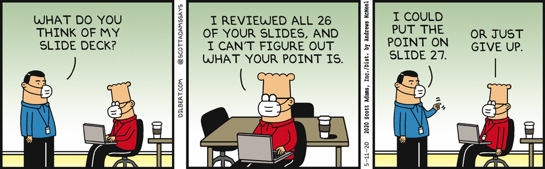

Writing style
=============


[](https://dilbert.com/strip/2020-05-11 "dilbert.com")


Writing is hard. Get help.

-   [_Plain Words: A guide to the use of English_](https://www.amazon.co.uk/Plain-Words-Rebecca-Gowers/dp/0241960347/) by Sir Ernest Gowers
-   [_Politics and the English Language_](https://www.amazon.co.uk/Politics-English-Language-Penguin-Classics-ebook/dp/B00AZQTM5I/) by George Orwell
-   [Grammarly](https://www.grammarly.com) checks spelling and grammar

[](http://www.youtube.com/watch?v=OV5J6BfToSw "Stephen Pinker at the Royal Institute")

> It’s a nervous tic of analytical philosophy to be forever wishing to clarify distinctions that nobody is actually confused about.
> <br>— _Jerry Fodor_


Plain and simple 
----------------

Surely elegant and elaborate sentences in a formal style lend authority to what you say? 

Rarely. Prefer plain and simple style. 

> There were four interview rooms. Each was a windowless concrete cube divided exactly in half by a wall-to-wall desk-height counter with safety glass above. Caged lights burned on the ceiling above the counter. The counter was cast from concrete. The grain of the formwork lumber was still visible in it. The safety glass was thick and slightly green and was divided into three overlapping panes, to give two sideways listening slots. The centre pane had a cut-out slot at the bottom, for documents. Like a bank. Each half of the room had its own chair, and its own door. Perfectly symmetrical.
><br>— Lee Child, _61 Hours_ 


Second-person imperative
------------------------

When saying what to do, write as you would speak – in the second-person imperative. Address your reader as _you_.

> ~~At this point the foo should be barred.~~

> ~~The user should be sure to bar the foo.~~

> Bar the foo.

An excellent example from a snake catcher in Australia.

> Hoser warned that snakes could be dangerous, and not to deal with them without professional help.
> 
> “If you see a snake don’t go near it. Nine times out of 10 if they’re in your garden they’re passing through,” he said.
> 
> “If you get bitten, bandage on your arm, straight to hospital.
> 
> “Without treatment you’re likely to die. With treatment you probably won’t die.” 

> — _The Guardian_ 2020.09.01


Humor
-----

Despite all you do, much technical writing is necessarily repetitive and tedious. Occasional humor can lighten it, but a little goes a long way – a _very_ long way. 


Refactor
--------

Refactor your prose as you would your code:

-   prefer terser expressions where they do not obstruct readability
-   remove duplication, for example, moving repeated phrasing from list items to the list’s preamble 
-   find ways to simplify expressions 


Mood 
----

Prefer the active mood. For example, prefer

> Prefer the active mood.

to

> The active mood is to be preferred. 


Numbers 
-------

Use words for small numbers of things, e.g. “there are three ways to achieve this”, up to twenty. 

Use numbers to refer to numbers themselves, e.g. “and adds 2 to the total”.


Place names
-----------

Use English place names. Thus _Copenhagen_ not _København_; _Milan_ not _Milano_, and _Zurich_ not _Zürich_.

Using place names correctly in a foreign language is a mark of competence.
Using them in English is showing off. 


Only
----

_Only_ is a crucial qualifier in documentation. Place it beside what you want to qualify.

The reader can usually resolve any ambiguity by eliminating unlikely interpretations. Not always. 
Placing _only_ in the right place relieves her of this work. 

The function will… | semantics | _only_ qualifies
-------------------|-----------|------------------
**only return** 0 if an error occurs | If an error occurs, the function will do nothing but _return_ the result of 0. It won’t also _set_ 0 as the value of a variable, _write_ 0 to file… | _return_
return **only 0** if an error occurs | If an error occurs, the function returns nothing but a solitary _zero_. Otherwise it may return anything. (Including a zero.) | _0_
return 0 **only if** an error occurs | _If_ an error occurs the function will return a zero. Otherwise it will return something else. | _if_


Linking
-------

Take opportunities to link to the Reference, the Knowledge Base, _Q for Mortals_,etc. 


Function reference
------------------

In documenting library functions, follow the format of the Reference, e.g.


### `.foo.bar` (example)

```txt
.foo.bar[abc;def;ghi;klm]
```

Where

-   `abc` is a boolean vector
-   `def` is blah blah blah
-   `ghi` is blah blah blah
-   `klm` is blah blah blah

returns the gorabeezer of hoojamaflip as a table with columns

```txt
this    the first thing
that    something like this
other   and the rest
```

Narrative, exceptions, errors, tips, and so on.


