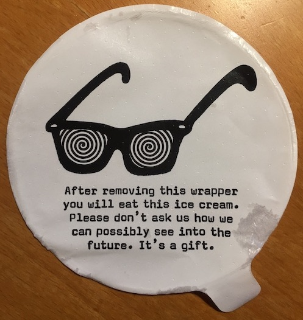

Writing style
=============


[](https://dilbert.com/strip/2020-05-11 "dilbert.com")


Writing is hard. Get help.

-   [_Plain Words: A guide to the use of English_](https://www.amazon.co.uk/Plain-Words-Rebecca-Gowers/dp/0241960347/) by Sir Ernest Gowers
-   [_Politics and the English Language_](https://www.amazon.co.uk/Politics-English-Language-Penguin-Classics-ebook/dp/B00AZQTM5I/) by George Orwell
-   [Grammarly](https://www.grammarly.com) checks spelling and grammar

[](http://www.youtube.com/watch?v=OV5J6BfToSw "Stephen Pinker at the Royal Institute")

> It’s a nervous tic of analytical philosophy to be forever wishing to clarify distinctions that nobody is actually confused about.
> <br>— _Jerry Fodor_


Plain and simple 
----------------

Surely elegant and elaborate sentences in a formal style lend authority to what you say? 

Rarely. Prefer plain and simple style. 

> There were four interview rooms. Each was a windowless concrete cube divided exactly in half by a wall-to-wall desk-height counter with safety glass above. Caged lights burned on the ceiling above the counter. The counter was cast from concrete. The grain of the formwork lumber was still visible in it. The safety glass was thick and slightly green and was divided into three overlapping panes, to give two sideways listening slots. The centre pane had a cut-out slot at the bottom, for documents. Like a bank. Each half of the room had its own chair, and its own door. Perfectly symmetrical.
><br>— Lee Child, _61 Hours_ 


Second-person imperative
------------------------

When saying what to do, write as you would speak – in the second-person imperative. Address your reader as _you_.

```txt
👎 At this point the foo should be barred.
👎 The user should take care to bar the foo.
👍 Bar the foo.
```

An excellent example from a snake catcher in Australia.

> Hoser warned that snakes could be dangerous, and not to deal with them without professional help.
> 
> “If you see a snake don’t go near it. Nine times out of 10 if they’re in your garden they’re passing through,” he said.
> 
> “If you get bitten, bandage on your arm, straight to hospital.
> 
> “Without treatment you’re likely to die. With treatment you probably won’t die.”

> — _The Guardian_ 2020.09.01


Humor
-----

Despite all you do, much technical writing is necessarily repetitive and tedious. Occasional humor can lighten it, but a little goes a long way – a _very_ long way. 




