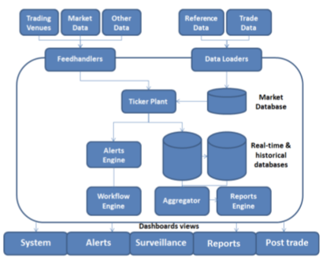
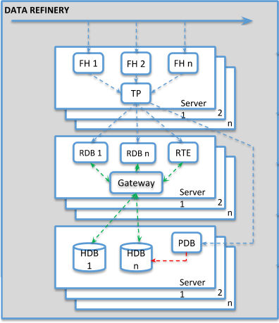

# Example architectures

## Kx for Surveillance

{: style="width:100%"}

Feedhandlers ingest the tick ata received directly from trading venues and market data sources.

The tickerplant receives, logs and publishes all real-time data downstream.

The real-time database captures all intraday data; and writes it to disk at end of day.

The historical database processes read historical data from disk and provide them to other processes. 

## Kx Data Refinery 

 
_Data-processing layer_

Tools and components:

Admin server

: Develop, configure, deploy and manage solutions: authentication, subscription, connections, users, settings, permissions, configuration.

Monitoring

: Scan, monitor, and alerting of issues in software and hardware.

Third-party interoperability

: Publish and subscribe, Web services, change-data capture…

APIs

: Native kdb+ APIs; direct IPC and binary communication for HPC.

Kx visualization tools

: HTML5, Kx Dashboards, Kx Analyst