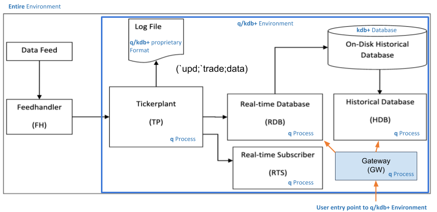

# Architecture of kdb+ systems

_Applications that use kdb+ typically comprise multiple processes_

The small footprint of the q interpreter, the [interprocess communication](../basics/ipc.md) baked into q, and the range of [interfaces](../interfaces/index.md) available make it straightforward to incorporate kdb+ into a multi-process application architecture.

Certain kinds of process recur across applications.

## Data feed

This is a source of real-time data; for example, financial quotes and trades from [Bloomberg](https://www.bloomberg.com/professional/solution/content-and-data/) or [Refinitiv](https://www.refinitiv.com/), or readings from a network of sensors

## Feedhandler

Parses data from the data feed to a format that can be ingested by kdb+.

KX’s [Fusion interfaces](../interfaces/fusion.md) connect kdb+ to a range of other technologies, such as [R](../interfaces/r/index.md), [Apache Kafka](../interfaces/kafka/index.md), [Java](../interfaces/java-client-for-q.md), [Python](../interfaces/embedpy.md) and [C](../interfaces/c-client-for-q.md).

## Tickerplant

Captures the initial data feed, writes it to the log file and [publishes](../kb/publish-subscribe.md) these messages to any registered subscribers.
Aims for zero-latency.
Includes ingesting data in batch mode.

Manages subscriptions: adds and removes subscribers, and sends subscriber table definitions.

Handles end-of-day (EOD) processing.

??? tip "Best practices for tickerplants"

    Tickerplants should be lightweight, not capturing data and using very little memory. 

    For best resilience, and to avoid core resource competition, run them on their own cores.

## Log file

This is the file to which the Tickerplant logs the q messages it receives from the feedhandler. It is used for recovery: if the RDB has to restart, the log file is replayed to return to the current state.

??? tip "Best practices for log files"

    The logging process can run on any hardware and OS, from a RaspberryPi to a cloud server.

    Store the file on a fast local disk to minimize publication delay and I/O waits.

    :fontawesome-regular-map:
    [Data recovery for kdb+tick](../wp/data-recovery.md)
     
    :fontawesome-solid-desktop:
    [Linux production notes](../kb/linux-production.md)

## Real-time database

Subscribes to messages from the Tickerplant, stores them in memory, and allows this data to be queried intraday.

At end of day usually writes intraday data to the Historical Database, and sends it a new EOD message.

??? tip "Best practices for real-time databases"

    RDBs queried intraday should exploit attributes in their tables. For example, a trade table might be marked as sorted by time (`` `s#time``) and grouped by sym (`` `g#sym``).

    RDBs require RAM as they are storing the intraday messages.
    Calculate how much RAM your RDB needs for a given table:

    (Expected max # of messages) \* schema cost \* flexibility ratio

    Schema cost: for a given row, a sum of the datatype size.
     
    Flexibility ratio: 1.5 is a common value

    :fontawesome-regular-map:
    [Intraday writedown solutions](../wp/intraday-writedown/index.md)

## Real-time subscriber

Subscribes to the intraday messages and typically performs some additional function on receipt of new data – e.g. calculating an order book or maintaining a subtable with the latest price for each instrument.

??? tip "Best practices for real-time subscribers"

    Write streaming analytics to compute the required results, rather than timed computations.

    Ensure analytics can deal with multiple messages, so there are no dependencies here if the tickerplant runs in batch mode.

    Check analytic run time versus expected TP publish intervals to ensure you don’t bottleneck. In general, look to the most busy and stressful market day for this, and add additional scaling factors.
    E.g. If my TP publishes a message ~every 30ms, my analytic should take less than 30ms to run. To allow for message throughput to double in the TP, the analytic should run in <15ms.

    :fontawesome-regular-map:
    [Order Book: a kdb+ intraday storage and access methodology](../wp/order-book.md)

## Historical database

Provides a queryable data store of historical data;
for example, for creating customer reports on order execution times, or sensor failure analyses.

Large tables are usually stored on disk partitioned by date, with each column stored as its own file.

The dates are referred to as _partitions_ and this on-disk structure contributes to the high performance of kdb+.

??? tip "Best practices for historical databases"

    Attributes are key. Partition tables on disk on the most-queried column.

    If the first two columns are `time` and `sym`, sorting on `time` within `sym` partions is assumed and provides a performance boost.

    Can add grouping attribute for other highly-queried columns.

    When creating the database schema consider the symbol versus string type  choice very carefully:

    -   Symbol type: Use symbols for columns with highly repeating data that are queried most frequently e.g. sym, exchange, side etc.
    -   String type: Any highly variable data e.g. order ID

    Database sizing follows the same formula as the RDB sizing.

    Consider using [compression](../kb/file-compression.md) for older data, or less-queried columns, to reduce on-disk size. Typically compression sees ⅕ the space usage.
    When compressing databases, choose compression algorithm and blocksizes through performance comparisons on typical queries.

    :fontawesome-regular-map:
    [Compression in kdb+](../wp/compress/index.md)

## Gateway

The entry point into the kdb+ system. Responsible for routing incoming queries to the appropriate processes, and returning their results.

Can connect both the real-time and historical data to allow users to query across both. In some cases, a gateway will combine the result of a series of queries to different processes.

??? tip "Best practices for gateways"

    Run only lightweight code. 

    Track disconnections and queries submitted.

    Return sensible errors when queries fail.

    Use the deferred-response feature (V3.6) to avoid additional coding on the side of connecting non-kdb+ processes.

    [Load-management](../kb/load-balancing.md): round-robin might not be the best option for your system. 
    Consider other options specific to your APIs and load.

    :fontawesome-regular-map:
    [Query Routing: A kdb+ framework for a scalable, load balanced system](../wp/query-routing/index.md)

## :fontawesome-solid-hand-point-right: What next?

:fontawesome-regular-map:
[Building real-time tick subscribers](../wp/rt-tick/index.md)
 
:fontawesome-regular-map:
[Data recovery for kdb+ tick](../wp/data-recovery.md)
 
:fontawesome-regular-map:
[Disaster-recovery planning for kdb+ tick systems](../wp/disaster-recovery/index.md)
 
:fontawesome-regular-map:
[Intraday writedown solutions](../wp/intraday-writedown/index.md)
 
:fontawesome-regular-map:
[Query routing: a kdb+ framework for a scalable load-balanced system](../wp/query-routing/index.md)
 
:fontawesome-regular-map:
[Order book: a kdb+ intraday storage and access methodology](../wp/order-book.md)
 
:fontawesome-regular-map:
[Kdb+tick profiling for throughput optimization](../wp/tick-profiling.md)
 
:fontawesome-regular-map:
[Kdb+ and WebSockets](../wp/websockets/index.md)

