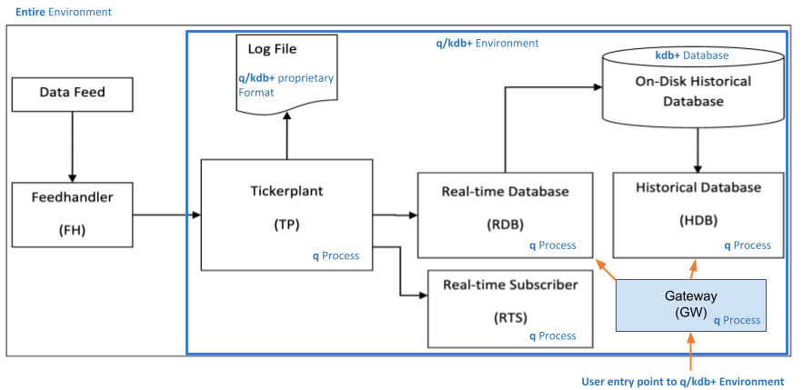

# Architecture of kdb+ systems

Applications that use kdb+ typically consist of multiple processes. 

The means by which processes communicate with each other may be as simple as the [interprocess communication](../basics/ipc.md) baked into the q language, or more sophisticated interfaces such as [Apache Kafka](../interfaces/kafka/index.md) or a [Solace event broker](../interfaces/solace/index.md). 