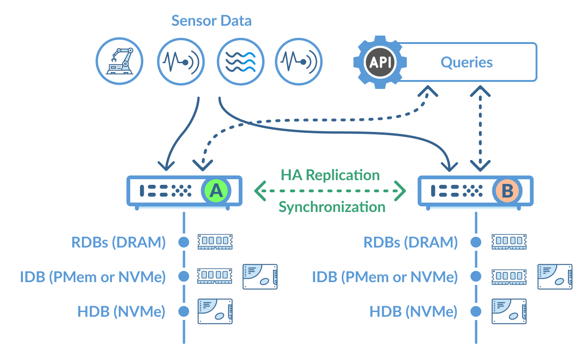
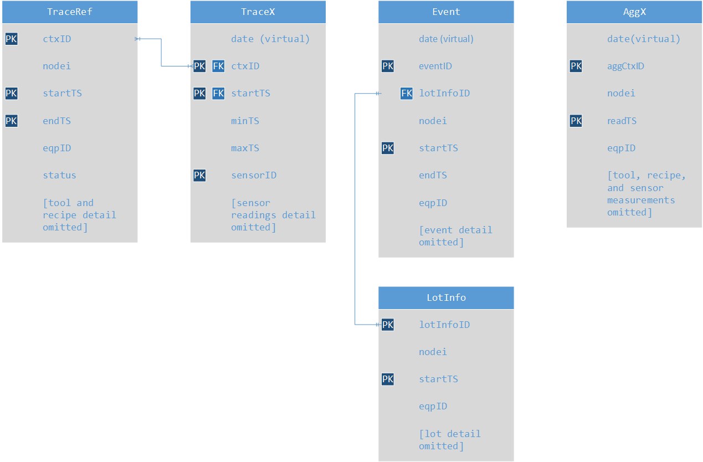

# :fontawesome-solid-bolt: Performance of Intel Optane persistent memory

!!! summary "Key findings"

    Use of Intel® Optane™ persistent memory (PMem) as a block-storage device with KX Streaming Analytics delivers 4× to 12x improved analytics performance compared to high-performance NVMe storage – similar performance to DRAM for query workloads. For key data-processing workloads, we found DRAM requirements were significantly reduced.

    PMem lets organizations support more demanding analytic workloads on more data with less infrastructure.

:fontawesome-solid-hand-point-right:
[Summary results](#summary-results)

## Setup and evaluation

### Hardware setup

We configured two systems:

<table>
<thead>
<tr>
<th style="vertical-align: bottom">configuration</th>
<th style="text-align:center; vertical-align: bottom;">baseline without Optane</th>
<th style="text-align:center; vertical-align: bottom;">with Optane</th></tr>
</thead>
<tbody>
<tr>
<td>Server and operating system</td>
<td colspan="2" style="text-align: center">Supermicro 2029U-TN24R4T&nbsp;&nbsp;Centos 8</td>
</tr>
<tr>
<td>RAM</td>
<td colspan="2" style="text-align: center">768 GB RAM (2666 MHz) LRDIMMs</td>
</tr>
<tr>
<td>CPU</td>
<td colspan="2" style="text-align: center">36 physical cores: 2 × Intel® Xeon® Gold 6240L Gen.2 2.6 GHz CPU Hyper-threading turned on</td>
</tr>
<tr>
<td>Optane Persistent Memory</td>
<td>n/a</td>
<td>12 DIMMs × 512 GB NMA1XXD512GPS</td>
</tr>
<tr>
<td>Log</td>
<td>RAID 50 data volume 24× NVMe P4510 NVME</td>
<td>Intel Optane² persistent memory 3 TB EXT4³ DAX</td>
</tr>
<tr>
<td>Intraday Database ≤ 24 Hrs</td>
<td rowspan="2" style="vertical-align: middle">48 TB RAIDIX ERA¹ Raid Software, XFS 6 RAID 5 Groups, 64 chunk</td>
<td>Intel Optane persistent memory 3 TB EXT4 DAX</td>
</tr>
<tr>
<td class="nowrap">Historical Database &gt; 24 Hrs</td>
<td>RAID 50 data volume Same as baseline configuration</td>
</tr>
</tbody>
</table>

### Environment setup and testing approach

We configured a KX Streaming Analytics system operating in a high-availability (HA) cluster, processing and analyzing semiconductor manufacturing data as follows. We ran tests on both configurations for ingestion, processing, and analytics. Tests were run with the same data and durations.

### Publishing and ingestion

-   Publish and ingest over 2.25M sensor readings in 894 messages per second, 2.5 TB per day
-   Ingest sensor trace, aggregation, event, and IoT data using four publishing clients from a semiconductor front-end processing environment

### Analytics

-   81 queries per second spanning real-time data, intraday data (&lt; 24 hours), and historical data
-   100 queries at a time targeting the real-time database (DRAM), intra-day database (on Intel Optane PMem), and historical database (on NVMe storage)
-   Single-threaded calculation and aggregation tests targeted at the in-memory database and intra-day database

### Data processing

-   Perform a data-intensive process, entailing reading and writing all of the data ingested for the day

### High availability and replication

-   System ran 24×7 with real-time replication to secondary node
-   Logged all data ingested, to support data protection and recovery
-   Data fed to two nodes, mediated to ensure no data loss in event of disruption to the primary system

### Data model and ingestion

The data-model workload involved multiple tables representing reference or master data, sensor reading, event and aggregation data.
This relational model is used in fulfilling streaming analytics and queries spanning real-time and historical data.
KX ingests raw data streams, processes and persists data into the following structure.
For efficient queries and analytics, KX batches and stores data for similar time ranges together, using one or more sensor or streaming data loaders.
The tables and fields used in our configuration are illustrated below.

## Test results

### Reading and writing to disk

We used the kdb+ nano I/O benchmark for reading and writing data to a file system backed by block storage.
The nano benchmark calculates basic raw I/O capability of non-volatile storage, as measured by kdb+.
Note the cache is cleared after each test, unless otherwise specified.

:fontawesome-brands-github:
[KxSystems/nano](https://github.com/KxSystems/nano)

!!! detail "Bypassing page cache"

    With most block storage devices, data is read into page cache to be used by the application.
    However, reads and writes to Intel Optane persistent memory configured as block storage bypass page cache (in DRAM).

    This improves overall system performances and lowers demand on the Linux kernel for moving data in/out of page cache and for overall memory management.

Read performance (Intel Optane persistent memory as block device vs
NVMe storage):

-   2× to 9× faster reading data from 36 different files in parallel
-   Comparable to retrieving data from page cache (near DRAM performance)
-   41× better for reading a file in a single thread.

Write performance:

-   42% slower than NVMe devices, due to striping only across 6 DIMM devices vs 24 NVME drives
-   Similar single-threaded write performance across the two configurations

<table class="results">
<colgroup>
<col style="text-align: left">
<col span="2">
<col span="2" style="background-color: rgba(219,220,222,.3);">
<col span="2" style="background-color: rgba(255,195,0,.5);">
</colgroup>
<thead>
<tr><th/><th colspan="2">before</th><th colspan="2">after</th><th colspan="2">comparison4</th></tr>
<tr><th/><th colspan="2">NVMe</th><th colspan="2">PMem</th><th colspan="2">PMem vs NVMe</th></tr>
</thead>
<tbody>
<tr><td class="lbl">Threads</td><td>1</td><td>36</td><td>1</td><td>36</td><td>1</td><td>36</td></tr>
<tr><td class="lbl">Total Write Rate (sync)</td><td>1,256</td><td>5,112</td><td>1,137</td><td>2,952</td><td>0.91</td><td>0.58</td></tr>
<tr><td class="lbl">Total create list rate</td><td>3,297</td><td>40,284</td><td>4,059</td><td>30,240</td><td>1.23</td><td>0.75</td></tr>
<tr><td class="lbl">Streaming Read (mapped)</td><td>1,501</td><td>12,702</td><td>61,670</td><td>118,502</td><td>41.08</td><td>9.33</td></tr>
<tr><td class="lbl">Walking List Rate</td><td>2,139</td><td>9,269</td><td>3,557</td><td>28,657</td><td>1.66</td><td>3.09</td></tr>
<tr><td class="lbl">Streaming ReRead (mapped) &nbsp;&nbsp;Rate (from DRAM for NVMe)</td><td>35,434</td><td>499,842</td><td>101,415</td><td>479,194</td><td>2.86</td><td>0.96</td></tr>
<tr><td class="lbl">random1m</td><td>828</td><td>12,050</td><td>1,762</td><td>24,700</td><td>2.13</td><td>2.05</td></tr>
<tr><td class="lbl">random64k</td><td>627</td><td>8,631</td><td>1,905</td><td>36,970</td><td>3.04</td><td>4.28</td></tr>
<tr><td class="lbl">random1mu</td><td>607</td><td>10,216</td><td>1,099</td><td>14,679</td><td>1.81</td><td>1.44</td></tr>
<tr><td class="lbl">random64ku</td><td>489</td><td>6,618</td><td>1,065</td><td>8,786</td><td>2.18</td><td>1.33</td></tr>
</tbody>
</table>

### Query performance

We tested query performance by targeting data that would be cached in
DRAM, on Intel Optane PMem, and NVMe drives, with parallel execution of
each query using multiple threads where possible.

Each query involved retrieving trace data with a range of parameters
including equipment, chamber, lot, process plan, recipe, sequence, part,
sensor, time range, columns of data requested. The parameters were
randomized for time range of 10 minutes.

Query response times using Intel Optane persistent memory were
**comparable to DRAM** and **3.8× to 12× faster** than NVMe.

<table class="results">
<colgroup>
  <col span="2">
  <col style="background-color: rgba(219,222,223,.3)">
  <col/>
  <col span="2" style="background-color: rgba(255,195,0,.5);">
</colgroup>
<thead>
  <tr>
    <th/>
    <th colspan="3" style="opacity: .5; letter-spacing: .3em;">QUERY PROCESSES</th>
    <th colspan="2" style="opacity: .5; letter-spacing: .3em;">COMPARISONS</th>
  </tr>
<tr><th/>
<th>DRAM RDB 2</th>
<th>PMem IDB 8</th>
<th>NVMe HDB 8</th>
<th>PMem vs DRAM4</th>
<th>PMem vs NVMe</th>
</tr>
</thead>
<tbody>
<tr><td class="subhead" colspan="6">1 query at a time</td></tr>
<tr><td class="lbl">Mean response time (ms)</td><td>23</td><td>26</td><td>319</td><td>1.17</td><td>12.10</td></tr>
<tr><td class="lbl">Mean payload size (KB)</td><td>778</td><td>778</td><td>668</td><td>1</td><td>1</td></tr>
<tr><td class="subhead" colspan="6">100 queries at a time</td></tr>
<tr><td class="lbl">Mean response time (ms)</td><td>100</td><td>82</td><td>310</td><td>0.82</td><td>3.77</td></tr>
<tr><td class="lbl">Mean payload size (KB)</td><td>440</td><td>440</td><td>525</td><td>1</td><td>1</td></tr>
</tbody>
</table>

Two real-time database query processes were configured matching typical
configurations, with each process maintaining a copy of the recent data in
DRAM. (Additional real-time processes could be added to improve performance
with higher query volumes at the cost of additional DRAM.)

### Data-processing performance

KX Streaming Analytics enables organizations to develop and execute data and storage I/O intensive processes. 
We compare the performance of a mix of PMem with NVMe storage to NVMe-only storage configuration when reading significant volume of data from the intraday database and persisting it to the historical database on NVME storage.

By reading data from PMem and writing to NVMe-backed storage, Optane cut data processing time by 1.67× and reduced the RAM required by 37%.

<table class="results">
  <colgroup>
    <col span="2">
  <col style="background-color: rgba(219,222,223,.3)">
  <col style="background-color: rgba(255,195,0,.5);">
<thead>
<tr><th/><th>before</th><th>after</th><th/></tr>
<tr><th/><th>NVMe only, no PMem</th><th>PMem &amp; NVMe</th><th>PMem vs NVMe only4</th></tr>
</thead>
<tbody>
<tr><td class="lbl">Data processed (GB)</td><td>2,200</td><td>3,140</td><td>1.43</td></tr>
<tr><td class="lbl">Processing Time (minutes)</td><td>24.97</td><td>21.40</td><td>0.86</td></tr>
<tr><td class="lbl">Processing time GB/s</td><td>1.47</td><td>2.45</td><td>1.67</td></tr>
<tr><td class="lbl">Max DRAM Utilisation5</td><td>56%</td><td>35%</td><td>0.63</td></tr>
</tbody>
</table>

## Summary results

### Analytics

-   Performed within 10% of DRAM for queries involving table joins
-   Performed 4× to 12× faster than 24 NVMe storage in RAID configuration
-   DRAM performed 3× to 10× faster when performing single-threaded calculations and aggregations on data

### Data processing and I/O operations

-   Processed 1.6× more data per second than NVMe-only storage where data was read from PMem and written to NVMe storage
-   2× to 10× faster reading data from files in parallel
-   Seed of reading data similar to page cache (DRAM)
-   Single-threaded file-write performance within 10% in both configurations
-   Multithreaded file-write performance 42% slower

Infrastructure resources
------------------------

-   Required 37% less RAM to complete key I/O-intensive data processing
-   Required no page cache for querying or retrieving data stored in PMem

Business benefits
-----------------
-   Collect and process more data with higher velocity sensors and assets
-   Accelerate analytics and queries on recent data by 4× to 12×
-   Reduce cost of infrastructure running with less servers and DRAM to support data processing and analytic workloads
-   Align infrastructure more closely to the value of data by establishing a storage tier between DRAM and NVMe- or SSD-backed performance block storage

Organizations should consider Intel Optane persistent memory where there is a need to accelerate analytic performance beyond what is available with NVMe or SSD storage.

:fontawesome-solid-print:
[PDF of this article](https://code.kx.com/download/wp/optane-tests.pdf "Download")

## Notes

1.  We used software RAID from RAIDIX to deliver lower latency and
    higher throughput for reads and writes over and above VROC and
    MDRAID. 

    :fontawesome-solid-globe:
    [KX Streaming Analytics platform raises its performance with RAIDIX era](https://www.raidix.com/blog/kx-streaming-analytics-platform-raises-its-performance-with-raidix-era/)

2.  Intel Optane persistent memory configured in App Direct Mode as EXT4
    volume single-block device.

3.  In our testing we found EXT4 performed significantly better than
    XFS, with EXT4 performing 1.5× to 12× better than XFS

4.  Higher is better. Factor of 1 = same performance. Factor of 2
    = 200% faster than comparator.

5.  Maximum DRAM utilisation as measured by the operating system during
    the process and is primarily a function of amount of data that
    needed to be maintained in RAM for query access. The faster the
    completion of the process the less RAM that is required on the
    system.
