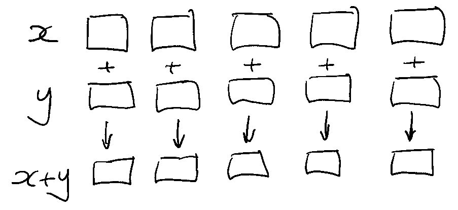
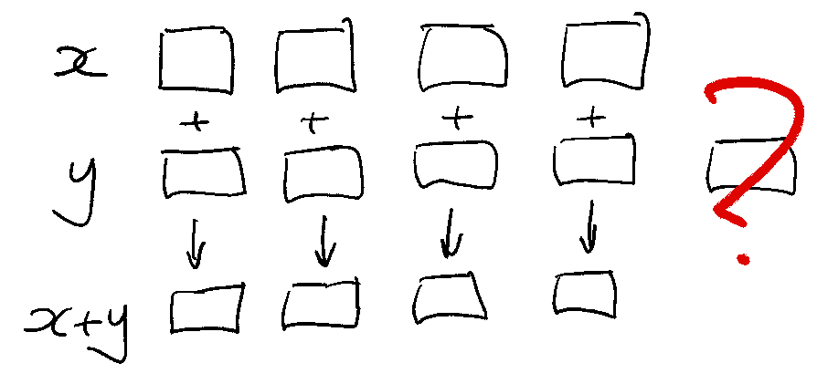
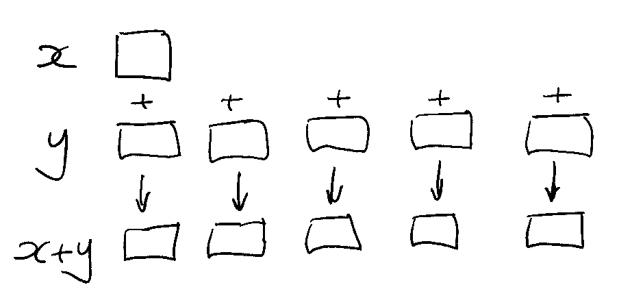
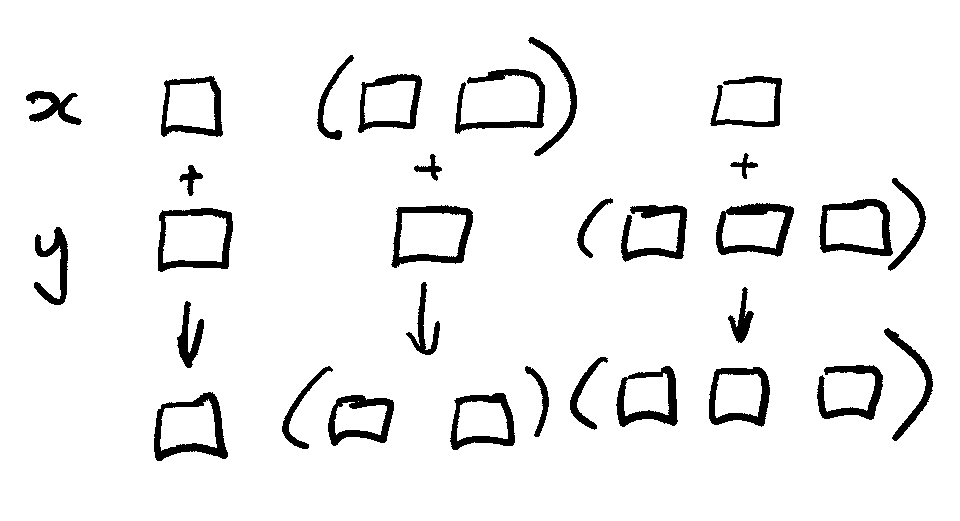
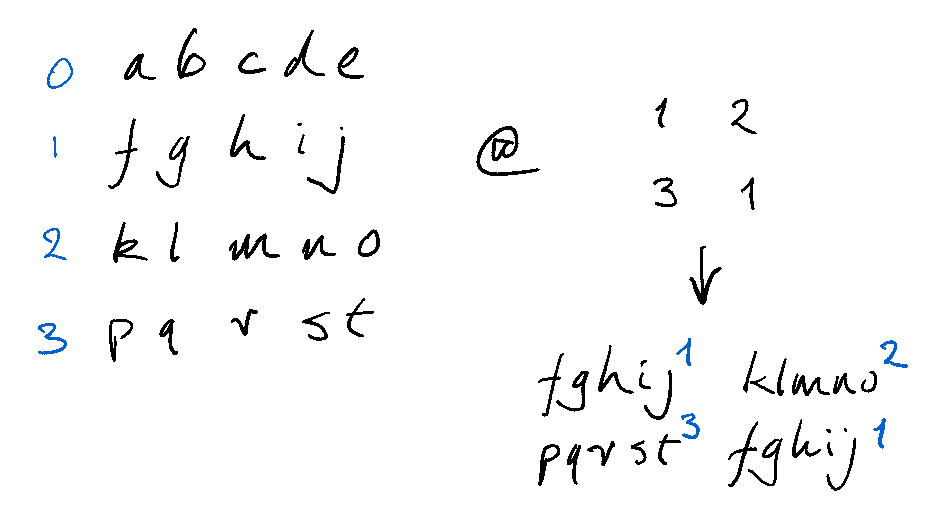
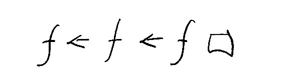

# Implicit iteration

!!! warning "Before you specify iteration, see whether what you need is already implicit in the operators and keywords"

:fontawesome-solid-film:
This tutorial as a [video presentation](https://code.kx.com/download/learn/iteration/implicit.mp4)

Lists and dictionaries are first-class entities in q, and most operators and keywords iterate through them.
This article is about when to _leave it to q_. 

That is, when *not* to specify iteration. 

Recall:

Map iteration

: evaluates an expression _once_ on each item in a list or dictionary. 


Accumulator iteration

: evaluates an expression _successively_: the result of one evaluation becomes an argument of the next.


## Implicit map iterations

The simplest and most common implicit map iteration is _pairwise_: between corresponding list items.



```q
q)10 100 1000 * (1 2 3;4 5 6;7 8)
10 20 30
400 500 600
7000 8000
```
Of course, this requires the lists to have the same number of items. 



```q
q)10 100 1000 * (1 2 3;4 5 6)
'length
  [0]  10 100 1000 * (1 2 3;4 5 6)
                   ^
```


### Scalar extension

Unless! 
If one of the operands is an atom, _scalar extension_ pairs it with every list item.



```q
q)5 < 1 2 3 4 5 6 7 8
00000111b
q)"f" < ("abc";"def";"gh")
000b
000b
11b
```

### Atomic iteration

Many operators have _atomic iteration_: they iterate recursively, pairwise and with scalar extension, until they find the atoms in a list. 



```q
q)1 4 7 < (1 2 3;4 5 6;7 8)
011b
011b
01b

q)(1;2 3 4; 7) < (1 2 3;4 5 6;7 8)
011b
111b
01b

q)(1;2 3 4;(5 6 7;8)) < (1 2 3;4 5 6;7 8)
011b
111b
(110b;0b)
```
Similarly, some unary keywords implicitly apply to each item of a list argument – and recurse to atoms.
```q
q)cos (1 2 3; 4 5 6)
0.5403023  -0.4161468 -0.9899925
-0.6536436 0.2836622  0.9601703

q)lower("THE";("Quick";"Brown");"FOX")
"the"
("quick";"brown")
"fox"
```
Atomic operators are atomic in both their left and right [domains](../basics/glossary.md#domain).
```q
4 < (1;2 3 4;(5 6 7;8))
0b
000b
(111b;1b)
```
Some binary keywords are atomic in only one domain.
For example, the right argument of [`within`](../ref/within.md) is an ascending pair of sortable type.
But in its left domain, `within` is atomic.
```q
q)2 3 4 within 3 6
011b
q)(2 3 4;(5; 6 7;8)) within 3 6
0  1   1
1b 10b 0b
```


### List iteration

List iteration is through list items only – not atomic.
The [`like`](../ref/like.md) keyword has list iteration in its left domain.
```q
q)`quick like "qu?ck"
1b
q)`quick`quack`quark like "qu?ck"       / list iteration
110b
q)(`quick;`quack`quark) like "qu?ck"    / but not atomic
'type
  [0]  (`quick;`quack`quark) like "qu?ck"
                             ^
```
List iteration stops after the first level: it does not recurse.


### Simple visualizations

Even a simple visual display can be useful. 
Here are sines of the first twenty positive integers, tested to see which of them is greater than 0.5.

```q
q).5 < sin 1 + til 20
11000011000001100001b
```

We can take that boolean vector and use it to index a short string, getting us a simple visual display.
And, as you probably know, [Index At](https://code.kx.com/q/ref/apply/#index-at) `@` can be elided and replaced with prefix notation.

```q
q)".#" @ .5 < sin 1 + til 20
"##....##.....##....#"
q)".#" .5 < sin 1 + til 20
"##....##.....##....#"
```

Index At is atomic in its right domain; that is, *right-atomic*. 

Here we’ll index a string with an integer vector and we’ll get a string result.
```q
q)" -|+" @ 0 3 1 1 1 3 0
" +---+ "
```
If we index it with a 2-row matrix – two integer vectors – we’ll get a character matrix back.
```q
q)" -|+" @ (0 3 1 1 1 3 0;0 2 0 0 0 2 0)
" +---+ "
" |   | "
```
And if we take that 2-row matrix and index it – to make selections from it – the result is a numeric matrix.
```q
q)(0 3 1 1 1 3 0;0 2 0 0 0 2 0) @ 0 1 1 1 0
0 3 1 1 1 3 0
0 2 0 0 0 2 0
0 2 0 0 0 2 0
0 2 0 0 0 2 0
0 3 1 1 1 3 0
```
And because Index At is right-atomic we can use the numeric matrix to index the string.
```q
q)" -|+" @(0 3 1 1 1 3 0;0 2 0 0 0 2 0) @ 0 1 1 1 0
" +---+ "
" |   | "
" |   | "
" |   | "
" +---+ "
```
Index At is right-atomic, but in its left domain it has list iteration: list items need not be atoms.
In this example, the list items are themselves strings.
If we index that list of strings with an integer matrix, we get back a matrix of strings.
```q
q)show L:("the";"quick";"brown";"fox")
"the"
"quick"
"brown"
"fox"
q)(1 3;2 0)
1 3
2 0
q)L@(1 3;2 0)
"quick" "fox"
"brown" "the"
```



```q
q)show q:4 5#.Q.a
"abcde"
"fghij"
"klmno"
"pqrst"

q)q @ (1 2;3 1)  / Index At: right-atomic 
"fghij" "klmno"
"pqrst" "fghij"

q)q . (1 2;3 1)  / Index: list iteration on the right
"ig"
"nl"
```
Some keywords evaluate a binary expression between adjacent items in a list. 
```q
q)deltas 1 5 0 9 5 2
1 4 -5 9 -4 -3
q)ratios 2 3 4 5
2 1.5 1.333333 1.25
```
These are map iterations: the evaluations are independent and can be performed in parallel.


## Exercise 1

:fontawesome-solid-download:
[`sensors.txt`](./sensors.txt) contains (24) hourly sensor readings over a 12-day period. 
Sensor readings are in the range 0-9.
```bash
$ wget https://code.kx.com/download/learn/iteration/sensors.txt
--2022-01-03 11:27:18--  https://code.kx.com/download/learn/iteration/sensors.txt
Resolving code.kx.com (code.kx.com)... 74.50.49.235
Connecting to code.kx.com (code.kx.com)|74.50.49.235|:443... connected.
HTTP request sent, awaiting response... 200 OK
Length: 300 [text/plain]
Saving to: ‘sensors.txt’

sensors.txt         100%[===================>]     300  --.-KB/s    in 0s

2022-01-03 11:27:19 (143 MB/s) - ‘sensors.txt’ saved [300/300]
```

```q
q)show s:read0`:sensors.txt
"030557246251157265736086"
"757251109999993270188377"
"776439448625126896347568"
"116491158137137589031187"
"855938799541699262946623"
"104948806186867057936025"
"328964479858696484945053"
"861596102999933729145653"
"623589072102430497578780"
"240663439999997746246672"
"311551572414272384005263"
"850884046457214232200714"
```

??? question "a. For each of the 24 hours, on how many days of the period did the sensor reading for that hour fall to zero?"

    Converting the sensor readings to numbers is not necessary: they can be compared directly to `"0"`.
    ```q
    q)s="0"
    101000000000000000000100b
    000000010000000001000000b
    000000000000000000000000b
    000000000000000000100000b
    000000000000000000000000b
    010000010000000100000100b
    000000000000000000000100b
    000000010000000000000000b
    000000100010001000000001b
    001000000000000000000000b
    000000000000000000110000b
    001000100000000000011000b
    ```
    The Equals operator has implicit atomic iteration. Here it iterates across the items (rows) of the list `s`. Each item (row) is a character list (string) and Equals continues iterating through the items.

    The result of `s="0"` is a boolean matrix of the same shape as `s`. 
    Summing it simply adds the rows together.
    ```q
    q)sum s="0"
    1 1 3 0 0 0 2 3 0 0 1 0 0 0 1 1 0 1 2 2 1 3 0 1i
    ```

Your maintenance manager gets automated reports printed, but the last report got damaged. She needs your help. 

??? question "b. On which days did the sensor readings begin (8, 6, 1, 5, …) and (1, 1, 6, 4, …)?"

    We can search the first four columns of `s` for these sequences.

    ```q
    q)s[;til 4]
    "0305"
    "7572"
    "7764"
    "1164"
    "8559"
    "1049"
    "3289"
    "8615"
    "6235"
    "2406"
    "3115"
    "8508"
    ```
    The Find operator has list iteration in both left and right domains.

    ```q
    q)s[;til 4]?("8615";"1164")
    7 3
    ```

Visualizations help us find patterns in datasets.
Even simple visualizations can be valuable.

Normal operating levels are in the range (2,7).

??? question "c. Display a simple plot showing when the sensors reported levels outside that range."

    The `within` keyword take as right argument a 2-item vector of sortable type. 
    It has atomic iteration in its left domain.
    Keyword `not` is atomic. 

    ```q
    q)not s within "27"
    101000000001100000000110b
    000001111111110001111000b
    000001001000100110000001b
    110011101100100011101110b
    100101011001011000100000b
    110101110110100100100100b
    001100001101010010100100b
    101010110111100001100000b
    000011100110001010001011b
    001000001111110000000000b
    011001000010000010110000b
    101110100000010000011010b
    ```

    Because [Index At](https://code.kx.com/q/ref/apply#index-at) is right-atomic we can use the boolean matrix to index a string.

    ```q
    ".#"not s within "27"
    "#.#........##........##."
    ".....#########...####..."
    ".....#..#...#..##......#"
    "##..###.##..#...###.###."
    "#..#.#.##..#.##...#....."
    "##.#.###.##.#..#..#..#.."
    "..##....##.#.#..#.#..#.."
    "#.#.#.##.####....##....."
    "....###..##...#.#...#.##"
    "..#.....######.........."
    ".##..#....#.....#.##...."
    "#.###.#......#.....##.#."
    ```

At level 9 productivity is highest.

??? question "d. Plot when in the period this occurred."

    ```q
    ".#"s="9"
    "........................"
    "........######.........."
    ".....#..........#......."
    "....#............#......"
    "...#...##....##...#....."
    "...#..............#....."
    "...#....#....#....#....."
    "....#....####....#......"
    ".....#..........#......."
    "........######.........."
    "........................"
    "........................"
    ```

## Implicit accumulator iterations

Accumulator iterations evaluate some expression _successively_: the result of one evaluation becomes the argument of the next. 



We have already used the `sum` keyword, which implicitly evaluates Add between successive items of a list. 
```q
q)((2+3)+4)+5
14
q)sum 2 3 4 5
14

q)a:`cats`dogs!2 3; b:`cows`sheep!3 4; c:`dogs`sheep!5 6
q)sum (a;b;c)
cats | 2
dogs | 8
cows | 3
sheep| 10
```
`sum` is an *aggregator*: it returns the result of its *last* evaluation.
`sums` also iterates successively, but returns the results of *all* the evaluations.
```q
q)(2;2+3;2+3+4;2+3+4+5)
2 5 9 14
q)sums 2 3 4 5
2 5 9 14
```
Notice that the result has the same length as the argument: `sums` is a *uniform* function. 
Notice also that the index of the result corresponds to the number of evaluations: `(sums 2 3 4 5)[3]` is the result of three additions and `(sums 2 3 4 5)[0]` is the result of no additions. 

Keywords such as `mavg` and `msum` combine map iterations (e.g. evaluate on each group of three successive items) with an aggregator which might employ accumulator iteration, e.g. `sum`.
```q
q)3 msum 1 5 0 9 5 2 2 4 0 5 3 0
1 6 6 14 14 16 9 8 6 9 8 8
```

Exercise 2
----------
Factory productivity is thought to be most affected by the machinery’s fuddling level. 
An automated process adjusts the fuddling level every 20 minutes to keep it stable; the level resets to zero each midnight. 

:fontawesome-solid-download:
We have in [`fudadj.csv`](https://code.kx.com/download/learn/iteration/fudadj.csv) a log of the adjustments. 
```q
q)\wget -q https://code.kx.com/download/learn/iteration/fudadj.csv

q)read0 `:fudadj.csv / fuddling adjustments
"-1,-1,3,3,2,3,3,3,1,-1,3,0,2,1,2,1,0,-1,3,0,3,1,1,1,3,0,-1,3,-1,2,0,2,1,3,0,0,0,..
"0,1,-1,-1,3,-1,-1,3,1,1,2,1,-1,1,3,2,2,3,2,2,2,3,3,3,2,3,0,3,3,1,2,1,-1,-1,-1,0,..
"1,0,-1,2,3,-1,1,-1,-1,-1,2,3,2,0,0,3,3,2,2,-1,2,-1,2,0,1,2,2,0,0,-1,1,3,-1,1,-1,..
"3,2,2,1,3,-1,-1,-1,1,-1,1,1,0,-1,0,3,-1,0,2,0,2,0,1,2,3,2,1,3,-1,2,-1,1,2,1,-1,3..
"1,0,3,-1,2,3,3,1,1,2,-1,1,1,3,-1,2,2,2,2,2,0,3,-1,1,2,-1,3,0,0,1,2,3,3,0,-1,0,-1..
"2,-1,3,2,1,2,3,3,1,2,-1,-1,1,-1,0,-1,3,2,-1,-1,-1,1,1,2,2,3,0,2,1,0,1,2,3,3,2,-1..
"3,1,-1,2,1,3,-1,1,0,1,2,2,1,3,1,1,1,3,2,-1,-1,1,0,3,3,0,0,2,1,0,2,3,2,2,2,0,-1,-..
"-1,2,-1,-1,1,2,-1,0,2,3,0,2,0,1,2,-1,3,3,1,2,-1,-1,-1,3,3,0,1,1,1,3,2,1,-1,1,2,2..
"-1,3,-1,2,0,0,1,1,1,3,0,2,2,2,2,-1,-1,-1,-1,1,1,3,0,3,-1,1,2,3,0,-1,2,2,2,2,0,2,..
"3,2,-1,-1,0,-1,3,2,0,3,1,0,0,2,3,2,1,1,-1,2,3,-1,3,3,3,-1,1,3,2,1,1,1,2,3,2,1,1,..
"0,2,0,1,-1,3,0,2,-1,2,-1,2,0,0,-1,3,0,3,1,0,2,2,3,-1,2,0,1,1,2,0,2,2,0,0,0,-1,1,..
"2,-1,2,-1,3,0,1,1,0,-1,2,2,3,3,0,0,-1,1,3,-1,1,2,2,3,2,-1,0,2,0,3,0,1,1,0,3,3,-1..
```

??? question "What were the fuddling levels corresponding to the sensor readings in Exercise 1?"

    The file has no column headers, so [Load CSV](https://code.kx.com/q/ref/file-text/#load-csv) returns not a table but a list of columns.

    ```q
    q)show fa:(prd[24 3]#"J";csv)0: read0 `:fudadj.csv / fuddling adjustments
    -1 0  1  3  1  2  3  -1 -1 3  0  2
    -1 1  0  2  0  -1 1  2  3  2  2  -1
    3  -1 -1 2  3  3  -1 -1 -1 -1 0  2
    3  -1 2  1  -1 2  2  -1 2  -1 1  -1
    2  3  3  3  2  1  1  1  0  0  -1 3
    ..
    ```

    That suits us. The 72 rows correspond to 20-minute intervals. 
    We take cumulative sums across the intervals, and select every third sum to get the hourly levels.
    Transposing the result gives us 12×24 fuddling levels.
    ```q
    q)flip sums[fa]@2+3*til 24
    1 9  16 18 23 23 29 32 34 38 41 44 44 50 52 54 59 62 65 72 72 76 78 80
    0 1  4  8  11 18 24 33 38 45 47 45 50 51 54 55 58 58 57 61 64 68 69 66
    0 4  3  7  9  17 20 21 26 25 28 27 28 33 34 34 36 42 46 49 51 55 55 61
    7 10 9  10 9  11 15 18 24 28 30 33 35 41 41 43 43 49 51 56 57 57 62 63
    4 8  13 15 18 24 28 31 35 36 44 43 45 47 49 55 58 60 64 62 65 67 68 70
    4 9  16 16 16 20 17 21 26 29 35 39 42 49 57 59 65 69 73 73 75 74 74 77
    3 9  9  14 19 24 24 28 31 34 41 45 46 49 55 57 59 62 68 71 75 77 79 79
    0 2  3  8  11 16 18 19 23 28 30 35 36 37 41 41 42 47 54 59 58 59 63 67
    1 3  6  11 17 14 15 21 23 25 31 35 41 46 47 51 54 59 63 67 73 77 81 86
    4 2  7  11 16 20 24 29 32 38 42 48 51 56 60 67 64 72 75 78 79 82 85 91
    2 5  6  9  8  14 17 21 24 27 31 30 32 36 38 39 41 44 42 47 50 50 51 53
    3 5  7  10 16 16 19 26 27 32 34 40 39 40 43 51 51 53 57 62 65 63 65 71
    ```

    It is clear that the automatic adjustments are not keeping the fuddling levels stable.

!!! detail "Yet another way q is weird?"

    If in other languages you are used to specifying iterations, you may at first experience this as an annoying distraction. Besides solving your problem, you also have to learn and keep in mind q’s implicit iterations.
    You already know how to write iterations. Why now learn this? 
    
    The reward is that, as implicit iteration becomes familiar to you, you stop thinking about most of the iterations in your code, which leaves you more mental space for problem solving. 
    (Only when we put on noise-cancelling headphones do we discover how much annoying background noise we had been filtering out.) 

    As a bonus, many algorithms are startlingly simple to write in q. It’s way cool.


## Conclusion

That’s it. The big takeaway is that there is a *lot* of iteration built into the q primitives. 
It will almost always give you your shortest, fastest code – and the most readable.