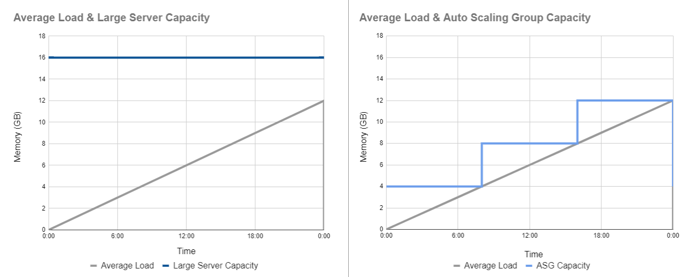
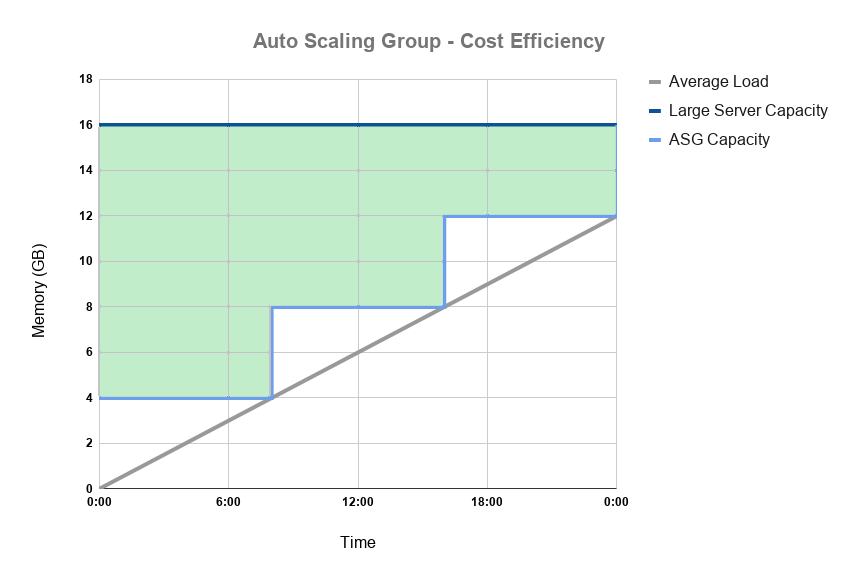
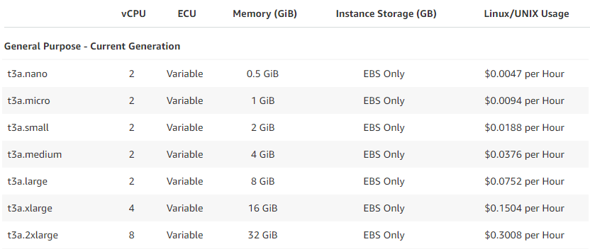
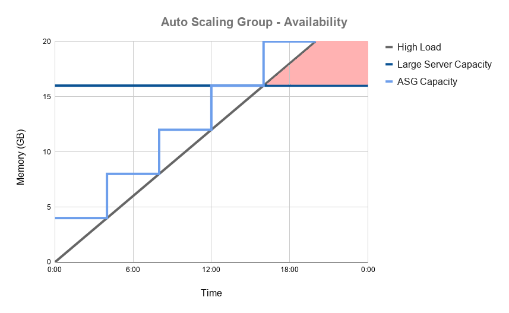

White paper
{: #wp-brand}

# Auto Scaling for a kdb+ realtime database

by [Jack Stapleton](cost-risk.md#author)
{: .wp-author}

:fontawesome-brands-youtube:
[Autoscaling the Real-time Database in the Cloud](https://youtu.be/3YFhoL9Rw6k "YouTube presentation")
 
:fontawesome-brands-github:
[kxcontrib/cloud-autoscaling](https://github.com/kxcontrib/cloud-autoscaling)

Cloud computing has fast become the new normal as more and more organizations are migrating their IT systems to the cloud.
Big cloud platforms like Amazon Web Services, Google Cloud, and Microsoft Azure have made it reliable, secure, and most importantly cost-effective.

The Infrastructure-as-a-Service (IaaS) model they have adopted has made it easier than ever before to provision computing resources.
This model has been taken a step further with Auto Scaling technologies.
Servers, storage, and networking resources can now be commissioned and decommissioned in an instant without any manual intervention.
This elasticity is one of the key benefits of Cloud Computing.
Customers can leverage this new technology to scale their infrastructure in order to meet system demands.

As these technologies become more prevalent it will become important to start incorporating them into kdb+.
This article explores how we can do this while focusing on scaling the random-access memory (RAM) needed for the real-time database (RDB).

Auto Scaling is the act of monitoring the load on a system and dynamically acquiring or shutting down resources to match this load.
Incorporating this technology into an application means we no longer need to provision one large computing resource whose capacity must forever meet the application’s demand.
Instead we can use clusters of smaller resources and scale them in and out to follow the demand curve.

## Auto Scaling and kdb+

When it comes to databases there are three main types of computing resources that we can look to scale:

* Storage
* Compute
* Random-access memory (RAM)

Scaling storage for our kdb+ databases can be relatively simple in the cloud.
As the database grows we can provision extra storage volumes for our instances, or increase the size of the ones currently in use.

Reading and writing data are prime use cases for scaling compute power within a kdb+ application.
Scaling compute for reading has been covered by Rebecca Kelly in her blog post [KX in the Public Cloud: Autoscaling using kdb+](https://kx.com/blog/kx-in-the-public-cloud-auto-scaling-using-kdb).
Here Rebecca demonstrates how to scale the number of historical database (HDB) servers to handle an increasing or decreasing number of queries.

Dynamically scaling the compute needed for writing can be a bit more complicated.
Given we want to maintain the data’s order, the entire stream of data for a given source must go through one point in the system to be timestamped.

The same can be said for scaling the RAM needed for an RDB.
For this use case the number of RDB servers will be increased throughout the day as more and more data is ingested by the tickerplant.
The system must ensure that the data is not duplicated across these servers.
Building a solution for this problem will be the objective of this article.

## Auto Scaling the RDB

By Auto Scaling the RDB we will improve both the cost-efficiency and the availability of our databases.

### Why use Auto Scaling

Let’s say on average we receive a total of 12GB of data which is distributed evenly throughout the day.
For a regular kdb+ system we might provision one server with 16GB of RAM to allow for some contingency capacity.
We then hope that the data volumes do not exceed that 16GB limit on a daily basis.

In a scalable cluster we can begin the day with one small server (for this example a quarter of the size, 4GB).
The RAM needed to hold real-time data in memory will grow throughout the day, as it does we can step up our capacity by launching more servers.

 
_<small>Figure 1.1: Capacities of regular and scalable real-time databases </small>_

### Cost efficiency

In the cloud _you pay only for what you use_.
So in a perfect system there should be no spare computing resources running idle accumulating costs.
In periods of low demand like weekends or end-of-day (when the day’s data has been flushed from memory) we should have the ability to scale down.
By ensuring this we can maintain the performance of a system at the lowest possible cost.

 
_<small>Figure 1.2: Potential cost savings of a scalable RDB </small>_

It is worth noting that the number of servers you provision will have no real bearing on the overall cost.
For the most part, running one server with 16GB of RAM will cost the same as running four with 4GB.

Below is an example of Amazon Web Service’s pricing for the varying sizes of its t3a instances.
As you can see the price is largely proportional to the memory capacity of each instance.

 
_<small>Figure 1.3: Amazon Web Services' t3a instance pricing </small>_

### Availability

Replacing one large server with a scalable cluster will make our system more reliable.
By dynamically acquiring resources we can ensure that the load on our system never exceeds its capacity.

 
_<small>Figure 1.4: Availablity of a scalable RDB under high load </small>_

This will safeguard against unexpected spikes in data volumes crippling our systems and we can stop guessing our capacity needs.
When developing a new application there is no need to estimate how much memory the RDB is going to need throughout its lifetime.
Even if the estimate turns out to be correct, we will still end up provisioning resources that will lie mostly idle during periods of low demand.
Demand varies and so should our capacity.

Distributing the day’s data among multiple smaller servers will also increase the system’s resiliency.
One fault will no longer mean all of the day’s data is lost.
The smaller RDBs will also be quicker to recover from a fault as they will only have to replay a portion of the tickerplant’s log.

