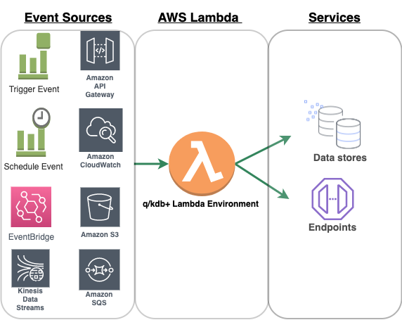
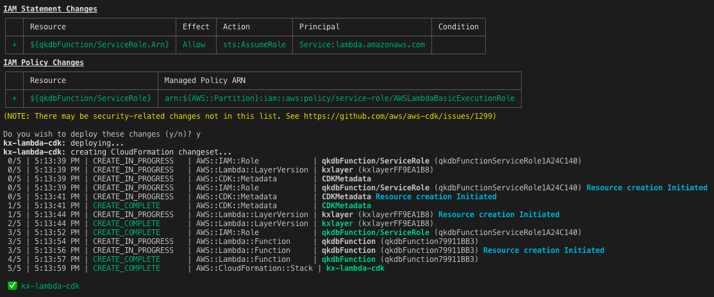
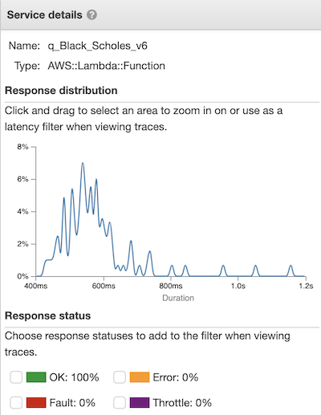

# Serverless q/kdb+ on AWS Lambda


<!-- GettyImages-1087885966.jpg -->

Although kdb+ is already widely used within AWS, we are often asked by users to explain how we run kdb+ under a “serverless” framework. One way of running kdb+ in this mode is to use the [AWS Lambda service](https://aws.amazon.com/lambda/).

AWS Lambda is an event-driven, serverless computing platform. It runs code in response to events and automatically manages the computing resources required by that code.

Lambda can be described as a type of serverless Function-as-a-Service (FaaS). FaaS is one approach to building event-driven computing systems. It relies on functions as the unit of deployment and execution and provides provision-free scalability and built-in reliability.

Lambda functions can be triggered by a variety of events that occur on AWS or on supporting third-party services. They enable you to build reactive, event-driven systems. When there are multiple, simultaneous events to respond to, Lambda runs more copies of the function in parallel and scales with the size of the workload.


## Benefits

### No servers to provision

AWS Lambda can run your code without requiring you to provision or manage servers. In this case, with kdb+, you can write your q script and upload it to Lambda, which will manage the execution environment.


### High availability

Serverless applications have built-in availability and fault tolerance. You don’t need to architect for these capabilities in your q/kdb+ code as the services running the application provide them by default.


### Continuous scaling

AWS Lambda can scale your kdb+ application by running code in response to each event trigger. Your code runs in parallel and processes each trigger individually, scaling precisely with the size of the workload.


### Cost per execution

AWS Lambda charges for every 100ms your code executes and the number of times your code is triggered. There is no cost when your code isn’t running.


## Using Lambda with other AWS services

AWS Lambda integrates with a range of other AWS services. Triggers can be set up to invoke a function in response to a file being put in an S3 bucket, lifecycle events, response to incoming HTTP requests, consume events from a queue, process records from a Kinesis Data Stream, as well as many more AWS services.

Each service that integrates with Lambda sends data to the lambda function as an event in JSON format. The structure of the event document is different for each event type, and contains data about the resource or request that triggered the function. Each Lambda runtime converts the event into an object and passes it to your function.




## Q/kdb+ Lambda runtime

The AWS Lambda execution environment provisions and runs secure sandboxed micro virtual machines in order to execute functions. These secure sandboxes can be rapidly provisioned with minimal footprint, enabling performance and security. The q/kdb+ runtime runs in this standard Lambda execution environment.

A runtime is responsible for

-   running the function’s setup code
-   reading the handler name from an environment variable
-   reading invocation events from the Lambda runtime API

The runtime passes the event data to the function handler, and posts the response from the handler back to the lambda function. A custom runtime’s entry point is an executable file named `bootstrap`.


### Initialization tasks

The runtime code is responsible for completing some initialization tasks. Then it processes invocation events in a loop until it is terminated. The initialization tasks run once per instance of the function to prepare the environment to handle invocations.

1.   Retrieve settings – Read environment variables to get details about the function and environment.

    1.  `_HANDLER` – The location to the handler, from the function’s configuration. The standard format is _file.method_, where _file_ is the name of the file without an extension, and _method_ is the name of a method or function defined in the file.
    2.  `LAMBDA_TASK_ROOT` – The directory that contains the function code (`/var/task/`).
    3.   `AWS_LAMBDA_RUNTIME_API` – The host and port of the runtime API.

2.   Initialize the function – Load the handler file and run any global or static code that it contains. Functions should create static resources like SDK clients and database connections once, and reuse them for multiple invocations.

3.   Handle errors – If an error occurs, call the initialization error API and exit immediately.

Initialization counts towards billed execution time and timeout. When an execution triggers the initialization of a new instance of your function, you can monitor the behavior of the function in CloudWatch logs and AWS X-Ray Trace. X-Ray traces allow the user to analyze and debug distributed applications and troubleshoot the root cause of performance issues and errors.


### Q/kdb+ bootstrap and code execution

To deploy the q/kdb+ runtime to your Lambda environment follow the instructions at

-   [Deploy using Serverless Application Repository](#deploy-using-serverless-application-repository)
-   [Deploy using Cloud Development Kit](#deploy-using-the-cloud-development-kit)

Once the q/kdb+ runtime is deployed to your Lambda environment, two files can be seen on the Lambda console.

```txt
bootstrap
script.q
```


A custom runtime’s entry point is an executable file named `bootstrap`. Once the Lambda function is invoked by an event, the bootstrap file passes the event data to the function handler and posts the response from the handler back to the Lambda function. The following bootstrap takes advantage of using FIFO pipes in Linux for larger payloads and enhanced error handling. The bootstrap also sets some environment variables for `QHOME`, `QLIC` and `PATH`.

The q code to execute is placed in a file called `script.q`. On the Lambda console, the handler is set as `script.q`.


In the bootstrap file, the handler is called using `$_HANDLER`.

```bash
q /var/task/$_HANDLER > response &
```

When the function is invoked, the JSON event object is passed into a file called `event_data` using

```bash
curl -sSLf -D headers -o event_data
[http://${AWS_LAMBDA_RUNTIME_API}/2018-06-01/runtime/invocation/next](about:blank)
```

`bootstrap`:

```bash
#!/bin/sh
set​ -eu
export​ QHOME=/opt
export​ QLIC=/tmp
export​ PATH=​"​$PATH​:​$QHOME​/l64:​$LAMBDA_TASK_ROOT​"

while​ ​true​; ​do
    WORKDIR=$(mktemp -d)
    cd​ ​"​$WORKDIR​"
    curl -sSLf -D headers -o event_data http://​${AWS_LAMBDA_RUNTIME_API}​/2018-06-01/runtime/invocation/next

    AWS_LAMBDA_REQUEST_ID=$(sed -ne 's/^Lambda-Runtime-Aws-Request-Id:\s*\(.*\)\s*\r$/\1/ p'​ headers)
    # exported in case we want these in q-land
    export​ AWS_LAMBDA_DEADLINE_MS=$(sed -ne 's/^Lambda-Runtime-Deadline-Ms:\s*\(.*\)\s*\r$/\1/ p'​ headers)
    export​ AWS_LAMBDA_TRACE_ID=$(sed -ne 's/^Lambda-Runtime-Trace-Id:\s*\(.*\)\s*\r$/\1/ p'​ headers)

    # we stream to support large responses
    mkfifo response
    ​# we call q executable and q code and send response to response pipe
    q /var/task/$_HANDLER > response &

    # we want to stop just before the deadline
    WATCHDOG=$(((AWS_LAMBDA_DEADLINE_MS - $(date -u +%s) * 1000 - 1000) / 1000))
    [ ​$WATCHDOG​ -ge 3 ] || WATCHDOG=3

    curl -sSf -X POST --max-time ​$WATCHDOG​ \
        -H ​'Expect:'​ \
        -H ​'Content-Type: application/octet-stream'​ \
        -T response \
        http://​${AWS_LAMBDA_RUNTIME_API}​/2018-06-01/runtime/invocation/​${AWS_LAM BDA_REQUEST_ID}​/response &
    PID_C=$!

    q -q <&- > response &
    PID_Q=$!

    wait​ ​$PID_Q​ && RC_Q=0 || RC_Q=$?
    [$RC_Q​ -eq 0 ] || error ​$AWS_LAMBDA_REQUEST_ID​ q

    # curl may have not finished yet
    wait​ ​$PID_C​ || ​true

    # we tidy up here in case some external resources were never actually used by our q code
    PIDS=$(ps --no-headers -o pid --ppid $$)
    echo​ ​"​$PIDS​"​ | xargs -r ​kill​ -9 2>/dev/null || ​true

    cd​ - >/dev/null
    unset​ AWS_LAMBDA_REQUEST_ID AWS_LAMBDA_DEADLINE_MS AWS_LAMBDA_TRACE_ID
    rm -rf ​"​$WORKDIR​"
done

exit​ 0
```

### Runtime environment limitations

-  The disk space (ephemeral) is limited to 512 MB in `/tmp` directory.
-   The default deployment package size is 50 MB.
-   Memory range is from 128 to 3008 MB.
-   Maximum execution timeout for a function is 15 minutes.
-   Requests limitations by lambda:
    -   Request and response (synchronous calls) body payload size can be up to 6 MB.
    -   Event request (asynchronous calls) body can be up to 128 KB.

Technically the limit for the deployment package size can be much higher if you let your lambda function pull the deployment package from S3. AWS S3 allows for deploying function code with a substantially higher deployment package limit (\~250 MB) as compared to directly uploading to Lambda or any other AWS service.


## Deploy using Serverless Application Repository

The q/kdb+ runtime is available from the [Serverless Application Repository](https://serverlessrepo.aws.amazon.com/applications).

The AWS Serverless Application Repository is a managed repository for serverless applications.

Following the instructions from the above link, you can deploy the latest version of q/kdb+ to your AWS Lambda environment. To register your q/kdb+ Lambda function, visit [serverless.kx.com](https://serverless.kx.com/).

## Deploy using the Cloud Development Kit

The AWS Cloud Development Kit (CDK) is a software-development framework to model and provision cloud applications using a range of programming languages. To install the CDK follow the instructions at [cdkworkshop.com](https://cdkworkshop.com/).

The following Python code is used to deploy the q/kdb+ runtime and function code to the AWS Lambda environment.


`LambdaKxStack.py`:
```python
from​ aws_cdk ​import​ (
    core,
    aws_lambda ​as​ _lambda
)

class​ ​LambdaKxStack​(core.Stack):
​
    def​ ​__init__​(self, scope: core.Construct, id: str, **kwargs) -> ​None​:
        super().__init__(scope, id, **kwargs)

    # Defines the kdb+ runtime layer from the layers directory
     kxlayer = _lambda.LayerVersion(self, ​'kxlayer'​,
        code = _lambda.AssetCode(​'layers'​)
    )
    ​# Defines an AWS Lambda function, q code from
    # code directory, memory, handler and runtime layer
    my_lambda = _lambda.Function(
        self, ​'qkdbFunction'​,
        runtime=_lambda.Runtime.PROVIDED,
        code=_lambda.Code.asset(​'code'​),
        layers= [kxlayer],
        memory_size = ​256,
        handler=​'script.q'
    )
```

The repository for the complete CDK code can be found at

:fontawesome-brands-github:
[kxcontrib/kx-lambda](https://github.com/kxcontrib/kx-lambda)

The `layers` directory contains the q/kdb+ runtime and the `code` directory contains the q/kdb+ code.

To deploy the LambdaKxStack to the Lambda environment, navigate to the directory where `app.py` is located and run:

```bash
$ cdk deploy kx-lambda-cdk
```


To remove the stack and all dependencies from your account, run:

```bash
$ cdk destroy kx-lambda-cdk
```

## Option pricing using Black-Scholes pricing model

For many financial institutions, HPC grids are a key infrastructure component of their financial and risk modelling. These model computations are becoming increasingly more complex and a growing number of financial institutions are evolving to leverage serverless architectures to achieve high parallelization on AWS Lambda.

One use case for financial institutions is to calculate Value at Risk (VaR) using the Black-Scholes pricing model. The following steps show how to set up a q/kdb+ Lambda function to price one call option using the Black-Scholes pricing model written in q. For simplicity, an approximation is used for the Cumulative Normal Distribution function (CNDF).

-   On the Lambda console, create a new file called `Black_Scholes.q` and copy in the code below.
-   Set the handler to `Black_Scholes.q`.
-   When invoked, the bootstrap file now calls the `$_HANDLER` variable to execute the Black Scholes q code.

`Black_Scholes.q`:
```q
tbl:.j.k raze read0 hsym `$"event_data"

cndf:{
  abs(x>0)
  -(exp[-.5*x*x]%sqrt 2*3.14159265358979323846)
  *t*.31938153+t*-.356563782+t*1.781477937
  +t*-1.8212 55978+1.330274429*t:1%1+.2316419*abs x }

BlackScholes:{[s;x;r;t;v;cp]
  d1:((log s%x)+(r+0.5*(v*v))*t)%v*sqrt t;
  d2:((log s%x)+(r-0.5*(v*v))*t)%v*sqrt t;
  $[cp~"c";(s*cndf[d1])-x*(exp neg r*t)*cndf[d2];
    cp~"p";(x*(exp neg r*t)*cndf[neg d2])-s*cndf[neg d1];
    '"(c)all/(p)ut error"] }

tbl[`BlackScholes_Option_Price]:BlackScholes[ tbl.EquityPrice;
  tbl.Strike;
  tbl.Rate;
  tbl.Time; tbl.Volatility; -10h$tbl.CallPut ]

.j.j tbl
```


### Invoke Lambda function and decode logs

The Lambda function is invoked by calling the AWS Lambda [`invoke`](https://docs.aws.amazon.com/cli/latest/reference/lambda/invoke.html) CLI command. The input parameters are passed to our Black-Scholes pricing model as a JSON message using the `--payload` parameter.

```bash
$ aws lambda invoke \
    --invocation-type RequestResponse \
    --function-name q_Black_Scholes \
    --region us-east-1 \
    --log-type Tail \
    --payload '{ "Ticker": "AAPL","EquityPrice": 200,"Strike": 220,"Rate":
0.025,"Time": 0.25,"Volatility": 0.2673,"CallPut": "c"}' \
    --profile kx_lambda_user output.txt \
    --query 'LogResult' \
    --output text \
    | base64 -D
```

You can also use the [testing feature](https://aws.amazon.com/blogs/compute/improved-testing-on-the-aws-lambda-console/) on AWS Lambda to test your function from the AWS Lambda console.

In the `Black_Scholes.q` script, the `event_data` is parsed into a table using 

```q
tbl:.j.k raze read0 hsym `$"event_data"
```

Each parameter (Price, Strike, etc.) is then passed to the `BlackScholes` q function. The `.j.j` function outputs the result in JSON format.

The bootstrap file then passes the result object to the response pipe and the output is returned to your Lambda `invoke` CLI call.

Bootstrap response curl command:
```bash
curl -sSf -X POST --max-time $WATCHDOG \
    -H 'Expect:' \
    -H 'Content-Type: application/octet-stream' \
    -T response \
    http://${AWS_LAMBDA_RUNTIME_API}/2018-06-01/runtime/invocation/${AWS_LAMBDA_REQUEST_ID}/response &
```

The CLI command should return this response in the output.txt file:
```json
"{\"Ticker\":\"AAPL\",\"EquityPrice\":200,\"Strike\":220,\"Rate\":0.025,\"Time\":0.25,
\"Volatility\":0.2673,\"CallPut\":\"c\",\"​BlackScholes_Option_Price\":4.220232​}
```

From the response payload we see the function was successful and calculated the Black-Scholes option price. For simplicity, one option price was calculated but this function can be easily extended to scale and process multiple option-price calculations/events. In the next section, we will demonstrate scaling and processing multiple events from an S3 bucket.


## Stream data from Amazon S3

To demonstrate a q/kdb+ Lambda function processing multiple events, we detail how to stream data from AWS Simple Storage Service (S3). Using FIFO named pipes and [`.Q.fps`](../../ref/dotq.md#qfps-streaming-algorithm) within q, data can be streamed in for processing. To illustrate this example, we create 100 files each containing 1 million Black-Scholes input parameters. The files are placed in a S3 bucket. This S3 bucket is the trigger for the Lambda function.

:fontawesome-brands-aws:
[Configuring Amazon S3 Event Notifications](https://docs.aws.amazon.com/AmazonS3/latest/dev/NotificationHowTo.html)
for how to add an S3 bucket event as a trigger to your Lambda function

Each parameter file is space-delimited and has a column for Spot, Strike, Time, Rate and Volatility as illustrated below.

```txt
28.54 25.00 21.00 0.05 0.53
25.07 26.00 22.00 0.05 0.54
26.92 27.00 20.00 0.05 0.48
25.97 28.00 45.00 0.05 0.45
23.09 29.00 90.00 0.05 0.48
```

The Lambda function that is created has an associated AWS IAM role. To access the data in S3, the Lambda roles credentials are updated using IAM to allow permission to access the S3 bucket where you would like to place your parameter files.

:fontawesome-brands-aws:
[Writing IAM Policies: How to Grant Access to an Amazon S3 Bucket](https://aws.amazon.com/blogs/security/writing-iam-policies-how-to-grant-access-to-an-amazon-s3-bucket/)

Next we update the handler to use the q code `process_s3data.q`.

The steps in the `process_s3data.q` code are as follows.

1.  Parse event data from S3 event to create S3 object key and bucket variables.
1.  Set environment variables that will be used by the `Stream_Data` script.
1.  Call S3 function from `Stream_Data` script, initiate FIFO pipe and stream in S3 data.
1.  Load `blackScholes.q`.
1.  Create inputs table to store input parameters.
1.  Use [`.Q.fps`](../../ref/dotq.md#qfps-streaming-algorithm) to stream in the S3 data from the FIFO `pipe_stream` to inputs table.
1.  Use [`.Q.fu`](../../ref/dotq.md#qfu-apply-unique) to run the inputs through the `blackScholes` formula.
1.  `black_scholes_data` contains the input parameters and the calculated option prices.

`process_s3data.q`:
```q
//Parse S3 event data
jsonevent:.j.k raze read0 hsym `$​"event_data"​
s3key:raze jsonevent@/`Records`s3`object`key
bucket:raze jsonevent@/`Records`s3`bucket`name

//Set environment variables
`LAMBDAQ_REF setenv ​"pipe_stream"
`LAMBDAQ_REGION setenv ​"us-east-1"
`LAMBDAQ_BUCKET setenv bucket
`LAMBDAQ_KEY setenv s3key

// Call S3 function from Stream_Data script,
// initiate fifo pipe and stream in S3 data.
\Stream_Data s3

//Load black scholes q code
\l /var/task/blackScholes.q

//Create black scholes inputs table
inputs: flip `spot`strike`time`rate`vol!​"FFFFF"​$\:()

// Stream S3 data from pipe into inputs table
.Q.fps[{`inputs insert (​"FFFFF"​;​" "​;​1​)​0​:x}]`:pipe_stream

// Calculate option prices using black scholes formula
blackScholesPrices:.Q.fu[blackScholes] inputs
black_scholes_data:update blackScholesPrices from inputs
```


`blackScholes.q`:
```q
cn​df:​{
  ​abs​(x>​0​)-(​exp​[-​0.5​*x*x]%​sqrt 2​*​3.14159265358979323846​)*
  ​t​*.​31938153​+​t​*-​0.356563782​+​t​*​1.781477937​+​t​*
  -​1.821255978​+​1.330274429​*​t:1​.%​1​+.​2316419​*​abs​ x }

blackSchol​es:​{[table]
  s:ta​ble[`spot];
  ​x:ta​ble[`strike];
  ​t:ta​ble[`​time​];
  ​r:ta​ble[`​rate​];
  ​v:ta​ble [`vol];
  ​cp:​`c;
  ​d1​:((​log​ s%x)+(r+​0.5​*(v*v))*​t​)%v*​sqrt​ ​t​;
  ​d2​:((​log​ s%x)+(r-​0.5​*(v*v))*​t​)%v*​sqrt​ ​t​;
  $[cp~`c;(s*cndf[​d1​])-x*(​exp​ neg r*​t​)*cndf[​d2​];
    cp~`p;(x*(​exp​ neg r*​t​)*cndf[neg ​d2​])-s*cndf[neg ​d1​];
    '​"(c)all/(p)ut error"​] }
```

The `Stream_Data` script uses the IAM credentials of the Lambda role to sign the API request and access the S3 bucket where the data resides. The files are then streamed into a FIFO pipe which is processed using `.Q.fps`.

The script uses the following environment variables to sign the request.

```txt
AWS_ACCESS_KEY_ID
AWS_SECRET_ACCESS_KEY
AWS_SESSION_TOKEN
```

:fontawesome-brands-aws:
[Signing AWS API Requests](https://docs.aws.amazon.com/general/latest/gr/signing_aws_api_requests.html)

`Stream_Data`:
```bash
#!/bin/sh
set​ -eu

do_curl​ () {
    [ ​"​${LAMBDAQ_REF:-}​"​ -a ​"​${LAMBDAQ_URI:-}​"​ ] || ​exit​ 64

    mkfifo ​"​$LAMBDAQ_REF​"
    curl -sSf --compressed -o ​"​$LAMBDAQ_REF​"​ ​"​$LAMBDAQ_URI​"​ &
}

sha256​ () {
    echo​ -n ​"​$1​"​ | openssl dgst -sha256 | cut -d​' '​ -f2 | tr -d ​'\n'
}
hmac​ () {
    echo​ -n ​"​$1​"​ | openssl dgst -sha256 -mac HMAC -macopt ​"​$2​"​ | cut -d​' '​ -f2 | tr -d ​'\n'
}
do_s3​ () {
    [ ​"​${LAMBDAQ_REF:-}​"​ -a ​"​${LAMBDAQ_REGION:-}​"​ -a "​${LAMBDAQ_BUCKET:-}​"​ -a ​"​${LAMBDAQ_KEY:-}​"​ ] || ​exit​ 64
    AWS_DATE=$(date -u +%Y%m%dT%H%M%S)Z
    AWS_ALGO=AWS4-HMAC-SHA256
    AWS_SERVICE=s3
    AWS_HOST=​$LAMBDAQ_BUCKET​.​$AWS_SERVICE​.​$LAMBDAQ_REGION​.amazonaws.com
    AWS_PATH=/​${LAMBDAQ_KEY%\?*} [ ​"​$AWS_PATH​"​ = ​"/​$LAMBDAQ_KEY​"​ ] && AWS_QUERY= ||
    AWS_QUERY=​${LAMBDAQ_KEY#*\?} 
    AWS_REQUEST=aws4_request 
    AWS_REGION=​$LAMBDAQ_REGION

    PCHK=$(sha256 ​''​)
    CCHK=$(sha256 ​"GET 
$AWS_PATH
$AWS_QUERY
host:​$AWS_HOST 
x-amz-content-sha256:​$PCHK 
x-amz-date:​$AWS_DATE​${AWS_SESSION_TOKEN:+ 
x-amz-security-token:​$AWS_SESSION_TOKEN​}

host;x-amz-content-sha256;x-amz-date​${AWS_SESSION_TOKEN:+;x-amz-securit y-token}
$PCHK​"​)

    SKEY=$(hmac aws4_request hexkey:$(hmac ​$AWS_SERVICE​ hexkey:$(hmac $AWS_REGION​ hexkey:$(hmac ​${AWS_DATE%T*} key:​"AWS4​$AWS_SECRET_ACCESS_KEY​"​))))
    SIG=$(hmac ​"​$AWS_ALGO $AWS_DATE ${AWS_DATE%T*}​/​$AWS_REGION​/​$AWS_SERVICE​/​$AWS_REQUEST $CCHK​"​ hexkey:​$SKEY​)

    mkfifo ​"​$LAMBDAQ_REF​"
    curl -sSf --compressed -o ​"​$LAMBDAQ_REF​"​ \
        -H ​"Authorization: ​$AWS_ALGO Credential=​$AWS_ACCESS_KEY_ID​/​${AWS_DATE%T*}​/​$AWS_REGION​/​$AWS_SERVICE​/​$ AWS_REQUEST​, 
        SignedHeaders=host;x-amz-content-sha256;x-amz-date​${AWS_SESSION_TOKEN:+ ;x-amz-security-token}​, Signature=​$SIG​"​ \
        -H ​"x-amz-content-sha256: ​$PCHK​"​ \
        -H ​"x-amz-date: ​$AWS_DATE​"​ \ 
        ${AWS_SESSION_TOKEN:+-H "x-amz-security-token: $AWS_SESSION_TOKEN"}​ \
        "https://​$AWS_HOST$AWS_PATH​?​$AWS_QUERY​"​ &
}

case​ ​$1​ ​in 
  curl) do_curl;; 
  s3) do_s3;; 
  *) exit​ 64;; 
esac

exit​ 0
```

## Process Amazon Kinesis data streams

Using q/kdb+ on Lambda, we can send data between the AWS Kinesis Service and a remote q/kdb+ process using IPC.

For a simple test, set up a running q process on an Elastic Compute Cloud (EC2) server and note the IP address. Kdb+ is available on EC2 from the [AWS
Marketplace](https://aws.amazon.com/marketplace/pp/B07KX973GH?ref_=beagle)
or can be manually installed on a machine of your choosing.

1.  Run the q process on port 5001 (`\p 5001`)
1.  Open port 5001 on the EC2 Security Group

Next update the handler to use `Kinesis.q`

The `Kinesis.q` script will first deserialize the Kinesis event message.

```q
event:.j.k raze read0 hsym `$"event_data"
```

It then handles the IPC connection between Lambda and the remote q process. Using the [`hopen`](../../ref/hopen.md) function, a handle is opened to
the IP address of the EC2 server running the remote q process.

```q
h:hopen `:34.123.12.123:5001
```


`Kinesis.q`:
```q
event:.j.k ​raze​ ​read0​ ​hsym​ `$​"event_data"​
h:​hopen​ `:​34.123.12.123​:​5001
h ​"show `Sending_Kinesis_Data_Stream" 
h(​set​;`kinesis_data;event)
hclose​ h
```

To invoke the `Kinesis.q` function, a sample Kinesis Data Stream event message can be used. This can be set up by using the testing feature from the AWS Lambda console. There is also a range of test events available for other AWS services.

From the AWS Lambda console, _Select Configure Test Events_ \> _Create New Test Event_ \> _Event Template_ \> _Amazon Kinesis Data Stream_. Select _Create_, then _Test_.


Example Kinesis data stream event:
```json
{
  "Records": [
    {
      "kinesis": {
        "partitionKey": ​"partitionKey-03"​, 
        "kinesisSchemaVersion": ​"1.0"​,
        "data": ​"SGVsbG8sIHRoaXMgaXMgYSB0ZXN0IDEyMy4="​, 
        "sequenceNumber": "49545115243490985018280067714973144582180062593244200961"​,
        "approximateArrivalTimestamp": ​1428537600 
      },
      "eventSource": ​"aws:kinesis"​,
      "eventID": "shardId-000000000000:49545115243490985018280067714973144582180062593 244200961"​,
      "invokeIdentityArn": ​"arn:aws:iam::EXAMPLE"​, 
      "eventVersion": ​"1.0"​,
      "eventName": ​"aws:kinesis:record"​, 
      "eventSourceARN": ​"arn:aws:kinesis:EXAMPLE"​, 
      "awsRegion": ​"us-east-1"
    }
  ] 
}
```

Once the test is run, the following can be seen on the remote q/kdb+ process. 

Remote q process running on EC2 (port 5001):
```q
q)`Sending_Kinesis_Dat​a_Stream
q)kinesis_data
Records| +`kinesis`eventSource`eventID`invokeIdentityArn`eventVersion`eventName`eventSourceARN`awsRegion!
(,`partitionKey`kinesisSchemaVersion`data`se quenceNumber`approximateArrivalTimestamp!
    ("partitionKey-03";"1.0";"SGV sbG8sIHRoaXMgaXMgYSB0ZXN0IDEyMy4=";"4954511524349098501828006771497314 4582180062593244200961";1.428538e+09);
    ,"aws:kinesis";,"shardId-0000000 00000:49545115243490985018280067714973144582180062593244200961";
    ,"arn: aws:iam::EXAMPLE";,"1.0";,"aws:kinesis:record";,"arn:aws:kinesis:EXAMP LE";,"us-east-1")
```

The Kinesis Data stream data was successfully sent to q and stored in the object called `kinesis_data`.

This simple example illustrates how easy it is to send data from AWS Lambda to another q/kdb+ process. This example can easily be extended to execute based on a trigger event from Kinesis or any other [AWS supported
services](https://docs.aws.amazon.com/lambda/latest/dg/lambda-services.html).


## Serverless gateway process

Many kdb+ systems are constructed where data is stored across several processes. These architectures can range from a single real-time and historic database on the same server to multi-site architectures where data of various forms is stored in hundreds of different processes. In either case there is likely to be the same requirement to access data across processes. This is typically achieved using a kdb+ gateway process.

The primary objective of a gateway is to act as a single interface point and separate the end user from the configuration of the underlying databases. The task of the gateway can be broken down into the following steps.

1.  Check user entitlements and data-access permissions
1.  Provide access to stored procedures
1.  Gain access to data in the required services
1.  Provide best possible service and query performance

Setting up a gateway in a serverless framework has many benefits.

-   There are no servers to manage.
-   The gateway can scale to meet user requests.
-   You only pay for the compute time for each request

Trades table on a remote EC2 machine:
```txt
exchange​ ​ sym​ ​    time​ ​                         price​ ​  size 
--------------------------------------------------------------------
exchangeA​ ​BTCEUR​  2020​-01-27D22​:33:39.163733000 8076​.09​ ​-0​.00380418 
exchangeA​ ​BTCUSD​  2020​-01-27D22​:33:39.163867000 8897 ​   -0​.03520613 
exchangeA​ ​BTCUSDC​ 2020​-01-27D22​:33:39.163905000 8895​.96​ ​-0​.06329409 
exchangeB​ ​BTCGBP​  2020​-01-27D22​:33:39.163967000 6827​.19​ 0​.02871252 
exchangeB​ ​BTCGBP​  2020​-01-27D22​:33:39.225011000 6850​.9​ ​ -0​.01170263 
exchangeC​ ​BTCGBP​  2020​-01-27D22​:33:39.225011000 6870​.8​  0​.127068
```

On the remote RDB/HDB process running on the EC2 server, we set up the following q functions.

```q
getExchangeData:{[t;x] ​select​ from t ​where​ exchange = x} 
getCcyData:{[t;x] ​select​ from t ​where​ sym = x}
```

The following q code can be set up in a Lambda function to illustrate a simple gateway process. A handle `h` is opened to the remote RDB/HBD process.

```q
// Open handle to remote RDB/HDB
h:hopen `:​34.12.123.12​:​5001
// get all exchange trades
Exchange_trades: h(`getExchangeData;`trades;`exchangeA)

// get to all BTCUSD trades
BTCUSD_trades: h(`getCcyData;`trades;`BTCUSD)
hclose h
```

This simple example demonstrates how a gateway process can be quickly set up on AWS Lambda and from this could be extended to handle additional functionality such as permissioning and user entitlements.


## Runtime and trace logs

Each Lambda function can be monitored by AWS X-Ray to analyze and debug issues. AWS X-Ray tracing is useful for distributed applications, such as those built using microservices architectures. X-Ray tracing can be enabled from the Lambda console or using the AWS CLI.

```bash
$ aws lambda update-function-configuration \
    --function-name q_Function \
    --tracing-config '{"Mode": "Active"}'
```

Taking one example, we examine the trace logs for a function and see how much time is attributed to function invocation and run time of the q code. For illustration purposes, a function was run 100 times in parallel and the X-Ray trace logs can be seen below.


<br>
<small>_Response distribution of the 100 invocations of the function_</small>

Taking a closer look at one of the traces, we can see the function took a total of 479ms to run. 330ms of this time was spent on running the q code and 138ms was spent preparing the environment.


<br>
<small>_Trace details_</small>

Using X-Ray it’s easy to debug and monitor function execution time and memory usage. Consequently, you can make informed decisions on running the function, such as increasing or decreasing the memory size so the function executes more efficiently.


## Reserved concurrency and execution limits

The Lambda service for every AWS account starts with a pool of 1000 concurrent executions. All q/kdb+ lambda functions from this account share executions from this pool. If one q/kdb+ lambda function were to receive for example 1000 requests, AWS would run those from the common pool.

If a second q/kdb+ Lambda function in the same account were to receive for example 200 requests, it could be completely or partially rejected as the number of combined concurrent executions is over the limit of 1000.

To guarantee that executions will be available to your q/kdb+ lambda function, you can use the Reserved Concurrency parameter. AWS however reserves 100 executions for the common pool at all times. So, if the account limit is 1000, the maximum number of Reserved Concurrency would be 900.

To modify the Reserved Concurrency via the command line use the following command.

```bash
$ aws lambda put-​function​-concurrency \
    --​function​-​name YOUR_FUNCTION_NAME_HERE \
    --reserved-concurrent-executions ​50
```

It is also worth noting, in order to raise the limit above 1,000 concurrent function executions, a request can be submitted to the AWS Support Centre.

