# Appendix A - Elastic Block Store (EBS)

!!! info "EBS can be used to store HDB data, and is fully compliant with kdb+."

    It supports all of the POSIX semantics required.

Three variants of the [Elastic Block Service](https://docs.aws.amazon.com/AWSEC2/latest/UserGuide/RootDeviceStorage.html) (EBS) are all qualified by
kdb+: `gp2` and `io1` are both NAND Flash, but offer different
price/performance points, and `st1` is comprised of traditional drives.
Unlike ephemeral SSD storage, EBS-based storage can be dynamically
provisioned to any other EC2 instance via operator control. So this is a
candidate for on-demand HDB storage. Assign the storage to an instance
in build scripts and then spin them up. (Ref: Amazon EBS)

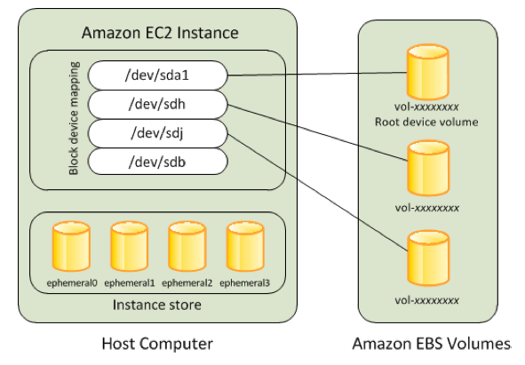

A disadvantage of EBS is that even if the data is read-only (immutable)
a specific volume cannot be simultaneously mounted and shared
between two or more EC2 instances. Furthermore, the elastic volume would
have to be migrated from one instance ownership to another, either
manually, or with launch scripts. EBS Snapshots can be used for
regenerating an elastic volume to be copied across to other freshly
created EBS volumes, which are subsequently shared around under EBS with
a new instance being deployed on-demand.

Therefore, users of EBS or direct attach containing significant volumes
of historical data, may need to replicate the data to avoid constraining
it to just one node. You could also shard the data manually,
perhaps thence accessing nodes attached via a kdb+ UI gateway.

EBS is carried over the local network within one availability zone.
Between availability zones there would be IP L3 routing protocols
involved in moving the data between zones, and so the latencies would be
increased.

EBS may look like a disk, act like a disk, and walk like a disk, but it
doesn’t behave like a disk in the traditional sense.

There are constraints on calculating the throughput gained from EBS:

  - There is a max throughput to/from each physical EBS volume. This is
    set to 500&nbsp;MB/sec for io1 and 160&nbsp;MB/sec for `gp2`. A `gp2` volume can
    range in size from 1&nbsp;GB to 16&nbsp;TB. You can use multiple volumes per
    instance (and we would expect to see that in place with a HDB).

  - There is a further limit to the volume throughput applied, based on
    its size at creation time. For example, a GP2 volume provides a
    baseline rate of IOPs geared up from the size of the volume and
    calculated on the basis of 3 IOPs/per GB. For 200&nbsp;GB of volume, we
    get 600 IOPS and @ 1&nbsp;MB that exceeds the above number in (1), so the
    lower value would remain the cap. The burst peak IOPS figure is more
    meaningful for random, small reads of kdb+ data.

  - For `gp2` volumes there is a burst level cap, but this increases as the volume gets larger. This burst level peaks at 1 TB, and is 3000 IOPS. that would be 384&nbsp;MB/sec at 128&nbsp;KB records, which, again is in excess of the cap of 160&nbsp;MB/sec.

  - There is a maximum network bandwidth per instance. In the case of
    the unit under test here we used `r4.4xlarge`, which constrains the
    throughput to the instance at 3500&nbsp;Mbps, or a wire speed of 430&nbsp;MB/sec, capped. This would be elevated with larger instances, up to
    a maximum value of 25&nbsp;Gbps for a large instance, such as for
    `r4.16xlarge`.

  - It is important note that EBS scaled linearly across an entire
    estate (e.g. parallel peach queries). There should be no constraints
    if you are accessing your data, splayed across different physical
    across distinct instances. e.g. 10 nodes of `r4.4xlarge` is capable of
    reading 4300&nbsp;MB/sec.

Kdb+ achieves or meets all of these advertised figures. So the EBS
network bandwidth algorithms become the dominating factor in any final
calculations for your environment.

For consistency in all of these evaluations, we tested with a common
baseline using an `r4.4xlarge` instance with four 200-GB volumes, each with
one xfs file system per volume, therefore using four mount points (four
partitions). To show the scale to higher throughputs we used an
`r4.16xlarge` instance with more volumes: eight 500-GB targets, (host max
bandwidth there of 20&nbsp;Gbps, compared with max EBS bandwidth of 1280&nbsp;MB/sec) and
we ran the comparison on `gp2` and `io1` versions of EBS storage.
For the testing of `st1` storage, we used four 6-TB volumes, as each of
these could burst between 240-500&nbsp;MB/sec. We then compared the delta
between two instance sizes.

## EBS-GP2

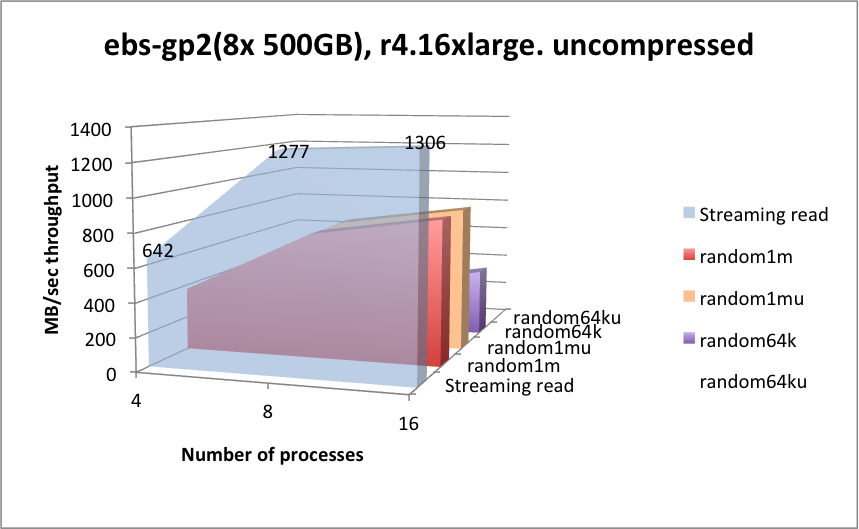

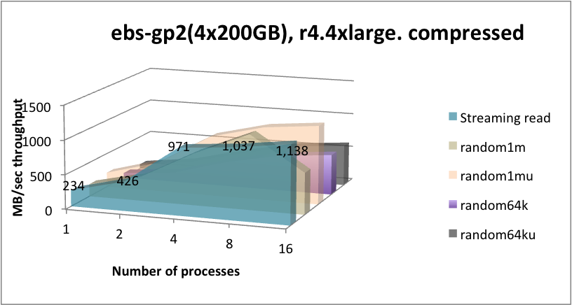

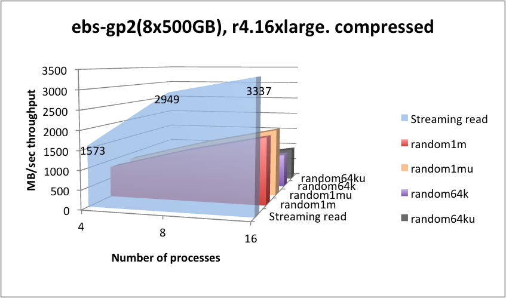

function       | latency (mSec) | function   | latency (mSec) 
---------------|----------------|------------|---------------
`hclose hopen` | 0.004          | `();,;2 3` | 0.006
`hcount`       | 0.002          | `read1`    | 0.018

<small>_EBS GP2 metadata operational latencies - mSecs (headlines)_</small>

## EBS-IO1

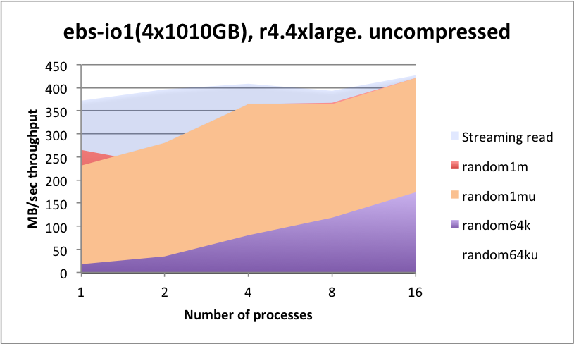

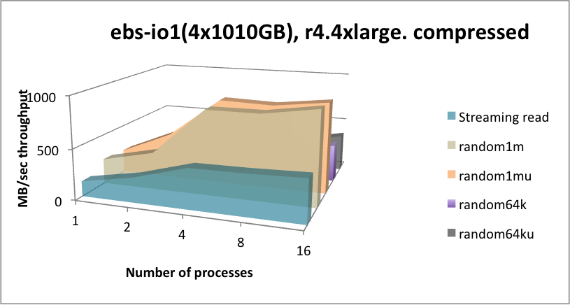

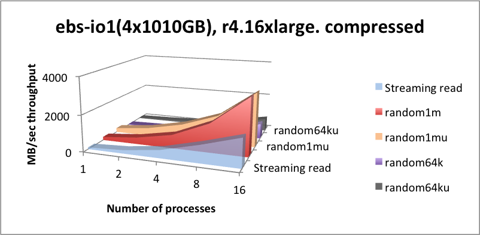

function       | latency (mSec) | function   | latency (mSec) 
---------------|----------------|------------|---------------
`hclose hopen` | 0.003          | `();,;2 3` | 0.006
`hcount`       | 0.002          | `read1`    | 0.017

<small>_EBS-IO1 metadata operational latencies - mSecs (headlines)_</small>

## EBS-ST1

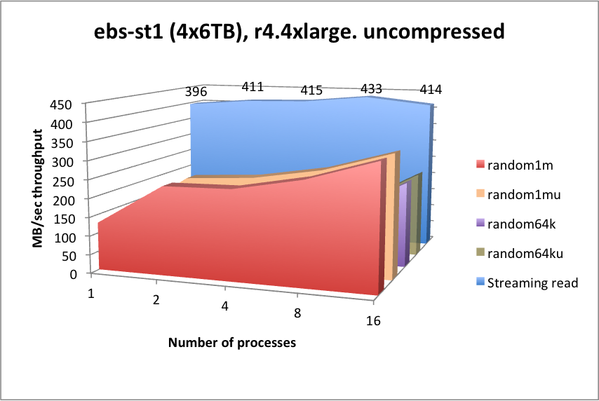

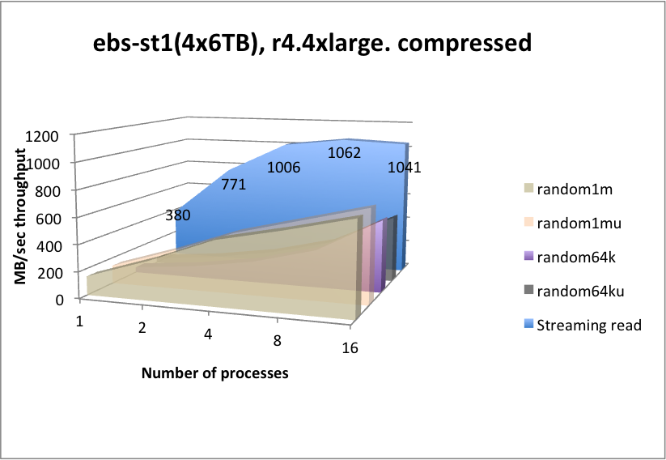

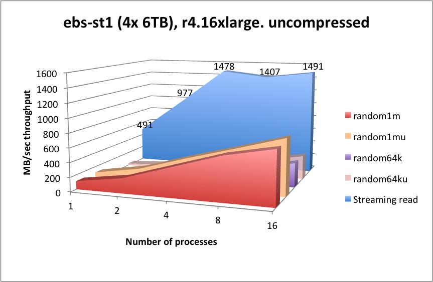

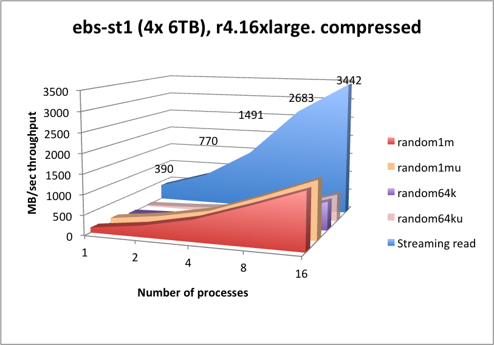

function       | latency (mSec) | function   | latency (mSec) 
---------------|----------------|------------|---------------
`hclose hopen` | 0.003          | `();,;2 3` | 0.04
`hcount`       | 0.002          | `read1`    | 0.02

<small>_EBS-ST1 metadata operational latencies - mSecs (headlines)_</small>

## Summary 

Kdb+ matches the expected throughput of EBS for all classifications,
with no major deviations across all classes of read patterns required.
EBS-IO1 achieves slightly higher throughput metrics over GP2, but
achieves this at a guaranteed IOPS rate. Its operational latency is
very slightly lower for meta data and random reads. When considering
EBS for kdb+, take the following into consideration:

-   Due to private-only presentations of EBS volumes, you may wish to
    consider EBS for solutions that shard/segment their HDB data between
    physical nodes in a cluster/gateway architecture. Or you may choose
    to use EBS for locally cached historical data, with other
    file-systems backing EBS with full or partial copies of the entire
    HDB.

-   Fixed bandwidth per node: in our testing cases, the instance
    throughput limit of circa 430&nbsp;MB/sec for `r4.4xlarge` is easily
    achieved with these tests. Contrast that with the increased
    throughput gained with the larger `r4.16xlarge` instance. Use this
    precept in your calculations.

-   There is a fixed throughput per GP2 volume, maxing at 160&nbsp;MB/sec.
    But multiple volumes will increment that value up until the peak
    achievable in the instance definition. Kdb+ achieves that instance
    peak throughput.

-   Server-side kdb+ in-line compression works very well for streaming
    and random 1-MB read throughputs, whereby the CPU essentially keeps
    up with the lower level of compressed data ingest from EBS, and for
    random reads with many processes, due to read-ahead and
    decompression running in-parallel being able to magnify the input
    bandwidth, pretty much in line with the compression rate.

-   `st1` works well at streaming reads, but will suffer from high
    latencies for any form of random searching. Due to the lower
    capacity cost of `st1`, you may wish to consider this for data that is
    considered for streaming reads only, e.g. older data.

[Migrating a kdb+ HDB to Amazon EC2](index.md)

[B. EFS (NFS)](app-b-efs-nfs.md)

