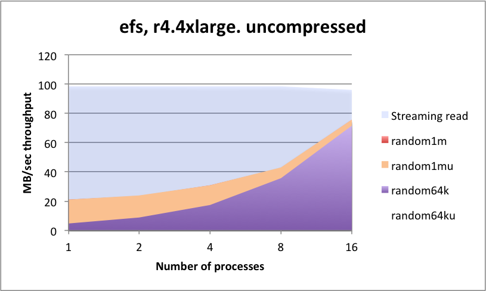
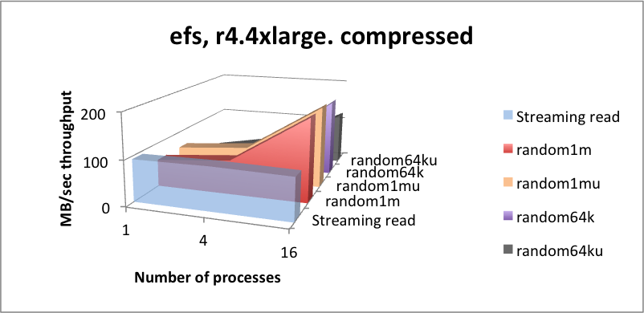

# Appendix B – EFS (NFS)

EFS is an NFS service owned and run by AWS that offers NFS service for
nodes in the same availability zone, and can run across zones, or can be
exposed externally. The location of where the storage is kept is owned
by Amazon and is not made transparent to the user. The only access to
the data is via using the service by name (NFS service), and there is no
block or object access to said data.

&nbsp; | Amazon EFS | Amazon EBS Provisioned IOPS
-|------------|----------------------------
Availability and durability | Data is stored independently across multiple AZs. | Data is stored redundantly in a single AZ.
Access | Up to thousands of Amazon EC2 instances, from multiple AZs, can connect concurrently to a file system. | A single Amazon EC2 instance can connect to a file system.
Use cases | Big data and analytics, media processing workflows, content management, web serving, and home directories. | Boot volumes, transactional and NoSQL databases, data warehousing, and ETL.

One way to think about EFS is that it is a service deployed in some regions (not all) of the AWS estate. It does indeed leverage S3 as a persistent storage, but the EFS users have no visibility of a single instance of the server, as the service itself is ephemeral and is deployed throughout all availability zones.

This is different from running your own NFS service, whereby you would define and own the instance by name, and then connect it to an S3 bucket that you also own and define.

A constraint of EFS for kdb+ is that performance is limited by a predefined burst limit, which is based on the file-system size:

file-system size | aggregate read/write throughput
-----------------|---------------------------------
100 GiB | • burst to 100&nbsp;MiB/s for up to 72 min a day • drive up to 5&nbsp;MiB/s continuously
1 TiB | • burst to 100&nbsp;MiB/s for 12 hours a day • drive 50&nbsp;MiB/s continuously
10 TiB | • burst to 1&nbsp;GiB/s for 12 hours a day • drive 500&nbsp;MiB/s continuously
larger | • burst to 100&nbsp;MiB/s per TiB of storage for 12 hours a day • drive 50&nbsp;MiB/s per TiB of storage continuously

So, the EFS solution offers a single name space for your HDB structure,
and this can be shared around multiple instances including the ability
for one or more nodes to be able to write to the space, which is useful
for daily updates. We tested kdb+ performance with a 1-TB file system.
Testing was done within the burst limit time periods.

The EFS burst performance is limited to 72 minutes per day for a 100-GB
file system. Subsequent throughput is limited to 5&nbsp;MB/sec.

function       | latency (mSec) | function   | latency (mSec) 
---------------|----------------|------------|---------------
`hclose hopen` | 3.658          | `();,;2 3` | 11.64
`hcount`       | 3.059          | `read1`    | 6.85

<small>_Metadata operational latencies - mSecs (headlines)_</small>

## Summary

Note the low rate of streaming read performance, combined with very high metadata latencies (1000× that of EBS). The increase in transfer rate for many-threaded compressed data indicates that there is a capped bandwidth number having some influence on the results as well as the operational latency. Consider constraining any use of EFS to temporary store and not for runtime data access.

[A. Elastic Block Store (EBS)](app-a-ebs.md)

[C. Amazon Storage Gateway](app-c-asg.md)

