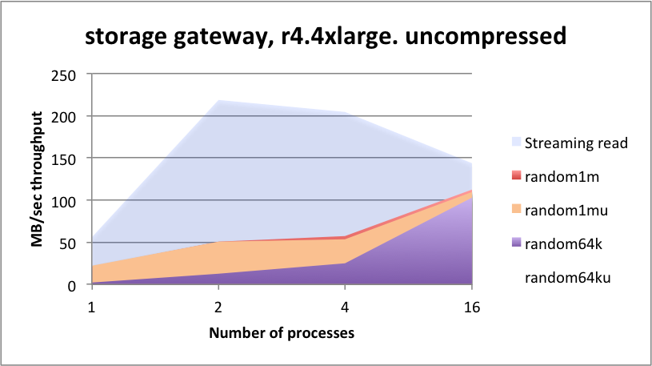

# Appendix C – Amazon Storage Gateway (File mode)

Amazon Storage Gateway is a pre-prepared AMI/instance that can be
provisioned on-demand. It allows you to present an NFS layer to the
application with S3 as a backing store. The difference between this and
EFS is that the S3 bucket is owned and named by you. But fundamentally
the drawback with this approach will be the operational latencies. These
appear much more significant than the latencies gained for the EFS
solution, and may reflect the communication between the file gateway
instance and a single declared instance of S3. It is likely that the S3
buckets used by EFS are run in a more distributed fashion.

One advantage of AWS Gateway is that it is managed by AWS, it can be
deployed directly from the AWS console, and incurs no additional fees
beyond the normal storage costs which is in line with S3.

function       | latency (mSec) | function   | latency (mSec) 
---------------|----------------|------------|---------------
`hclose hopen` | 3.892          | `();,;2 3` | 77.94
`hcount`       | 0.911          | `read1`    | 7.42

<small>_Metadata operational latencies - mSecs (headlines)_</small>

## Summary

The throughput appears to run at about 50% of the line rates available, even when run at scale. 
The AWS gateway exhibits significantly high operational latency. 
This manifests as very long wait times when performing an interactive `ls -l` command from the root of the file system, while the file system is under load, sometimes taking several minutes to respond to the directory walk.

[B. EFS (NFS)](app-b-efs-nfs.md)

[D. MapR-FS](app-d-mapr.md)

