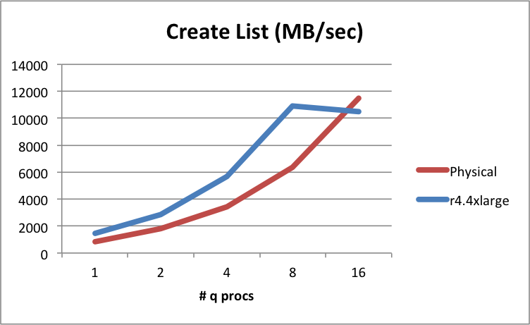
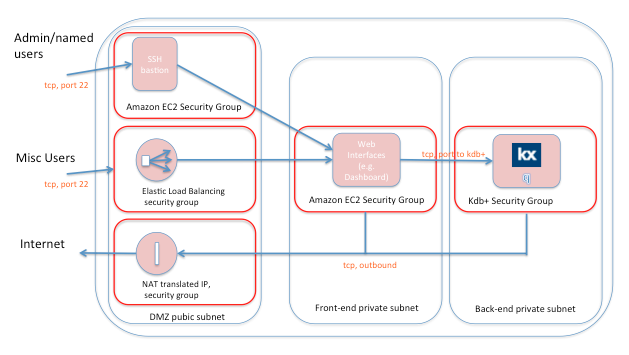
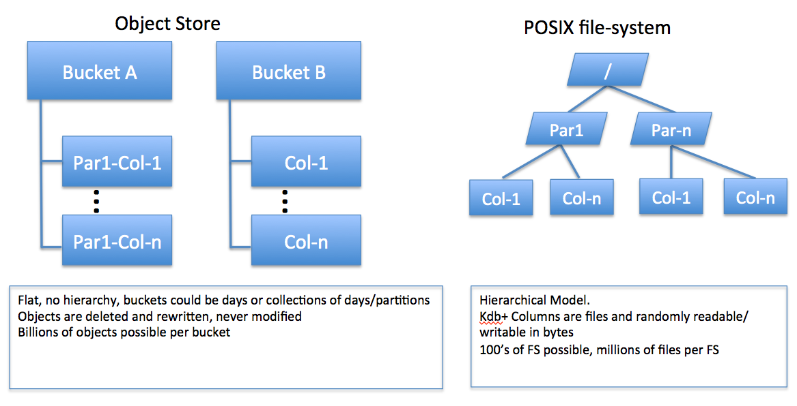
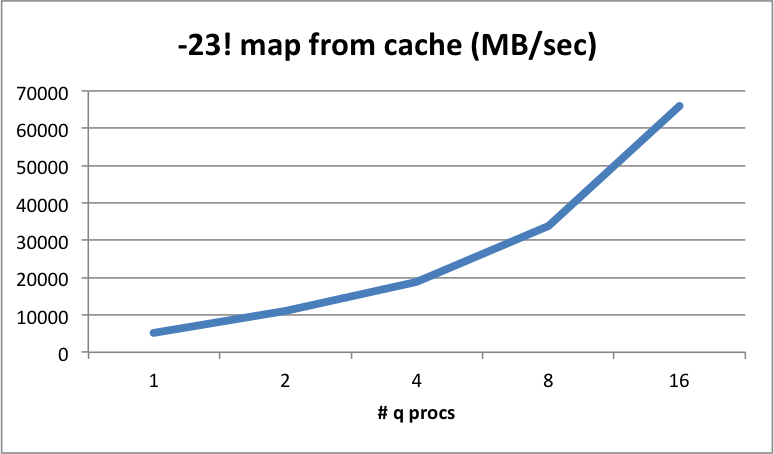
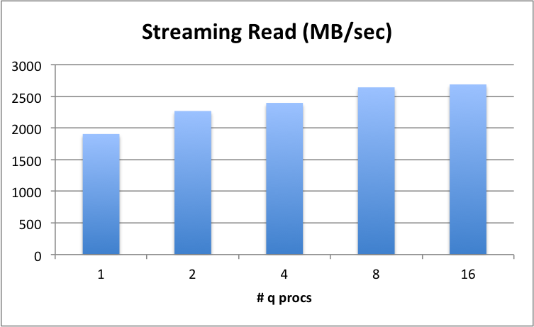
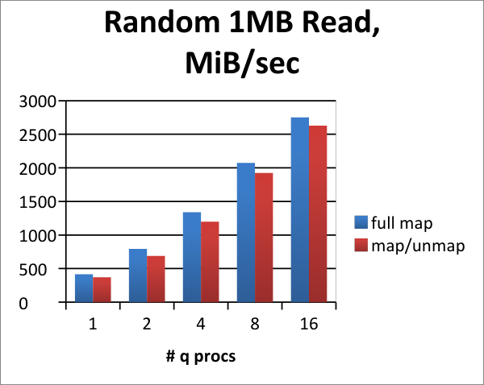
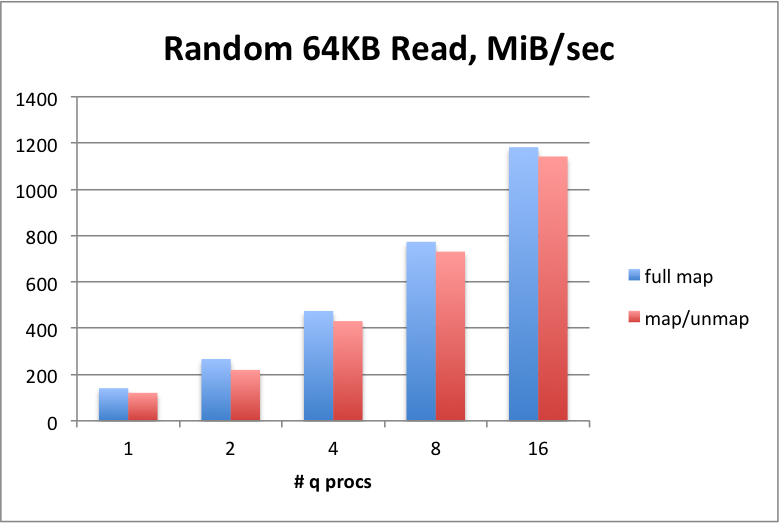
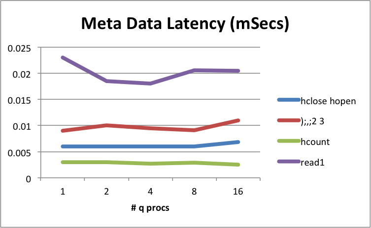

# Migrating a kdb+ HDB to Amazon EC2 


Kx has an ongoing project of evaluating different cloud technologies to see how they interact with kdb+. 
If you are assessing migrating a kdb+ historical database (HDB) and analytics workloads into the 
[Amazon Elastic Compute Cloud](https://aws.amazon.com/ec2/) 
(EC2), here are key considerations:

-   performance and functionality attributes expected from using kdb+, and the associated HDB, in EC2
-   capabilities of several storage solutions working in the EC2
environment, as of March 2018
-  performance attributes of EC2, and benchmark results

You must weigh the pros and cons of each solution.
The key issues of each approach are discussed in the Appendices. 
We highlight specific functional constraints of each solution. 

We cover some of the in-house solutions supplied by Amazon Web Services (AWS), as well as a selection of some of the third-party solutions sold and supported for EC2, and a few open-source products. Most of these solutions are freely available for building and testing using Amazon Machine Images (AMI) found within the Amazon Marketplace.


## Why Amazon EC2?

[Gartner](https://fortune.com/2017/06/15/gartner-cloud-rankings/),
and other sources such as [Synergy
Research](https://www.srgresearch.com/articles/microsoft-google-and-ibm-charge-public-cloud-expense-smaller-providers),
rank cloud-services providers:

1. Amazon Web Services
1. Microsoft Azure 
1. Google Cloud Platform

This is partly due to the fact that Amazon was first to market, and
partly because of their strong global data-center presence and rich
sets of APIs and tools.

Amazon EC2 is one of many services available to AWS users, and is managed via the AWS console. EC2 is typically used to host public estates of Web and mobile-based applications. Many of these are ubiquitous and familiar to the public. EC2 forms a significant part of the “Web 2.0/Semantic Web” applications available for mobile and desktop computing.

Kdb+ is a high-performance technology. It is often assumed the Cloud cannot provide a level of performance, storage and memory access commensurate with dedicated or custom hardware implementations. Porting to EC2 requires careful assessment of the functional performance constraints both in EC2 compute and in the supporting storage layers.

Kdb+ users are sensitive to database performance. Many have significant amounts of market data – sometimes hundreds of petabytes – hosted in data centers. Understanding the issues is critical to a successful migration.

Consider the following scenarios:

-   Your internal IT data services team is moving from an in-house data center to a cloud-services offering. This could be in order to move the IT costs of the internal data center from a capital expense line to an operating expense line.

-   You need your data analytics processing and/or storage capacity to be scaled up _instantly_, _on-demand_, and without the need to provide extra hardware in your own data center.

-   You believe the Cloud may be ideal for burst processing of your compute load. For example, you may need to run 100s of cores for just 30 minutes in a day for a specific risk-calculation workload.

-   Your quants and developers might want to work on kdb+, but only for a few hours in the day during the work week, a suitable model for an on-demand or a spot-pricing service.

-   You want to drive warm backups of data from in-house to EC2, or across instances/regions in EC2 – spun up for backups, then shut down.

-   Development/UAT/Prod life-cycles can be hosted on their own instances and then spun down after each phase finishes. Small memory/core instances can cost less and can be increased or decreased on demand.

Hosting both the compute workload and the historical market data on
EC2 can achieve the best of both worlds: 

-   reduce overall costs for hosting the market data pool
-   flex to the desired performance levels

As long as the speed of deployment and ease of use is coupled with similar or _good enough_ runtime performance, EC2 can be a serious contender for hosting your market data.


## :fontawesome-solid-user: Author

Glenn Wright, Systems Architect, Kx, has 30+ years of experience within the high-performance computing industry. He has worked for several software and systems vendors where he has focused on the architecture, design and implementation of extreme performance solutions. At Kx, Glenn supports partners and solutions vendors to further exploit the industry- leading performance and enterprise aspects of kdb+.

## In-house vs EC2

Kdb+ is used to support 

-   real-time data analytics
-   streaming data analytics
-   historical data analytics

The historical database in a kdb+ solution is typically kept on a non-volatile persistent storage medium (a.k.a. _disks_). 
In financial services this data is kept for research (quant analytics or back-testing), algorithmic trading and for regulatory and compliance requirements.

!!! warning "Low latency and the Cloud"

    In the current state of cloud infrastructure, Kx does not recommend keeping the high-performance, low-latency part of market data – or streaming data collection – applications in the Cloud.

    When speed translates to competitive advantage, using AWS (or cloud in general) needs to be considered carefully.

Carefully-architected cloud solutions are acceptable for parts of the
application that are removed from from the cutting-edge performance and
data-capture requirements often imposed on kdb+. For example, using
parallel transfers with a proven simple technology such as `rsync`, that can
take advantage of the kdb+ data structures (distinct columns that
can safely be transferred in parallel) and the innate compressibility of
some of the data types to transfer data to historical storage in a cloud
environment at end of day.

Storage and management of historical data can be a non-trivial
undertaking for many organizations: 

-   capital and running costs 
-   overhead of maintaining security policies
-   roles and technologies required
-   planning for data growth and disaster recovery

AWS uses tried-and-tested infrastructure, which includes excellent policies and processes for handling such production issues.

Before we get to the analysis of the storage options, it is important to
take a quick look at the performance you might expect from compute and
memory in your EC2 instances.


### CPU cores 

We assume you require the same number of cores and
memory quantities as you use on your in-house bare-metal servers. The
chipset used by the instance of your choice will list the number of
cores offered by that instance. The definition used by AWS to describe
cores is vCPUs. It is important to note that with very few exceptions,
the vCPU represents a hyper-threaded core, not a physical core. This is
normally run at a ratio of 2 hyper-threaded cores to one physical core.
There is no easy way to eliminate this setting. Some of the very large
instances do deploy on two sockets. For example, `r4.16xlarge` uses two
sockets.

If your sizing calculations depend on getting one q process to run
only on one physical core and not share itself with other q processes,
or threads, you need to either 

-   use CPU binding on q execution
-   invalidate the execution on even, or odd, core counts

Or you can run on instances that have more vCPUs than there will be instances
running. For the purposes of these benchmarks, we have focused our
testing on single socket instances, with a limit of 16 vCPUs, meaning
eight physical cores, thus:
```bash
[centos@nano-client1 ~]$ lscpu
Architecture: x86_64
CPU op-mode(s): 32-bit, 64-bit
Byte Order: Little Endian
CPU(s): 16
On-line CPU(s) list: 0-15
Thread(s) per core: 2
Core(s) per socket: 8
Socket(s): 1
NUMA node(s): 1
Vendor ID: GenuineIntel
CPU family: 6
Model: 79
Model name: Intel(R) Xeon(R) CPU E5-2686 v4 @ 2.30GHz
```


### System memory

Memory sizes vary by the instance chosen. 

!!! warning "Memory lost to hypervisor"

    Memory is reduced from the nominal “power of two” RAM sizing, as some is set aside for the Xen hypervisor. For example, a nominal 128 GB of RAM gets sized to approximately 120 GB. 

    Take account of this in your memory sizing exercises.


### Compute and memory performance

For CPU and memory, the EC2 performance matches that seen on physical systems, when correlated to the memory specifications. So the default HVM mode of an AMI under Xen seems to work efficiently when compared to a native/physical server.

There is one caveat to this, in testing kdb+ list creation speeds we observe a degradation of memory list creation times when the number of q processes running exceeds the number of vCPUs in the virtual machine. This is because the vCPU in EC2 is actually a single hyperthreaded core, and not a physical core. In this example, we see competition on the physical cores. For a 16 vCPU instance we notice this only when running above 8 q processes:



!!! info "Megabytes and mebibytes"

    Throughout this paper, MB and GB are used to refer to [MiBytes](https://en.wikipedia.org/wiki/Mebibyte "Wikipedia") and GiBytes respectively.


### Network and storage performance

As expected, we see more noticeable performance variations with the aspects of the system that are virtualized and shared in EC2, especially those which in principle are shared amongst others on the platform. For kdb+ users, the storage (I/O) and the networking access are virtualized/shared, being separated from the bare metal by the Xen hypervisor. Most of the AMIs deployed into EC2 today are based on the Hardware Virtual Machine layer (HVM). It seems that in recent instantiations of HVM, the performance for I/O aspects of the guest have improved. For the best performance, AWS recommends current-generation instance types and HVM AMIs when you launch your instances.
Any storage solution that hosts historical market data must:

-   support the Linux-hosted [POSIX file system](https://en.wikipedia.org/wiki/POSIX) interfaces
-   offer suitable performance for streaming and random I/O mapped read
rates
-   offer acceptable performance for random-region reads of a table (splayed) columns, constituting large record reads from random regions of the file

These aspects, and inspection of metadata performance, are summarized in the tests. The term _metadata_ is used to refer to file operations such as listing files in a directory, gathering file size of a file, appending, finding modification dates, and so on.

!!! warning "Using Amazon S3 as a data store"

    Because kdb+ does not directly support the use of an object store for its stored data, it cannot support direct use of an object-store model such as the Amazon S3. If you wish to use Amazon S3 as a data store, kdb+ historical data must be hosted on a POSIX-based file system layer fronting S3.

    Several solutions offer a POSIX interface layered over an underlying S3 storage bucket. These can be included alongside native file-system support that can also be hosted on EC2.

Although EC2 offers both physical systems and virtual systems within the Elastic Cloud, it is most likely customers will opt for a virtualized environment. There is also a choice in EC2 between spot pricing of an EC2, and deployed virtual instances. We focus here on the attribute and results achieved with the deployed virtual instance model. These are represented by instances that are tested in one availability zone and one placement group.

A _placement group_ is a logical grouping of instances within a single availability zone. Nodes in a placement group should gain better network latency figures when compared to nodes scattered anywhere within an availability zone. Think of this as placement subnets or racks with a data center, as opposed to the datacenter itself. All of our tests use one placement group, unless otherwise stated.

Kdb+ is supported on most mainstream Linux distributions, and by extension we support standard Linux distributions deployed under the AWS model.

Testing within this report was carried out typically on CentOS 7.3 or 7.4 distributions, but all other mainstream Linux distributions are expected to work equally well, with no noticeable performance differences seen in spot testing on RHEL, Ubuntu and SuSe running on EC2.


### Does kdb+ work in the same way under EC2?

Yes – mostly.

When porting or hosting the HDB data to EC2, we expect our customers to:

1.  Use one of the many POSIX-based file systems solutions available under EC2.

1.  Use (partly or fully) the lower-cost object storage via a POSIX or POSIX-like access method.

1.  Not store the historical data on Hadoop HDFS file systems.

If kdb+ runs alongside one of the solutions reviewed here, your HDB will function identically to any internally-hosted, bare-metal system. You can use this report as input to determine the performance and the relative costs for an HDB solution on EC2.

## Historical data layouts and performance testing

The typical kdb+ database layout for a stock tick-based system is
partitioned by date, although integer partitioning is also possible.
Partitioning allows for quicker lookup and increases the ability to
parallelize queries. Kdb+ splays in-memory table spaces into
representative directories and files for long-term retention. Here is
an example of an on-disk layout for quote and trade tables, with date
partitions:

<style type="text/css">
  .foo {
    float: right;
    margin: 0 0 1em 1em;
  }
</style>
{.foo}

Usually, updates to the HDB are made by writing today’s or the last
day’s in-memory columns of data to a new HDB partition. Q programmers
can use a utility built into q for this which creates the files and
directories organized as in the table above. Kdb+ requires the support
of a POSIX-compliant file system in order to access and process HDB
data.

Kdb+ maps the entire HDB into the runtime address space of kdb+. This
means the Linux kernel is responsible for fetching HDB data. If,
for example, you are expecting a query that scans an entire day’s trade
price for a specific stock symbol range, the file system will load this
data into the host memory as required. So, for porting this to EC2, if
you expect it to match the performance you see on your in-house
infrastructure you will need to look into the timing differences between
this and EC2.

Our testing measured the time to load and unload data from arrays,
ignoring the details of structuring columns, partitions and segments –
we focused on just the raw throughput measurements.

All of these measurements will directly correlate to the final
operational latencies for your full analytics use-case, written in q. In
other words, if a solution reported here shows throughput of 100&nbsp;MB/sec
for solution A, and shows 200&nbsp;MB/sec for solution B, this will reflect
the difference in time to complete the data fetch from backing store. Of
course, as with any solution, you get what you pay for, but the
interesting question is: how much more could you get within the
constraints of one solution?

To give an example: assuming a retrieval on solution A takes 50 ms for a
query comprised of 10 ms to compute against the data, and 40 ms to fetch
the data, with half the throughput rates, it might take 90 ms (10+80) to
complete on solution B. Variations may be seen depending on metadata and
random read values.

This is especially important for solutions that use networked file
systems to access a single namespace that contains your HDB. This may
well exhibit a significantly different behavior when run at scale.


## Data locality


Data locality is the basic architectural decision.

You will get the best storage performance in EC2 by localizing the data
to be as close to the compute workload as is possible.

EC2 is divided into various zones. Compute, storage and support software
can all be placed in pre-defined availability zones. Typically these
reflect the timezone location of the data center, as well as a further
subdivision into a physical instance of the data center within one
region or time zone. Kdb+ will achieve the lowest latency and highest
bandwidth in the network by using nodes and storage hosted in the same
availability zone.


## Getting your data into EC2 

Let’s suppose you already have a lot of data for your historical
database (HDB). You will need to know the achievable bandwidth for data
loading, and note that you will be charged by the amount of data
ingested. The mechanics of loading a large data set from your data
center which hosts the HDB into EC2 involves the use of at least one of
the two methods described below.


### EC2 Virtual Private Cloud 

We would expect kdb+ customers to use the EC2 Virtual Private Cloud
(VPC) network structure. Within the VPC you can use either an anonymous
IP address, using EC2 DHCP address ranges, or a permanently-allocated IP
address range. The anonymous DHCP IP address range is free of charge.
Typically you would deploy both the front and backend domains (subnets)
within the same VPC, provisioned and associated with each new instance
in EC2. Typically, an entire VPC allocates an entire class-C subnet. You
may provision up to 200 class-C subnets in EC2, as one account. Public
IP addresses are reachable from the internet and are either dynamically
allocated on start, or use the same pre-defined elastic IP address on
each start of the instance.

Private IP addresses refer to the locally defined IP addresses only
visible to your cluster (e.g. the front/backend in diagram below).
Private IP addresses are retained by that instance until the instance is
terminated. Public access may be direct to either of these domains, or
you may prefer to set up a classic [‘demilitarized zone’](#security-of-your-data-and-secure-access) for kdb+ access.

An elastic IP address is usually your public IPv4 address, known to your
quants/users/applications, and is reachable from the Internet and
registered permanently in DNS, until you terminate the instance or
elastic IP. AWS has added support for IPv6 in most of their regions. An
elastic IP address can mask the failure of an instance or software by
remapping the address to another instance in your estate. That is handy
for things such as GUIs and dashboards, though you should be aware of
this capability and use it. You are charged for the elastic IP address
if you close down the instance associated with it, otherwise one IP
address is free when associated. As of January 2018 the cost is, \$0.12
per Elastic IP address/day when not associated with a running instance.
Additional IP addresses per instance are charged.

Ingesting data can be via the public/elastic IP address. In this case,
routing to that connection is via undefined routers. The ingest rate to
this instance using this elastic IP address would depend on the
availability zone chosen. But in all cases, this would be a shared pubic
routed IP model, so transfer rates may be outside your control.

In theory this uses publicly routed connections, so you may wish to
consider encryption of the data over the wire, prior to decryption.


### Direct Connect 

Direct Connect is a dedicated network connection between an access point
to your existing IP network and one of the AWS Direct Connect locations.
This is a dedicated physical connection offered as a VLAN, using
industry standard 802.1q VLAN protocol. You can use AWS Direct Connect
instead of establishing your own VPN connection over the internet to
VPC. Specifically, it can connect through to a VPC domain using a
private IP space. It also gives a dedicated service level for bandwidth.
There is an additional charge for this service.

## Security of your data and secure access

The EC2 application machine image model (AMI) has tight security models in place. 
You would have to work very hard to remove these.

The following diagram is a typical scenario for authenticating access to
kdb+ and restricting networking access. The frontend and backend private
subnets are provisioned by default with one Virtual Private Cloud (VPC)
managed by EC2. Typically, this allocates an entire class-C subnet. You
may provision up to 200 class-C subnets in EC2. The public access may be
direct to either of these domains, or you may prefer to setup a classic
‘demilitarized zone’:



Amazon has spent a lot of time developing [security features for EC2](https://aws.amazon.com/security/).
Key issues:

-   A newly-provisioned node comes from a trusted build image, for example, one found in the AWS Marketplace.
-   The Amazon Linux AMI Security Center provides patch and fix lists, and these can be automatically inlaid by the AMI. The Amazon Linux AMI is a supported and maintained Linux image provided by AWS for use on EC2.
-   Encryption at rest is offered by many of the storage interfaces covered in this report.

:fontawesome-regular-hand-point-right: [Amazon Security](https://aws.amazon.com/blogs/security/)


## Getting your data out of EC2


Storing billions and billions of records under kdb+ in EC2 is easily achievable. Pushing the data into EC2 can be easily done and in doing so incurs no data transfer charges from AWS. But AWS will charge you to extract this information from EC2. For example, network charges may apply if you wish to extract data to place into other visualization tools/GUIs, outside the domain of kdb+ toolsets.


### Replication

Or you may be replicating data from one region or availability zone, to another. For this, there is a cost involved. At time of writing, the charges are \$.09/GB (\$92/TB), or \$94,200 for 1&nbsp;PB transferred out to the Internet via EC2 public IP addresses. That is raw throughput measurements, not the raw GBs of kdb+ columnar data itself. This is billed by AWS at a pro-rated monthly rate. The rate declines as the amount of data transferred increases. This rate also applies for all general traffic over a VPN to your own data center. Note that normal Internet connections carry no specific service-level agreements for bandwidth.


### Network Direct

If you use the Network Direct option from EC2, you get a dedicated network with guaranteed bandwidth. You then pay for the dedicated link, plus the same outbound data transfer rates. For example, as of January 2018 the standard charge for a dedicated 1&nbsp;GB/sec link to EC2 would cost \$220/month plus \$90/month for a transfer fee per TB.

Consider these costs when planning to replicate HDB data between regions, and when exporting your data continually back to your own data center for visualization or other purposes. Consider the migration of these tools to coexist with kdb+ in the AWS estate, and if you do not, consider the time to export the data. 


## Storing your HDB in S3


S3 might be something you are seriously considering for storage of some,
or all, of your HDB data in EC2. Here is how S3 fits into the landscape
of all of the storage options in EC2.


### Locally-attached drives

You can store your HDB on locally-attached drives, as you might do today on your own physical hardware on your own premises. 

EC2 offers the capability of bringing up an instance with internal NVMe or SAS/SATA disk drives, although this is not expected to be used for anything other than caching data, as this storage is referred to as ephemeral data by AWS, and might not persist after system shutdowns. This is due to the on-demand nature of the compute instances: they could be instantiated on any available hardware within the availability zone selected by your instance configuration.


### EBS volumes

You can store your HDB on [EBS volumes](https://docs.aws.amazon.com/AWSEC2/latest/UserGuide/RootDeviceStorage.html). These appear like persistent block-level storage. Because the EC2 instances are virtualized, the storage is separated at birth from all compute instances. 

By doing this, it allows you to start instances on demand, without the need to co-locate the HDB data alongside those nodes. This separation is always via the networking infrastructure built into EC2. In other words, your virtualized compute instance can be attached to a real physical instance of the storage via the EC2 network, and thereafter appears as block storage. This is referred to as _network attached storage_ (Elastic Block Storage). 

Alternatively, you can place the files on a remote independent file system, which in turn is typically supported by EC2 instances stored on EBS or S3.


### Amazon S3 object store

Finally, there is the ubiquitous Amazon S3 object store, available in all regions and zones of EC2. Amazon uses S3 to run its own global network of websites, and many high-visibility web-based services store their key data under S3. With S3 you can create and deploy your HDB data in buckets of S3 objects. 

-   **Storage prices** are lower (as of January 2018): typically 10% of the costs of the Amazon EBS model.
-   S3 can be configured to offer **redundancy and replication** of object data, regionally and globally.

Amazon can  be configured to duplicate your uploaded data across multiple geographically diverse repositories, according to the replication service selected at bucket-creation time. S3 promises [99.999999999%](https://aws.amazon.com/s3/faqs/) durability. 

:fontawesome-regular-hand-point-right: [AWS S3 replication](https://docs.aws.amazon.com/AmazonS3/latest/dev/crr.html)

However, there are severe limitations on using S3 when it comes to kdb+.
The main limitation is the API. 


#### API limitations

An S3 object store is organized differently from a POSIX file system. 

[](img/media/image7.png "Click to expand")

S3 uses a web-style [RESTful interface](https://en.m.wikipedia.org/wiki/Representational_state_transfer "Wikipedia") HTTP-style interface with [eventual-&#8203;consistency](https://en.wikipedia.org/wiki/Eventual_consistency "Wikipedia") semantics of put and change. 
This will always represent an additional level of abstraction for an application like kdb+ that directly manages its virtual memory. 
S3 therefore exhibits slower per–process/thread performance than is usual for kdb+. The lack of POSIX interface and the semantics of RESTful interfaces prevents kdb+ and other high-performance databases from using S3 directly. 

However, S3’s low cost, and its ability to scale performance horizontally when additional kdb+ instances use the same S3 buckets, make it a candidate for some customers.


#### Performance limitations

The second limitation is S3’s performance, as measured by the time taken to populate vectors in memory. 

Kdb+ uses POSIX file-system semantics to manage HDB structure directly on disk. It exploits this feature to gain very high-performance memory management through Linux-based memory mapping functions built into the kernel, from the very inception of Linux.

S3 uses none of this.

On EC2, kdb+ performance stacks up in this order (from slowest to faster):

1.  S3
2.  EBS
3.  Third-party distributed or managed file system
4.  Local drives to the instance (typically cache only)

Although the performance of S3 as measured from one node is not fast, S3 retains comparative performance for each new instance added to an HDB workload in each availability zone. Because of this, S3 can scale up its throughput when used across multiple nodes within one availability zone. This is useful if you are positioning large numbers of business functions against common sets of market data, or if you are widely distributing the workload of a single set of business queries. This is not so for EBS as, when deployed, the storage becomes owned by one, and only one, instance at a time.


#### Replication limitations

A nice feature of S3 is its built-in replication model between regions
and/or time zones. 

Note you have to choose a replication option; none is chosen by default.

The replication process may well duplicate incorrect behavior from one region to another. In other words, this is not a backup.

However, the data at the replica site can be used for production
purposes, if required. Replication is only for cross-region propagation
(e.g. US-East to US-West). But, given that the kdb+ user can design this
into the solution (i.e. end-of-day copies to replica sites, or multiple
pub-sub systems), you may choose to deploy a custom solution within
kdb+, across region, rather than relying on S3 or the file system
itself.


#### Summary

-   The **POSIX file system interface** allows the Linux kernel to move data
    from the blocks of the underlying physical hardware, directly into
    memory mapped space of the user process. This concept has been tuned
    and honed by over 20 years of Linux kernel refinement. In our case,
    the recipient user process is kdb+. S3, by comparison, requires the
    application to bind to an HTTP-based RESTful (get, wait, receive)
    protocol, which is typically transferred over TCP/IP LAN or WAN
    connection. Clearly, this is not directly suitable for a
    high-performance in-memory analytics engine such as kdb+. However,
    all of the file-system plug-ins and middleware packages reviewed in
    this paper help mitigate this issue. The appendices list the main
    comparisons of all of the reviewed solutions.

-   Neither Kdb+, nor any other high-performance database, makes use of the **RESTful object-store interface**.

-   There is no notion of **vectors, lists, memory mapping** or optimized placement of objects in memory regions.

-   S3 employs an **eventual-consistency** model, meaning there is no guaranteed service time for placement of the object, or replication of the object, for access by other processes or threads.

-   S3 exhibits relatively low **streaming-read performance**. A RESTful, single S3 reader process is limited to a [read throughput](http://blog.zachbjornson.com/2015/12/29/cloud-storage-performance.html) of circa 0.07&nbsp;GB/sec. Some of the solutions reviewed in this paper use strategies to improve these numbers within one instance (e.g. raising that figure to the 100s&nbsp;MB/sec – GB/sec range). There is also throughput scalability gained by reading the same bucket across multiple nodes. There is no theoretical limit on this bandwidth, but this has not been exhaustively tested by Kx.

-   Certain **metadata operations**, such as kdb+’s append function, cause significant latency vs that observed on EBS or local attached storage, and your mileage depends on the file system under review.

Performance enhancements, some of which are bundled into **third-party
solutions** that layer between S3 and the POSIX file system layer, are
based around a combination of: multithreading read requests to the S3
bucket; separation of large sequential regions of a file into individual
objects within the bucket and read-ahead and caching strategies.

There are some areas of synergy. Kdb+ HDB data typically stores billions
and billions of time-series entries in an immutable read-only mode. Only
updated new data that lands in the HDB needs to be written. S3 is a
[shared nothing](https://en.wikipedia.org/wiki/Shared-nothing_architecture "Wikipedia") model. Therefore, splitting a single segment or
partitioned column of data into one file, which in turn is segmented
into a few objects of say 1&nbsp;MB, should be a lightweight operation, as
there is no shared/locking required for previously written HDB data. So
the HDB can easily tolerate this eventual consistency model. This does
not apply to all use-cases for kdb+. For example, S3, with or without a
file system layer, cannot be used to store a reliable ticker-plant log.

Where S3 definitely plays to its strengths, is that it can
be considered for an **off-line deep archive** of your kdb+ formatted market
data.

Kx does not make recommendations with respect to
the merits, or otherwise, of storing kdb+ HDB market data in a data
retention type “WORM” model, as required by the regulations [SEC 17-a4](https://en.wikipedia.org/wiki/SEC_Rule_17a-4 "Wikipedia").


## Disaster recovery

In addition to EC2’s built-in disaster-recovery features, when you use
kdb+ on EC2, your disaster recovery process is eased by kdb+’s simple,
elegant design.

Kdb+ databases are stored as a series of files and directories on disk.
This makes administering databases extremely easy because database files
can be manipulated as operating-system files. Backing up a kdb+ database
can be implemented using any standard file-system backup utility. This
is a key difference from traditional databases, which have to have their
own cumbersome backup utilities and do not allow direct access to the
database files and structure.

Kdb+’s use of the native file system is also reflected in the way it
uses standard operating-system features for accessing data
(memory-mapped files), whereas traditional databases use proprietary
techniques in an effort to speed up the reading and writing processes.
The typical kdb+ database layout for time-series data is to partition by
date.


## Licensing kdb+ in the Cloud


Existing kdb+ users have a couple of options for supporting their kdb+
licenses in the Cloud:


### Existing license

You can use your existing license entitlement but must transfer or register coverage in the Cloud service. This would consume the specified number of cores from your license pool. An enterprise license can be freely used in EC2 instance(s). This might apply in the situation where the Cloud environment is intended to be a permanent static instance. Typically, this will be associated with a virtual private cloud (VPC) service. For example, AWS lets you provision a logically isolated section of the Cloud where you can launch AWS resources in a virtual network. The virtual network is controlled by your business, including the choice of IP, subnet, DNS, names, security, access, etc.


### On-demand licensing

You can sign up for an on-demand license, and use it to enable kdb+ on each of the on-demand EC2 nodes. Kdb+ on-demand usage registers by core and by minutes of execution.


## Encryption

Consider the need for access to any keys used to encrypt and store data.
Although this is not specific to AWS, do not assume you have automatic rights to private keys employed to encrypt the data.

Where a third-party provider supplies or uses encryption or compression to store the market data on S3, you will need to check the public and private keys are either made available to you, or held by some form of external service.


## Benchmarking methodology


For testing raw storage performance, we used a
lightweight test script developed by Kx, called `nano`, based on
the script `io.q` written by Kx’s Chief Customer Officer, Simon Garland. 
The scripts used for this benchmarking are freely available
for use and are published on Github at
:fontawesome-brands-github: [KxSystems/nano](https://github.com/KxSystems/nano)

These sets of scripts are designed to focus on the relative performance of distinct I/O functions typically expected by a HDB. The measurements are taken from the perspective of the primitive IO operations, namely:

test | what happens
-----|-------------------------------------------------------------------
Streaming reads | One list (e.g. one column) is read sequentially into memory. We read the entire space of the list into RAM, and the list is memory-mapped into the address space of kdb+.                                                
Large&nbsp;Random&nbsp;Reads<br/>(one mapped read and map/unmapped) | 100 random-region reads of 1&nbsp;MB of a single column of data are indexed and fetched into memory. Both single mappings into memory, and individual map/fetch/unmap sequences. Mapped reads are triggered by a page fault from the kernel into `mmap`’d user space of kdb+. This is representative of a query that requires to read through 100 large regions of a column of data for one or more dates (partitions). 
Small Random Reads<br/>(mapped/unmapped sequences) | 1600 random-region reads of 64&nbsp;KB of a single column of data are indexed and fetched into memory. Both single mappings into memory, and individual map/fetch/unmap sequences. Reads are triggered by a page fault from the kernel into `mmap`’d user space of kdb+. We run both fully-mapped tests and tests with map/unmap sequences for each read.
Write | Write rate is of less interest for this testing, but is reported nonetheless.
Metadata:<br/>(`hclose` `hopen`) | Average time for a typical open/seek to end/close loop. Used by TP log as an “append to” and whenever the database is being checked. Can be used to append data to an existing HDB column.
Metadata:<br/>`(();,;2 3)` | Append data to a modest list of 128&nbsp;KB, will open/stat/seek/write/close. Similar to ticker plant write down.
Metadata:<br/>`(();:;2 3)` | Assign bytes to a list of 128&nbsp;KB, stat/seek/write/link. Similar to initial creation of a column.
Metadata:<br/>(`hcount`) | Typical open/stat/close sequence on a modest list of 128&nbsp;KB. Determine size. e.g. included in `read1`.
Metadata:<br/>(`read1`) | An atomic mapped map/read/unmap sequence open/stat/seek/read/close sequence. Test on a modest list of 128&nbsp;KB.

This test suite ensures we cover several of the operational tasks undertaken during an HDB lifecycle.

For example, one broad comparison between direct-attached storage
and a networked/shared file system is that the networked file-system
timings might reflect higher operational overheads vs. a Linux kernel
block-based direct file system. Note that a shared file system will
scale up in-line with the implementation of horizontally distributed
compute, which the block file systems will not easily do, if at all.
Also note the networked file system may be able to leverage 100s or
1000s of storage targets, meaning it can sustain high levels of
throughput even for a single reader thread.


### Baseline result – using a physical server

All the appendices refer to tests on AWS.

To see how EC2 nodes compare to a physical server, we show the results of running the same set of benchmarks on a server running natively, bare metal, instead of on a virtualized server on the Cloud.

For the physical server, we benchmarked a two-socket Broadwell E5-2620 v4 @ 2.10&nbsp;GHz; 128&nbsp;GB DDR4 2133&nbsp;MHz. This used one Micron PCIe NVMe drive, with CentOS 7.3. For the block device settings, we set the device read-ahead settings to 32&nbsp;KB and the queue depths to 64. It is important to note this is just a reference point and not a full solution for a typical HDB. This is because the number of target drives at your disposal here will limited by the number of slots in the server.

Highlights:


#### Creating a memory list

The MB/sec that can be laid out in a simple
list allocation/creation in kdb+. Here we create a list of longs of
approximately half the size of available RAM in the server.


Shows the capability of the server when laying out
lists in memory; reflects the combination of memory speeds
alongside the CPU. 


#### Re-read from cache

The MB/sec that can be re-read when the data
is already held by the kernel buffer cache (or file-system cache, if
kernel buffer not used). It includes the time to map the pages back into
the memory space of kdb+ as we effectively restart the instance here
without flushing the buffer cache or file system cache.



Shows if there are any unexpected glitches with the file-system caching subsystem. This may not affect your product kdb+ code per-se, but may be of interest in your research.


#### Streaming reads

Where complex queries demand wide time periods or symbol ranges. An
example of this might be a VWAP trading calculation. These types of
queries are most impacted by the throughput rate i.e., the slower the
rate, the higher the query wait time.



Shows that a single q process can ingest at 1900&nbsp;MB/sec with data
hosted on a single drive, into kdb+’s memory space, mapped.
Theoretical maximum for the device is approximately 2800&nbsp;MB/sec and we
achieve 2689&nbsp;MB/sec. Note that with 16 reader processes, this
throughput continues to scale up to the device limit, meaning kdb+ can
drive the device harder, as more processes are added. 


#### Random reads

We compare the throughputs for random 1&nbsp;MB-sized reads. This simulates
more precise data queries spanning smaller periods of time or symbol
ranges.

In all random-read benchmarks, the term _full map_ refers to reading
pages from the storage target straight into regions of memory that are
pre-mapped.





Simulates queries that are searching around broadly different times or symbol regions. This shows that a typical NVMe device under kdb+ trends very well when we are reading smaller/random regions one or more columns at the same time. This shows that the device actually gets similar throughput when under high parallel load as threads increase, meaning more requests are queuing to the device and the latency per request sustains. 


#### Metadata function response times

We also look at metadata function response times for the file system. In the baseline results below, you can see what a theoretical lowest figure might be. 

We deliberately did not run metadata tests using very large data sets/files, so that they better represent just the overhead of the file system, the Linux kernel and target device.


function       | latency (mSec) | function   | latency (mSec) 
---------------|----------------|------------|---------------
`hclose hopen` | 0.006          | `();,;2 3` | 0.01
`hcount`       | 0.003          | `read1`    | 0.022

<small>_Physical server, metadata operational latencies - mSecs (headlines)_</small>



This appears to be sustained for multiple q processes, and on the
whole is below the multiple μSecs range. Kdb+ sustains good metrics. 


### AWS instance local SSD/NVMe

We separate this specific test from other storage tests,
as these devices are contained within the EC2 instance itself, unlike
every other solution reviewed in [Appendix A](app-a-ebs.md). Note that some of the
solutions reviewed in the appendixes do actually leverage instances
containing these devices.

An instance-local store provides temporary block-level storage for your
instance. This storage is located on disks that are physically attached
to the host computer.

This is available in a few predefined regions (e.g. US-East-1), and for
a selected list of specific instances. In each case, the instance local
storage is provisioned for you when created and started. The size and
quantity of drives is preordained and fixed in both size and quantity.
This differs from EBS, where you can select your own.

For this test we selected the `i3.8xlarge` as the instance under test<!--  (==see References FIXME Specifically?== ) -->. 
`i3` instance definitions will provision local NVMe or SATA
SSD drives for local attached storage, without the need for networked
EBS.

Locally provisioned SSD and NVMe are supported by kdb+. The results from
these two represent the highest performance per device available for
read rates from any non-volatile storage in EC2.

However, note that this data is ephemeral. That is,
whenever you stop an instance, EC2 is at liberty to reassign that space
to another instance and it will scrub the original data. When the
instance is restarted, the storage will be available but scrubbed. This
is because the instance is physically associated with the drives, and
you do not know where the physical instance will be assigned at start
time. The only exception to this is if the instance crashes or reboots
without an operational stop of the instance, then the same storage will
recur on the same instance.

The cost of instance-local SSD is embedded in the fixed price of the
instance, so this pricing model needs to be considered. By contrast, the
cost of EBS is fixed per GB per month, pro-rated. The data held on
instance local SSD is not natively sharable. If this needs to be shared,
this will require a shared file-system to be layered on top, i.e.
demoting this node to be a file system server node. For the above
reasons, these storage types have been used by solutions such as [WekaIO](#appendix-i-wekaio-matrix), for their local instance of the erasure coded data cache.

function                     | instance-local NVMe<br/>(4 × 1.9 TB) | physical node<br/>(1 NVMe)
-----------------------------|:---------------------------:|:------------:
streaming read (MB/sec)      | 7006                        | 2624
random 1-MB read (MB/sec)    | 6422                        | 2750
random 64-KB read (MB/sec)   | 1493                        | 1182
metadata (`hclose`, `hopen`) | 0.0038 mSec                 | 0.0068 mSec

The variation of absolute streaming rates is reflective of the device itself. These results are equivalent to the results seen on physical servers. What is interesting is that at high parallelism, the targets work quicker with random reads and for metadata service times than the physical server. These instances can be deployed as a high-performance persistent cache for some of the AWS-based file system solutions, such as used in ObjectiveFS and WekaIO Matrix and Quobyte.


## Observations from kdb+ testing 


### CPU and memory speed

For CPU and memory speed/latencies with kdb+, EC2 compute nodes performance for CPU/memory mirrors the capability of logically equivalent bare-metal servers. At time of writing, your main decision here is the selection of system instance. CPUs range from older generation Intel up to Haswell and Broadwell, and from 1 core up to 128 vcores (vCPU). Memory ranges from 1&nbsp;GB up to 1952&nbsp;GB RAM.


### Storage performance

The best storage performance was, as expected, achieved with locally-attached ephemeral NVMe storage. This matched, or exceeded, EBS as that storage is virtualized and will have higher latency figures. As data kept on this device cannot be easily shared, we anticipate this being considered for a super cache for hot data (recent dates). Data stored here would have to be replicated at some point as this data could be lost if the instance is shut down by the operator.


### Wire speeds

Kdb+ reaches wire speeds on most streaming read tests to networked/shared storage, under kdb+, and in several cases we can reach wire speeds for random 1-MB reads using standard mapped reads into standard q abstractions, such as lists.


### `gp2` vs `io1`

EBS was tested for both `gp2` and its brethren the `io1` flash variation. Kdb+ achieved wire speed bandwidth for both of these. When used for larger capacities, we saw no significant advantages of `io1` for the HDB store use case, so the additional charges applied there need to be considered.


### `st1`

EBS results for the `st1` devices (low cost traditional disk drives, lower cost per GB) show good (90th-percentile) results for streaming and random 1-MB reads, but, as expected, significantly slower results for random 64-KB and 1-MB reads, and 4× the latencies for metadata ops. Consider these as a good candidate for storing longer term, older HDB data to reduce costs for owned EBS storage.


### ObjectiveFS and WekaIO Matrix

ObjectiveFS and WekaIO Matrix are commercial products that offer full operational functionality for the POSIX interface, when compared to open-source S3 gateway products. These can be used to store and read your data from/to S3 buckets. 

WekaIO Matrix offers an erasure-encoded clustered file-system, which works by sharing out pieces of the data around each of the members of the Matrix cluster. 

ObjectiveFS works between kdb+ and S3 with a per-instance buffer cache plus distributed eventual consistency. It also allows you to cache files locally in RAM cache and/or on ephemeral drives within the instance. Caching to locally provisioned drives is likely to be more attractive vs. caching to another RAM cache.


### POSIX file systems

Standalone file systems such as MapR-FS and Quobyte support POSIX fully. Other distributed file systems designed from the offset to support POSIX should fare equally well, as to some degree, the networking infrastructure is consistent when measured within one availability zone or placement group. Although these file system services are encapsulated in the AWS marketplace as AMI’s, you are obliged to run this estate alongside your HDB compute estate, as you would own and manage the HDB just the same as if it were in-house. Although the vendors supply AWS marketplace instances, you would own and running your own instances required for the file system.


### WekaIO and Quobyte

WekaIO and Quobyte use a distributed file-system based on erasure-coding distribution of data amongst their quorum of nodes in the cluster. This may be appealing to customers wanting to provision the HDB data alongside the compute nodes. If, for example, you anticipate using eight or nine nodes in production these nodes could also be configured to fully own and manage the file system in a reliable way, and would not mandate the creation of distinct file-system services to be created in other AWS instances in the VPC. 

What might not be immediately apparent is that for this style of product, they will scavenge at least one core on every participating node in order to run their erasure-coding algorithm most efficiently. This core will load at 100% CPU.


### EFS and AWS Gateway

Avoid [EFS](https://docs.aws.amazon.com/efs/latest/ug/performance.html) and AWS Gateway for HDB storage. They both exhibit very high latencies of operation in addition to the network-bandwidth constraints. They appear to impact further on the overall performance degradations seen in generic NFS builds in Linux. This stems from the latency between a customer-owned S3 bucket (AWS Gateway), and an availability zone wide distribution of S3 buckets managed privately by AWS.


### Open-source products

Although the open source products that front an S3 store (S3FS, S3QL and Goofys) do offer POSIX, they all fail to offer full POSIX semantics such as symbolic linking, hard linking and file locking. Although these may not be crucial for your use case, it needs consideration. 

You might also want to avoid these, as performance of them is at best average, partly because they both employ user-level FUSE code for POSIX support.


## Network configuration


The network configuration used in the tests:

The host build was CentOS 7.4, with Kernel 3.10.0-693.el7.x86\_64. The ENS module was installed but not configured. The default instance used in these test reports was `r4.4xlarge`. 

Total network bandwidth on this model is “up-to” 10&nbsp;Gbps. 

For storage, this is documented by AWS as provisioning up to 3,500&nbsp;Mbps, equivalent to 437&nbsp;MB/sec of EBS bandwidth, per node, bi-directional. We met these discrete values as seen in most of our individual kdb+ tests.


<div class="kx-nav" markdown="1">
<div class="kx-nav-next">[A. Elastic Block Store (EBS)](app-a-ebs.md)</div>
</div>
