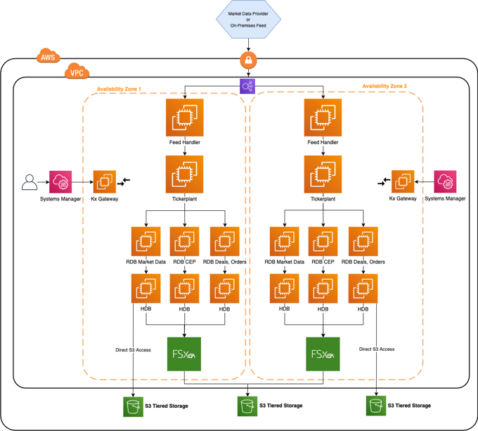

# :kx-brands-aws-cloud:<br>Reference architecture for AWS


Kdb+ is the technology of choice for many of the world’s top financial institutions when implementing a tick-capture system for timeseries analysis. Kdb+ is capable of processing large amounts of data in a very short space of time, making it the ideal technology for dealing with the ever-increasing volumes of financial tick data.

KX customers can lift and shift their kdb+ plants to the cloud and exploit virtual machines (VM) with storage. This is the classic approach that relies on the existing license. To benefit more from the cloud technology we recommend migrating to KX Insights.

!!! summary "KX Insights"

    {: style="float:left; margin:0 2em 2em 0; max-width:20%"}

    [KX Insights](https://code.kx.com/insights/) provides a range of tools to build, manage and deploy kdb+ applications in the cloud. It supports interfaces for deployment and common ‘Devops‘ orchestration tools such as Docker, Kubernetes, Helm, etc. It supports integrations with major cloud logging services. It provides a kdb+ native REST client, Kurl, to authenticate and interface with other cloud services. KX Insights also provides kdb+ native support for reading from cloud storage, and a packaging utility, QPacker to build and deploy kdb+ applications to the cloud. By taking advantage of KX Insights suite of tools, developers can quickly and easily create new and integrate existing kdb+ applications on Google Cloud.

    Deployment:

    -   [QPacker](https://code.kx.com/insights/cloud-edition/qpacker/quickstart/) – A packaging utility that supports q, Python and C libraries
    <!-- -   [Detailed guide](https://code.kx.com/insights/cloud-edition/kx-core-app-charts/helloworld/) to using Helm and Kubernetes to deploy kdb+ applications to the cloud. -->
    -   Detailed examples of using Helm and Kubernetes to deploy kdb+ applications to the cloud

    Service integration:

    -   [QLog](https://code.kx.com/insights/cloud-edition/qlog/quickstart/) – Integrations with major cloud logging services
    -   [Kurl](https://code.kx.com/insights/cloud-edition/kurl/quickstart/) – Native kdb+ REST client with authentication to cloud services

    Storage:
    
    -   [Kdb+ Object Store](https://code.kx.com/insights/cloud-edition/objstor/quickstart/) – Native support for reading and querying cloud object storage


## Architectural components

The core of a kdb+ tick-capture system is called kdb+tick.
The [Kdb+tick](../../learn/startingkdb/tick.md) architecture allows the capture, processing, and querying of timeseries data against real-time, streaming and historical data.

This reference architecture describes a full solution running kdb+tick within Amazon Web Services (AWS) which consists of these bare-minimum functional components:

-   Datafeeds
-   Feedhandlers
-   Tickerplant
-   Real-time database
-   Historical database
-   KX gateway

One architectural pattern for kdb+tick in Amazon Web Services is depicted below. The kdb+ historical database (HDB) can be stored in FSx Lustre and tiered to S3 or, with KX Insights, the HDB data can be directly accessed from a kdb+ process.

[](architecture.png "Click to expand")
<br>
<small>_A simplified architecture diagram for kdb+tick in Amazon Web Services_</small>

Worthy of note in this reference architecture is the ability to place kdb+ processing functions either in one Elastic Compute Cloud (EC2) instance or distributed across many EC2 instances. Kdb+ processes can communicate with each other through built-in language primitives: this allows for flexibility in final design layouts. Data transportation between kdb+ processes, and overall external communication, is by low-level TCP/IP sockets. If two components are on the same EC2 instance, local Unix sockets can be used to reduce communication overhead.

Many customers have tickerplants set up on their premises. The AWS reference architecture allows them to manage a hybrid infrastructure that communicates with tickerplants both on premises and in the cloud. However, the benefits of migrating on-premises solutions to the cloud are vast. These include flexibility, auto-scaling, improved transparency in cost management, access to management and infrastructure tools built by Amazon, quick hardware allocation and many more.
<!-- 
!!! tip "KX Insights"

    This article focuses on kdb+tick deployment to EC2 virtual machines in AWS.
    However, KX Insights provides another kdb+ architectural pattern for deploying to AWS Elastic Kubernetes Service (EKS).

    :fontawesome-solid-hand-point-right:
    [KX Core App Charts](https://code.kx.com/insights/kx-core-app-charts/)
 -->

### Datafeeds

These are the sources of the data we aim to ingest into our system. For financial use cases, data may be ingested from B-pipe (Bloomberg), or Elektron (Refinitiv) data or any exchange that provides a data API. Often the streaming data is available on a pub-sub component like Kafka, Solace, etc. - all popular sources have an open-source interface to kdb+. The data feeds are in a proprietary format, but always one with which KX is familiar. Usually this means that a feedhandler just needs to be aware of the specific data format.

Due to the flexible architecture of KX, most, if not all, the underlying kdb+ processes that constitute the system can be placed in any location of this architecture. For example, for latency, compliance or other reasons, the data feeds may be relayed through your existing on-premises data center. Or the connection from the feed handlers may be made directly from this Virtual Private Cloud (VPC) into the market data venue.

The kdb+ infrastructure is often used also to store internally derived data. This can optimize internal data flow and help remove latency bottlenecks. The pricing of liquid products, for example on B2B markets, is often done by a complex distributed system. This system changes often due to new models, new markets or other internal system changes. Data in kdb+ that will be generated by these internal steps will also require processing and handling huge amounts of timeseries data. When all the internal components of these systems send data to kdb+, a comprehensive impact analysis captures any changes.


### Feedhandler

A feedhandler process captures external data and translates it into kdb+ messages. You can use multiple feed handlers to gather data from several sources and feed it to the kdb+ system for storage and analysis.

There are a number of open source (Apache 2 licensed) Fusion interfaces between KX and other third-party technologies. Feed handlers are typically written in Java, Python, C++, and&nbsp;q.

:fontawesome-brands-superpowers:
[Fusion interfaces on kdb+](../../interfaces/fusion.md)


### Tickerplant

The tickerplant (TP) is a specialized, single-threaded kdb+ process that operates as a link between your datafeed and a number of subscribers. It implements a pub-sub pattern: specifically, it receives data from the feedhandler, stores it locally in a table, then saves it to a log file. It publishes this data to a realtime database (RDB) and any clients who have subscribed to it. It then purges its local tables of data.

Tickerplants can operate in two modes:

Batch mode

: Collects updates in its local tables. It batches up for a period of time and then forwards the update to realtime subscribers in a bulk update.

Real-time (zero latency) mode

: Forwards the input immediately. This requires smaller local tables but has higher CPU and network costs. Bear in mind that each message has a fixed network overhead.

Supported API calls:

-   Subscribe: adds subscriber to message receipt list and sends subscriber table definitions
-   Unsubscribe: removes subscriber from message receipt list

Events:

-   End of Day: at midnight, the TP closes its log files, autocreates a new file, and notifies the realtime database (RDB) of the start of the new day


### Realtime database

The realtime database (RDB) holds all the intraday data in memory, to enable fast, powerful queries.

For example, at the start of the business day, the RDB sends a message to the tickerplant and receives a reply containing the data schema, the location of the log file, and the number of lines to read from the log file. It then receives subsequent updates from the tickerplant as they are published. One of the key design choices for Amazon Web Services is the size of memory for this instance, as ideally we need to contain the entire business day/period of data in memory.

Purpose:

-   Subscribed to the messages from the tickerplant
-   Stores (in-memory) the messages received
-   Allows this data to be queried intra-day

Actions:

-   On message receipt: inserts into local, in-memory tables
-   End of Day receipt: usually writes intraday data down then sends a new End of Day message to the HDB. Optionally RDB sorts certain tables (e.g. by sym and time) to speed up queries.

An RDB can operate in single- or multi-input mode. The default mode is single-input, in which user queries are served sequentially and queries are queued till an update from the TP is processed (inserted into the local table).

In standard tick scripts, the RDB tables are indexed, typically by the product identifier. An index is a hash table behind the scene. Indexing has a significant impact on the speed of the queries at the cost of slightly slower ingestion. The insert function takes care of the indexing, i.e. during an update it also updates the hash table.

Performance of the CPU and memory in the chosen AWS instance will have some impact on the overall sustainable rates of ingest and queryable rate of this realtime kdb+ function.


### Historical database

The historical database (HDB) is a simple kdb+ process with a pointer to the persisted data directory. A kdb+ process can read this data and memory-maps it, allowing for fast queries across a large volume of data. Typically, the RDB is instructed by the tickerplant to save its data to the data directory at EOD from where the HDB can refresh its memory mappings.

HDB data is partitioned by date in the standard tickerplant. If multiple disks are attached to the box, then data can be segmented and kdb+ makes use of parallel IO operations. Segmented HDB requires a `par.txt` file that contains the locations of the individual segments.

A HDB query is processed by multiple threads and map-reduce is applied if multiple partitions are involved in the query.

Purpose:

-   Provides a queryable data store of historical data
-   In instances involving research and development or data analytics, you can create customer reports on order execution times

Actions:

-   End of Day receipt: reloads the database to get the new days’ data from the RDB write-down

HDBs are often expected to be mirrored locally. Some users, (e.g. quants) need a subset of the data for heavy analysis and backtesting where the performance is critical.


### KX gateway

In production, a kdb+ system may be accessing multiple timeseries datasets, usually each one representing a different market-data source, or using the same data, refactored for different schemas. All core components of a kdb+tick can handle multiple tables. However, you can introduce multiple TPs, RDBs and HDBs based on your fault-tolerance requirements. This can result in a large number of q components and a high infrastructure segregation. A KX gateway generally acts as a single point of contact for a client. A gateway collects data from the underlying services, combines datasets and may perform further data operations (e.g. aggregation, joins, pivoting, etc.) before it sends the result back to the user.

The specific design of a gateway can vary in several ways according to expected use cases. For example, in a hot-hot set up, the gateway can be used to query services across availability zones.

The implementation of a gateway is largely determined by the following factors.

-   Number of clients or users
-   Number of services and sites
-   Requirement of data aggregation
-   Support of free-form queries
-   Level of redundancy and failover

The task of the gateway can be broken down into the following steps.

-   Check user entitlements and data-access permissions
-   Provide access to stored procedures, utility functions and business logic
-   Gain access to data in the required services (TP, RDB, HDB)
-   Provide the best possible service and query performance

The KX gateway must be accessible through Amazon GC2 security rules from all clients of the kdb+ service. In addition, the location of the gateway service needs to be visibile to the remaining kdb+ processes constituting the full KX service.


## Storage and filesystem

Kdb+tick architecture needs storage space for three types of data:

TP log

: If the tickerplant (TP) needs to handle many updates, then writing to TP needs to be fast since slow I/O may delay updates and can even cause data loss. Optionally, you can write updates to the TP log in batches (e.g. every second) as opposed to real time. You will suffer data loss if TP or instance is halted unexpectedly or stops/restarts, as the recently received updates are not persisted. Nevertheless, you already suffer data loss if a TP process or the AWS instance goes down or restarts. The extra second of data loss is probably marginal to the whole outage window.

: If the RDB process goes down, then it can replay data to recover from the TP log. The faster it can recover, the less data is waiting in the TP output queue to be processed by the restarted RDB. Hence, a fast read operation is critical to resilience. Amazon EBS io2 with block express or a subsection of an existing Amazon FSx for Lustre file system are good storage solutions to use for a TP log.


sym file (and `par.txt` for segmented databases)

: The sym file is written by the realtime database (RDB) after end-of-day, when new data is appended to the historical database (HDB). The HDB processes will then read the sym file to reload new data. Time to read and write the sym file is often marginal compared to other I/O operations. It is beneficial to write the sym file to a shared file system like Amazon FSx for Lustre or Amazon EFS. This provides flexibility in the AWS Virtual Private Cloud (VPC), as any AWS instance can assume this responsibility in a stateless fashion.


HDB data

: Performance of the filesystem solution will determine the speed and operational latency for kdb+ to read its historical (at rest) data.

: Both EBS (io2 Block Express) and FSx for Lustre can provide good query execution times for important business queries. Each EBS Block express volume supports up to 256K IOPS and 4GBps of throughput and a maximum volume size capacity of 64TiB with sub-millisecond, low-variance I/O latency. Amazon EBS io2 volumes support multi-attached instances, up to 16 Linux instances built on Nitro System in the same Availability Zone can be attached to EBS io2. For larger capacity requirements, FSx for Lustre is a good choice for the HDB. Amazon FSx for Lustre file systems scale to hundreds of GB/s of throughput and millions of IOPS. FSx for Lustre also supports concurrent access to the same file or directory from thousands of compute instances.

One advantage of storing your HDB within the AWS ecosystem is the flexibility of storage. This is usually distinct from “on-prem” storage, whereby you may start at one level of storage capacity and grow the solution to allow for dynamic capacity growth. One huge advantage of most AWS storage solutions (e.g persistent disks) is that disks can grow dynamically without the need to halt instances, this allows you to change resources dynamically. For example, start with small disk capacity and grow capacity over time.

Best practice is to replicate data. Data replication processes can use lower cost/lower performance object storage in AWS or data can replicate across availability zones. For example, you might have a service failover from Europe to North America, or vice-versa. Kdb+ uses POSIX filesystem semantics to manage HDB structure directly on a POSIX style filesystem stored in persistent storage (e.g. Amazon EBS or FSx for Lustre).

:fontawesome-solid-hand-point-right:
[Migrating a kdb+ historical database to the Amazon Cloud](https://kx.com/blog/migrating-a-kdb-historical-database-to-the-amazon-cloud/)


### Simple Storage Service (S3)

S3 is an object store that scales to exabytes of data. There are different storage classes (Standard, Standard IA, Intelligent Tiering, One Zone, Glacier, Glacier Deep Archive) for different availability. Infrequently used data can use cheaper but slower storage. The KX Insights native object store functionality allows users to read HDB data from S3 object storage.

The HDB `par.txt` file can have segment locations that are on AWS S3 object storage. In this pattern, the HDB can reside entirely on S3 storage or spread across EBS, EFS or S3 as required. There is a relatively high latency when using S3 cloud storage compared to storage services EBS Block Express or FSx for Lustre. The performance of kdb+ when working with S3 can be improved by taking advantage of the caching feature of the kdb+ native object store. The results of requests to S3 can be cached on a local high-performance disk thus increasing performance. The cache directory is continuously monitored and a size limit is maintained by deleting files according to a LRU (least recently used) algorithm.

Caching coupled with enabling secondary threads can increase the performance of queries against a HDB on S3 storage. The larger the number of secondary threads, irrespective of CPU core count, the better the performance of kdb+ object storage. Conversely the performance of cached data appears to be better if the secondary-thread count matches the CPU core count.

We recommend using compression on the HDB data residing on S3. This can reduce the cost of object storage and possible egress costs and also counteract the relatively high-latency and low bandwidth associated with S3 object storage.

Furthermore, S3 is useful for archiving, tiering, and backup. The TP log file and the sym can be stored each day and archived for a period of time. The lifecycle management of the object store simplifies clean-up, whereby one can set expiration time on any file. The versioning feature of S3 is particularly useful when a sym file bloat happens due to feed misconfiguration or upstream change. Migrating back to a previous version restores the health of the whole database.

S3 provides strong read-after-write consistency. After a successful write or update of an object, any subsequent read request immediately receives the latest version of the object. S3 also provides strong consistency for list operations, so after a write, you can immediately perform a listing of the objects in a bucket with all changes reflected. This is especially useful when there are many kdb+ processes reading from S3 as it ensures consistency.

A kdb+ feed can subscribe to a S3 file update where the upstream drops into a bucket and can start its processing immediately. The data is available earlier compared to the solution when the feed is started periodically (e.g. in every hour).


### Elastic Block Store (EBS)

[EBS](app-a-ebs.md) is a good storage service to store HDB and Tickerplant data, and is fully compliant with kdb+. EBS supports all of the POSIX semantics required. With the introduction of io2 EBS volumes, users experienced increased performance of 500 I/OPS per GiB and more durability, reducing the possibility of a storage volume failure. With the introduction of io2 Block Express, users experienced even more performance - volumes will give you up to 256K IOPS & 4000 MBps of throughput and a maximum volume size of 64 TiB, all with sub-millisecond, low-variance I/O latency.

:fontawesome-solid-globe: AWS blog:
<br>
[New EBS Volume Type io2 – 100× Higher Durability and 10× More IOPS/GiB](https://aws.amazon.com/blogs/aws/new-ebs-volume-type-io2-more-iops-gib-higher-durability/)
<br>
[Now in Preview – Larger Faster io2 EBS Volumes with Higher Throughput](https://aws.amazon.com/blogs/aws/now-in-preview-larger-faster-io2-ebs-volumes-with-higher-throughput/)


### Elastic File Store (EFS)

[EFS](app-b-efs-nfs.md) is an NFS service by AWS that offers NFS service for nodes in the same availability zone, and can run across zones, or be exposed externally. EFS can be used to store HDB and tickerplant data, and is fully compliant with kdb+.


### FSx for Lustre

Amazon FSx for Lustre is POSIX-compliant and is built on Lustre, a popular open-source parallel filesystem that provides scale-out performance that increases linearly with a filesystem’s size. FSx filesystems scale to hundreds of GBs of throughput and millions of IOPS. It also supports concurrent access to the same file or directory from thousands of compute instances and provides consistent, sub-millisecond latencies for file operations, which makes it especially suitable for storing and retrieving HDB data.

FSx for Lustre persistent filesystem provides highly available and durable storage for kdb+ workloads. The fileservers in a persistent filesystem are highly available and data is automatically replicated within the same availability zone.

FSx for Lustre persistent filesystem allows you to choose from three deployment options.

-   PERSISTENT-50
-   PERSISTENT-100
-   PERSISTENT-200

Each of these deployment options comes with 50 MB/s, 100 MB/s, or 200 MB/s baseline disk throughput per TiB of filesystem storage.

:fontawesome-brands-aws:
[Performance-tuning options](https://docs.aws.amazon.com/fsx/latest/LustreGuide/performance.html)

### Other storage solutions

This document contains the storage solution provided by Amazon. There are other vendors who offer kdb+-compliant storage options - these are described in more details under _Other File Systems_ at https://code.kx.com/q/cloud.

## Memory

The tickerplant (TP) uses very little memory during normal operation in realtime mode, while a full record of intraday data is maintained in the realtime database. Abnormal operation occurs if a realtime subscriber (including RDB) is unable to process the updates. TP stores these updates in the output queue associated with the subscriber. A large output queue needs a large memory. TP may even hit memory limits and exit in extreme cases. Also, TP in batch mode needs to store data (e.g. for a second). This also increases the memory needed. Consequently, the memory requirement of the TP box depends on the setup of the subscribers and the availability requirements of the tick system.

The main consideration for an instance hosting the RDB is to use a memory-optimized VM instance such as the `m5.8xlarge` (with 128 GB memory), `m5.16xlarge` (256 GB memory), etc. AWS also offers VM with extremely large memory, `u-24tb1.metal`, with 24 TiB of memory, for clients who need to store large amounts of high-frequency data in memory, in the RDB, or even to keep more than one partition of data in the RDB form.

Bear in mind, the trade-off of large memory and RDB recovery time. The larger the tables, the longer it takes for the RDB to start from the TP log. To alleviate this problem, clients may split a large RDB into two. The driving rule for separating the tables into two clusters is the join operation between them. If two tables are never joined, then they can be placed into separate RDBs.

We recommend large memories for HDB boxes. User queries may require large temporal space for complex queries. Query execution times are often dominated by IO cost to get the raw data. OS-level caching stores frequently used data. The larger the memory, the less cache miss will happen and the faster the queries will run.


## CPU

The CPU load generated by the tickerplant (TP) depends on the number of publishers and their verbosity (number of updates per second) and the number of subscribers. Subscribers may subscribe to partial data, but any filtering applied will consume further CPU cycles.

The CPU requirement of the real-time database (RDB) comes from

-   appending updates to local tables
-   user queries

Local table updates are very efficient especially if TP sends batch updates. Nevertheless, faster CPU results in faster ingestion and lower latency. User queries are often CPU-intensive. They perform aggregation and joins, and call expensive functions. If the RDB is set up in [multithreaded input mode](../../kb/multithreaded-input.md) then user queries are executed in parallel. Furthermore, kdb+ 4.0 supports multithreading in most primitives, including `sum`, `avg`, `dev`, etc. If the RDB process is heavily used and hit by many queries, then it is recommended to start with [secondary threads](../../basics/cmdline.md#-s-secondary-threads). VMs with plenty of cores are recommended for RDB processes with large numbers of user queries.

If the infrastructure is sensitive to the RDB EOD work, then powerful CPUs are recommended. Sorting tables before splaying is a CPU-intensive task.

Historical databases (HDB) are used for user queries. In many cases the IO dominates execution times. If the box has large memory and OS level caching reduces IO operations efficiently then CPU performance will directly impact execution times.

## Locality, latency, and resilience

The standard  on-premise tick setup has the components on the same server. The tickerplant (TP) and realtime database (RDB) are linked via the TP log file and the RDB and historical database (HDB) are bound due to RDB EOD splaying.

Customized tickerplants relax this constraint to improve resilience. One motivation might be to avoid HDB queries impacting data capture in TP. You can set up an HDB writer on the HDB box and the RDB can send its tables via IPC at midnight and delegate the IO work together with the sorting and attribute handling.

We recommend placing the feed handlers outside the TP box on another VM between TP and data feed. This way any malfunction of the feed handler has a smaller impact on TP stability.

The kdb+tick architecture can also be set up with [placement groups](https://docs.aws.amazon.com/AWSEC2/latest/UserGuide/placement-groups.html) in mind, depending on the use case. A placement group is a configuration option AWS offers which lets you place a group of interdependent instances in a certain way across the underlying hardware on which those instances reside. The instances could be placed close together, spread through different racks, or spread through different availability zones.


Cluster placement group

: The cluster placement group configuration allows you to place your group of interrelated instances close together in order to achieve the best throughput and low latency results. This option lets you pack the instances together oly inside the same availability zone, either in the same Virtual Private Cloud (VPC) or between peered VPCs.


Spread placement groups

: With spread placement groups, each single instance runs on separate physical hardware racks. So, if you deploy five instances and put them into this type of placement group, each one of those five instances will reside on a different rack with its own network access and power, either within a single availability zone or in a multi-availability-zone architecture.


## Disaster recovery

A disaster recovery plan is usually based on requirements from both the Recovery Time Objective (RTO) and Recovery Point Objective (RPO) specifications, which can guide the design of a cost-effective solution. However, every system has its own unique requirements and challenges. Here we suggest best-practice methods for dealing with the various possible failures one needs to be plan.

In all the various combinations of failover operations that can be designed, the end goal is always to maintain availability of the application and minimize any disruption to the business.

In a production environment, some level of redundancy is always required. Requirements may vary depending on the use case, but in nearly all instances requiring high availability, the best option is to have a hot-hot (or ‘active-active’) configuration. Four main configurations are found in production.


Hot-hot

: is the term for an identical mirrored secondary system running, separate to the primary system, capturing and storing data but also serving client queries. In a system with a secondary server available, hot-hot is the typical configuration as it is sensible to use all available hardware to maximize operational performance. The KX gateway handles client requests across availability zones and collects data from several underlying services, combining data sets and if necessary, performing an aggregation operation before returning the result to the client.


Hot-warm

: The secondary system captures data but does not serve queries. In the event of a failover, the KX gateway will reroute client queries to the secondary (warm) system.

Hot-cold

: The secondary system has a complete backup or copy of the primary system at some previous point in time (recall that kdb+ databases are just a series of operating system files and directories) with no live processes running. A failover in this scenario involves restoring from this latest backup, with the understanding that there may be some data loss between the time of failover to the time the latest backup was made.


Pilot Light (or cold hot-warm)

: The secondary is on standby and the entire system can quickly be started to allow recovery in a shorter time period than a hot-cold configuration.

Typically, kdb+ is deployed in a high-value system. Hence, downtime can impact business which justifies the hot-hot setup to ensure high availability.

Usually, the secondary will run on completely separate infrastructure, with a separate filesystem, and save the data to a secondary database directory, separate from the primary. In this way, if the primary system or underlying infrastructure goes offline, the secondary would be able to take over completely.

The usual strategy for failover is to have a complete mirror of the production system (feedhandler, tickerplant, and realtime subscriber), and when any critical process goes down, the secondary takes over. Switching from production to disaster recovery systems can be implemented seamlessly using kdb+ interprocess communication.

:fontawesome-regular-map:
[Disaster-recovery planning for kdb+tick systems](../../wp/disaster-recovery/index.md)
<br>
:fontawesome-regular-map:
[Data recovery for kdb+ tick](../..//wp/data-recovery.md)


## Network

The network bandwidth needs to be considered if the tickerplant components are not located on the same VM. The network bandwidth between AWS VMs depends on the type of the VMs. For example, a VM of type `m5.2xlarge` has a maximum network bandwidth 10 Gbps and a larger instance `m5.16xlarge` can sustain between 10–25 Gbps. The [C5n](https://aws.amazon.com/blogs/aws/new-c5n-instances-with-100-gbps-networking/) instances, built on the AWS Nitro system, have up to 100 Gbps network bandwidth. For a given update frequency you can calculate the required bandwidth by employing the [`-22!` internal function](../../basics/internal.md#-22x-uncompressed-length) that returns the length of the IPC byte representation of its argument. The tickerplant copes with large amounts of data if batch updates are sent.

You might want to consider [Enhanced networking](https://docs.aws.amazon.com/AWSEC2/latest/UserGuide/enhanced-networking.html) that provides high-performance networking capabilities on certain instances. The employed virtualization technique has higher I/O performance and lower CPU utilization when compared to traditional virtualized network interfaces. Enhanced networking provides higher bandwidth, higher packet per second (PPS) performance, and consistently lower inter-instance latencies.

An [Elastic Fabric Adapter](https://docs.aws.amazon.com/AWSEC2/latest/UserGuide/efa.html) (EFA) is a network device that you can attach to your Amazon EC2 instance to accelerate High Performance Computing (HPC) and machine learning applications. EFA enables customers to run applications requiring high levels of inter-node communications at scale on AWS. Its custom-built operating system (OS) bypass hardware interface enhances the performance of inter-instance communications, which is critical to scaling these applications.

EFA provides lower and more consistent latency and higher throughput than the TCP transport traditionally used in cloud-based HPC systems

!!! tip "Make sure the network is not your bottleneck in processing the updates."

A network load balancer is a type of [Elastic Load Balancer](https://aws.amazon.com/elasticloadbalancing/) by Amazon. It is used for ultra-high performance, TLS offloading at scale, centralized certificate deployment, support for UDP, and static IP addresses for your application. Operating at the connection level, Network Load Balancers are capable of handling millions of requests per second securely while maintaining ultra-low latencies.

Load balancers can distribute load among applications that offer the same service. Kdb+ is single-threaded by default. You can set [multithreaded input mode](../../kb/multithreaded-input.md) in which requests are processed in parallel. This however, is not recommended for gateways (due to socket usage limitation) and for q servers that process data from disk, like HDBs.

A better approach is to use a pool of HDB processes. Distributing the queries can either be done by the gateway via async calls or by a load balancer. If the gateways are sending sync queries to the HDB load balancer, then we recommend a gateway load balancer to avoid query contention in the gateway. Furthermore, there are other tickerplant components that enjoy the benefit of load balancers to handle simultaneous requests better.

Adding a load balancer on top of an historical database (HDB) pool is quite simple, it needs only three steps.

1.  Create a network load balancer with protocol TCP. Set the name, availability zone, target group and security group. The security group needs to have an inbound rule to the HDB port.
2.  Create a launch template. A key part here is the _User Data_ window where you can type a startup-script. It mounts the volume that contains the HDB data and the q interpreter, sets environment variables (e.g. `QHOME`) and starts the HDB. The HDB accepts incoming TCP connections from the load balancer so you need to set up an inbound firewall rule via a security group. You can also use an image (AMI) that you created earlier from an existing EC2.
3.  Create an Auto Scale instance group (set of virtual machines) with autoscaling to better handle peak loads. Set the recently created instance group as a target group. All clients will access the HDB pool via the load balancer’s DNS name (together with the HDB port) and the load balancer will distribute the requests among the HDB servers seamlessly.

General TCP load balancers with an HDB pool offer better performance than a stand-alone HDB. However, utilizing the underlying HDBs is not optimal. Consider three clients C1, C2, C3, and two servers HDB1 and HDB2. C1 is directed to HDB1 when establishing the TCP connection, C2 to HDB2 and C3 to HDB1 again. If C1 and C3 send heavy queries and C2 sends a few lightweight queries, then HDB1 is overloaded and HDB2 is idle. To improve the load distribution the load balancer needs to go under the TCP layer and needs to understand the kdb+ protocol.


## Logging

AWS provides a fully managed logging service that performs at scale and can ingest application and system log data. AWS CloudWatch allows you to view, search and analyze system logs. It provides an easy-to-use and customizable interface so that e.g. DevOps can quickly troubleshoot applications.

[CloudWatch Logs](https://docs.aws.amazon.com/AmazonCloudWatch/latest/logs/WhatIsCloudWatchLogs.html) enables you to see all of your logs, regardless of their source, as a single and consistent flow of events ordered by time. Events are organized into log streams and each stream is part of a log group. Related applications typically belong to the same log group.

You don’t need to modify your tick scripts to enjoy the benefits of CloudWatch. A log agent can be installed and configured to forward your application log to CloudWatch. The EC2 machine of the agent needs proper entitlements by having the appropriate WatchLog policy in its IAM rule. In the host configuration file you need to provide the log file to watch and to which log stream the new entries should be sent.

Almost all kdb+ tick components can benefit from cloud logging. Feed handlers log new data arrival, data and connection issues. The TP logs new or disappearing publishers and subscribers. It can log if the output queue is above a threshold. The RDB logs all steps of the EOD process which includes sorting and splaying of all tables. The HDB and gateway can log every user query.

Kdb+ users often prefer to save log messages in kdb+ tables. Tables that are unlikely to change are specified by a schema, while entries that require more flexibility use key-value columns. Log tables are ingested by log tick plans and these Ops tables are separated from the tables required for the business.

One benefit of storing log messages is the ability to process log messages in qSQL. Timeseries join functions include as-of and window joins. For example, gateway functions are executed hundreds of times during the day. The gateway query executes RDB and HDB queries, often via a load balancer. All these components have their own log entries. You can simply employ a window join to find relevant entries and perform aggregation to get an insight of the performance characteristics of the execution chain. Note that nothing prevents you from logging both to kdb+ and to CloudWatch.

<!-- FIXME link -->
KX Insights QLog provides kdb+ cloud logging functionality. QLog supports multiple endpoint types through a simple interface and provides the ability to write to them concurrently. The logging endpoints in QLog are encoded as URLs with two main types: file descriptors and REST endpoints. The file descriptor endpoints supported are

```txt
:fd://stdout
:fd://stderr
:fd:///path/to/file.log
```

REST endpoints are encoded as standard HTTP/S URLs such as: `https://logs.${region}.amazonaws.com`. QLog generates structured, formatted log messages tagged with a severity level and component name. Routing rules can also be configured to suppress or route based on these tags.

Existing q libraries that implement their own formatting can still use QLog via the base APIs. This enables them to do their own formatting but still take advantage of the QLog-supported endpoints. Integration with cloud logging applications providers can easily be achieved using logging agents. These can be set up alongside running containers/virtual machines to capture their output and forward to logging endpoints, such as CloudWatch.

CloudWatch supports monitoring, alarming and creating dashboards. It is simple to create a metric filter based on a pattern and set an alarm (e.g. sending email) if a certain criterion holds. You may also wish to integrate your KX monitoring for kdb+ components into this cloud logging and monitoring framework. The purpose is the same: to get insights into performance, uptime and overall health of the applications and the servers pool. You can visualize trends via dashboards.


## Interacting with AWS services

People interact with AWS services manually via the console web interface. You may also need to interact from a q process. There are three easy ways to do this. For demonstration we will invoke a lambda function called `myLambda` from a q process. The lambda requires a payload JSON with two name-value pairs as input. JSON serialization and deserialization is supported by q functions `.j.j` and `.j.k`, respectively. In our use case, the payload needs to be base64-encoded. This is also supported natively in q by function `.Q.btoa`.


### Via AWS CLI

A q process can run shell commands using the `system` keyword. We assume that AWS CLI is installed on the script-runner machine.

```q
q) fn: "myLambda"
q) payload: .j.j `name1`name2!("value 1"; "value 2")
q) command: "aws lambda invoke --function-name ", fn, " --payload ", .Q.btoa[payload], " response.txt"
q) .j.k raze system command
StatusCode     | 200f
ExecutedVersion| "$LATEST"
```

Unfortunately, this approach needs string manipulation, so it is not always convenient.


### Via EmbedPy

Amazon provides a Python client library to interact with AWS services. Using [embedPy](../../interfaces/embedpy.md), a q process can load a Python environment and easily transfer data between the two environments.

```q
q) system "l p.q"
q)p)import json         # to create payload easily
q)p)import boto3        # to invoke a lambda

q)p)client = boto3.client('lambda')

q)p)response= client.invoke(FunctionName='myLambda', Payload=json.dumps({'name1': 'value 1', 'name2': 'value 2'}))

q)p)result= response['Payload'].read()
```


### Natively via Kurl REST API

Finally, you can send HTTP requests to the AWS REST API endpoints. KX Insights provides a native q REST API called Kurl. Kurl provides ease-of-use cloud integration by registering AWS authentication information. When running on a cloud instance, and a role is available, Kurl will discover and register the instance metadata credentials. When running outside the cloud, OAuth2, ENV, and file-based credential methods are supported. Kurl takes care of your credentials and properly formats the requests. In the code below the variables `fn` and `payload` are as in the previous example.

```q
q) system "l kurl.q";

q) resp: .kurl.sync (`$"https://lambda.us-east-1.amazonaws.com/2015-03-31/functions/", fn, "/invocations";`POST; enlist[`body]!enlist payload);

q) if[not 200 = first resp; '("Error invoking function ", last resp)];
```

## Package, manage, and deploy

QPacker is a tool to help developers package, manage and deploy q/kdb+ applications to the cloud. It automates the creation of containers and virtual machines using a simple configuration file `qp.json`. It packages q/kdb+ applications with common shared-code dependencies, such as Python and C. QPacker can build and run containers locally as well as push to container registries (DockerHub, AWS Elastic Container Registry etc.).

Software is often built by disparate teams, who may individually have remit over a particular component, and package that component for consumption by others. QPacker will store all artefacts for a project in a QPK file. While this file is intended for binary dependencies, it is also intended to be portable across environments.

QPacker can interface with Hashicorp Packer to generate virtual machine (VM) images for AWS. These VM images can then be used as templates for a VM instance running in the cloud. When a cloud target is passed to QPacker (`qp build -aws`), an image is generated for each application defined in the top-level `qp.json` file. The QPK file resulting from each application is installed into the image and integrated with systemd to allow the `startq.sh` launch script to start the application on boot.


## Amazon Lambda Functions

Function as a Service (FaaS) is an interesting cloud technology that lets developers create an application without considering the complexity of building and maintaining the infrastructure that runs it. Cloud providers support only a handful of programming languages natively. AWS’ FaaS solution, [Lambda](https://docs.aws.amazon.com/AWSCloudFormation/latest/UserGuide/AWS_Lambda.html), supports Bash scripts that can start any executable, including a q script.

Kdb+ on AWS Lambda is serverless as there are no servers to manage or maintain. When your lambda service is not used then you don’t have infrastructure costs. The cost is transparent and you can charge those who actually use your service. Also, the infrastructure scales well and parallel execution of your lambda is not limited by your hardware that is typically fixed with an on-premise solution. Furthermore, your lambda is executed in its own environment, so you can worry less about the protection against side effects compared to a static solution.

There are many use cases for employing lambdas in kdb+tick. First, the batch feed handlers that run when new data is dropped can run by lambda. This integrates well with S3. For example a new CSV file in an S3 bucket can immediately trigger a lambda that runs the feed handler. Developers only need to estimate the total amount of memory that will be used by the feed handler. All the backend infrastructure is managed by AWS. The scalability has real business value compared to on-premise solutions, where typically a set of feed handlers need to be allocated on a set of machines. The DevOps team needs to manually arrange the placements, which is prone to error especially due to the dynamic nature of load.

Another use case is to start a gateway by lambda to execute a client query. This provides cost transparency, zero cost when service is not used, and full client query isolation.

:fontawesome-solid-hand-point-right:
[Serverless kdb+ on AWS Lambda](../aws-lambda/index.md)


## Cloud Map: service discovery

Feeds and the RDB need to know the address of the tickerplant. The gateway and the RDB need to know the address of the HDB. In a microservice infrastructure like kdb+tick, these configuration details are best stored in a configuration-management service. This is especially true if the addresses are constantly changing and new services are added dynamically.

Service discovery can be managed from within kdb+ or by using a service such as [AWS Cloud Map](https://aws.amazon.com/cloud-map/). This service keeps track of all your application components, their locations, attributes and health status. Cloud Map organizes services into namespaces. A service must have an address and can have multiple attributes. You can add a health check to any service. A service is unhealthy if the number of times the health check failed is above a threshold. Set a higher threshold for HDBs if you allow long-running queries.

Kdb+ can easily interact with the AWS Cloud Map REST API using Kurl. Kurl can be extended to create/query namespaces, discover or register/deregister instances to facilitate service discovery of your kdb+ processes running in your tick environment. For example, a kdb+ gateway can fetch from Cloud Map the addresses of healthy RDBs and HDBs. The aws console also comes with a simple web interface to visualize the status of your kdb+ processes/instances.


## Access management

We distinguish application- and infrastructure-level access control. Application-level access management controls who can access kdb+ components and run commands. Tickerplant (TP), realtime database (RDB) and historical database (HDB) are generally restricted to kdb+ infra admins only and the gateway is the access point for the users. One responsibility of the gateway is to check if the user can access the tables (columns and rows) s/he is querying. This generally requires checking user ID (returned by `.z.u`) against some organizational entitlement database, cached locally in the gateway and refreshed periodically.

!!! detail "AWS Systems Manager Session Manager"

    [Session Manager](https://docs.aws.amazon.com/systems-manager/latest/userguide/session-manager.html) is a fully managed AWS Systems Manager capability that lets you manage your kdb+ Amazon EC2 instances through an interactive one-click browser-based shell or through the AWS Command Line Interface (CLI). Session Manager provides secure and auditable instance management for your kdb+ tick deployment without the need to open inbound ports, maintain bastion hosts, or manage SSH keys.

    We would use this for permissioning access to the KX gateway. This is a key task for the administrators of the KX system and both user and API access to the entire system is controlled entirely through the KX gateway process.


## Hardware

It’s worth noting several EC2 instance types that are especially performant for kdb+ workloads. The `R5` family of EC2 instance types are memory-optimized. Although the `R5b` and `R5` CPU-to-memory ratio and network performance are the same, `R5b` instances support bandwidth up to 60 Gbps and EBS performance of 260K IOPS, providing 3× higher EBS-Optimized performance compared to `R5` instances.

The [Nitro system](https://aws.amazon.com/ec2/nitro/) is a collection of building blocks that can be assembled in different ways, providing the flexibility to design and rapidly deliver EC2 instance types with a selection of compute, storage, memory, and networking options.


service | EC2 instance type | storage | CPU, memory, I/O
--------|------------------|---------|-----------------
Tickerplant | Memory Optimized<br>R4, R5, R5b, X1 | Io2 EBS<br>FSx Lustre | High-Perf<br>Medium<br>Medium
Realtime database | Memory Optimized<br>R4, R5, R5b, X1 | | High-Perf<br>High-Capacity<br>Medium
Historical database | Memory Optimized<br>R4, R5, R5b, X1 | Io2 EBS<br>FSx Lustre<br>ObjectiveFS<br>WekaIO | Medium Perf<br>Medium<br>High
Complex event processing (CEP) | Memory Optimized<br>R4, R5, R5b, X1 | | Medium Perf<br>Medium<br>High
Gateway | Memory Optimized<br>R4, R5, R5b, X1 | | Medium-Perf<br>Medium<br>High


## Further reading

:fontawesome-brands-github:
[KxSystems/kdb-tick](https://github.com/KxSystems/kdb-tick):
standard `tick.q` scripts
<br>
:fontawesome-regular-map:
[Building real-time tick subscribers](../../wp/rt-tick/index.md)
<br>
:fontawesome-regular-map:
[Data recovery for kdb+ tick](../../wp/data-recovery.md)
<br>
:fontawesome-regular-map:
[Disaster-recovery planning for kdb+tick systems](../../wp/disaster-recovery/index.md)
<br>
:fontawesome-regular-map:
[Intraday writedown solutions](../../wp/intraday-writedown/index.md)
<br>
:fontawesome-regular-map:
[Query Router: a kdb+ framework for a scalable load-balanced system](../../wp/query-routing/index.md)
<br>
:fontawesome-regular-map:
[Order Book: a kdb+ intraday storage and access methodology](../../wp/order-book.md)
<br>
:fontawesome-regular-map:
[Kdb+tick profiling for throughput optimization](../../wp/tick-profiling.md)
<br>
:fontawesome-solid-hand-point-right:
[Migrating a kdb historical database to AWS](https://kx.com/blog/migrating-a-kdb-historical-database-to-the-amazon-cloud/)
<br>
:fontawesome-solid-cloud:
[Serverless kdb+ on AWS Lambda](../aws-lambda/index.md)
<br>
:fontawesome-solid-hand-point-right:
[Deploy to EKS](https://code.kx.com/insights/kx-core-app-charts/)
<br>
:fontawesome-solid-hand-point-right:
[Kdb+ Cloud Edition](https://code.kx.com/insights/cloud-edition/)


