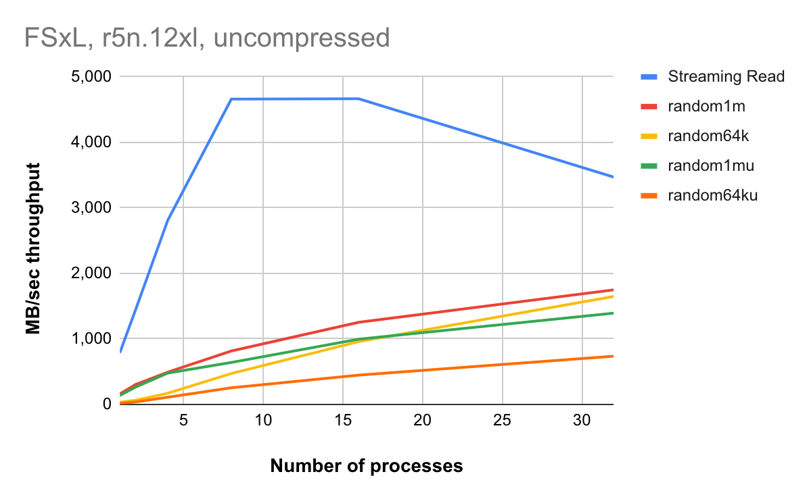
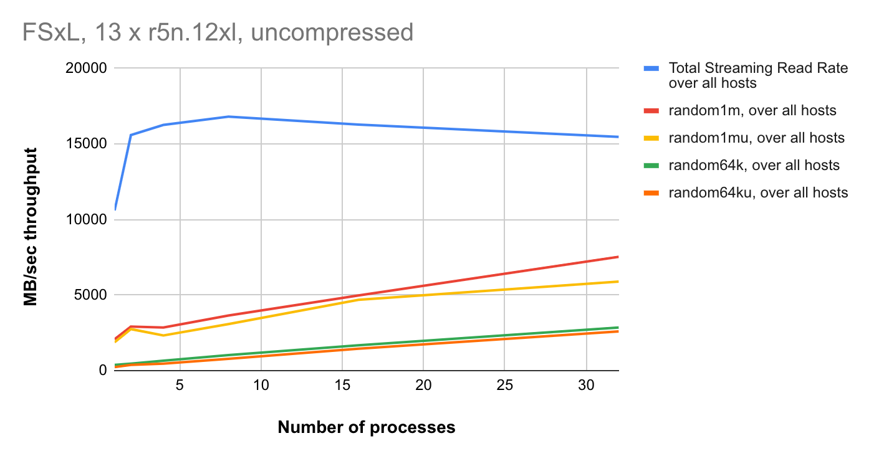

# :fontawesome-brands-aws: Amazon FSx for Lustre

[Amazon FSx for Lustre](https://aws.amazon.com/fsx/lustre/) is POSIX-compliant and is built on [Lustre](https://www.lustre.org), a popular open-source parallel filesystem that provides scale-out performance that increases linearly with a filesystem’s size. FSx filesystems scale to hundreds of GBs of throughput and millions of IOPS. It also supports concurrent access to the same file or directory from thousands of compute instances and provides consistent, sub-millisecond latencies for file operations, which makes it especially suitable for storing and retrieving HDB data.

FSx for Lustre persistent filesystem provides highly available and durable storage for kdb+ workloads. The fileservers in a persistent filesystem are highly available and data is automatically replicated within the same availability zone.

FSx for Lustre persistent filesystem allows you to choose from three deployment options.

```txt
PERSISTENT-50
PERSISTENT-100
PERSISTENT-200
```

Each of these deployment options comes with 50 MBs, 100 MBs, or 200 MBs baseline disk throughput per TiB of filesystem storage.

:fontawesome-brands-aws:
[Performance-tuning options](https://docs.aws.amazon.com/fsx/latest/LustreGuide/performance.html)


## Performance

We present some output of the nano benchmark designed to measure storage performance from kdb+ perspective. In the test we used PERSISTENT-200 deployment type of size 60TB, 200 SSD as cache storage.

Chart below displays streaming and random reads of block of different sizes. Streaming read performance is representative of e.g. `select` statements without `where` clause and optimizing read-ahead setting by `-23!`. Random reads happen when we extract only a subset of the vectors - e.g. due to using a restrictive `where` constraint.



The multiple node results are displayed below.



The random read performance well demonstrates that Lustre file systems scale horizontally across multiple file servers and disks.