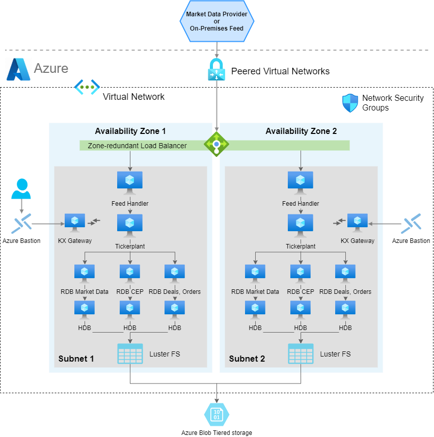

# Reference architecture for Azure

<!-- Kdb+ is the technology of choice for many of the world’s top financial institutions when implementing a tick-capture system for timeseries analysis. Kdb+ is capable of processing large amounts of data in a very short space of time, making it the ideal technology for dealing with the ever-increasing volumes of financial tick data.
 -->

_Lift and shift your kdb+ plants to the cloud and leverage virtual machines (VM) with storage_

kdb Insights provides a range of tools to build, manage and deploy kdb+ applications in the cloud.

kdb Insights supports:

- interfaces for deployment and common ‘Devops’ orchestration tools such as Docker, Kubernetes, Helm, and others. 
- integrations with major cloud logging services. 

kdb Insights provides:

- a kdb+ native REST client; Kurl, to authenticate and interface with other cloud services. 
- kdb+ native support for reading from Azure Blog Storage, and a packaging utility, QPacker to build and deploy kdb+ applications to the cloud. 
  
By taking advantage of the kdb Insights suite of tools, you can quickly and easily create new and integrate existing kdb+ applications on Microsoft Azure.

**Deployment**
-   QPacker – A packaging utility that supports q, Python and C libraries
-   Detailed guide to deploy kdb+ applications to the cloud

**Service integration**
-   QLog – Integrations with major cloud logging services
-   Kurl – Native kdb+ REST client with authentication to cloud services

**Storage**

-   kdb+ Object Store – Native support for reading and querying Azure Blob Storage

## kdb+ architecture patterns in Microsoft Azure

kdb+tick is an architecture that allows the capture, processing and querying of timeseries data against realtime, streaming and historical data. 

This reference architecture describes a full solution running kdb+tick within Microsoft Azure which consists of these functional components:

-   datafeeds
-   feedhandlers
-   tickerplant
-   realtime database
-   historical database
-   KX gateway

An architectural pattern for kdb+tick in Microsoft Azure:



Azure integration allows the ability to place kdb+ processing functions either in one Azure Virtual Machine (VM) instance or distributed across many Azure VM instances. The ability for kdb+ processes to communicate with each other through kdb+’s built-in language primitives, allows for this flexibility in final design layouts. The transport method between kdb+ processes and overall
external communication is achieved through low-level TCP/IP sockets. If two components are on the same VM instance, then local Unix sockets can be used to reduce communication overhead.

Many customers have tickerplants set up on their premises. The Microsoft Azure reference architecture allows you to manage a hybrid infrastructure that communicates with both tickerplants on-premises and in the cloud. The benefits of migrating tickerplants to a cloud infrastructure are vast, and include flexibility, auto-scaling, improved transparency in cost management, access to management and infrastructure tools built by Microsoft, quick hardware allocation and many more.

This page focuses on kdb+tick deployment to virtual machines in Azure; however, kdb Insights provides another kdb+ architectural pattern for deploying to Microsoft Azure Kubernetes Service (AKS).

Refer to [managed app](https://code.kx.com/insights/enterprise/azure-marketplace/kx-managed-app.html) for more details.

### Datafeeds

These are the source data ingested into the system. For financial use cases, data may be ingested from B-pipe (Bloomberg), or Elektron (Refinitiv) or any exchange that provides a data API.
Often the streaming data is available on a pub-sub component such as Kafka, or Solace, which are popular for having an open-source interface to kdb+. The datafeeds are in a proprietary format, but always one with which KX has familiarity. Usually this means a feed handler just needs to be aware of the specific data format. Due to the flexible architecture of KX, most underlying kdb+ processes that constitute the system can be placed anywhere in this architecture. For example, for latency, compliance or other reasons, the datafeeds might be relayed through your on-premises data center. Alternatively, the connection from the feedhandlers might be made directly from the Azure Virtual Network (VNet) into the market-data source.

The kdb+ infrastructure is often used to store internally derived data. This can optimize internal data flow and help remove latency bottlenecks. The pricing of liquid products, for example on B2B markets, is often calculated by a complex distributed system. This system often changes due to new models, new markets or other internal system changes. Data in kdb+ that is generated by these internal steps also require processing and handling huge amounts of timeseries data. When all the internal components of these systems send data to kdb+, a comprehensive impact analysis captures any changes.

### Feedhandler

A feedhandler is a process that captures external data and translates it into kdb+ messages. Multiple feedhandlers can be used to gather data from several different sources and feed it to the kdb+ system for storage and analysis.

There are a number of open-source (Apache 2 licensed) [Fusion interfaces](../../interfaces/index.md) between KX and other third-party technologies. Feedhandlers are typically written in Java, Python, C++ and q.

### Tickerplant

A tickerplant (TP) is a specialized, single-threaded kdb+ process that operates as a link between the client’s data feed and a number of subscribers. It implements a pub-sub pattern,specifically, it receives data from the feedhandler, stores it locally in a table then saves it to a log file. It publishes this data to a realtime database (RDB) and any clients who have subscribed to it. It then purges its local tables of data.

Tickerplants can operate in two modes:

mode | operation
-----|----------
batch | Collects updates in its local tables, batches up for a period of time and then forwards the update to realtime subscribers in a bulk update.
realtime (zero&nbsp;latency) | Forwards the input immediately. This requires smaller local tables but has higher CPU and network costs. Each message has a fixed network overhead.

API calls:

call | operation
-----|----------
subscribe | Add subscriber to message receipt list and send subscriber table definitions.
unsubscribe | Remove subscriber from message receipt list.

!!! info "End of Day event: at midnight, the TP closes its log files, auto creates a new file, and notifies the realtime database about the start of the new day."
    

### Realtime database

The realtime database holds all the intraday data in memory to allow for fast powerful queries. For example, at the start of the business day, the RDB sends a message to the tickerplant and receives a reply containing the data schema, the location of the log file, and the number of lines to read from the log file. It then receives subsequent updates from the tickerplant as they are published. One of the key design choices for Microsoft Azure is the size of memory for this instance, as ideally we need to contain the entire business day/period of data in-memory.

Purpose:

-   Subscribed to the messages from the tickerplant
-   Stores (in-memory) the messages received
-   Allows this data to be queried intraday

Actions:

-   On message receipt: insert into local, in-memory tables.
-   End of Day receipt: usually writes intraday data down then sends a new End-of-Day message to the HDB. Optionally RDB sorts certain tables (for example, by sym and time) to speed up queries.

An RDB can operate in single or multi-input mode. The default mode is single input, in which user queries are served sequentially and queries are queued until an update from the TP is processed (inserted into the local table).

In standard tick scripts, the RDB tables are indexed (using hash tables), typically by the product identifier. Indexing has a significant impact on query speed, resulting in slower data ingestion. The insert function takes care of the indexing; during an update it also updates the hash table.

!!! note "The performance of the CPU and memory in the chosen Azure VM instance impacts the rate at which data is ingested and the time taken to execute data queries."

### Historical database

The historical database (HDB) is a simple kdb+ process with a pointer to the persisted data directory. A kdb+ process can read this data and memory map it, allowing for fast queries across a large volume of data. Typically, the RDB is instructed by the TP to save its data to the data directory at EOD. The HDB can then refresh its memory from the data directory mappings. 

HDB data is partitioned by date in the standard TP. If multiple disks are attached to the box, then data can be segmented and kdb+ makes use of parallel I/O operations. Segmented HDB requires a `par.txt` file that contains the locations of the individual segments.

An HDB query is processed by multiple threads, and map-reduce is applied if multiple partitions are involved in the query.

Purpose:

-   Provides a queryable data store of historical data 
-   In instances involving research and development or data analytics, customers can create reports on order execution times

Actions:

-   End of Day receipt - Reload the database to get the new day’s worth of data from the RDB write down.

HDBs are often expected to be mirrored locally. If performance is critical, some users, (for example, quants) need a subset of the data for heavy analysis and backtesting.

### KX Gateway

In production, a kdb+ system may be accessing multiple timeseries datasets, usually each one representing a different market data source, or using the same data, refactored for different schemas. All core components of a kdb+tick can handle multiple tables. However, you can introduce multiple TPs, RDBs and HDBs based on your fault-tolerance requirements. This can result in a large number of kdb+ components and a high infrastructure segregation. A KX gateway generally acts as a single point of contact for a client. A gateway collects data from the underlying services, combines datasets and may perform further data operations (for example, aggregation, joins, pivoting, and so on) before it sends the result back to the user.

The specific design of a gateway can vary in several ways according to expected use cases. For example, in a hot-hot setup, the gateway can be used to query services across availability zones.

The implementation of a gateway is largely determined by the following factors:

-   Number of clients or users
-   Number of services and sites
-   Requirement for data aggregation
-   Support of free-form queries
-   Level of redundancy and failover

The task of the gateway is to:

-   Check user entitlements and data-access permissions
-   Provide access to stored procedures, utility functions and business logic
-   Gain access to data in the required services (TP, RDB, HDB)
-   Provide the best possible service and query performance

The KX Gateway must be accessible through Azure security rules from all clients of the kdb+ service. In addition, the location of the gateway service also needs to have visibility of the remaining kdb+ processes constituting the full KX service.

## Storage and filesystem

kdb+tick architecture needs storage space for three types of data:

*TP log*

:   If the TP needs to handle many updates, then writing to it needs to be fast since slow I/O may delay updates and can even cause data loss. Optionally, you can write updates to the TP log in batches, for example, every second as opposed to in real time. Data loss occurs if the TP or instance is halted unexpectedly, or stops or restarts, as the recently received updates are not    persisted. If a TP process or the Azure VM instance goes down or restarts also results in data loss. The extra second of data loss is probably marginal to the whole outage window.

    If the RDB process goes down, then it can replay data to recover from the TP log. The faster it can recover, the fewer data are waiting in the TP output queue to be processed by the restarted RDB. Hence, a fast read operation is critical for resilience reasons. Using Azure Premium SSD Managed Disk or Ultra disk, or a subsection of an existing Lustre filesystem on Azure is a recommended solution.

!!! note "Managed disks are more resilient and would still contain the data despite any Azure VM restart or loss."

*Sym file (and `par.txt` for segmented databases)*

:   The sym file is written by the realtime database after end-of-day, when new data is appended to the historical database. The HDB processes read the sym file to reload new data. Time to read and write the sym file is often marginal compared to other I/O operations. It is beneficial to be able to write down to a shared filesystem, thereby adding huge flexibility in the Azure Virtual
Network (VNet). Any other Azure VM instance can assume this responsibility in a stateless fashion.

*HDB data*

:   Performance of the filesystem solution determines the speed and operational latency for kdb+ to read its historical (at rest) data. The solution needs to be designed to cater for good     query execution times for the most important business queries. These may splay across many partitions or segments of data or may deeply query on few or single partitions of data. The time to write a new partition impacts RDB EOD work. For systems that are queried around the clock the RDB write time needs to be very short.

One advantage of storing your HDB within the Azure ecosystem is the flexibility of storage. This is usually distinct from “on-prem” storage, whereby you may start at one level of storage capacity and grow the solution to allow for dynamic capacity growth. One huge advantage of most Azure storage solutions is that permanent disks can grow dynamically without the need to halt instances, this allows you to dynamically change resources. For example, start with small disk capacity and grow capacity over time.

The reference architecture recommends replicating data. This can either be tiered out to lower cost or lower performance object storage in Azure or the data can be replicated across availability zones. The latter may be useful if there is client-side disconnection from other time zones. You may consider failover of service from Europe to North America, or vice-versa. Kdb+ uses POSIX filesystem semantics to manage HDB structure directly on a POSIX-style file system stored in persistent storage, for example Azure Disk Storage. There are many solutions that offer
full operational functionality for the POSIX interface.

### Azure Blob Storage

Azure Blob Storage is an object store that scales to exabytes of data. There are different storage classes (Premium, Hot, Cool, Archive) for different availability. Infrequently used data can use cheaper but slower storage. The kdb Insights native object store functionality allows users to read HDB data from Azure Blob object storage.

The HDB `par.txt` file can have segment locations that are on Azure Blob object storage. In this pattern, the HDB can reside entirely on Azure Blob storage or spread across Azure Disks, Azure Files or Azure Blob Storage as required. There is a relatively high latency when using Azure Blob cloud storage compared to local storage, such as Azure Disks. The performance of kdb+ when working with Azure Blob Storage can be improved by taking advantage of the caching feature of the kdb+ native objectstore. The results of requests to Azure Blob Storage can be cached on a
local high-performance disk thus increasing performance. The cache directory is continuously monitored and a size limit is maintained by deleting files according to a LRU (least recently used) algorithm.

Caching coupled with enabling secondary threads can increase the performance of queries against a HDB on Azure Blob Storage. The larger the number of secondary threads, irrespective of CPU core count, the better the performance of kdb+ object storage. Conversely, the performance of cached data appears to be better if the secondary-thread count matches the CPU core count.

It is recommended to use compression on the HDB data residing on Azure Blob Storage. This can reduce the cost of object storage and possible egress costs, and also counteract the relatively high-latency and low bandwidth associated with Azure Blob Storage.

Furthermore, Azure Blob Storage is useful for archiving, tiering, and backup purposes. The TP log file and the sym can be stored each day and archived for a period of time. The lifecycle management of the object store simplifies clean-up, whereby one can set the expiration time on any file. The versioning feature of Azure Blob Storage is particularly useful when a sym file bloat happens due to feed misconfiguration or upstream change. Migrating back to a previous version saves the health of the whole database.

Azure Blob Storage provides strong read-after-write consistency. After a successful write or update of an object, any subsequent read request immediately receives the latest version of the object. Azure Blob Storage also provides strong consistency for list operations, so after a write, you can immediately perform a listing of the objects in a bucket with all changes reflected. This is especially useful when there are many kdb+ processes reading from Azure Blob Storage, as it ensures consistency.

A kdb+ feed can subscribe to a Azure Blob Storage file update that the upstream drops into a bucket and can start its processing immediately. The data is available earlier compared to the solution when the feed is started periodically, for example, every hour.

### Azure Disk Storage

Azure Disk Storage can be used to store HDB and Tickerplant data, and is fully compliant with kdb+. It supports all the POSIX semantics required. Azure Ultra Disk volumes offers increased performance of 300 IOPS/GiB, up to a maximum of 160 K IOPS per disk and more durability, reducing the possibility of a storage volume failure.

### Azure Files

Azure Files over NFS offers NFS service for nodes in the same availability zone, and can run across zones, or can be exposed externally. Azure Files can be used to store HDB and tickerplant data
and is fully compliant with kdb+. Microsoft plan to release to general availability shortly.

### Lustre FS 

[Lustre](https://learn.microsoft.com/en-us/azure/azure-managed-lustre/) FS is POSIX compliant and built on Lustre, a popular open-source parallel filesystem that provides scale-out performance that increases linearly with a filesystem’s size. Lustre filesystems scale to hundreds of GB/s of throughput and millions of IOPS. It also supports concurrent access to the same file or directory from thousands of compute instances and provides consistent, sub-millisecond latencies for file operations, making it especially suitable for storing and retrieving HDB data.

A Lustre FS persistent file system provides highly available and durable storage for kdb+ workloads. The file servers in a persistent file system are highly available and data is automatically replicated within the same Availability Zone. 

## Memory

The TP uses very little memory during normal operation in realtime mode, while a full record of intraday data is maintained in the realtime database. Abnormal operation occurs if a realtime
subscriber (including RDB) is unable to process the updates. TP stores these updates in the output queue associated with the subscriber. Large output queue needs a large memory. TP may exceed memory limits and exit in extreme cases. Also, TP in batch mode needs to store data. This also increases memory need. Consequently, the memory requirement of the TP box depends on the setup of the subscribers and the availability requirements of the tick system.

The main consideration for an instance hosting the RDB is to use a memory optimized VM instance such as the `Standard_E16s_v5` (with 128 GB memory), or `Standard_E32s_v5` (256 GB memory). Azure also offers VM with extremely large memory, `S896oom (BareMetal)`, with 36TiB of memory, for clients who need to store large amounts of high-frequency data in memory, in the RDB, or to keep more than one partition of data in the RDB form.

There is a tradeoff however, of large memory and RDB recovery time. The larger the tables, the longer it takes for the RDB to start from TP log. To alleviate this problem, you can split a large RDB into two. The rule for separating the tables into two clusters is the join operation between them. If two tables are never joined, then they can be placed into separate RDBs.

It is recommended that HDB boxes have large memories. User queries may require large temporal space for complex queries. Query execution times are often dominated by IO cost to get the raw data. OS-level caching stores frequently used data. The larger the memory, the less cache miss and the faster the queries run.

## CPU

The CPU load generated by the TP depends on the number of publishers and their verbosity (number of updates per second), and the number of subscribers. Subscribers may subscribe to partial data, but any filtering applied consumes further CPU cycles.

The CPU requirement of the realtime database comes from

1.  appending updates to local tables
2.  user queries

Local table updates are very efficient especially if the TP sends batch updates. Faster CPU results in faster ingestion and lower latency. User queries are often CPU intensive. They perform aggregation, joins, and call expensive functions. If the RDB is set up in multi-input mode (started with a negative port) then user queries are executed in parallel. Furthermore, kdb+ 4.0 supports multithreading in most primitives, including `sum`, `avg`, `dev`, etc. (If the RDB process is heavily used and hit by many queries, then it is recommended to start in
multi-process mode by the `-s` command-line option). VMs with many cores are recommended for RDB processes with large numbers of user queries.

If the infrastructure is sensitive to the RDB EOD work, then powerful CPUs are recommended. Sorting tables before splaying is a CPU-intensive task.

Historical databases are used for user queries. In many cases the IO dominates execution times. If the box has large memory and OS-level caching reduces IO operations efficiently, then CPU performance directly impacts execution times.

Azure VM instances optimized for HPC applications, such as the [HBv4-series](https://learn.microsoft.com/en-us/azure/virtual-machines/hbv4-series) 
(`Standard_HB120rs_v4` with 120 AMD EPYC vCPUs), are recommended for CPU-bound services as described in the use cases above.


## Locality, latency and resiliency

The standard tick set up on premises requires the components to be placed on the same server. The tickerplant and realtime database are linked via the TP log file and the RDB and historical database are bound due to RDB EOD splaying. Customized tickerplants release this constraint in order to improve resilience. One motivation could be to avoid HDB queries impacting data capture in TP. You can set up an HDB writer on the HDB box and RDB can send its tables through IPC at midnight and delegate the IO work together with the sorting and attribute handling.

It is recommended that the feedhandlers are placed outside the TP box on another VM between the TP and data feed. This minimises the impact on TP stability if the feedhandler malfunctions.

### Placement groups

The kdb+ tick architecture can be set up with placement groups, depending on the use case. A Proximity Placement Group is a configuration option that Azure offers, which lets you place a group of interdependent instances in a certain way across the underlying hardware in which those instances reside. The instances could be placed close together, spread through different racks, or spread through different Availability Zones.

### Cluster placement group

The cluster placement group configuration allows you to place your group of interrelated instances close together to achieve the best throughput and low latency results possible. This option only lets you pack the instances together inside the same Availability Zone, either in the same Virtual Network (VNet) or between peered VNets.

### Spread placement groups

With spread placement groups, each single instance runs on separate physical hardware racks. So, if you deploy five instances and put them into this type of placement group, each one of those five instances  resides on a different rack with its own network access and power, either within a single AZ or in multi-AZ architecture.

## Recovery-time and recovery-point objectives

A disaster-recovery plan is usually based on requirements from both the Recovery Time Objective and Recovery Point Objective specifications, which can guide the design of a cost-effective solution. However, every system has its own unique requirements and challenges. Here, we suggest the best-practice methods for dealing with the various possible failures one needs to be aware of and plan for when building a kdb+ tick-based system.

In the various combinations of failover operations that can be designed, the end goal is always to maintain availability of the application and minimize any disruption to the business.

In a production environment, some level of redundancy is always required. Depending on the use case, requirements may vary but in nearly all instances requiring high availability, the best option is to have a hot-hot (or active-active) configuration. There are four main configurations found in production hot-hot, hot-warm, hot-cold, and pilot-light (or cold hot-warm). 


Term | Description
----------- | ------------------------
Hot-hot | Describes an identical mirrored secondary system running, separate to the primary system, capturing and storing data but also serving client queries. In a system with a secondary server available, hot-hot is the typical configuration as it is sensible to use all available hardware to maximize operational performance. The KX gateway handles client requests across availability zones and collects data from several underlying services, combining data sets and if necessary, performing an aggregation operation before returning the result to the client.
Hot-warm | The secondary system captures data but does not serve queries. In the event of a failover, the KX gateway reroutes client queries to the secondary (warm) system.
Hot-cold | The secondary system has a complete backup or copy of the primary system at some previous point in time (recall that kdb+ databases are a series of operating system files and directories) with no live processes running. A failover in this scenario involves restoring from this latest backup, with the understanding that there may be some data loss between the time of failover to the time the latest backup was made.
Pilot light (or cold hot-warm) | The secondary is on standby and the entire system can quickly be started to allow recovery in a shorter time period than a hot-cold configuration.

Typically, kdb+ is deployed in a high-value system. Hence, downtime can impact business which justifies the hot-hot setup to ensure high availability.

Usually, the secondary system runs on completely separate infrastructure, with a separate filesystem, and saves the data to a secondary database directory, separate from the primary system. In this way, if the primary system or underlying infrastructure goes offline, the secondary system is able to take over completely.

The usual strategy for failover is to have a complete mirror of the production system (feed handler, tickerplant, and realtime subscriber), and when any critical process goes down, the secondary is able to take over. Switching from production to disaster recovery systems can be implemented seamlessly using kdb+ interprocess communication.

:fontawesome-regular-map:
[Disaster-recovery planning for kdb+ tick systems](../..//wp/disaster-recovery/index.md)
<br>
:fontawesome-regular-map:
[Data recovery for kdb+ tick](../../wp/data-recovery.md)

## Network

Network bandwidth needs to be considered if the TP components are not located on the same VM. The network bandwidth between Azure VMs depends on the type of the VMs. For example, a VM of type `Standard_D8as_v4` has an expected network bandwidth 3.125 Gbps and a larger instance `Standard_D32as_v4` can sustain 12.5 Gbps. For a given update frequency you can calculate the required bandwidth by employing the [`-22!`](../../basics/internal.md#-22x-uncompressed-length) internal function that returns the length of the IPC byte representation of its argument. The TP copes with large amounts of data if batch updates are sent. Make sure that the network is not your bottleneck in processing the updates.

### Azure Load Balancer

An Azure Load Balancer is a type of load balancing service by Azure. It is used for ultra-high performance, TLS offloading at scale, centralized certificate deployment, support for UDP, and static IP addresses for your application. Operating at the connection level, network load balancers are capable of securely handling millions of requests per second while maintaining ultra-low latencies.

Load balancers can distribute load among applications that offer the same service. Kdb+ is single threaded by default. The recommended approach is to use a pool of HDB processes. Distributing the queries can either be done by the gateway using async calls or by a load balancer. If the gateways are sending sync queries to the HDB load balancer, then a gateway load balancer is recommended to avoid query contention in the gateway. Furthermore, there are other TP components that enjoy the benefit of load balancers to better handle simultaneous requests.

Adding a load balancer on top of an historical database (HDB) pool requires only three steps:

1.   Create a Network Load Balancer with protocol TCP. Set the name, Availability Zone, Target Group name and Security group. The security group needs an inbound rule to the HDB port. 
2.   Create a launch template. A key part is the User Data window where you can type a startup-script. It mounts the volume that contains the HDB data and the q interpreter, sets environment variables (e.g. `QHOME`) and starts the HDB. The HDB accepts incoming TCP connections from the Load Balancer, so you must set up an inbound Firewall rule using a Security Group. You can also leverage a Custom Image  that you already created from an existing Azure VM. 
3.   Create an Azure Virtual Machine scale set (set of virtual machines) with autoscale rules to better handle peak loads. You can set the recently created instance group as a Target Group. All clients access the HDB pool using the Load Balancer’s DNS name (together with the HDB port) and the load balancer distributes the requests among the HDB servers seamlessly.

General TCP load balancers with an HDB pool offer better performance than a stand-alone HDB, however, utilizing the underlying HDBs is not optimal. Consider three clients C1, C2, C3 and two servers HDB1 and HDB2. C1 is directed to HDB1 when establishing the TCP connection, C2 to HDB2 and C3 to HDB1 again. If C1 and C3 send heavy queries and C2 sends a few lightweight queries, then HDB1 is overloaded and HDB2 is idle. To improve the load distribution the load balancer needs to go under the TCP layer and needs to understand the kdb+ protocol.

## Logging

Azure provides a fully managed logging service that performs at scale and can ingest application and system log data. Azure Monitor allows you to view, search and analyze system logs. It provides an easy to use and customizable interface so that e.g. DevOps can quickly troubleshoot applications.

Azure Monitor Logs enables you to see all of your logs, regardless of their source, as a single and consistent flow of events ordered by time. Events are organized into log streams and each stream is part of a log group. Related applications typically belong to the same log group.

You don’t need to modify your tick scripts to enjoy the benefits of Azure Monitor. The Azure Monitor agent can be installed and configured to forward your application log to Azure Monitor. You should use the policies and policy initiatives below to automatically install the agent and associate it with a data-collection rule, every time you create a virtual machine. In the host configuration file you need to provide the log file to watch and to which log stream the new entries should be sent.

Almost all kdb+ tick components can benefit from cloud logging.  Feedhandlers log new data arrival, data and connection issues. The TP logs new or disappearing publishers and subscribers. It can log if the output queue is above a threshold. The RDB logs all steps of the EOD process which includes sorting and splaying of all tables. The HDB and gateway can log every user query.

Kdb+ users often prefer to save log messages in kdb+ tables. Tables that are unlikely to change are specified by a schema, while entries that require more flexibility use key-value columns. Log tables are ingested by log tick plans and these Ops tables are separated from the tables required for the business.

One benefit of storing log messages is the ability to process log messages in qSQL. Timeseries join functions include as-of and window joins. For example, gateway functions are executed hundreds of times during the day. The gateway query executes RDB and HDB queries, often using a load balancer. All these components have their own log entries. You can simply employ Window Join to find relevant entries and perform aggregation to get insight into the performance characteristics of the execution chain. Please note that you can log both to kdb+ and to Azure Monitor.

kdb Insights QLog provides kdb+ cloud-logging functionality. QLog supports multiple endpoint types through a simple interface and provides the ability to write to them concurrently. The logging endpoints in QLog are encoded as URLs with two main types: file descriptors and REST endpoints. The file descriptor endpoints supported are;

```txt
:fd://stdout
:fd://stderr
:fd:///path/to/file.log
```

REST endpoints are encoded as standard HTTP/S URLs such as:

```http
https://<CustomerId>.ods.opinsights.azure.com/api/logs?api-version=2016-04-01
```

QLog generates structured, formatted log messages tagged with a severity level and component name. Routing rules can also be configured to suppress or route based on these tags.

Existing q libraries that implement their own formatting can still use QLog via the base APIs. This enables them to do their own formatting but still take advantage of the QLog-supported endpoints. Integration with cloud logging application providers can easily be achieved using logging agents. These can be set up alongside running containers or virtual machines to capture their output and forward to logging endpoints, such as Azure Monitor.

Azure Monitor supports monitoring, alarming and creating dashboards. It is simple to create a Metric Filter based on a pattern and set an alarm (for example, sending email) if a certain criterion holds. You may also wish to integrate your KX monitoring for kdb+ components into this cloud logging and monitoring framework. The gives you insights into performance, uptime and overall health of the applications and the servers pool. You can visualize trends using dashboards.

## Interacting with Azure services

You can use Azure services through the console web interface. You may also need to interact from a q process. The following demonstration shows how to get a list of Virtual Machines for a specific Azure Tenant from a q process using either:

1.  a system call to the Azure CLI
1.  embedPy using the Azure SDK for Python
1.  the Kurl Rest API client

### Azure CLI

A q process can run shell commands by calling the function `system`. The example below shows how we can get the list of virtual machines. We assume the Azure CLI is installed on the script-runner machine.

```txt
(38env) stran@amon:~$ q
KDB+ 4.0 2020.07.15 Copyright (C) 1993-2020 Kx Systems
l64/ 4(16)core 7959MB stran amon 127.0.1.1 EXPIRE ..
```
```q
q) system "az vm list --output table"
"Name            ResourceGroup          Location   Zones"
"--------------- ---------------------- ---------- -------"
"staging-bastion STAGING-RESOURCE-GROUP westeurope"
"tempVM          STAGING-RESOURCE-GROUP westeurope"
"windowsvm       WINDOWSVM_GROUP        westeurope"
```
This example shows how the Azure CLI forms q using the system function.

Unfortunately, this approach needs string manipulation so it is not always convenient.

### EmbedPy

Azure provides a Python client library to interact with Azure services. Using embedPy, a q process can load a Python environment and easily query the list of virtual machines for a given Azure tenant.

```txt
(38env) stran@amon:\~/development/Azure$ q
KDB+ 4.0 2020.07.15 Copyright (C) 1993-2020 Kx Systems 
l64/ 4(16)core 7959MB stran amon 127.0.1.1 EXPIRE ..
```
```q
q)\l p.q
q)p)from azure.identity import ClientSecretCredential
q)p)from azure.mgmt.compute import ComputeManagementClient
q)p)Subscription_Id = "xxxxxxxx"
q)p)Tenant_Id = "xxxxxxxxx"
q)p)Client_Id = "xxxxxxxxx"
q)p)Secret = "xxxxxxxxx"
q)p)credential = ClientSecretCredential(tenant_id=Tenant_Id,
client_id=Client_Id, client_secret=Secret)
q)p)compute_client = ComputeManagementClient(credential,
Subscription_Id)
q)p)for vm in compute_client.virtual_machines.list_all(): print(vm.name)
staging-bastion
tempVM
windowsvm
q)
```

### Kurl REST API

Finally, you can send HTTP requests to the Azure REST API endpoints. KX Insights provides a native q REST API called Kurl. Kurl provides ease-of-use cloud integration by registering Azure authentication information. When running on a cloud instance, and a role is available, Kurl discovers and registers the instance metadata credentials. When running outside the cloud, OAuth2, ENV, and file-based credential methods are supported. Kurl takes care of your credentials and properly formats the requests. In the code lines below, we call the Azure Resource Manager REST API to pull the list of VMs for a specific tenant.

The following example uses a simple Bearer token for authorization.

```txt
(38env) stran@amon:\~$ q
KDB+ 4.1t 2021.07.12 Copyright (C) 1993-2021 Kx Systems
l64/ 4(16)core 7959MB stran amon 127.0.1.1 EXPIRE ..
```
```q
q)url:"https://management.azure.com/subscriptions"
q)url,:"/c4f7ecef-da9e-4336-a9d6-d11d5838caff/resources"
q)url,:"?api-version=2021-04-01"
q)url,,:"&%24filter=resourceType%20eq%20%27microsoft.compute%2Fvirtualmachines%27"
q)params:``headers!(::;enlist["Authorization"]!enlist "bearer XXXXXXXXXXXXXXX")
q)resp:.kurl.sync (`$url;`GET;params)
q)t: (uj) over enlist each (.j.k resp[1])[`value]
q)select name, location, tags from t
name              location     tags
-----------------------------------------------------------------------
"staging-bastion" "westeurope" `cluster_name`name!("staging";"staging")
"tempVM"          "westeurope" `cluster_name`name!("";"")
"windowsvm"       "westeurope" `cluster_name`name!("";"")
q)
```

## Package, manage, and deploy

QPacker (QP) is a tool to help developers package, manage and deploy kdb+ applications to the cloud. It automates the creation of containers and virtual machines using a simple configuration file `qp.json`. It packages kdb+ applications with common shared code dependencies, such as Python and C. QPacker can build and run containers locally as well as push to container registries such as DockerHub and Azure Container Registry.

Software is often built by disparate teams, who may individually have remit over a particular component, and package that component for consumption by others. QPacker stores all artefacts for a project in a QPK file. While this file is intended for binary dependencies, it is also portable across environments.

QPacker can interface with Hashicorp Packer to generate virtual-machine images for Azure. These VM images can then be used as templates for a VM instance running in the cloud. When a cloud target is passed to QPacker (`qp build -azure`), an image is generated for each application defined in the top-level `qp.json` file. The QPK file resulting from each application is installed into the image and integrated with Systemd to allow the `startq.sh` launch script to start the application on boot.


## Azure Functions

Function as a service (FaaS) lets developers create an application without considering the complexity of building and maintaining the infrastructure that runs it. Cloud providers support only a handful of programming languages natively. Azure’s FaaS solution, [Functions](https://azure.microsoft.com/en-us/products/functions/), supports Bash scripts that can start any executable including a q script.

One use case is to start a gateway by Azure Functions to execute a client query. This provides cost transparency, zero cost when service is not used and full client query isolation.


## Access management

We distinguish application- and infrastructure-level access control. Application-level access management controls who can access kdb+ components and run commands. TP, RDB, and HDB are generally restricted to kdb+ infrastructure administrators only and the gateway is the access point for the users. One responsibility of the gateway is to check if the user can access the tables (columns and rows) s/he is querying. This generally requires checking user ID (returned by `.z.u`) against some organizational entitlement database, cached locally in the gateway and refreshed
periodically.


### Secure access – Azure Bastion

Azure Bastion, a fully platform-managed PaaS service that you provision inside your virtual network, lets you manage your kdb+ Azure Virtual Machines through an RDP and SSH session directly in the Azure portal using a single-click seamless experience. Azure Bastion provides secure and auditable instance management for your kdb+ tick deployment without the need to open inbound ports, maintain bastion hosts, or manage SSH keys.

Use this to permission access to the KX gateway. This is a key task for the administrators of the KX system, and both user and API access to the entire system is controlled entirely through the KX gateway process.


## Hardware specifications

A number of Azure VM types are especially performant for kdb+ workloads.

Azure offers five different sub-groups of VMs in the memory-optimized family – each with a high memory-to-vCPU ratio. Although the DSv2-series 11-15 and Esv4-series have a comparable vCPU to memory ratio, DSv2R instances support bandwidth up to 24.4Gbps and max uncached disk throughput performance of 62.5K IOPS and expected network bandwidth of 24.4Gbps, providing 2× higher disk throughput and network bandwidth performance compared to Esv4 instances.

The Azure Hypervisor, based on Windows Hyper-V, is the native hypervisor powering the Azure Cloud Service platform and providing the building blocks for delivering Azure Virtual Machine types with a selection of compute, storage, memory, and networking options.

service | Azure VM type | storage | CPU,&nbsp;memory,&nbsp;I/O
--------|---------------|---------|-----------------
tickerplant | _Memory optimized_: Dv4/DSv4, Ev4/Esv4, Ev5/Esv5, M<br>_HPC-optimized_: HBv3 | Azure Managed Premium SSD/Ultra Disk<br>Lustre FS? | High Perf<br>Medium<br>Medium
realtime database | _Memory optimized_: Dv4/DSv4, Ev4/Esv4, Ev5/Esv5, M<br>_HPC-optimized_: HBv3 | – | High Perf<br>High&nbsp;Capacity<br>Medium
historical database | _Memory optimized_: Dv4/DSv4, Ev4/Esv4, Ev5/Esv5, M | Azure Managed Premium SSD/Ultra Disk<br>Lustre FS? | Medium Perf<br>Medium&nbsp;Memory<br>High IO
complex event processing (CEP) | _Memory optimized_: Dv4/DSv4, Ev4/Esv4, Ev5/Esv5, M | – | Medium Perf<br>Medium&nbsp;Memory<br>High IO
gateway | Memory optimized: Dv4/DSv4, Ev4/Esv4, Ev5/Esv5, M | – | Medium Perf<br>Medium&nbsp;Memory<br>High IO


## Resources

:fontawesome-brands-github:
GitHub [repository](https://github.com/KxSystems/kdb-tick) with standard tick.q scripts

:fontawesome-regular-map:
[Building Real-time Tick Subscribers](../../wp/rt-tick/index.md)
<br>
:fontawesome-regular-map:
[Data recovery for kdb+ tick](../../wp/data-recovery.md)
<br>
:fontawesome-regular-map:
[Disaster-recovery planning for kdb+ tick systems](../../wp/disaster-recovery/index.md)
<br>
:fontawesome-regular-map:
[Intraday writedown solutions](../../wp/intraday-writedown/index.md)
<br>
:fontawesome-regular-map:
[Query Routing: a kdb+ framework for a scalable load-balanced system](../../wp/query-routing/index.md)
<br>
:fontawesome-regular-map:
[Order Book: a kdb+ intraday storage and access methodology](../../wp/order-book.md)
<br>
:fontawesome-regular-map:
[Kdb+tick profiling for throughput optimization](../../wp/tick-profiling.md)
:fontawesome-solid-cloud:
[KX Cloud Edition](https://code.kx.com/insights/cloud-edition/)


*[EOD]: end of day
*[IPC]: interprocess communication
*[HDB]: historical database
*[RDB]: realtime database
*[TP]: tickerplant
*[VM]: virtual machine
