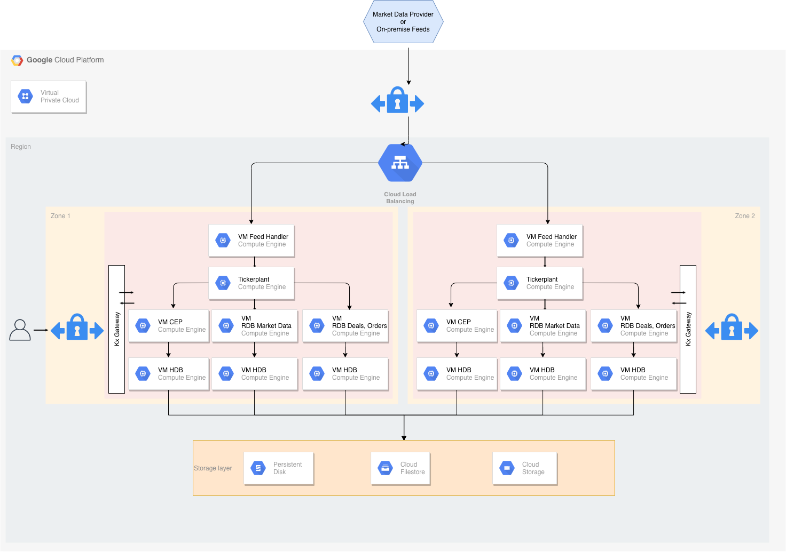

# Reference architecture for Google Cloud 


Kdb+ is the technology of choice for many of the world’s top financial institutions when implementing a tick-capture system. Kdb+ is capable of processing large amounts of data in a very short space of time, making it the ideal technology for dealing with the ever-increasing volumes of financial tick data. 


## Architectural components

The core of a kdb+ tick-capture system is called kdb+tick.

[Kdb+tick](../../learn/startingkdb/tick.md) is an architecture which allows the capture, processing and querying of timeseries data against real-time, streaming and historical data. This reference architecture describes a full solution running kdb+tick within Google Cloud Platform (GCP) which consists of these bare-minimum functional components:

-   data feeds
-   feed handlers
-   tickerplant
-   real-time database
-   historical database
-   Kx gateway

[](img/gc-architecture.png "Click to expand")
<br>
<small>_A simplified architecture diagram for kdb+/tick in GCP_</small>

Worthy of note in this reference architecture is the ability to place kdb+ processing functions either in one GCP instance or distributed around many GCP instances. The ability for kdb+ processes to communicate with each other through kdb+’s built-in language primitives, allows for this flexibility in final design layouts. The transport method between kdb+ processes and all overall  external communication is done through low-level TCP/IP sockets. If two components are on the same GCP instance, then local Unix sockets can be used to reduce communication overhead. 

Many customers have kdb+tick set up on their premises. The GCP reference architecture allows customers to manage a hybrid infrastructure that communicates with both kdb+tick systems on-premises and in the cloud.However,  benefits from migrating their infrastructure to the cloud include

-   flexibility
-   auto-scaling
-   more transparent cost management
-   access to management/infrastructure tools built by Google
-   quick hardware allocation


### Data feeds

This is the source data we aim to ingest into our system. For financial use cases, data may be ingested from B-pipe (Bloomberg), or Elektron (Refinitiv) data or any exchange that provides a data API. 

Often the streaming data is available on a pub-sub component like Kafka or Solace, with an open-source interface to kdb+. The data feeds are in a proprietary format, but always one Kx has familiarity with. Usually this means that a feed handler just needs to be aware of the specific data format. 

The flexible architecture of Kx means most if not all the underlying kdb+ processes that constitute the system can be placed anywhere in it. For example, for latency, compliance or other reasons, the data feeds may be relayed through an existing customer on-premises data center. Or the connection from the feed handlers may be made directly from this Virtual Private Cloud (VPC) into the market data venue. 

The kdb+ infrastructure is often used to also store internally-derived data. This can optimize internal data flow and help remove latency bottlenecks. The pricing of liquid products (for example, B2B markets) is often done by a complex distributed system. This system often changes with new models, new markets or other internal system changes. Data in kdb+ that will be generated by these internal steps will also require processing and handling huge amounts of timeseries data. When all the internal components of these systems send data to kdb+, a comprehensive impact analysis captures any changes. 


### Feed handler

A feed handler is a process that captures external data and translates it into kdb+ messages. Multiple feed handlers can be used to gather data from several different sources and feed it to the kdb+ system for storage and analysis.
There are a number of open-source (Apache 2 licensed) Fusion interfaces between Kx and third-party technologies. Feed handlers are typically written in Java, Python, C++ and q.

:fontawesome-brands-superpowers:
[Fusion interfaces on kdb+](../../interfaces/fusion.md)


### Tickerplant

The Tickerplant (TP) is a specialized, single threaded kdb+ process that operates as a link between the client’s data feed and a number of subscribers. It implements a pub-sub pattern: specifically, it receives data from the feed handler, stores it locally in a table then saves it to a log file. It publishes this data to a real-time database (RDB) and any clients that have subscribed to it. It then purges its local tables of data. 

Tickerplants can operate in two modes:

Batch mode 

: Collects updates in its local tables. It batches up for a period of time and then forwards the update to real-time subscribers in a bulk update. 

Real-time mode 

: Forwards the input immediately. This requires smaller local tables but has higher CPU and network costs, bear in mind that each message has a fixed network overhead.

Supported API calls:

call | action
-----|-------
Subscribe | Adds subscriber to message receipt list and sends subscriber table definitions.
Unsubscribe| Removes subscriber from message receipt list.

Events:

End of Day 

: At midnight, the TP closes its log files, auto creates a new file, and notifies the real-time database (RDB) about the start of the new day. 


### Real-time database

The real-time database (RDB) holds all the intraday data in memory, to allow for fast powerful queries. 

For example, at the start of business day, the RDB sends a message to the Tickerplant and receives a reply containing the data schema, the location of the log file, and the number of lines to read from the log file. It then receives subsequent updates from the Tickerplant as they are published. One of the key design choices for Google Cloud Platform (GCP) will be the size of memory for this instance, as ideally we need to contain the entire business day/period of data in-memory.

Purpose:

-   Subscribed to the messages from the Tickerplant
-   Stores (in-memory) the messages received
-   Allows this data to be queried intraday

Actions:

-   On message receipt inserts into local, in-memory tables.
-   At End of Day, usually writes intraday data down then sends a new End-of-Day message to the HDB; may sort certain tables (e.g. by sym and time) to speed up queries.

An RDB can operate in single- or multi-input mode. The default mode is single input, in which user queries are served sequentially and queries are queued until an update from the TP is processed (inserted into the local table).
In standard tick scripts, the RDB tables are indexed, typically by the product identifier. 

An index is a hash table behind the scene. Indexing has a significant impact on the speed of the queries at the cost of slightly slower ingestion. The insert function takes care of the indexing, i.e. during an update it also updates the hash table.

Performance of the CPU and memory in the chosen GCP instance will have some impact on the overall sustainable rates of ingest and queryable rate of this real-time kdb+ function.


### Historical database

The historical database (HDB) is a simple kdb+ process with a pointer to the persisted data directory. A kdb+ process can read this data and memory maps it, allowing for fast queries across a large volume of data. Typically, the RDB is instructed to save its data to the data directory at EOD from where the HDB can refresh its memory mappings.

HDB data is partitioned by date in the standard kdb+tick. If multiple disks are attached to the box, then data can be segmented, and kdb+ makes use of parallel I/O operations. Segmented HDB requires a `par.txt` file that identifies the locations of the individual segments.

An HDB query is processed by multiple threads and map-reduce is applied if multiple partitions are involved in the query.

Purpose:

-   Provides a queryable data store of Historical Data.
-   In instances involving research and development or data analytics, customers can create customer reports on order execution times.

Actions:

-   End of Day receipt: reloads the database to get the new days’ worth of data from the RDB write-down.

HDBs are often expected to be mirrored locally. Some users, (e.g.  quants) need a subset of the data for heavy analysis and backtesting where the performance is critical.


### Kx gateway

In production, a kdb+ system may be accessing multiple timeseries data sets, usually each one representing a different market data source, or using the same data, refactored for different schemas. Process-wise, this can be seen as multiple TP, RDB and HDB processes. 

A Kx gateway generally acts as a single point of contact for a client. A gateway collects data from the underlying services, combines data sets and may perform further data operations (e.g. aggregation, joins, pivoting, etc.) before it sends the result back to the user.

The specific design of a gateway can vary in several ways according to expected use cases. For example, in a hot-hot set up, the gateway can be used to query services across availability zones. 

The implementation of a gateway is largely determined by the following factors.

-   Number of clients or users
-   Number of services and sites
-   Requirement of data aggregation
-   Support of free-form queries
-   Level of redundancy and failover

The task of the gateway can be broken down into the following steps.

-   Check user entitlements and data-access permissions
-   Provide access to stored procedures
-   Gain access to data in the required services (TP, RDB, HDB)
-   Provide the best possible service and query performance


### GCP considerations for the gateway

The Kx gateway must be accessible through GCP security rules from all clients of the kdb+ service. In addition, the location of the gateway service also needs to have visibility to the remaining kdb+ processes constituting the full Kx service.


## Storage and filesystem 

Kdb+tick architecture needs storage space for three types of data:

TP log

: If the Tickerplant (TP) needs to handle many updates, then writing to TP needs to be fast since slow I/O may delay updates and can even cause data loss. Optionally, you can write updates to TP log batched (e.g. in every second) as opposed to real-time. You will suffer data loss if TP or instance is halted unexpectedly or stops/restarts, as the recently received updates are not persisted. Nevertheless, you already suffer data loss if a TP process or the GCP instance goes down or restarts. The extra second of data loss is probably marginal to the whole outage window.

: If the RDB process goes down, then it can replay data to recover from the TP log. The faster it can recover the less data is waiting in the TP output queue to be processed by the restarted RDB. Hence fast read operation is critical for resilience reasons.

sym file (and `par.txt` for segmented databases)

: The sym file is written by the real-time database (RDB) after end-of-day, when new data is appended to the historical database (HDB). The HDB processes will then read the sym file to reload new data. Time to read and write the sym file is often marginal compared to other I/O operations.  Usually it is beneficial here to be able to write down to a shared filesystem, thereby adding huge flexibility in the GCP Virtual Private Cloud (VPC). (For example, any other GCP instance can assume this responsibility in a stateless fashion).

HDB data

: Performance of the file system solution will determine the speed and operational latency for kdb+ to read its historical (at rest) data. The solution needs to be designed to cater for good query execution times for the most important business queries. These may splay across many partitions or segments of data or may deeply query on few/single partitions of data. The time to write a new partition impacts RDB EOD work. For systems that are queried around the clock the RDB write time needs to be very short. 

One real great value of storing your HDB within the GCP eco-system is the flexibility of storage. This is usually distinct from ‘on-prem’ storage, whereby you may start at one level of storage capacity and grow the solution to allow for dynamic capacity growth. One huge advantage of most GCP storage solutions (e.g. persistent disks) is that disks can grow dynamically without the need to halt instances, this allows you to dynamically change resources. For example, start with small disk capacity and grow capacity over time.

The reference architecture recommends replicating data. Either this can be tiered out to lower cost/lower performance object storage in GCP or the data can be replicated across availability zones. The latter may be useful if there is client-side disconnection from other time zones. You may consider failover of service from Europe to North America, or vice-versa. Kdb+ uses POSIX filesystem semantics to manage HDB structure directly on a POSIX-style filesystem stored in persistent storage (GCP persistent disks _et al._) 
There are many solutions that offer full operational functionality for the POSIX interface. 


### Cloud storage

Cloud Storage (CS) is an object store that scales to exabytes of data. There are different storage classes (standard, nearline, cold line, archive) for different availability. Infrequently used data can use cheaper but slower storage. The cloud storage interface supports PUT, GET, LIST, HEAD operations only so it cannot be used for its historical database (HDB) directly, and constitutes ‘eventual consistency’: and RESTful interfaces. There is an open-source adapter (e.g. [Cloud Storage FUSE](https://cloud.google.com/storage/docs/gcs-fuse)) which allows mounting a Cloud Storage bucket as a file system but this solution is currently not recommended by Google.

CS is great for archive, tiering, and backup purposes. The TP log file and the sym should be stored each day and archived for a period of time. The lifecycle management of the object store simplifies clean-up whereby one can set expiration time to any file. The [versioning feature](https://cloud.google.com/storage/docs/object-versioning) of Cloud Storage is particularly useful when a sym file bloat happens due to feed misconfiguration or upstream change. Migrating back to a previous version saves the health of the whole database.

A kdb+ feed can subscribe to a CS file update that the upstream drops into a bucket and can start its processing immediately. The data is available earlier compared to the solution when the feed is started periodically,e.g. in every hour.


### Persistent disk (PD)

Persistent disk is the networked block storage solution of GCP. 

PD has a POSIX interface so it can be used to store historical database (HDB) data. One can use disks with different latency and throughput characteristics. Storage volumes can be transparently resized without downtime. You no longer need to delete data that might be needed in the future, just add capacity on the fly. Although the PD capacity can be shrunk this is not always supported by all filesystem types.

Persistent disks in GCP allow simultaneous readers, so they can be attached to multiple VMs running their own HDB processes. Frequently-used data that are sensitive to latency should use SSD disks that offer consistently high performance.

PD automatic encryption helps to protect sensitive data at the lowest level of the infrastructure.

The limitation of PDs is that they can be mounted in read-write mode only to a single VM. When EOD [splaying](../../kb/splayed-tables.md) happens, the PD needs to be unmounted from another VM, (i.e. all extra HDBs need to be shut down).

Local PD can be mounted to a single VM. They have higher throughput and lower latency (especially with NVMe interface) at the expense of functionality including redundancy and snapshots. Local PD with write cache flushing disabled can be a great choice for TP logs. Mirrored HDBs for target groups like quants also require maximal speed and care less about redundancy and snapshots.

When considering selecting the right PD, one needs to be aware of the relation between maximal IOP and number of CPUs.


### Filestore

Filestore is a set of services from GCP allowing you to load your HDB store into a fully managed service. All filestore tiers use network-attached storage (NAS) for Google Compute Engine instances to access the HDB data. Depending on which tier you choose, it can scale to 100s of TBs for high-performance workloads. Along with predictable performance, it is simple to provision and easy to mount on Compute Engine VM instances. NFSv3 is fully supported.


### Filestore High Scale

Formerly called Elastifile, Filestore High Scale, as implied by its name, offers additional performance attributes and enterprise features into the GCP Filestore service. It is designed to be a scalable, enterprise-grade shared file system, providing high-performance, POSIX-compliant NFS-presented file services.

It includes some other storage features such as: Deduplication, Compression, Snapshots, Cross-region replication, and Quotas. Kdb+ is qualified with Filestore High Scale. In using Filestore High Scale, you can take advantage of these built-in features when using it for all or some of your HDB segments and partitions. As well as performance, it allows for consolidation of RDB write down and HDB reads, due to its simultaneous read and write support within a single filesystem namespace. 

This makes it more convenient than GCP persistent disks. You can simply add HDB capacity by setting up a new VM, mounting Filestore High Scale as if an NFS client to that service, and if needed, register the HDB to the HDB load balancer. RDB or any other data-writer processes can write HDB anytime, it just needs to notify the HDB processes to remap the HDB files to the backing store.

We anticipate that you would deploy Filestore High Scale as part of a tiered storage solution for your HDB. You may tier some data to local persistent disk or other Filestore tiers, including standard and premium tiers, or to object storage, according to the chosen deployment strategy.

Prior to choosing this technology, check in via your Google Cloud console to find the currently-supported regions for Filestore High Scale, as this is gradually being deployed globally.


## Memory 

The tickerplant (TP) uses very little memory during normal operation in real-time mode, whilst a full record of intraday data is maintained in the real-time database. Abnormal operation occurs if a real-time subscriber (including RDB) is unable to process the updates. TP stores these updates in the output queue associated with the subscriber. Large output queue needs a large memory. TP may even hit memory limits and exit in extreme cases. Also, TP in batch mode needs to store data (e.g. for a second). This also increases memory need. Consequently, the memory requirement of the TP box depends on the set-up of the subscribers and the availability requirements of the tick system.

The main consideration for an instance hosting the RDB is to use a memory-optimized VM instance such as the `n1-highmem-16` (with 104 GB memory), `n1-highmem-32` (208 GB memory), etc. GCP also offers VM with extremely large memory, `m1-ultramem-160`, with 3.75 TiB of memory, for clients who need to store large amounts of high-frequency data in memory, in the RDB, or even to keep more than one partition of data in the RDB form.

Bear in mind the trade-off of large memory and RDB recovery time. The larger the tables, the longer it takes for the RDB to start from TP log. To alleviate this problem, clients may split a large RDB into two. The driving rule for separating the tables into two clusters is the join operation between them. If two tables are never joined, then they can be placed into separate RDBs. 

HDB boxes are recommended to have large memories. User queries may require large temporal space for complex queries. Query execution times are often dominated by IO cost to get the raw data. OS level caching stores frequently used data. The larger the memory the less cache miss will happen and the faster the queries will run.


## CPU 

The CPU load generated by the Tickerplant (TP) depends on the number of publishers and their verbosity (number of updates per second) and the number of subscribers. Subscribers may subscribe to partial data, but any filtering applied will consume further CPU cycles.

The CPU requirement of the real-time database (RDB) comes from 

-   appending updates to local tables
-   user queries

Local table updates are very efficient especially if TP sends batch updates. User queries are often CPU intensive. They perform aggregation, joins, and call expensive functions. If the RDB is set up in multi-input mode (started with a negative port) then user queries are executed in parallel. Furthermore, kdb+ 4.0 supports multithreading in most primitives, including `sum`, `avg`, `dev`, etc. If the RDB process is heavily used and hit by many queries, then it is recommended to start in multi-process mode by [`-s` command-line parameter](../../basics/cmdline.md#-s-secondary-threads)). VMs with a lot of cores are recommended for RDB processes with large numbers of user queries. 

If the infrastructure is sensitive to the RDB EOD work, then powerful CPUs are recommended. Sorting tables before splaying is a CPU-intensive task.

Historical databases (HDB) are used for user queries. In most cases the I/O dominates execution times. If the box has large memory and OS-level caching reduces I/O operations efficiently, then CPU performance will directly impact execution times.


## Locality, latency and resilience  

The standard tick set-up on premises requires the components to be placed on the same server. The tickerplant (TP) and real-time database (RDB) are linked via the TP log file and the RDB and historical database (HDB) are bound due to RDB EOD splaying. Customized kdb+tick release this constraint in order to improve resilience. One motivation could be to avoid HDB queries impacting data capture in TP. You can set up an HDB writer on the HDB box and RDB can send its tables via IPC at midnight and delegate the I/O work together with the sorting and attribute handling.

The feed handlers are recommended to be placed outside the TP box on another VM between TP and data feed. This way malfunctioning of the feed handler has a smaller impact on TP stability.


## Recovery

A disaster recovery plan is usually based on requirements from both the Recovery Time Objective (RTO) and Recovery Point Objective (RPO) specifications, which can guide the design of a cost-effective solution. However, every system has its own unique requirements and challenges. Here we suggest the best-practice methods for dealing with the various possible failures one needs to be aware of and plan for when building a kdb+tick system. 

In all the various combinations of failover operations that can be designed, the end goal is always to maintain availability of the application and minimize any disruption to the business.

In a production environment, some level of redundancy is always required. Depending on the use case, requirements may vary but in nearly all instances requiring high availability, the best option is to have a hot-hot (or ‘active-active’) configuration. 

The following are the four main configurations that are found in production: hot-hot, hot-warm, hot-cold, and pilot light (or cold hot-warm). 

Hot-hot

: Hot-hot is the term for an identical mirrored secondary system running, separate to the primary system, capturing and storing data but also serving client queries. 

: In a system with a secondary server available, hot-hot is the typical configuration as it is sensible to use all available hardware to maximize operational performance. The Kx gateway handles client requests across availability zones and collects data from several underlying services, combining data sets and if necessary, performing an aggregation operation before returning the result to the client.

Hot-warm

: The secondary system captures data but does not serve queries. In the event of a failover, the Kx gateway will reroute client queries to the secondary (warm) system. 

Hot-cold

: The secondary system has a complete backup or copy of the primary system at some previous point in time (recall that kdb+ databases are just a series of operating system files and directories) with no live processes running. 

: A failover in this scenario involves restoring from this latest backup, with the understanding that there may be some data loss between the time of failover to the time the latest backup was made.

Pilot light (cold hot-warm)

: The secondary is on standby and the entire system can quickly be started to allow recovery in a shorter time period than a hot-cold configuration.

Typically, kdb+ is deployed in a high-value system. Hence, downtime can impact business which justifies the hot-hot setup to ensure high availability.

Usually, the secondary will run on separate infrastructure, with a separate file system, and save the data to a secondary database directory, separate from the primary. In this way, if the primary system or underlying infrastructure goes offline, the secondary would be able to take over completely.

The usual strategy for failover is to have a complete mirror of the production system (feed handler, Tickerplant, and real-time subscriber), and when any critical process goes down, the secondary is able to take over. Switching from production to disaster recovery systems can be implemented seamlessly using kdb+ inter process communication. 

:fontawesome-regular-map:
[Disaster-recovery planning for kdb+tick systems](../../wp/disaster-recovery/index.md)
<br>
:fontawesome-regular-map:
[Data recovery for kdb+tick](../../wp/data-recovery.md)


## Network 

The network bandwidth needs to be considered if the tickerplant components are not located on the same VM. The network bandwidth between GCP VMs depends on the type of the VMs. For example, a VM of type `n1-standard-8` has a maximum egress rate of 2 GBps. For a given update frequency you can calculate the required bandwidth by employing the [`-22!` internal function](../../basics/internal.md#-22x-uncompressed-length) that returns the length of the IPC byte representation of its argument. The tickerplant copes with large amounts of data if batch updates are sent. Make sure that the network is not your bottleneck in processing the updates.


###  Network Load Balancer

A Network Load Balancer is used for ultra-high performance, TLS offloading at scale, centralized certificate deployment, support for UDP, and static IP addresses for your application. Operating at the connection level, Network Load Balancers are capable of handling millions of requests per second securely while maintaining ultra-low latencies. 

Load balancers can distribute load among applications that offer the same service. Kdb+ is single threaded by default. With a negative [`-p` command-line option](../../basics/cmdline.md#-p-listening-port) you can set multithreaded input mode, in which requests are processed in parallel. This however, is not recommended for gateways (due to socket-usage limitation) and for kdb+ servers that process data from disk, like HDBs. 

A better approach is to use a pool of HDB processes. Distributing the queries can either be done by the gateway via async calls or by a load balancer. If the gateways are sending sync queries to the HDB load balancer, then a gateway load balancer is recommended to avoid query contention in the gateway. Furthermore, there are other kdb+tick components that enjoy the benefit of load balancers to better handle simultaneous requests.

Adding a load balancer on top of an historical database (HDB) pool is quite simple. You create an instant template. It starts script automatically mounting the HDB data, sets environment variables (e.g. `QHOME`) and starts the HDB. The HDB accepts incoming TCP connections so you need to set up an ingress firewall rule via network tags. 

In the next step, you need to create a managed, stateless instance group (set of virtual machines) with autoscaling to better handle peak loads. 

The final step is creating a TCP network load balancer between your VMs. You can set the recently created instance group as a backend service and request a static internal address. All clients will access the HDB pool via this static address and the load balancer will distribute the requests among the HDB servers seamlessly.

General TCP load balancers with an HDB pool offer better performance than a stand-alone HDB, however, utilizing the underlying HDBs is not optimal. 

Consider three clients C1, C2, C3 and two servers HDB1 and HDB2. C1 is directed to HDB1 when establishing the TCP connection, C2 to HDB2 and C3 to HDB1 again. If C1 and C3 send heavy queries and C2 sends a few lightweight queries, then HDB1 is overloaded and HDB2 is idle. To improve the load distribution the load balancer needs to go under the TCP layer and needs to understand the kdb+ protocol.


## Logging

GCP provides a fully-managed logging service that performs at scale and can ingest applications and system log data. Google’s [Cloud Logging](https://cloud.google.com/logging) allows you to search and analyze the system log. It provides an easy-to-use and customizable interface so that DevOps can quickly troubleshoot applications. Log messages can be transferred to [BigQuery](https://cloud.google.com/bigquery) by a single click, where complex queries allow a more advanced log-data analysis. In this section we also illustrate how to easily interact with the GCP API from a q process.

The simplest way to send a log message from a kdb+ process is to use the [`system`](../../ref/system.md) keyword and the `gcloud logging` command-line tool. 

```q
system "gcloud logging write kdb-log \"My first log message as text.\"&"
```

The ampersand is needed to avoid the logging blocking the main thread.

GCP allows sending structured log messages in JSON format. If you would like to send some key-value pair that is stored in a q dictionary then you can use the function `.j.j` to serialize the map into JSON.

```q
m: `message`val!("a structured message"; 42)
system "gcloud logging write --payload-type=json kdb-log '", .j.j[m], "'"
```

Using system commands for logging is not convenient. A better approach is to use client libraries. There is no client library for the q programming language but you can use [embedPy](../..//ml/embedpy/index.md) and the Python API as a workaround.

```q
\l p.q
p)from google.cloud import logging
p)logging_client = logging.Client()
p)log_name = 'kdb-log-embedpy'
p)logger = logging_client.logger(log_name)

qlogger:.p.get[`logger]

qlogger[`:log_text] "My kdb+ third log message as text"

m: `message`val!("another structured message"; 42)
qlogger[`:log_struct] m
```

Another way to interact with the GCP logging API is through the REST API. Kdb+ supports HTTP get and post requests by utilities [`.Q.hg`](../../ref/dotq.md#qhg-http-get) and [`.Q.hp`](../../ref/dotq.md#qhp-http-post). The advantage of this approach is that you don't need to install embedPy, instead you have a portable pure-q solution. Kx plans to release an improved native solution that helps interaction with GCP REST API. 

Once the log messages are ingested you can search, sort and display them by 

-   the `gcloud` command-line tool
-   API Explorer
-   Logs Viewer

Logs Viewer is probably the best place to start the log analysis as it provides a slick web interface with a search bar and filters based on the most popular choices. A clear advantage of structured log messages over text-based ones is that you can make better use of the advanced search facility. You can restrict by any key, value pair in the boolean expression of filtering constraints.

Log messages can be filtered and copied to BigQuery, which allows a more advanced analysis thanks to the Standard SQL of BigQuery that provides superset functionality of ANSI SQL (e.g. by allowing array and JSON columns).

Key benefits of Cloud Logging: 

-   Almost all kdb+tick components can benefit from Cloud Logging. Feed handlers log new data arrival, data and connection issues. The TP logs new or disappearing publishers and subscribers. It can log if the output queue is above a threshold. The RDB logs all steps of the EOD process which includes sorting and splaying of all tables. HDB and gateway can log every single user query.

-   Kdb+ users often prefer to save log messages in kdb+ tables. Tables that are unlikely to change are specified by a schema, while entries that require more flexibility use key-value columns. Log tables are ingested by log tickerplants and these Ops tables are separated from the tables required for the business. 

-   One benefit of storing log messages is the ability to process log messages in [qSQL](../../basics/qsql.md). Timeseries [join functions](../../basics/joins.md) include as-of and window joins. Consider how it investigates gateway functions that are executed hundreds of times during the day. The gateway query executes RDB and HDB queries and via load balancers. All these components have their own log entries. You can simply employ window join to find relevant entries and perform aggregation to get an insight of the performance characteristics of the execution chain.

    Nothing prevents you from logging both to kdb+ and to Cloud Logging.

-   Cloud Logging integrates with Google’s Cloud Monitoring. You may also wish to integrate your [Kx Monitoring](../../devtools.md#kx-monitoring) for kdb+ components into this cloud logging and cloud monitoring framework. The purpose is the same, to get insights into performance, uptime and overall health of the applications and the servers pool. You can visualize trends via dashboards and set rules to trigger alarms.


## Google Cloud Functions

Google Cloud Functions allow you to run code without worrying about infrastructure management. You deploy a code that is triggered by some event – the backend system is managed by Google. You pay only for the resource during the function execution. This may result in a better cost allocation than maintaining a complete backend server, by not paying for idle periods.

The function’s platform only supports Node.js, Java, Go, and Python programming languages. Python has a kdb+ API via PyQ but this requires starting up binary pyq, which is not supported. Java and Go have kdb+ client APIs, the former is maintained by Kx. 

One use case for Cloud Functions is implementing feed handlers. An upstream can drop, for instance, a CSV file to a Google Filestore bucket. This event can trigger a Java or Go cloud function that reads the file, applies some filtering or other data transformation, then sends the data to a tickerplant (TP). The real benefit of not caring about the backend infrastructure becomes obvious when the number of kdb+ tables, hence the number of feed handlers, increases, and distributing the feed handler on available servers needs constant human supervision.

A similar service, called Google Cloud Run, can be leveraged to run kdb+ in a serverless architecture. The kdb+ binary and code can be containerized and deployed to Google Cloud Run. Google Cloud Run then provisions the containers and manages the underlying infrastructure. 


## Access management

We distinguish application and infrastructure level access control. Application-level access management controls who can access kdb+ components and run commands. Tickerplant (TP), real-time database (RDB) and historical database (HDB) are generally restricted to kdb+ infra admins only and the gateway is the access point for the users. One responsibility of the gateway is to check if the user can access the tables (columns and rows) s/he is querying. This generally requires checking user ID (returned by [`.z.u`](../../ref/dotz.md#zu-user-id)) against some organizational entitlement database, cached locally in the gateway and refreshed periodically.

Google provides an enterprise-grade identity and access management referred to as Cloud IAM. It offers a unified way to administrate fine-grained actions on any GCP resource including storage, VMs and logs.


## Hardware

service | VM instance type | storage | CPU, memory, I/O
--------|------------------|---------|-----------------
Tickerplant | High CPU<br>`n1-highcpu-[16-96]`<br>`n2-highcpu-[8-80]` | PD<br>local PD | High-Perf<br>Medium<br>Medium
Real Time Database | High Memory<br>`n1-highmem-[16-96]`<br>`n2-highmem-[8-80]` | | High-Perf<br>High-Capacity<br>Medium
Historical Database | High Memory<br>`n1-highmem-[16-96]`<br>`n2-highmem-[8-80]` | PD<br>ElastiFile | Medium Perf<br>Medium<br>High 
Complex Event Processing (CEP) | Standard<br>`n1-standard-[16-96]`<br>`n2-standard-[8-80]` | | Medium Perf<br>Medium<br>High
Gateway | High CPU<br>`n1-highcpu-[16-96]`<br>`n2-highcpu-[8-80]` | | Medium-Perf<br>Medium<br>High


## Resources

:fontawesome-brands-github:
[KxSystems/kdb-tick](https://github.com/KxSystems/kdb-tick):
standard `tick.q` scripts
<br>
:fontawesome-regular-map:
[Building Real-time Tick Subscribers](../../wp/rt-tick/index.md)
<br>
:fontawesome-regular-map:
[Data Recovery for kdb+ tick](../../wp/data-recovery.md)
Disaster-recovery planning for kdb+ tick systems
<br>
:fontawesome-regular-map:
[Intraday writedown solutions](../../wp/intraday-writedown/index.md)
<br>
:fontawesome-regular-map:
[Query Routing: a kdb+ framework for a scalable load-balanced system](../../wp/query-routing/index.md)
<br>
:fontawesome-regular-map:
[Order Book: a kdb+ intraday storage and access methodology](../../wp/order-book.md)
<br>
:fontawesome-regular-map:
[Kdb+tick profiling for throughput optimization](../../wp/tick-profiling.md)
<br>
:fontawesome-solid-cloud:
[Migrating a kdb historical database to AWS](https://kx.com/blog/migrating-a-kdb-historical-database-to-the-amazon-cloud/)


