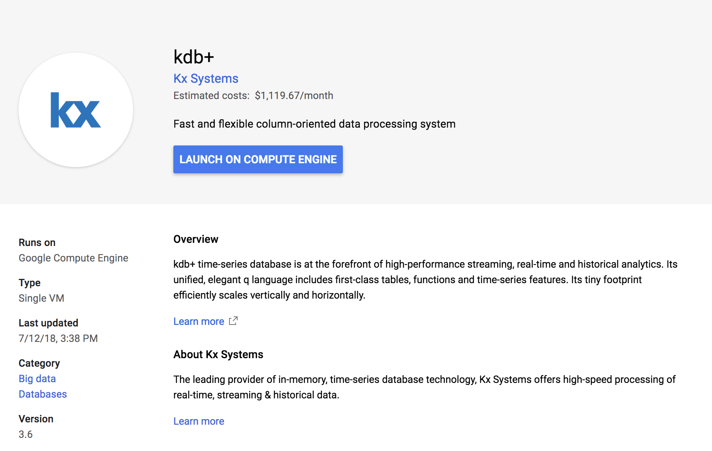
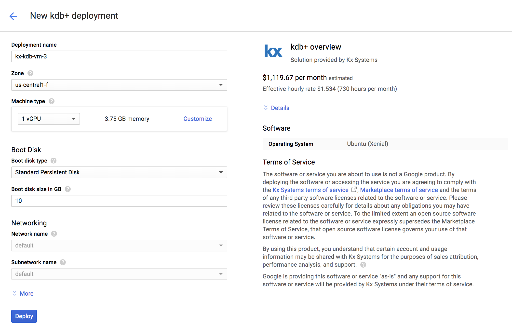

# Kdb+ on Google Cloud Platform Marketplace

Select `kdb+` from the [GCP Marketplace console](https://console.cloud.google.com/marketplace/details/kx-kdb-vm-public/kdb?q=kdb%2B&id=2ea31279-c1cd-4177-872c-e569c81651d6) and click _Launch on Compute Engine_

## Deploy kdb+

1. Choose a name for your kdb+ instance
2. Choose a machine type with at least 6&nbsp;GB of RAM; kdb+ charges you only based on the number of cores
3. Click _Deploy_

    

4. See it run! 

    

## First steps

Once your instance is up and running you can connect via SSH and take your [first steps](../../learn/brief-introduction.md).

