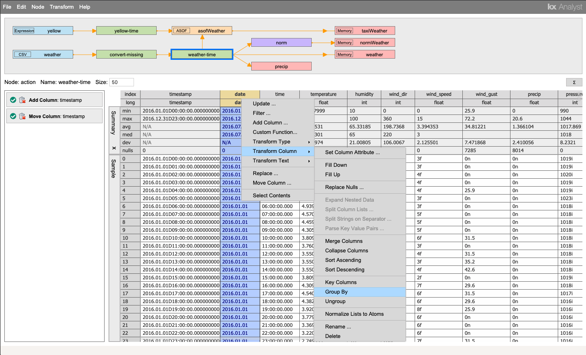
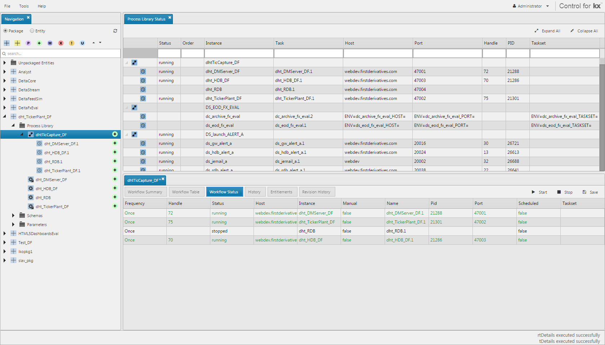
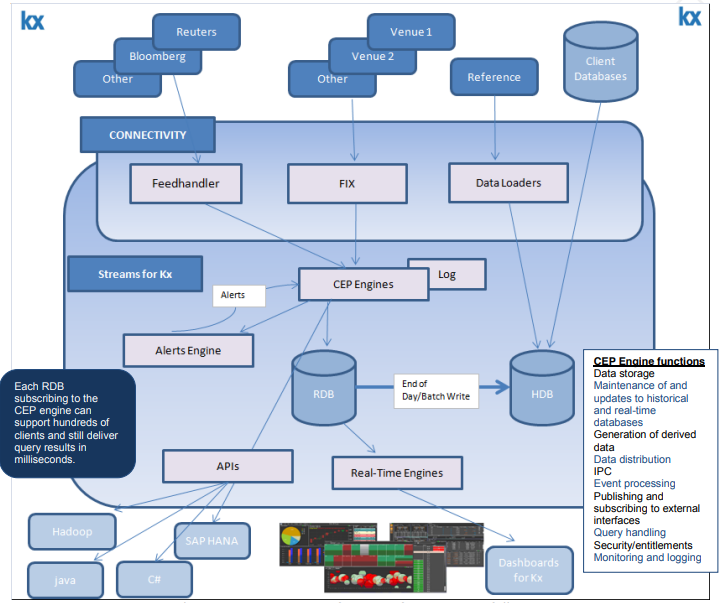
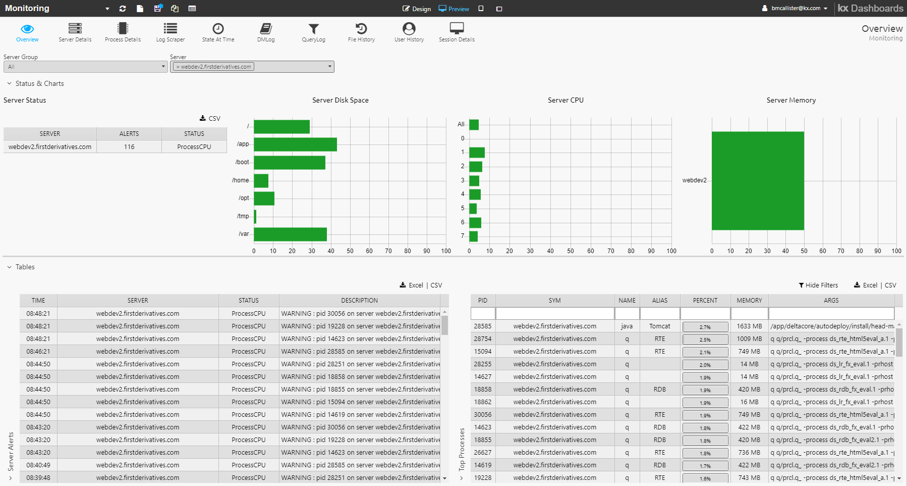

# Developer tools

## KX Developer

[KX Developer](/developer/) is a visual environment used to manage, manipulate and explore massive datasets in real-time by exploiting kdb+’s server-based analytics technology.

## KX Analyst

[KX Analyst](/analyst/)
is a version of KX Developer extended for use by enterprise customers.
It supports a wide range of users, from non-technical analysts to experienced q programmers.

## KX Libraries

[KX Libraries](/developer/libraries/) are a collection of useful q libraries for q development and build pipelines. The KX Libraries package provides libraries for Markdown documentation generation from q source, unit testing and property-based testing frameworks, static code linting, code profiling, code coverage, and an expressive data visualization library.

## KX Dashboards

<iframe src="https://player.vimeo.com/video/135580263" style="border: 1px solid #ccc; box-shadow: 0 2px 2px rgba(0,0,0,.14); height: 450px; width: 100%;"webkitallowfullscreen mozallowfullscreen allowfullscreen></iframe>

[KX Dashboards](/dashboards/)
offers an easy-to-use, yet powerful drag-and-drop interface to allow creators to build dashboards without the need for programming experience. 

## KX Platform 

[KX Platform](/platform/) is a suite of products for building kdb+ user interfaces in HTML5/JS. It has three modules.

### KX Control

[KX Control](/platform/) is a client-server application that allows you to design, build, deploy and manage data-capture/streaming systems.

### KX Stream

[KX Stream](/platform/) 
is a platform for capturing, storing and enriching large volumes of data. It provides a framework to develop and deploy customized analytics that quickly perform complex calculations on large volumes of real-time and historical market data.

  
<small>_Stream for KX deployed in a financial market_</small>

### KX Monitoring

[KX Monitoring](/platform/) 
gathers and displays information about a server’s status. Each server requires a SysMon Java application installed and running to collect the server and process statistics. The dashboards provide powerful tools for visualizing and analyzing the current and historical state of the system.

