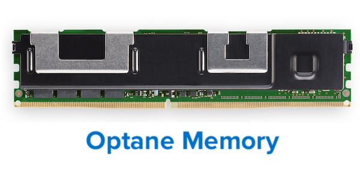
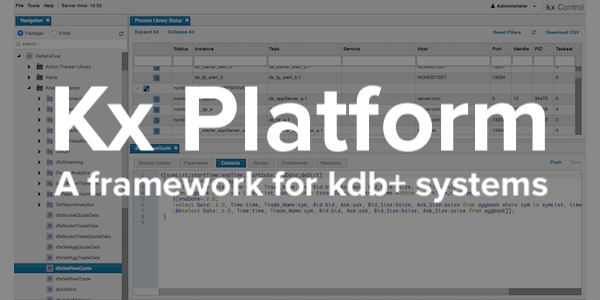
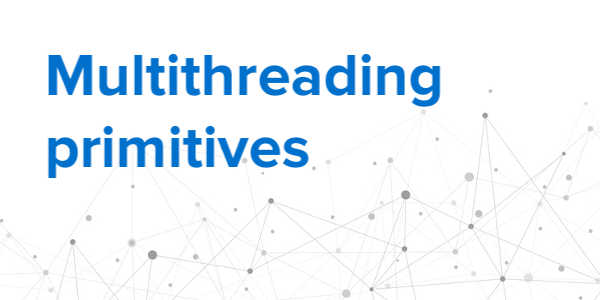
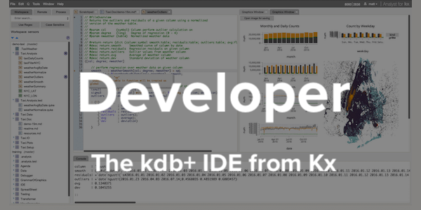
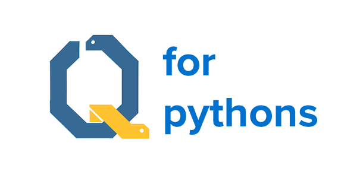

# Developing with kdb+ and the q language

  

    [{.css-img}](releases/ChangesIn4.0.md)[{.css-img}](kb/optane.md)[{.css-img}](/platform/)[{.css-img}](kb/mt-primitives.md)[{.css-img}](kb/dare.md)[{.css-img}](/developer/)
    <!-- [{.css-img}](learn/reading/index.md)[{.css-img}](learn/python/index.md) -->
  

<!--

[Covid-19: A message from Seamus Keating, First Derivatives CEO](coronavirus.md)

Kdb+, from [Kx](https://kx.com), is 

-   a high-performance historical time-series columnar database
-   an in-memory compute engine
-   a real-time streaming processor
-   an expressive query and programming language called q

!!! tip "New"

    
<i class="fas fa-fw fa-code"></i> [**kdb+ version 4.0**](releases/ChangesIn4.0.md)

    
    
<i class="fas fa-fw fa-bolt"></i> [multithreaded operators](kb/mt-primitives.md)

    
    
<i class="fas fa-fw fa-bolt"></i> [Optane Memory](kb/optane.md)

    
    
<i class="fas fa-fw fa-lock"></i> [data-at-rest crypto](kb/dare.md)

    
    
<i class="fas fa-fw fa-code"></i> [code profiler](kb/profiler.md)

    
    
<i class="fas fa-fw fa-code"></i> [Kx Platform 4.5](/platform/)

    
    
<i class="fas fa-fw fa-comment-medical"></i> [Coronavirus](coronavirus.md)

    

[**Kx Developer**](https://code.kx.com/developer/) A visual environment used to manage, manipulate and explore massive datasets in real-time. 
:fontawesome-solid-download:
[Free download](/developer/getting-started/)
-->

&nbsp;

    [<i class="fas fa-fw fa-download fa-border fa-5x"></i> 
    Download 
    :fontawesome-brands-apple:
    :fontawesome-brands-linux:
    :fontawesome-brands-windows:](https://kx.com/connect-with-us/download/  "Download free kdb+ for non-commercial use")

    [<i class="fas fa-fw fa-power-off fa-border fa-5x"></i> 
    Get started](learn/index.md "Learn how to install and start using kdb+")

    [<i class="fas fa-fw fa-book fa-border fa-5x"></i> 
    Reference and basics](ref/index.md "Reference card for the q language")

    [<i class="fas fa-fw fa-book-reader fa-border fa-5x"></i> 
    Phrasebook](/phrases/ "Power expressions in q")

<!-- 

    [<i class="fab fa-fw fa-quora fa-border fa-5x"></i> 
    _Q for Mortals_](/q4m3/ "The classic textboox for kdb+, now in its 3rd edition")

 -->

    [<i class="far fa-fw fa-map fa-border fa-5x"></i> 
    White papers](wp/index.md "Technical white papers on using kdb+")

    [<i class="fas fa-fw fa-graduation-cap fa-border fa-5x"></i> 
    Knowledge Base](kb/index.md)

    [<i class="fab fa-fw fa-superpowers fa-border fa-5x"></i> 
    Fusion interfaces](interfaces/ "Interfaces to other technologies")

    [<i class="fab fa-fw fa-github fa-border fa-5x"></i> 
    Share code](http://kxsystems.github.io/ "Kdb+ repositories on GitHub")

    [<i class="fas fa-fw fa-life-ring fa-border fa-5x"></i> 
    Support](support.md "Support contacts")

:fontawesome-solid-comment-medical:
[Covid-19: A message from Seamus Keating, First Derivatives CEO](coronavirus.md)

The source code for this site is on GitHub at 
:fontawesome-brands-github:
[KxSystems/docs](https://github.com/kxsystems/docs/). 

!!! info "[Careers at Kx and First Derivatives](http://www.firstderivatives.com/careers/)"
    
