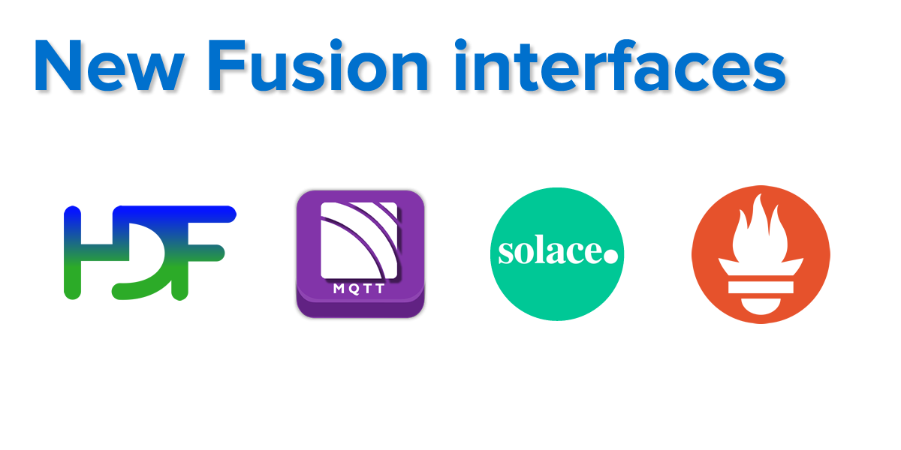

# Developing with kdb+ and the q language

[{.css-img}](releases/ChangesIn4.0.md)[{.css-img}](/dashboards/)[{.css-img}](ml/automl/index.md)[{.css-img}](cloud/aws-lambda/index.md)[{.css-img}](kb/mt-primitives.md)[{.css-img}](kb/dare.md)[{.css-img}](kb/optane.md)[{.css-img}](interfaces/hdf5/index.md)[{.css-img}](learn/reading/index.md)

??? info "New on code.kx.com"

    <ul markdown="1">
    <li>[kdb+ 4.0 – more speed, more security](releases/ChangesIn4.0.md)</li>
    <li>[Kx Dashboards – visualize, stream, and share](/dashboards/)</li>
    <li>[AutoML](ml/automl/index.md)</li>
    <li>[Go serverless – AWS Lambda](cloud/aws-lambda/index.md)</li>
    <li>[Multithreading primitives and implicit parallelism](cloud/aws-lambda/index.md)</li>
    <li>[DARE – data-at-rest encryption](kb/dare.md)</li>
    <li>[Optane memory](kb/optane.md)</li>
    <li>[New Fusion interfaces – HDF5, MQTT, Prometheus, Solace](interfaces/hdf5/index.md)</li>
    <li>[The Reading Room – q code to study](learn/reading/index.md)</li>
    </ul>

&nbsp;

    [<i class="fas fa-fw fa-download fa-border fa-5x"></i> 
    Download 
    :fontawesome-brands-apple:
    :fontawesome-brands-linux:
    :fontawesome-brands-windows:](https://kx.com/connect-with-us/download/  "Download free kdb+ for non-commercial use")

    [<i class="fas fa-fw fa-power-off fa-border fa-5x"></i> 
    Get started](learn/index.md "Learn how to install and start using kdb+")

    [<i class="fas fa-fw fa-book fa-border fa-5x"></i> 
    Reference and basics](ref/index.md "Reference card for the q language")

    [<i class="fas fa-fw fa-book-reader fa-border fa-5x"></i> 
    Phrasebook](/phrases/ "Power expressions in q")

<!-- 

    [<i class="fab fa-fw fa-quora fa-border fa-5x"></i> 
    _Q for Mortals_](/q4m3/ "The classic textboox for kdb+, now in its 3rd edition")

 -->

    [<i class="far fa-fw fa-map fa-border fa-5x"></i> 
    White papers](wp/index.md "Technical white papers on using kdb+")

    [<i class="fas fa-fw fa-graduation-cap fa-border fa-5x"></i> 
    Knowledge Base](kb/index.md)

    [<i class="fab fa-fw fa-superpowers fa-border fa-5x"></i> 
    Fusion interfaces](interfaces/ "Interfaces to other technologies")

    [<i class="fab fa-fw fa-github fa-border fa-5x"></i> 
    Share code](http://kxsystems.github.io/ "Kdb+ repositories on GitHub")

    [<i class="fas fa-fw fa-life-ring fa-border fa-5x"></i> 
    Support](support.md "Support contacts")

:fontawesome-solid-comment-medical:
[Covid-19: A message from Seamus Keating, First Derivatives CEO](coronavirus.md)

The source code for this site is on GitHub at 
:fontawesome-brands-github:
[KxSystems/docs](https://github.com/kxsystems/docs/). 

!!! info "[Careers at Kx and First Derivatives](http://www.firstderivatives.com/careers/)"
    
