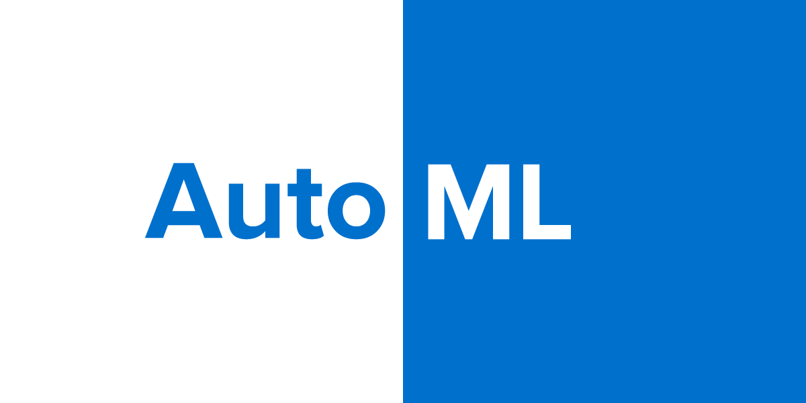

# Developing with kdb+ and the q language

<!-- 

[{.css-img}](releases/ChangesIn4.0.md)[{.css-img}](/dashboards/)[{.css-img}](ml/automl/index.md)[{.css-img}](cloud/aws-lambda/index.md)[{.css-img}](kb/mt-primitives.md)[{.css-img}](kb/dare.md)[{.css-img}](kb/optane.md)[{.css-img}](interfaces/hdf5/index.md)[{.css-img}](learn/reading/index.md)

 -->

Kdb+, from [Kx](https://kx.com), is

-   a high-performance cross-platform historical time-series columnar database 
-   an in-memory compute engine
-   a real-time streaming processor
-   an expressive query and programming language called q

!!! tip "New"

    :fontawesome-solid-book-reader: [Fizz buzz in q](learn/reading/fizzbuzz.md)

    :fontawesome-solid-cloud: [GCPM architecture](cloud/gcpm/architecture.md)

    :fontawesome-solid-book-reader: [kdb+中文教程](https://kdbcn.gitee.io/)

    :fontawesome-brands-youtube: [Autoscaling in the cloud](https://youtu.be/3YFhoL9Rw6k)

&nbsp;

[Get started](learn/install.md)
{: #kx-get-started .md-button}

[:fontawesome-solid-hiking: 
Intro tour](learn/tour/index.md "A one-page rapid tour of the q language")
{: .md-button}

[:fontawesome-solid-book-reader: 
Learn q](learn/index.md)
{: .md-button}

[:fontawesome-solid-dollar-sign: 
Data types](basics/datatypes.md "Datatypes in kdb+")
{: .md-button}

[:fontawesome-solid-book: 
Q reference](ref/index.md "Reference card for the q language")
{: .md-button}

[:fontawesome-solid-database: 
Database](database/index.md "Roughly speaking, kdb+ is what happens when q tables are persisted and then mapped back into memory for operations.")
{: .md-button}

[:fontawesome-solid-laptop-code: 
IDE: Kx Developer](/developer/ "Download and install the free IDE, Kx Developer")
{: .md-button}

??? quote "How we are responding to the pandemic"

    
    {: style="float:right; margin:0 0 0 1em; width:150px;"}

    As we face these challenging times brought on by the coronavirus pandemic, I wanted to share how we are addressing the situation for our employees and customers.
    We understand this is a stressful time, especially for anyone who is affected directly by the coronavirus, or has family members or friends impacted.

    From early on, we set up a global committee of cross-functional leaders meeting daily to review the information coming from governments, the medical community and our employees in the field.
    This committee developed a multi-level plan covering a range of recommendations and has been communicating with our employees multiple times per week to keep everyone up to date.

    The safety and well-being of our team, customers and partners has been our priority and we are taking all pragmatic measures to ensure that continues in an ever-evolving situation.
    These measures include staff working from home as they continue delivering services and support to clients across the globe.
    We are also leveraging virtual and digital communication methods as much as possible to keep the lines open and teamwork internally and externally going forward.

    We recognize that many of our customers are at the front line of maintaining confidence in the global economy and we are supporting them with their business continuity plans to ensure mission-critical work continues to get done.

    I am personally proud of the speed, agility and commitment demonstrated by our team despite the disruptions to our lives and work routines.
    We value the confidence our customers have put in us and are committed to working together to deliver for you throughout this unprecedented situation – and in better times ahead.

    **Seamus Keating**
     
    CEO, First Derivatives plc

:fontawesome-solid-globe:
[Careers at Kx and First Derivatives](http://www.firstderivatives.com/careers/)

---
The source code for this site is on GitHub at
:fontawesome-brands-github:
[KxSystems/docs](https://github.com/kxsystems/docs/).

