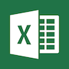

#  Microsoft Excel™ client for kdb+


## Interfacing via HTTP and CSV files

Assume that a kdb+ server process is listening on port 5001. Then an HTTP client can send a request that will return a CSV file. For instance, you can type this URL into a browser

```http
http://localhost:5001/q.csv?select from trade where i < 10
```

to get the first 10 trades. Depending on your browser settings, the result will be opened directly in Excel, saved to a CSV file, etc. The resulting CSV file would look something like this:

```csv
stock,price,amount,time
goog,75.43086,1800,05:21:48.815
amzn,96.28739,1400,03:46:53.366
goog,4.82224,2700,19:21:25.970
amd,34.25556,2400,16:00:29.397
msft,79.84078,1800,10:46:41.918
ibm,85.37164,1700,08:51:43.909
intel,60.03132,1900,08:17:48.629
amd,48.66041,2200,00:59:15.559
ibm,97.46072,1000,00:50:52.943
ibm,7.951954,1200,20:21:11.319
```

Alternatively a command-line HTTP client, such as `wget`, can also be used:

```bash
wget -O output.csv "http://localhost:5001/q.csv?select from trade where i < 10"
```

This saves the result of the query to the file output.csv, which can be loaded into Excel later.

!!! tip "Table result"

    The result must be a table, so that it can be converted to a CSV file. For instance, the following is invalid:

    <pre><code class="language-bash">
    wget -O output.csv "http://localhost:5001/q.csv?first trade"
    </code></pre>

    because the result is a dictionary. We need `1 # trade`. Notice that the `#` symbol cannot be written literally in a URL.

    <pre><code class="language-bash">
    wget -O output.csv "http://localhost:5001/q.csv?1 %23 trade"
    </code></pre>


## Interfacing via CSV files

CSV files can also be generated by a q process, without using HTTP. For instance, the result of the previous query can be saved into a table and then to a file:

```q
q)output: select from trade where i < 10
q)save `:output.csv
```


## Excel automation add-ins

With Automation add-ins for Excel, you can use a C\# function in a cell formula. This function can communicate with a kdb+ server process.  
<i class="far fa-hand-point-right"></i> <http://msdn.microsoft.com/en-us/library/ms173189(VS.80).aspx>


## Real-time interface via Excel RTD

It is possible to have Excel display changing data dynamically using the RTD (real-time data) functionality. Charles Skelton has developed a RTD server for q. 

This server is a .NET application, and it communicates directly with a q Ticker Plant, or a chained ticker plant. The RTD feature allows real-time data coming in from the ticker plant to be displayed in Excel. The schema can be customised according to whatever table names and column names are present in the ticker plant.


### Downloading

The RTD server can be downloaded from 
<i class="fab fa-github"></i> 
[CharlesSkelton/excelrtd](http://github.com/CharlesSkelton/excelrtd)

To install, run the `setup.exe` program and follow the instructions. You will need the Microsoft .NET Runtime installed.


### Configuration

Change directory to the location where you installed the program. At that location you will see the file 
`K4RtdServer.dll.config`, 
which is an XML file that contains config information for the server. Change the `host` and `port` keys in this file to connect to your ticker plant or chained ticker plant. Chained ticker plants are recommended as they provide some level of protection to your primary ticker plant.

The `name` key indicates the logical name of the plant, and is referenced from within the Excel worksheet.

For troubleshooting, a log can be activated – the log directory is specified in the config file under the `logdir` key. The program will create log files in the format `logdir/log\_hhmmssfff.txt`. Several levels of tracing are available:

-   `off`
-   `error`
-   `warning`
-   `info`
-   `verbose`

The RTD Server can also “fill” data on your behalf – should a null value be received from your ticker plant, the RTD server will use the last non-null value received for that cell instead.


### Example RTD file

The distribution contains an example Excel file that works with the default schema for demo trade and quote schema shipped with q.

The format for requesting data from the RTD Server is

```txt
=RTD("K4RtdServer",,"plantname","tablename","column","symbol")
```

The RTD server can also store the recent history of a cell, and this can be made available by using an index into the history as an additional parameter to the RTD call, e.g.

```txt
=RTD("K4RtdServer",,"plantname","tablename","column","symbol",1)
```

will get the previous value of the cell. This can be useful for conditional formatting or perhaps triggering some other calculation. Other cells can be dependent on cells using the RTD function, as can series in charts.


### Adjusting the update rate for Excel

To set the engine to handle a larger volume of updates, in Excel complete the following:

1.  In Excel, go to the Visual Basic Editor, by pressing Alt+F11 or clicking _Tools > Macro > Visual Basic Editor_
2. In the Immediate window (press Ctrl+G or click _View > Immediate Window_), type:

```vbnet
Application.RTD.ThrottleInterval = 1000
? Application.RTD.ThrottleInterval
```

