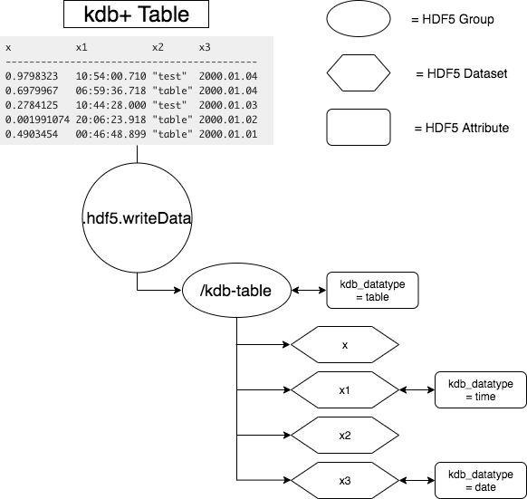
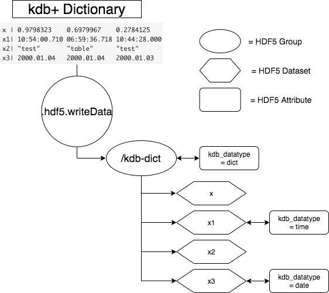

# Type mapping between kdb+ and HDF5 

:fontawesome-brands-github:
[KxSystems/hdf5-kdb](https://github.com/KxSystems/hdf5-kdb)

The following page outlines how kdb+ numeric and string types are represented in HDF5, how HDF5 native types are mapped to kdb+ and how more complex structures such as compound types in HDF5 and tables in kdb+ are mapped to the kdb+ and HDF5 respectively.

## Type mapping

Mapping of kdb+ datatypes to HDF5 types where possible maps directly to an equivalent type. In cases where a direct mapping is not possible an attribute `datatype_kdb` will be associated with the dataset and outline the type of the original kdb+ data. This allows for a consistent `q -> HDF5 -> q` mapping.

The following outlines the mapping which takes place between kdb+ and HDF5 datatypes. Where there is no exact mapping available between the two types every effort has been made to provide the most appropriate conversion possible.

```txt
       kdb+ type            HDF5 type     datatype_kdb
------------------------------------------------------
    boolean (1h)     H5T_NATIVE_UCHAR              "b"
       guid (2h)             H5T_C_S1              "g"
       byte (4h)     H5T_NATIVE_UCHAR                 
      short (5h)     H5T_NATIVE_SHORT                 
        int (6h)       H5T_NATIVE_INT                 
       long (7h)     H5T_NATIVE_LLONG                 
       real (8h)      H5T_NATIVE_REAL                 
      float (9h)    H5T_NATIVE_DOUBLE                 
      char (10h)             H5T_C_S1                 
    symbol (11h)             H5T_C_S1              "s"
 timestamp (12h)     H5T_NATIVE_LLONG              "p"
     month (13h)       H5T_NATIVE_INT              "m"
      date (14h)       H5T_NATIVE_INT              "d"
  datetime (15h)    H5T_NATIVE_DOUBLE              "z"
  timespan (16h)     H5T_NATIVE_LLONG              "n"
    minute (17h)       H5T_NATIVE_INT              "u"
    second (18h)       H5T_NATIVE_INT              "v"
      time (19h)       H5T_NATIVE_INT              "t"
     table (98h)                               "table"
dictionary (99h)                                "dict"
```


### Tables and dictionaries

Tables and dictionaries in kdb+ are mapped differently to HDF5 than singularly typed data. While HDF5 has a compound dataset type which may acts similarly to a table in kdb+ a generic write function from kdb+ to HDF5 would likely be limited in functionality.

Given that writes to compound datasets are inflexible the following structure has been derived to store kdb+ tables and dictionaries

1. Tables and dictionaries are not written to datasets but instead to a group named for the table or dictionary.
2. These groups have an associated attribute `datatype_kdb` which indicates if the data is a dictionary or table.
3. An attribute `kdb_cols` or `kdb_keys` is added to this group indicating the ordering and naming of columns or keys.
4. Each key/column has an associated dataset within this group, if applicable these datasets will have an attribute indicating the kdb+ type to which they are associated.
5. Recursive writes for nested dictionaries or tables within tables etc. are supported by this format.

The following images show how such a structure is formatted on write to HDF5 for both a table and dictionary





### HDF5 to kdb+

The following outlines how HDF5 native datatypes are mapped to kdb+ datatypes.
```txt
  HDF5 type/class          kdb+ type
------------------------------------
  H5T_NATIVE_CHAR          char(10h)
 H5T_NATIVE_SHORT          short(5h)
   H5T_NATIVE_INT            int(6h)
  H5T_NATIVE_LONG   int(6h)/long(7h)
 H5T_NATIVE_LLONG           long(7h)
 H5T_NATIVE_FLOAT           real(8h)
H5T_NATIVE_DOUBLE          float(9h)
 H5T_NATIVE_UCHAR           byte(4h)
H5T_NATIVE_USHORT          short(5h)
  H5T_NATIVE_UINT            int(6h)
 H5T_NATIVE_ULONG   int(6h)/long(7h)
    H5T_NATIVE_B8           byte(4h)
         H5T_C_S1          char(10h)
    H5T_NATIVE_B8           byte(4h)
   H5T_NATIVE_B16          short(5h)
   H5T_NATIVE_B32            int(6h)
   H5T_NATIVE_B64           long(7h)
     H5T_COMPOUND         table(98h)
```

!!! note "Int or long"
	As the above table shows, `H5T_NATIVE_LONG` and `H5T_NATIVE_ULONG` may be returned as either an kdb+ `int` or `long`. This depends on the underlying system architecture.

!!! warning 
	At present reading of `H5T_COMPOUND` datasets to kdb+ should only be completed on uncompressed HDF5 datasets which contain one dimensional `H5T_NATIVE` data types.

