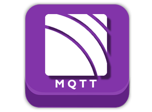

#  Using MQTT with kdb+

<i class="fab fa-github"></i> [KxSystems/mqtt](https://github.com/KxSystems/mqtt)

## Introduction

Message Queueing Telemetry Transport[(MQTT)](http://mqtt.org/) is a machine-to-machine/IOT connectivity protocol. It is designed to be lightweight offering functionality for publish/subscribe messaging transport and is designed for constrained devices and low-bandwidth, high-latency or unreliable networks.

### Use-cases

This messaging protocol is used extensively in use-cases which require as small software footprint such as the following

1. Communication with edge devices/sensors
2. Home automation
3. Mobile applications

Further information on sectors which make use of this technology can be found [here](https://en.wikipedia.org/wiki/MQTT#Real-world_applications)

### kdb+/MQTT Integration

The purpose of this interface is to provide kdb+ users with the ability to communicate with an MQTT broker from a kdb+ session. The interface follows closely the PAHO MQTT C api available [here](https://github.com/eclipse/paho.mqtt.c). Exposed functionality includes

1. Connecting to an MQTT broker
2. Subscribing to topics
3. Publishing to a broker

A full outline of the available functionality is outlined [here](user-guide.md) with example inplementations outlined [here](examples.md).

!!!Note
	In order to run the examples provided with this interface you will need a MQTT broker installed and running locally. A Mosquitto broker can be setup and installed following the instructions provided [here](https://mosquitto.org/download/).

## Status

This interface is currently available as a beta version under an Apache 2.0 licence and is supported on a best effort basis by the Fusion team. This interface is currently in active development, with additional functionality to be released on an ongoing basis.

If you find issues with the interface or have feature requests please consider raising an issue [here](https://github.com/KxSystems/mqtt/issues). If you wish to contribute to this project please follow the contributing guide [here](https://github.com/KxSystems/mqtt/blob/master/CONTRIBUTING.md).

