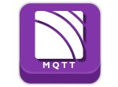

#  Using MQTT with kdb+

:fontawesome-brands-github: 
[KxSystems/mqtt](https://github.com/KxSystems/mqtt)

Message Queueing Telemetry Transport [(MQTT)](http://mqtt.org/) is a machine-to-machine/IOT connectivity protocol. It is designed to be lightweight, offering functionality for publish/subscribe messaging transport. 

The protocol is commonly used for constrained devices with low bandwidth, high latency or on unreliable networks.

## Use cases

This messaging protocol is used extensively where a small software footprint is required, e.g.

-   communication with edge devices/sensors
-   home automation
-   mobile applications

:fontawesome-brands-wikipedia-w:
[MQTT: Real-world applications](https://en.wikipedia.org/wiki/MQTT#Real-world_applications "Wikipedia")

## Kdb+/MQTT integration

This interface lets you communicate with an MQTT broker from a kdb+ session. The interface follows closely the [PAHO MQTT C API](https://github.com/eclipse/paho.mqtt.c). Exposed functionality includes

-   connect to an MQTT broker
-   subscribe to topics
-   publish to a broker

:fontawesome-regular-hand-point-right:
[Function reference](reference.md), [example implementations](examples.md)
 
:fontawesome-brands-github: 
[Install guide](https://github.com/KxSystems/mqtt#installation)

!!! tip "To run the examples you will need a MQTT broker [installed and running locally](https://mosquitto.org/download/)."

## Status

The interface is currently available under an Apache 2.0 license and is supported on a best-efforts basis by the Kx Fusion team. The interface is currently in active development, with additional functionality released on an ongoing basis.

:fontawesome-brands-github: 
[Issues and feature requests](https://github.com/KxSystems/mqtt/issues) 

:fontawesome-brands-github: 
[Guide to contributing](https://github.com/KxSystems/mqtt/blob/master/CONTRIBUTING.md)
