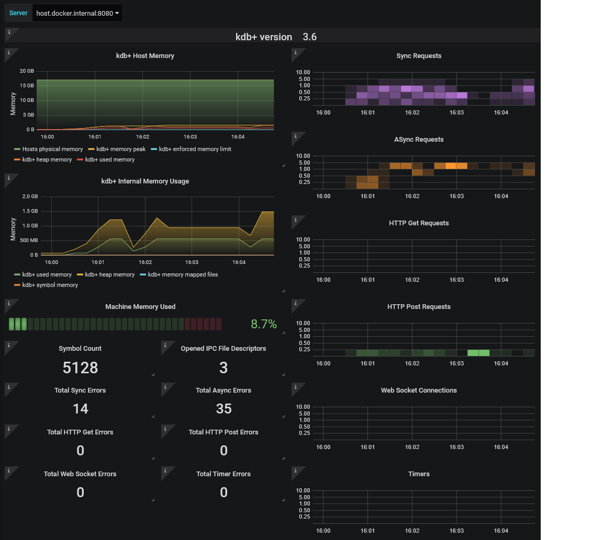

# Example usage of Prometheus Exporter interface


The demonstration described below uses [Docker Compose](https://docs.docker.com/compose/install/) to run an instance of Prometheus and [Grafana](https://grafana.com/) to gather and present them to a pre-configured interactive dashboard respectively.

This is intended as a simple and quick way to run an environment to demonstrate the use of this interface and is not a suggestion of how an environment should be run and maintained. It is not intended as a production-ready example, only for demonstration and development.


## Requirements

This demonstration requires a Docker instance capable of running Unix based containers e.g. Docker Desktop for Mac, Linux, Windows 10 Pro (or above), with Internet access.


## Setup

Ensure you have installed the q scripts to `$QHOME`/`%QHOME%` (as appropriate) following the [instructions](https://github.com/KxSystems/prometheus-kdb-exporter#quick-start).

Run kdb+ with the supplied `exporter.q` on the host upon which Docker is initialized. This will expose metrics over HTTP that will be gathered by Prometheus configured in the supplied demo.

From the `examples` folder the following will expose the metrics on port 8080.

```bash
q ../q/exporter.q -p 8080
```

Next we are required to initialize a Docker environment containing a single Prometheus instance and a Grafana dashboard. This accesses the kdb+ exporter from the local machine at port 8080. If you wish to use it for multiple targets or service discovery, refer to the Prometheus documentation.

Initializing the Docker environment varies between Windows, macOS and Linux.


### Windows and macOS &nbsp; :fontawesome-brands-windows: &nbsp; :fontawesome-brands-apple:

To run Prometheus and Grafana, enter the supplied `DockerCompose` directory and run

```bash
docker-compose up
```

Wait till images, etc., are downloaded and running. The first time will take longer than subsequent times once images have been downloaded; i.e. should take about a second to run if images have been downloaded previously.

When you have finished running the demo, type Ctl-c in the running `docker-compose` and run

```bash
docker-compose-down
```


### Linux &nbsp; :fontawesome-brands-linux: 

As above, but run

```bash
docker-compose -f docker-compose-linux.yml up
```

and then the following when you finish.

```bash
docker-compose -f docker-compose-linux.yml down
```

## Accessing Prometheus and Grafana

After starting the environment, Prometheus and Grafana should be accessible from your web browser in the port mentioned in the `docker-compose.yml`. 
These are defaulted as follows.

-   The Prometheus expression browser should be running on port 9090, e.g. `http://localhost:9090`
-   Grafana should be running on port 3000 e.g. `http://localhost:3000`

!!! note "For the Grafana dashboard use `admin` and `pass` as the username and password respectively"

While in the Prometheus front-end, you can try executing a basic expression such as `up` for the current status of monitored exporters. A `1` value should appear for your configured kdb+ instance/s to indicate Prometheus can reach the provided host, and that it sees kdb+ is running.

On logging into Grafana, a pre-configured dashboard called `kdb+` should be available with example metrics being displayed from your kdb+ instance on port 8080. To find this, select `Home`.

If you have configured Prometheus to watch more than one instance, once you are viewing the kdb+ dashboard you can use the _server_ drop-down to select other configured kdb+ instances. 

Files contained with the `grafana-config` directory contain the defaults used for the data source, and dashboards which may be altered or saved between invocations of the environment.

Example generated dashboard using the exposed metric data:




## Example: resource utilization

To show resources being consumed within the demo environment, we have supplied a q script that can connect to the q session being monitored and consumed resources, along with generating example errors.

The following script defaults to connecting to a remote q session on port 8080 (i.e. the q session being monitored above). To do this, run the following from the same machine at the command line.

```bash
q kdb_user_example.q
```

If the system is configured correctly, you should start to see the metrics changing within the Grafanas kdb+ dashboard after a few seconds.

