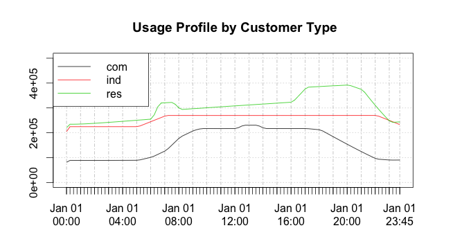

# :fontawesome-brands-r-project: Using R with kdb+


Kdb+ and R are complementary technologies. Kdb+ is the world’s leading timeseries database and incorporates a programming language called q. [R](https://www.r-project.org/) is a programming language and environment for statistical computing and graphics. Both are tools used by data scientists to interrogate and analyze data. Their features sets overlap in that they both:

-   are interactive development environments
-   incorporate vector languages
-   have a built-in set of statistical operations
-   can be extended by the user
-   are well suited for both structured and ad-hoc analysis

They do however have several differences:

-   q can store and analyze petabytes of data directly from disk whereas R is limited to reading data into memory for analysis
-   q has a larger set of datatypes including extensive temporal times (timestamp, timespan, time, second, minute, date, month) which make temporal arithmetic straightforward
-   R contains advanced graphing capabilities whereas q does not
-   built-in routines in q are generally faster than R
-   R has a more comprehensive set of pre-built statistical routines

When used together, q and R provide an excellent platform for easily performing advanced statistical analysis and visualization on large volumes of data.

R can be called as a server from q, and vice-versa.


## Q and R working together

Given the complementary characteristics of the two languages, it is important to utilize their respective strengths.
All the analysis could be done in q; the q language is sufficiently flexible and powerful to replicate any of the pre-built R functions.
Below are some best practice guidelines, although where the line is drawn between q and R will depend on both the system architecture and the strengths of the data scientists using the system.

-   Do as much of the analysis as possible in q. Q analyzes the data directly from the disk and it is always most efficient to do as much work as possible as close to the data as possible. Whenever possible avoid extracting large raw datasets from q. When extractions are required, use q to create smaller aggregated datasets
-   Do not re-implement tried and tested R routines in q unless they either
    -   can be written more efficiently in q and are going to be called often
    -   require more data than is feasible to ship to the R installation
-   Use R for data visualization

There are four ways to interface q with R:

1.  **R can connect to kdb+ and extract data** – loads a shared library into R, connects to kdb+ via TCP/IP
2.  **Embed R inside q and invoke R routines** – loads the R library into q, instantiates R
3.  **Q can connect to a remote instance of R** via TCP/IP and invoke R routines remotely
4.  **Q can load the R maths library** and invoke the R math routines locally

The first and second methods on interfacing between q and R are covered by the Fusion interfaces [rkdb](https://github.com/KxSystems/rkdb) and [embedR](https://github.com/KxSystems/embedr). The remaining methods are not supported or owned by KX but are described [below](#q-in-r): the packages and methods outlined are kdb-Rmath, RServe and RODBC.

A number of considerations will affect which of the above interfaces are used.

Considering the potential size of the data, it is probably more likely that the kdb+ installation containing the data will be hosted remotely from the user. Points to consider when selecting the integration method are:

-   if interactive graphing is required, either interface (1) or (2) must be used
-   interface (2) can only be used if the q and R installations are installed on the same server
-   interfaces (2) and (4) require less data transfer between (possibly remote) processes
-   interfaces (2) and (3) both require variables to be copied from kdb+ to R for processing, meaning that at some point in time two copies of the variable will exist, increasing total memory requirements

## Examples

The following examples make use of the Fusion interfaces between q/kdb+ and R and show their versatility.


## Extract aggregated data into R

This approach extracts aggregated statistics from q to R.
The required statistics in this case are the price returns between consecutive time buckets for each instrument.
The following q function extracts time-bucketed data:

```q
timebucketedstocks:{[startdate; enddate; symbols; timebucket]
  / extract the time-bucketed data
  data:select last price by date,sym,time:timebucket xbar date+time
    from trade
    where date within (startdate;enddate),sym in symbols;
  / calculate returns between prices in consecutive buckets
  / and return the results unkeyed
  () xkey update return:1^price%prev price by sym from data }
```

An example is:

```q
q)timebucketedstocks[2014.01.09;2014.01.13;`GOOG`IBM;0D00:05]
date       sym  time                          price    return
----------------------------------------------------------------
2014.01.09 GOOG 2014.01.09D04:00:00.000000000 1142     1
2014.01.09 GOOG 2014.01.09D04:05:00.000000000 1142.5   1.000438
2014.01.09 GOOG 2014.01.09D04:10:00.000000000 1142     0.9995624
2014.01.09 GOOG 2014.01.09D04:30:00.000000000 1143.99  1.001743
2014.01.09 GOOG 2014.01.09D04:35:00.000000000 1144     1.000009
2014.01.09 GOOG 2014.01.09D04:55:00.000000000 1144     1
..
```

Once the data is in R it needs to be aligned and correlated.
To align the data we will use a pivot function defined in the reshape package.

```r
# Reduce the dataset as much as possible
# only extract the columns we will use
> res <- execute(h,"select time,sym,return from timebucketedstocks[2014.01.09; 2014.01.15; `GOOG`IBM`MSFT; 0D00:05]")
> head(res)
                 time  sym    return
1 2014-01-09 09:30:00 GOOG 1.0000000
2 2014-01-09 09:35:00 GOOG 0.9975051
3 2014-01-09 09:40:00 GOOG 0.9966584
4 2014-01-09 09:45:00 GOOG 1.0005061
5 2014-01-09 09:50:00 GOOG 1.0004707
6 2014-01-09 09:55:00 GOOG 0.9988128
> install.packages('reshape')
> library(reshape)
# Pivot the data using the re-shape package
> p <- cast(res, time~sym)
# Using return as value column.
# Use the value argument to cast to override this choice
> head(p)
                 time      GOOG       IBM      MSFT
1 2014-01-09 09:30:00 1.0000000 1.0000000 1.0000000
2 2014-01-09 09:35:00 0.9975051 1.0006143 1.0002096
3 2014-01-09 09:40:00 0.9966584 1.0001588 1.0001397
4 2014-01-09 09:45:00 1.0005061 0.9998941 0.9986034
5 2014-01-09 09:50:00 1.0004707 0.9965335 1.0019580
6 2014-01-09 09:55:00 0.9988128 0.9978491 1.0022334
# And generate the correlation matrix
> cor(p)
          GOOG       IBM      MSFT
GOOG 1.0000000 0.2625370 0.1577429
IBM  0.2625370 1.0000000 0.2568469
MSFT 0.1577429 0.2568469 1.0000000
```

An interesting consideration is the timing for each of the steps and how that changes when the dataset gets larger.

```r
> system.time(res <- execute(h,"select time,sym,return from timebucketedstocks[2014.01.09; 2014.01.15; `GOOG`IBM`MSFT; 0D00:05]"))
   user  system elapsed
  0.001   0.001   0.145
> system.time(replicate(10,p<-cast(res,time~sym)))
   user  system elapsed
  0.351   0.012   0.357
> system.time(replicate(100,cor(p)))
   user  system elapsed
   0.04    0.00    0.04
```

We can see that

-   the data extract to R takes 145 ms. Much of this time is taken up by q producing the dataset. There is minimal transport cost (as the processes are on the same host);

    ```q
    q)\t select time,sym,return
      from timebucketedstocks[2014.01.09; 2014.01.15; `GOOG`IBM`MSFT; 0D00:05]
    134
    ```

-   the pivot takes approximately 36 ms
-   the correlation time is negligible

We can also analyze how these figures change as the dataset grows.
If we choose a more granular time period for bucketing the data set will be larger.
In our case we will use 10-second buckets rather than 5-minute buckets, meaning the result data set will be 30× larger.

```r
> system.time(res <- execute(h,"select time,sym,return from timebucketedstocks[2014.01.09; 2014.01.15; `GOOG`IBM`MSFT; 0D00:00:10]"))
  user    system  elapsed
  0.015   0.008   0.234
```

Using return as value column. Use the value argument to cast to override this choice

```r
> system.time(p<-cast(res,time~sym))
  user    system elapsed
  0.950   0.048   0.998
```

We can see that the time to extract the data increases by \~90 ms.
The q query time increases by 4 ms, so the majority of the increase is due to shipping the larger dataset from q to R.

```q
q)\t select time,sym,return
  from timebucketedstocks[2014.01.09; 2014.01.15; `GOOG`IBM`MSFT; 0D00:00:10]
138
```

The pivot time on the larger data set grows from 40 ms to \~1000 ms giving a total time to do the analysis of approximately 2300 ms.
As the dataset grows, the time to pivot the data in R starts to dominate the overall time.


## Align data in q

Given the pivot performance in R, an alternative is to pivot the data on the q side.
This has the added benefit of reducing the volume of data transported
due to the fact that we can drop the `time` and `sym` identification columns as the data is already aligned.
The q function below pivots the data.

```q
timebucketedpivot:{[startdate; enddate; symbols; timebucket]
  / Extract the time bucketed data
  data:timebucketedstocks[startdate;enddate;symbols;timebucket];
  / Get the distinct list of column names (the instruments)
  colheaders:value asc exec distinct sym from data;
  / Pivot the table, filling with 1 because if no value,
  / the price has stayed the same and return the results unkeyed
  () xkey 1^exec colheaders#(sym!return) by time:time from data }
```

:fontawesome-regular-hand-point-right:
[Pivoting tables](../kb/pivoting-tables.md)

An example is:

```q
q)timebucketedpivot[2014.01.09;2014.01.13;`GOOG`IBM;0D00:05]
time                          GOOG      IBM
-------------------------------------------------
2014.01.09D09:30:00.000000000 1         1
2014.01.09D09:35:00.000000000 0.9975051 1.000614
2014.01.09D09:40:00.000000000 0.9966584 1.000159
2014.01.09D09:45:00.000000000 1.000506  0.9998941
2014.01.09D09:50:00.000000000 1.000471  0.9965335
2014.01.09D09:55:00.000000000 0.9988128 0.9978491
2014.01.09D10:00:00.000000000 1.000775  0.9992017
..
```

Using the larger dataset example, we can then do

```r
> system.time(res <- execute(h,"delete time from timebucketedpivot [2014.01.09; 2014.01.15; `GOOG`IBM`MSFT; 0D00:00:10]"))
   user  system elapsed
  0.003   0.004   0.225
> cor(res)
          GOOG        IBM       MSFT
GOOG 1.0000000 0.15336531 0.03471400
IBM  0.1533653 1.00000000 0.02585773
MSFT 0.0347140 0.02585773 1.00000000
```

thus reducing the total query time from 2300 ms to 860 ms and also reducing the network usage.


## Correlations in q

A final approach is to calculate the correlations in q, meaning that R is not used for any statistical analysis.
The below function invokes the previously defined functions and creates the correlation matrix.
Utilizing the function `timebucketedpivot` defined above, and

```q
correlationmatrix:{[startdate; enddate; symbols; timebucket]
  / Extract the pivoted data
  data:timebucketedpivot[startdate;enddate;symbols;timebucket];
  / Make sure the symbol list is distinct
  / and contains only values present in the data
  symbols:asc distinct symbols inter exec distinct sym from data;
  / Calculate the list of pairs to correlate
  pairs:raze {first[x],/:1 _ x}each {1 _ x}\[symbols];
  / Return the pair correlation
  / Calculate two rows for each pair, with the same value in each correlate
  pair:{[data;pair]
    ([]s1:pair;s2:reverse pair; correlation:cor[data pair 0; data pair 1])};
  paircor:raze correlatepair[flip delete time from data] each pairs;
  / Pivot the data to give a matrix
  pivot:exec symbols#s1!correlation by sym:s2 from paircor;
  / fill with 1 for the diagonal
  unkey () xkey 1f^pivot }
```

which can be run like this:

```q
q)correlationmatrix[2014.01.09; 2014.01.15; `GOOG`IBM`MSFT; 0D00:00:10]
sym  GOOG      IBM        MSFT
      ------------------------------------
GOOG 1         0.1533653  0.034714
IBM  0.1533653 1          0.02585773
MSFT 0.034714  0.02585773 1
q)\t correlationmatrix[2014.01.09; 2014.01.15; `GOOG`IBM`MSFT; 0D00:00:10]
181
```

This solution executes quickest and with the least network usage, as the resultant correlation matrix returned to the user is small.


## Example: working with smart-meter data

To demonstrate the power of q, an example using randomly-generated smart-meter data has been developed.
This can be downloaded from
:fontawesome-brands-github:
[KxSystems/cookbook/tutorial](https://github.com/KxSystems/cookbook/tree/master/tutorial).
By following the instructions in the README, an example database can be built.
The default database contains information on 100,000 smart-meter customers from different sectors and regions over 61 days.
The default database contains 9.6M records per day, 586M rows in total.
A set of example queries are provided, and a tutorial to step through the queries and test the performance of q.
Users are encouraged to experiment with:

-   using secondary processes to boost performance
-   running queries with different parameters
-   modifying or writing their own queries
-   compression to reduce the size of on-disk data
-   changing the amount of data generated – more days, more customers, different customer distributions etc.

The data can be extracted from R for further analysis or visualisation.
As an example, the code below will generate an average daily usage profile
for each customer type (`res` = residential, `com` = commercial, `ind` = industrial) over a 10-day period.

```r
# load the xtsExtra package
# this will overwrite some of the implementations
# loaded from the xts package (if already loaded)
> install.packages("xtsExtra", repos="http://r-forge.r-project.org") # for R 3.1 you may need an additional parameter type="source"
> library(xtsExtra)
# load the connection library
> library(rkdb)
> h <- open_connection("127.0.0.1",9998,NULL)
# pull back the profile data
# customertypeprofiles takes 3 parameters
# [start date; end date; time bucket size]
> d<-execute(h,"customertypeprofiles[2013.08.01;2013.08.10;15]")
> dxts<-xts(d[,-1],order.by=d[,'time'])
# plot it
> plot.xts(dxts, screens=1, ylim=c(0,500000), auto.legend=TRUE, main=" Usage Profile by Customer Type")
```

which produces the plot in Figure 5:

<br>
_Figure 5: Customer usage profiles generated in q and drawn in R_


## Timezones

Note that R’s timezone setting affects date transfers between R and q. In R:

```r
> Sys.timezone()               # reads current timezone
> Sys.setenv(TZ = "GMT")       # sets GMT ("UTC" is the same)
```

For example, in the R server:

```q
q)Rcmd "Sys.setenv(TZ='GMT')"
q)Rget "date()"
"Fri Feb  3 06:33:43 2012"
q)Rcmd "Sys.setenv(TZ='EST')"
q)Rget "date()"
"Fri Feb  3 01:33:57 2012"
```

:fontawesome-regular-hand-point-right:
Knowledge Base: [Timezones and Daylight Saving Time](../kb/timezones.md)

## Other methods

Outside the Fusion interfaces to R, a number of interfaces provide extremely useful functionality to a q instance from R and vice-versa.

### Q in R

#### RODBC with kdb+

Although it is not the recommended method, if R is running on Windows, the q ODBC3 driver can be used to connect to kdb+ from R.

:fontawesome-regular-hand-point-right:
[Kdb+ server for ODBC3](q-server-for-odbc3.md)

The RODBC package should be installed in R. An example is given below.

```r
# install RODBC
> install.packages("RODBC")
# load it
> library(RODBC)
# create a connection to a predefined DSN
> ch <- odbcConnect("localhost:5000") # run a query
# s.k should be installed on the q server to enable standard SQL
# However, all statements can be prefixed with q) to run standard q.
> res <- sqlQuery(ch, paste('q)select count i by date from trade'))
```


### R in q

#### Embedded R maths library

R contains a maths library which can be compiled standalone.
The functions can then be exposed to q by wrapping them in C code which handles the mapping between R datatypes and q datatypes (K objects).
See :fontawesome-brands-github: [rwinston/kdb-rmathlib](https://github.com/rwinston/kdb-rmathlib)
for an example of integrating q with the R API (i.e. making use of some statistical functions from q).

```q
q)\l rmath.q
q)x:rnorm 1000     / create 1000 normal variates
q)summary x        / simple statistical summary of x
q)hist[x;10]       / show histogram (bin count) with 10 bins
q)y:scale x        / x = (x - mean(x))/sd(x)
q)quantile[x;.5]   / calculate the 50% quantile
q)pnorm[0;1.5;1.5] / cdf value for 0 for a N(1.5,1.5) distribution
q)dnorm[0;1.5;1.5] / normal density at 0 for N(1.5;1.5) distribution
```

:fontawesome-regular-hand-point-right:
Andrey’s [althenia.net/qml](http://althenia.net/qml)
for an embedded math lib


#### Remote R: Rserve

Rserve allows applications to connect remotely to an R instance over TCP/IP.
The methods are the same as those outlined above,
the difference being that all data is passed over TCP/IP rather than existing in the same memory space.

Every connection to Rserve has a separate workspace and working directory,
which means user-defined variables and functions with name clashes will not overwrite each other.
This differs from the previous method where, if two users are using the same q process,
they can overwrite each other’s variables in both the q and R workspaces.

