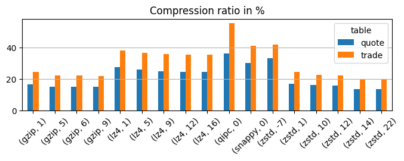

# Compression ratio

Compression ratio is one of the [three key metrics](../file-compression.md#performance) to evaluate a compression algorithm. It measures the relative reduction in size of data. This ratio is calculated by dividing the uncompressed size by the compressed size. For example, a value of 4 indicates that the data consumes a quarter of the disk space after compression. Higher numbers are better.

In this document, we display the relative sizes after compression, which is the inverse of compression ratios. The numbers are in percentages, so 25 corresponds to compression ratio 4. We used a popular financial dataset from the New York Stock Exchange (NYSE). The block size parameter was set to 17, which translates to logical block size of 128 KB.

The table-level results are presented below.

`zstd` performs nearly twice as well as `lz4` and `snappy` but is only marginally better than `gzip`.

The following tables provide a column-level breakdown. The columns are ordered by [entropy](https://en.wikipedia.org/wiki/Entropy_(information_theory)) in decreasing order. Low-entropy columns are typically well compressable so the top of the table likely contributes the most to the final disk space usage.

Table `quote`:

<table id="T_3dd48">
  <thead>
    <tr>
      <th class="index_name level0" >compalg</th>
      <th id="T_3dd48_level0_col0" class="col_heading level0 col0" colspan="4">gzip</th>
      <th id="T_3dd48_level0_col4" class="col_heading level0 col4" colspan="5">lz4</th>
      <th id="T_3dd48_level0_col9" class="col_heading level0 col9" >qipc</th>
      <th id="T_3dd48_level0_col10" class="col_heading level0 col10" >snappy</th>
      <th id="T_3dd48_level0_col11" class="col_heading level0 col11" colspan="6">zstd</th>
    </tr>
    <tr>
      <th class="index_name level1" >level</th>
      <th id="T_3dd48_level1_col0" class="col_heading level1 col0" >1</th>
      <th id="T_3dd48_level1_col1" class="col_heading level1 col1" >5</th>
      <th id="T_3dd48_level1_col2" class="col_heading level1 col2" >6</th>
      <th id="T_3dd48_level1_col3" class="col_heading level1 col3" >9</th>
      <th id="T_3dd48_level1_col4" class="col_heading level1 col4" >1</th>
      <th id="T_3dd48_level1_col5" class="col_heading level1 col5" >5</th>
      <th id="T_3dd48_level1_col6" class="col_heading level1 col6" >9</th>
      <th id="T_3dd48_level1_col7" class="col_heading level1 col7" >12</th>
      <th id="T_3dd48_level1_col8" class="col_heading level1 col8" >16</th>
      <th id="T_3dd48_level1_col9" class="col_heading level1 col9" >0</th>
      <th id="T_3dd48_level1_col10" class="col_heading level1 col10" >0</th>
      <th id="T_3dd48_level1_col11" class="col_heading level1 col11" >-7</th>
      <th id="T_3dd48_level1_col12" class="col_heading level1 col12" >1</th>
      <th id="T_3dd48_level1_col13" class="col_heading level1 col13" >10</th>
      <th id="T_3dd48_level1_col14" class="col_heading level1 col14" >12</th>
      <th id="T_3dd48_level1_col15" class="col_heading level1 col15" >14</th>
      <th id="T_3dd48_level1_col16" class="col_heading level1 col16" >22</th>
    </tr>
    <tr>
      <th class="index_name level1" >column</th>
      <th class="blank col0" >&nbsp;</th>
      <th class="blank col1" >&nbsp;</th>
      <th class="blank col2" >&nbsp;</th>
      <th class="blank col3" >&nbsp;</th>
      <th class="blank col4" >&nbsp;</th>
      <th class="blank col5" >&nbsp;</th>
      <th class="blank col6" >&nbsp;</th>
      <th class="blank col7" >&nbsp;</th>
      <th class="blank col8" >&nbsp;</th>
      <th class="blank col9" >&nbsp;</th>
      <th class="blank col10" >&nbsp;</th>
      <th class="blank col11" >&nbsp;</th>
      <th class="blank col12" >&nbsp;</th>
      <th class="blank col13" >&nbsp;</th>
      <th class="blank col14" >&nbsp;</th>
      <th class="blank col15" >&nbsp;</th>
      <th class="blank col16" >&nbsp;</th>
    </tr>
  </thead>
  <tbody>
    <tr>
      <th id="T_3dd48_level1_row0" class="row_heading level1 row0" >Participant_Timestamp</th>
      <td id="T_3dd48_row0_col0" class="data row0 col0" >46.8</td>
      <td id="T_3dd48_row0_col1" class="data row0 col1" >44.9</td>
      <td id="T_3dd48_row0_col2" class="data row0 col2" >45.0</td>
      <td id="T_3dd48_row0_col3" class="data row0 col3" >45.2</td>
      <td id="T_3dd48_row0_col4" class="data row0 col4" >70.2</td>
      <td id="T_3dd48_row0_col5" class="data row0 col5" >69.5</td>
      <td id="T_3dd48_row0_col6" class="data row0 col6" >69.0</td>
      <td id="T_3dd48_row0_col7" class="data row0 col7" >68.9</td>
      <td id="T_3dd48_row0_col8" class="data row0 col8" >68.9</td>
      <td id="T_3dd48_row0_col9" class="data row0 col9" >100.0</td>
      <td id="T_3dd48_row0_col10" class="data row0 col10" >71.5</td>
      <td id="T_3dd48_row0_col11" class="data row0 col11" >96.5</td>
      <td id="T_3dd48_row0_col12" class="data row0 col12" >41.3</td>
      <td id="T_3dd48_row0_col13" class="data row0 col13" >40.9</td>
      <td id="T_3dd48_row0_col14" class="data row0 col14" >40.9</td>
      <td id="T_3dd48_row0_col15" class="data row0 col15" >41.0</td>
      <td id="T_3dd48_row0_col16" class="data row0 col16" >41.0</td>
    </tr>
    <tr>
      <th id="T_3dd48_level1_row1" class="row_heading level1 row1" >Time</th>
      <td id="T_3dd48_row1_col0" class="data row1 col0" >38.5</td>
      <td id="T_3dd48_row1_col1" class="data row1 col1" >36.3</td>
      <td id="T_3dd48_row1_col2" class="data row1 col2" >36.3</td>
      <td id="T_3dd48_row1_col3" class="data row1 col3" >36.4</td>
      <td id="T_3dd48_row1_col4" class="data row1 col4" >61.3</td>
      <td id="T_3dd48_row1_col5" class="data row1 col5" >61.1</td>
      <td id="T_3dd48_row1_col6" class="data row1 col6" >60.5</td>
      <td id="T_3dd48_row1_col7" class="data row1 col7" >60.4</td>
      <td id="T_3dd48_row1_col8" class="data row1 col8" >60.4</td>
      <td id="T_3dd48_row1_col9" class="data row1 col9" >82.5</td>
      <td id="T_3dd48_row1_col10" class="data row1 col10" >62.4</td>
      <td id="T_3dd48_row1_col11" class="data row1 col11" >81.6</td>
      <td id="T_3dd48_row1_col12" class="data row1 col12" >31.3</td>
      <td id="T_3dd48_row1_col13" class="data row1 col13" >31.3</td>
      <td id="T_3dd48_row1_col14" class="data row1 col14" >31.3</td>
      <td id="T_3dd48_row1_col15" class="data row1 col15" >33.8</td>
      <td id="T_3dd48_row1_col16" class="data row1 col16" >33.8</td>
    </tr>
    <tr>
      <th id="T_3dd48_level1_row2" class="row_heading level1 row2" >Sequence_Number</th>
      <td id="T_3dd48_row2_col0" class="data row2 col0" >41.3</td>
      <td id="T_3dd48_row2_col1" class="data row2 col1" >41.1</td>
      <td id="T_3dd48_row2_col2" class="data row2 col2" >41.2</td>
      <td id="T_3dd48_row2_col3" class="data row2 col3" >41.2</td>
      <td id="T_3dd48_row2_col4" class="data row2 col4" >100.0</td>
      <td id="T_3dd48_row2_col5" class="data row2 col5" >100.0</td>
      <td id="T_3dd48_row2_col6" class="data row2 col6" >100.0</td>
      <td id="T_3dd48_row2_col7" class="data row2 col7" >100.0</td>
      <td id="T_3dd48_row2_col8" class="data row2 col8" >100.0</td>
      <td id="T_3dd48_row2_col9" class="data row2 col9" >100.0</td>
      <td id="T_3dd48_row2_col10" class="data row2 col10" >100.0</td>
      <td id="T_3dd48_row2_col11" class="data row2 col11" >100.0</td>
      <td id="T_3dd48_row2_col12" class="data row2 col12" >81.4</td>
      <td id="T_3dd48_row2_col13" class="data row2 col13" >81.4</td>
      <td id="T_3dd48_row2_col14" class="data row2 col14" >81.4</td>
      <td id="T_3dd48_row2_col15" class="data row2 col15" >35.1</td>
      <td id="T_3dd48_row2_col16" class="data row2 col16" >36.8</td>
    </tr>
    <tr>
      <th id="T_3dd48_level1_row3" class="row_heading level1 row3" >Offer_Price</th>
      <td id="T_3dd48_row3_col0" class="data row3 col0" >8.6</td>
      <td id="T_3dd48_row3_col1" class="data row3 col1" >6.9</td>
      <td id="T_3dd48_row3_col2" class="data row3 col2" >6.6</td>
      <td id="T_3dd48_row3_col3" class="data row3 col3" >6.5</td>
      <td id="T_3dd48_row3_col4" class="data row3 col4" >13.5</td>
      <td id="T_3dd48_row3_col5" class="data row3 col5" >11.1</td>
      <td id="T_3dd48_row3_col6" class="data row3 col6" >10.1</td>
      <td id="T_3dd48_row3_col7" class="data row3 col7" >9.6</td>
      <td id="T_3dd48_row3_col8" class="data row3 col8" >9.6</td>
      <td id="T_3dd48_row3_col9" class="data row3 col9" >17.5</td>
      <td id="T_3dd48_row3_col10" class="data row3 col10" >15.9</td>
      <td id="T_3dd48_row3_col11" class="data row3 col11" >16.3</td>
      <td id="T_3dd48_row3_col12" class="data row3 col12" >7.7</td>
      <td id="T_3dd48_row3_col13" class="data row3 col13" >6.4</td>
      <td id="T_3dd48_row3_col14" class="data row3 col14" >6.4</td>
      <td id="T_3dd48_row3_col15" class="data row3 col15" >6.1</td>
      <td id="T_3dd48_row3_col16" class="data row3 col16" >5.6</td>
    </tr>
    <tr>
      <th id="T_3dd48_level1_row4" class="row_heading level1 row4" >Bid_Price</th>
      <td id="T_3dd48_row4_col0" class="data row4 col0" >8.6</td>
      <td id="T_3dd48_row4_col1" class="data row4 col1" >6.9</td>
      <td id="T_3dd48_row4_col2" class="data row4 col2" >6.6</td>
      <td id="T_3dd48_row4_col3" class="data row4 col3" >6.5</td>
      <td id="T_3dd48_row4_col4" class="data row4 col4" >13.5</td>
      <td id="T_3dd48_row4_col5" class="data row4 col5" >11.1</td>
      <td id="T_3dd48_row4_col6" class="data row4 col6" >10.1</td>
      <td id="T_3dd48_row4_col7" class="data row4 col7" >9.6</td>
      <td id="T_3dd48_row4_col8" class="data row4 col8" >9.6</td>
      <td id="T_3dd48_row4_col9" class="data row4 col9" >17.5</td>
      <td id="T_3dd48_row4_col10" class="data row4 col10" >15.8</td>
      <td id="T_3dd48_row4_col11" class="data row4 col11" >16.3</td>
      <td id="T_3dd48_row4_col12" class="data row4 col12" >7.6</td>
      <td id="T_3dd48_row4_col13" class="data row4 col13" >6.4</td>
      <td id="T_3dd48_row4_col14" class="data row4 col14" >6.4</td>
      <td id="T_3dd48_row4_col15" class="data row4 col15" >6.1</td>
      <td id="T_3dd48_row4_col16" class="data row4 col16" >5.6</td>
    </tr>
    <tr>
      <th id="T_3dd48_level1_row5" class="row_heading level1 row5" >Symbol</th>
      <td id="T_3dd48_row5_col0" class="data row5 col0" >0.6</td>
      <td id="T_3dd48_row5_col1" class="data row5 col1" >0.2</td>
      <td id="T_3dd48_row5_col2" class="data row5 col2" >0.2</td>
      <td id="T_3dd48_row5_col3" class="data row5 col3" >0.2</td>
      <td id="T_3dd48_row5_col4" class="data row5 col4" >0.4</td>
      <td id="T_3dd48_row5_col5" class="data row5 col5" >0.4</td>
      <td id="T_3dd48_row5_col6" class="data row5 col6" >0.4</td>
      <td id="T_3dd48_row5_col7" class="data row5 col7" >0.4</td>
      <td id="T_3dd48_row5_col8" class="data row5 col8" >0.4</td>
      <td id="T_3dd48_row5_col9" class="data row5 col9" >1.7</td>
      <td id="T_3dd48_row5_col10" class="data row5 col10" >4.7</td>
      <td id="T_3dd48_row5_col11" class="data row5 col11" >0.0</td>
      <td id="T_3dd48_row5_col12" class="data row5 col12" >0.1</td>
      <td id="T_3dd48_row5_col13" class="data row5 col13" >0.0</td>
      <td id="T_3dd48_row5_col14" class="data row5 col14" >0.0</td>
      <td id="T_3dd48_row5_col15" class="data row5 col15" >0.0</td>
      <td id="T_3dd48_row5_col16" class="data row5 col16" >0.0</td>
    </tr>
    <tr>
      <th id="T_3dd48_level1_row6" class="row_heading level1 row6" >Offer_Size</th>
      <td id="T_3dd48_row6_col0" class="data row6 col0" >17.1</td>
      <td id="T_3dd48_row6_col1" class="data row6 col1" >14.9</td>
      <td id="T_3dd48_row6_col2" class="data row6 col2" >14.3</td>
      <td id="T_3dd48_row6_col3" class="data row6 col3" >13.5</td>
      <td id="T_3dd48_row6_col4" class="data row6 col4" >29.8</td>
      <td id="T_3dd48_row6_col5" class="data row6 col5" >23.3</td>
      <td id="T_3dd48_row6_col6" class="data row6 col6" >19.2</td>
      <td id="T_3dd48_row6_col7" class="data row6 col7" >17.1</td>
      <td id="T_3dd48_row6_col8" class="data row6 col8" >17.1</td>
      <td id="T_3dd48_row6_col9" class="data row6 col9" >35.3</td>
      <td id="T_3dd48_row6_col10" class="data row6 col10" >34.3</td>
      <td id="T_3dd48_row6_col11" class="data row6 col11" >28.0</td>
      <td id="T_3dd48_row6_col12" class="data row6 col12" >16.3</td>
      <td id="T_3dd48_row6_col13" class="data row6 col13" >13.6</td>
      <td id="T_3dd48_row6_col14" class="data row6 col14" >13.0</td>
      <td id="T_3dd48_row6_col15" class="data row6 col15" >12.7</td>
      <td id="T_3dd48_row6_col16" class="data row6 col16" >11.8</td>
    </tr>
    <tr>
      <th id="T_3dd48_level1_row7" class="row_heading level1 row7" >Bid_Size</th>
      <td id="T_3dd48_row7_col0" class="data row7 col0" >16.9</td>
      <td id="T_3dd48_row7_col1" class="data row7 col1" >14.7</td>
      <td id="T_3dd48_row7_col2" class="data row7 col2" >14.0</td>
      <td id="T_3dd48_row7_col3" class="data row7 col3" >13.2</td>
      <td id="T_3dd48_row7_col4" class="data row7 col4" >29.4</td>
      <td id="T_3dd48_row7_col5" class="data row7 col5" >23.0</td>
      <td id="T_3dd48_row7_col6" class="data row7 col6" >18.9</td>
      <td id="T_3dd48_row7_col7" class="data row7 col7" >16.8</td>
      <td id="T_3dd48_row7_col8" class="data row7 col8" >16.8</td>
      <td id="T_3dd48_row7_col9" class="data row7 col9" >34.8</td>
      <td id="T_3dd48_row7_col10" class="data row7 col10" >33.9</td>
      <td id="T_3dd48_row7_col11" class="data row7 col11" >27.7</td>
      <td id="T_3dd48_row7_col12" class="data row7 col12" >16.0</td>
      <td id="T_3dd48_row7_col13" class="data row7 col13" >13.4</td>
      <td id="T_3dd48_row7_col14" class="data row7 col14" >12.8</td>
      <td id="T_3dd48_row7_col15" class="data row7 col15" >12.5</td>
      <td id="T_3dd48_row7_col16" class="data row7 col16" >11.6</td>
    </tr>
    <tr>
      <th id="T_3dd48_level1_row8" class="row_heading level1 row8" >Exchange</th>
      <td id="T_3dd48_row8_col0" class="data row8 col0" >47.3</td>
      <td id="T_3dd48_row8_col1" class="data row8 col1" >44.6</td>
      <td id="T_3dd48_row8_col2" class="data row8 col2" >44.2</td>
      <td id="T_3dd48_row8_col3" class="data row8 col3" >44.0</td>
      <td id="T_3dd48_row8_col4" class="data row8 col4" >65.7</td>
      <td id="T_3dd48_row8_col5" class="data row8 col5" >60.0</td>
      <td id="T_3dd48_row8_col6" class="data row8 col6" >58.7</td>
      <td id="T_3dd48_row8_col7" class="data row8 col7" >57.8</td>
      <td id="T_3dd48_row8_col8" class="data row8 col8" >57.8</td>
      <td id="T_3dd48_row8_col9" class="data row8 col9" >99.9</td>
      <td id="T_3dd48_row8_col10" class="data row8 col10" >71.4</td>
      <td id="T_3dd48_row8_col11" class="data row8 col11" >83.1</td>
      <td id="T_3dd48_row8_col12" class="data row8 col12" >41.8</td>
      <td id="T_3dd48_row8_col13" class="data row8 col13" >43.9</td>
      <td id="T_3dd48_row8_col14" class="data row8 col14" >43.6</td>
      <td id="T_3dd48_row8_col15" class="data row8 col15" >40.5</td>
      <td id="T_3dd48_row8_col16" class="data row8 col16" >40.3</td>
    </tr>
    <tr>
      <th id="T_3dd48_level1_row9" class="row_heading level1 row9" >National_BBO_Ind</th>
      <td id="T_3dd48_row9_col0" class="data row9 col0" >20.1</td>
      <td id="T_3dd48_row9_col1" class="data row9 col1" >15.5</td>
      <td id="T_3dd48_row9_col2" class="data row9 col2" >14.8</td>
      <td id="T_3dd48_row9_col3" class="data row9 col3" >13.5</td>
      <td id="T_3dd48_row9_col4" class="data row9 col4" >33.2</td>
      <td id="T_3dd48_row9_col5" class="data row9 col5" >25.5</td>
      <td id="T_3dd48_row9_col6" class="data row9 col6" >20.4</td>
      <td id="T_3dd48_row9_col7" class="data row9 col7" >17.0</td>
      <td id="T_3dd48_row9_col8" class="data row9 col8" >17.0</td>
      <td id="T_3dd48_row9_col9" class="data row9 col9" >80.7</td>
      <td id="T_3dd48_row9_col10" class="data row9 col10" >30.4</td>
      <td id="T_3dd48_row9_col11" class="data row9 col11" >31.8</td>
      <td id="T_3dd48_row9_col12" class="data row9 col12" >18.1</td>
      <td id="T_3dd48_row9_col13" class="data row9 col13" >14.8</td>
      <td id="T_3dd48_row9_col14" class="data row9 col14" >13.7</td>
      <td id="T_3dd48_row9_col15" class="data row9 col15" >13.1</td>
      <td id="T_3dd48_row9_col16" class="data row9 col16" >12.7</td>
    </tr>
    <tr>
      <th id="T_3dd48_level1_row10" class="row_heading level1 row10" >Short_Sale_Restriction_Indicator</th>
      <td id="T_3dd48_row10_col0" class="data row10 col0" >0.5</td>
      <td id="T_3dd48_row10_col1" class="data row10 col1" >0.1</td>
      <td id="T_3dd48_row10_col2" class="data row10 col2" >0.1</td>
      <td id="T_3dd48_row10_col3" class="data row10 col3" >0.1</td>
      <td id="T_3dd48_row10_col4" class="data row10 col4" >0.4</td>
      <td id="T_3dd48_row10_col5" class="data row10 col5" >0.4</td>
      <td id="T_3dd48_row10_col6" class="data row10 col6" >0.4</td>
      <td id="T_3dd48_row10_col7" class="data row10 col7" >0.4</td>
      <td id="T_3dd48_row10_col8" class="data row10 col8" >0.4</td>
      <td id="T_3dd48_row10_col9" class="data row10 col9" >0.8</td>
      <td id="T_3dd48_row10_col10" class="data row10 col10" >4.7</td>
      <td id="T_3dd48_row10_col11" class="data row10 col11" >0.0</td>
      <td id="T_3dd48_row10_col12" class="data row10 col12" >0.0</td>
      <td id="T_3dd48_row10_col13" class="data row10 col13" >0.0</td>
      <td id="T_3dd48_row10_col14" class="data row10 col14" >0.0</td>
      <td id="T_3dd48_row10_col15" class="data row10 col15" >0.0</td>
      <td id="T_3dd48_row10_col16" class="data row10 col16" >0.0</td>
    </tr>
    <tr>
      <th id="T_3dd48_level1_row11" class="row_heading level1 row11" >Source_Of_Quote</th>
      <td id="T_3dd48_row11_col0" class="data row11 col0" >0.5</td>
      <td id="T_3dd48_row11_col1" class="data row11 col1" >0.1</td>
      <td id="T_3dd48_row11_col2" class="data row11 col2" >0.1</td>
      <td id="T_3dd48_row11_col3" class="data row11 col3" >0.1</td>
      <td id="T_3dd48_row11_col4" class="data row11 col4" >0.4</td>
      <td id="T_3dd48_row11_col5" class="data row11 col5" >0.4</td>
      <td id="T_3dd48_row11_col6" class="data row11 col6" >0.4</td>
      <td id="T_3dd48_row11_col7" class="data row11 col7" >0.4</td>
      <td id="T_3dd48_row11_col8" class="data row11 col8" >0.4</td>
      <td id="T_3dd48_row11_col9" class="data row11 col9" >0.8</td>
      <td id="T_3dd48_row11_col10" class="data row11 col10" >4.7</td>
      <td id="T_3dd48_row11_col11" class="data row11 col11" >0.0</td>
      <td id="T_3dd48_row11_col12" class="data row11 col12" >0.0</td>
      <td id="T_3dd48_row11_col13" class="data row11 col13" >0.0</td>
      <td id="T_3dd48_row11_col14" class="data row11 col14" >0.0</td>
      <td id="T_3dd48_row11_col15" class="data row11 col15" >0.0</td>
      <td id="T_3dd48_row11_col16" class="data row11 col16" >0.0</td>
    </tr>
    <tr>
      <th id="T_3dd48_level1_row12" class="row_heading level1 row12" >Retail_Interest_Indicator</th>
      <td id="T_3dd48_row12_col0" class="data row12 col0" >12.6</td>
      <td id="T_3dd48_row12_col1" class="data row12 col1" >9.6</td>
      <td id="T_3dd48_row12_col2" class="data row12 col2" >9.2</td>
      <td id="T_3dd48_row12_col3" class="data row12 col3" >8.4</td>
      <td id="T_3dd48_row12_col4" class="data row12 col4" >18.8</td>
      <td id="T_3dd48_row12_col5" class="data row12 col5" >14.7</td>
      <td id="T_3dd48_row12_col6" class="data row12 col6" >12.1</td>
      <td id="T_3dd48_row12_col7" class="data row12 col7" >10.5</td>
      <td id="T_3dd48_row12_col8" class="data row12 col8" >10.5</td>
      <td id="T_3dd48_row12_col9" class="data row12 col9" >34.0</td>
      <td id="T_3dd48_row12_col10" class="data row12 col10" >19.2</td>
      <td id="T_3dd48_row12_col11" class="data row12 col11" >21.1</td>
      <td id="T_3dd48_row12_col12" class="data row12 col12" >11.0</td>
      <td id="T_3dd48_row12_col13" class="data row12 col13" >9.0</td>
      <td id="T_3dd48_row12_col14" class="data row12 col14" >8.6</td>
      <td id="T_3dd48_row12_col15" class="data row12 col15" >8.3</td>
      <td id="T_3dd48_row12_col16" class="data row12 col16" >7.9</td>
    </tr>
    <tr>
      <th id="T_3dd48_level1_row13" class="row_heading level1 row13" >National_BBO_LULD_Indicator</th>
      <td id="T_3dd48_row13_col0" class="data row13 col0" >0.5</td>
      <td id="T_3dd48_row13_col1" class="data row13 col1" >0.1</td>
      <td id="T_3dd48_row13_col2" class="data row13 col2" >0.1</td>
      <td id="T_3dd48_row13_col3" class="data row13 col3" >0.1</td>
      <td id="T_3dd48_row13_col4" class="data row13 col4" >0.4</td>
      <td id="T_3dd48_row13_col5" class="data row13 col5" >0.4</td>
      <td id="T_3dd48_row13_col6" class="data row13 col6" >0.4</td>
      <td id="T_3dd48_row13_col7" class="data row13 col7" >0.4</td>
      <td id="T_3dd48_row13_col8" class="data row13 col8" >0.4</td>
      <td id="T_3dd48_row13_col9" class="data row13 col9" >0.8</td>
      <td id="T_3dd48_row13_col10" class="data row13 col10" >4.7</td>
      <td id="T_3dd48_row13_col11" class="data row13 col11" >0.0</td>
      <td id="T_3dd48_row13_col12" class="data row13 col12" >0.0</td>
      <td id="T_3dd48_row13_col13" class="data row13 col13" >0.0</td>
      <td id="T_3dd48_row13_col14" class="data row13 col14" >0.0</td>
      <td id="T_3dd48_row13_col15" class="data row13 col15" >0.0</td>
      <td id="T_3dd48_row13_col16" class="data row13 col16" >0.0</td>
    </tr>
    <tr>
      <th id="T_3dd48_level1_row14" class="row_heading level1 row14" >Quote_Condition</th>
      <td id="T_3dd48_row14_col0" class="data row14 col0" >0.5</td>
      <td id="T_3dd48_row14_col1" class="data row14 col1" >0.1</td>
      <td id="T_3dd48_row14_col2" class="data row14 col2" >0.1</td>
      <td id="T_3dd48_row14_col3" class="data row14 col3" >0.1</td>
      <td id="T_3dd48_row14_col4" class="data row14 col4" >0.4</td>
      <td id="T_3dd48_row14_col5" class="data row14 col5" >0.4</td>
      <td id="T_3dd48_row14_col6" class="data row14 col6" >0.4</td>
      <td id="T_3dd48_row14_col7" class="data row14 col7" >0.4</td>
      <td id="T_3dd48_row14_col8" class="data row14 col8" >0.4</td>
      <td id="T_3dd48_row14_col9" class="data row14 col9" >0.9</td>
      <td id="T_3dd48_row14_col10" class="data row14 col10" >4.7</td>
      <td id="T_3dd48_row14_col11" class="data row14 col11" >0.1</td>
      <td id="T_3dd48_row14_col12" class="data row14 col12" >0.1</td>
      <td id="T_3dd48_row14_col13" class="data row14 col13" >0.0</td>
      <td id="T_3dd48_row14_col14" class="data row14 col14" >0.0</td>
      <td id="T_3dd48_row14_col15" class="data row14 col15" >0.0</td>
      <td id="T_3dd48_row14_col16" class="data row14 col16" >0.0</td>
    </tr>
    <tr>
      <th id="T_3dd48_level1_row15" class="row_heading level1 row15" >SIP_Generated_Message_Identifier</th>
      <td id="T_3dd48_row15_col0" class="data row15 col0" >0.5</td>
      <td id="T_3dd48_row15_col1" class="data row15 col1" >0.1</td>
      <td id="T_3dd48_row15_col2" class="data row15 col2" >0.1</td>
      <td id="T_3dd48_row15_col3" class="data row15 col3" >0.1</td>
      <td id="T_3dd48_row15_col4" class="data row15 col4" >0.4</td>
      <td id="T_3dd48_row15_col5" class="data row15 col5" >0.4</td>
      <td id="T_3dd48_row15_col6" class="data row15 col6" >0.4</td>
      <td id="T_3dd48_row15_col7" class="data row15 col7" >0.4</td>
      <td id="T_3dd48_row15_col8" class="data row15 col8" >0.4</td>
      <td id="T_3dd48_row15_col9" class="data row15 col9" >0.8</td>
      <td id="T_3dd48_row15_col10" class="data row15 col10" >4.7</td>
      <td id="T_3dd48_row15_col11" class="data row15 col11" >0.0</td>
      <td id="T_3dd48_row15_col12" class="data row15 col12" >0.0</td>
      <td id="T_3dd48_row15_col13" class="data row15 col13" >0.0</td>
      <td id="T_3dd48_row15_col14" class="data row15 col14" >0.0</td>
      <td id="T_3dd48_row15_col15" class="data row15 col15" >0.0</td>
      <td id="T_3dd48_row15_col16" class="data row15 col16" >0.0</td>
    </tr>
    <tr>
      <th id="T_3dd48_level1_row16" class="row_heading level1 row16" >Security_Status_Indicator</th>
      <td id="T_3dd48_row16_col0" class="data row16 col0" >0.5</td>
      <td id="T_3dd48_row16_col1" class="data row16 col1" >0.1</td>
      <td id="T_3dd48_row16_col2" class="data row16 col2" >0.1</td>
      <td id="T_3dd48_row16_col3" class="data row16 col3" >0.1</td>
      <td id="T_3dd48_row16_col4" class="data row16 col4" >0.4</td>
      <td id="T_3dd48_row16_col5" class="data row16 col5" >0.4</td>
      <td id="T_3dd48_row16_col6" class="data row16 col6" >0.4</td>
      <td id="T_3dd48_row16_col7" class="data row16 col7" >0.4</td>
      <td id="T_3dd48_row16_col8" class="data row16 col8" >0.4</td>
      <td id="T_3dd48_row16_col9" class="data row16 col9" >0.8</td>
      <td id="T_3dd48_row16_col10" class="data row16 col10" >4.7</td>
      <td id="T_3dd48_row16_col11" class="data row16 col11" >0.0</td>
      <td id="T_3dd48_row16_col12" class="data row16 col12" >0.0</td>
      <td id="T_3dd48_row16_col13" class="data row16 col13" >0.0</td>
      <td id="T_3dd48_row16_col14" class="data row16 col14" >0.0</td>
      <td id="T_3dd48_row16_col15" class="data row16 col15" >0.0</td>
      <td id="T_3dd48_row16_col16" class="data row16 col16" >0.0</td>
    </tr>
    <tr>
      <th id="T_3dd48_level1_row17" class="row_heading level1 row17" >LULD_BBO_Indicator</th>
      <td id="T_3dd48_row17_col0" class="data row17 col0" >0.5</td>
      <td id="T_3dd48_row17_col1" class="data row17 col1" >0.1</td>
      <td id="T_3dd48_row17_col2" class="data row17 col2" >0.1</td>
      <td id="T_3dd48_row17_col3" class="data row17 col3" >0.1</td>
      <td id="T_3dd48_row17_col4" class="data row17 col4" >0.4</td>
      <td id="T_3dd48_row17_col5" class="data row17 col5" >0.4</td>
      <td id="T_3dd48_row17_col6" class="data row17 col6" >0.4</td>
      <td id="T_3dd48_row17_col7" class="data row17 col7" >0.4</td>
      <td id="T_3dd48_row17_col8" class="data row17 col8" >0.4</td>
      <td id="T_3dd48_row17_col9" class="data row17 col9" >0.8</td>
      <td id="T_3dd48_row17_col10" class="data row17 col10" >4.7</td>
      <td id="T_3dd48_row17_col11" class="data row17 col11" >0.0</td>
      <td id="T_3dd48_row17_col12" class="data row17 col12" >0.0</td>
      <td id="T_3dd48_row17_col13" class="data row17 col13" >0.0</td>
      <td id="T_3dd48_row17_col14" class="data row17 col14" >0.0</td>
      <td id="T_3dd48_row17_col15" class="data row17 col15" >0.0</td>
      <td id="T_3dd48_row17_col16" class="data row17 col16" >0.0</td>
    </tr>
    <tr>
      <th id="T_3dd48_level1_row18" class="row_heading level1 row18" >FINRA_BBO_Indicator</th>
      <td id="T_3dd48_row18_col0" class="data row18 col0" >0.5</td>
      <td id="T_3dd48_row18_col1" class="data row18 col1" >0.1</td>
      <td id="T_3dd48_row18_col2" class="data row18 col2" >0.1</td>
      <td id="T_3dd48_row18_col3" class="data row18 col3" >0.1</td>
      <td id="T_3dd48_row18_col4" class="data row18 col4" >0.4</td>
      <td id="T_3dd48_row18_col5" class="data row18 col5" >0.4</td>
      <td id="T_3dd48_row18_col6" class="data row18 col6" >0.4</td>
      <td id="T_3dd48_row18_col7" class="data row18 col7" >0.4</td>
      <td id="T_3dd48_row18_col8" class="data row18 col8" >0.4</td>
      <td id="T_3dd48_row18_col9" class="data row18 col9" >0.8</td>
      <td id="T_3dd48_row18_col10" class="data row18 col10" >4.7</td>
      <td id="T_3dd48_row18_col11" class="data row18 col11" >0.0</td>
      <td id="T_3dd48_row18_col12" class="data row18 col12" >0.0</td>
      <td id="T_3dd48_row18_col13" class="data row18 col13" >0.0</td>
      <td id="T_3dd48_row18_col14" class="data row18 col14" >0.0</td>
      <td id="T_3dd48_row18_col15" class="data row18 col15" >0.0</td>
      <td id="T_3dd48_row18_col16" class="data row18 col16" >0.0</td>
    </tr>
    <tr>
      <th id="T_3dd48_level1_row19" class="row_heading level1 row19" >Quote_Cancel_Correction</th>
      <td id="T_3dd48_row19_col0" class="data row19 col0" >0.5</td>
      <td id="T_3dd48_row19_col1" class="data row19 col1" >0.1</td>
      <td id="T_3dd48_row19_col2" class="data row19 col2" >0.1</td>
      <td id="T_3dd48_row19_col3" class="data row19 col3" >0.1</td>
      <td id="T_3dd48_row19_col4" class="data row19 col4" >0.4</td>
      <td id="T_3dd48_row19_col5" class="data row19 col5" >0.4</td>
      <td id="T_3dd48_row19_col6" class="data row19 col6" >0.4</td>
      <td id="T_3dd48_row19_col7" class="data row19 col7" >0.4</td>
      <td id="T_3dd48_row19_col8" class="data row19 col8" >0.4</td>
      <td id="T_3dd48_row19_col9" class="data row19 col9" >0.8</td>
      <td id="T_3dd48_row19_col10" class="data row19 col10" >4.7</td>
      <td id="T_3dd48_row19_col11" class="data row19 col11" >0.0</td>
      <td id="T_3dd48_row19_col12" class="data row19 col12" >0.0</td>
      <td id="T_3dd48_row19_col13" class="data row19 col13" >0.0</td>
      <td id="T_3dd48_row19_col14" class="data row19 col14" >0.0</td>
      <td id="T_3dd48_row19_col15" class="data row19 col15" >0.0</td>
      <td id="T_3dd48_row19_col16" class="data row19 col16" >0.0</td>
    </tr>
    <tr>
      <th id="T_3dd48_level1_row20" class="row_heading level1 row20" >FINRA_ADF_MPID_Indicator</th>
      <td id="T_3dd48_row20_col0" class="data row20 col0" >0.5</td>
      <td id="T_3dd48_row20_col1" class="data row20 col1" >0.1</td>
      <td id="T_3dd48_row20_col2" class="data row20 col2" >0.1</td>
      <td id="T_3dd48_row20_col3" class="data row20 col3" >0.1</td>
      <td id="T_3dd48_row20_col4" class="data row20 col4" >0.4</td>
      <td id="T_3dd48_row20_col5" class="data row20 col5" >0.4</td>
      <td id="T_3dd48_row20_col6" class="data row20 col6" >0.4</td>
      <td id="T_3dd48_row20_col7" class="data row20 col7" >0.4</td>
      <td id="T_3dd48_row20_col8" class="data row20 col8" >0.4</td>
      <td id="T_3dd48_row20_col9" class="data row20 col9" >0.8</td>
      <td id="T_3dd48_row20_col10" class="data row20 col10" >4.7</td>
      <td id="T_3dd48_row20_col11" class="data row20 col11" >0.0</td>
      <td id="T_3dd48_row20_col12" class="data row20 col12" >0.0</td>
      <td id="T_3dd48_row20_col13" class="data row20 col13" >0.0</td>
      <td id="T_3dd48_row20_col14" class="data row20 col14" >0.0</td>
      <td id="T_3dd48_row20_col15" class="data row20 col15" >0.0</td>
      <td id="T_3dd48_row20_col16" class="data row20 col16" >0.0</td>
    </tr>
    <tr>
      <th id="T_3dd48_level1_row21" class="row_heading level1 row21" >FINRA_ADF_Market_Participant_Quote_Indicator</th>
      <td id="T_3dd48_row21_col0" class="data row21 col0" >0.5</td>
      <td id="T_3dd48_row21_col1" class="data row21 col1" >0.1</td>
      <td id="T_3dd48_row21_col2" class="data row21 col2" >0.1</td>
      <td id="T_3dd48_row21_col3" class="data row21 col3" >0.1</td>
      <td id="T_3dd48_row21_col4" class="data row21 col4" >0.4</td>
      <td id="T_3dd48_row21_col5" class="data row21 col5" >0.4</td>
      <td id="T_3dd48_row21_col6" class="data row21 col6" >0.4</td>
      <td id="T_3dd48_row21_col7" class="data row21 col7" >0.4</td>
      <td id="T_3dd48_row21_col8" class="data row21 col8" >0.4</td>
      <td id="T_3dd48_row21_col9" class="data row21 col9" >0.8</td>
      <td id="T_3dd48_row21_col10" class="data row21 col10" >4.7</td>
      <td id="T_3dd48_row21_col11" class="data row21 col11" >0.0</td>
      <td id="T_3dd48_row21_col12" class="data row21 col12" >0.0</td>
      <td id="T_3dd48_row21_col13" class="data row21 col13" >0.0</td>
      <td id="T_3dd48_row21_col14" class="data row21 col14" >0.0</td>
      <td id="T_3dd48_row21_col15" class="data row21 col15" >0.0</td>
      <td id="T_3dd48_row21_col16" class="data row21 col16" >0.0</td>
    </tr>
    <tr>
      <th id="T_3dd48_level1_row22" class="row_heading level1 row22" >FINRA_ADF_Timestamp</th>
      <td id="T_3dd48_row22_col0" class="data row22 col0" >0.6</td>
      <td id="T_3dd48_row22_col1" class="data row22 col1" >0.2</td>
      <td id="T_3dd48_row22_col2" class="data row22 col2" >0.2</td>
      <td id="T_3dd48_row22_col3" class="data row22 col3" >0.2</td>
      <td id="T_3dd48_row22_col4" class="data row22 col4" >0.4</td>
      <td id="T_3dd48_row22_col5" class="data row22 col5" >0.4</td>
      <td id="T_3dd48_row22_col6" class="data row22 col6" >0.4</td>
      <td id="T_3dd48_row22_col7" class="data row22 col7" >0.4</td>
      <td id="T_3dd48_row22_col8" class="data row22 col8" >0.4</td>
      <td id="T_3dd48_row22_col9" class="data row22 col9" >2.4</td>
      <td id="T_3dd48_row22_col10" class="data row22 col10" >4.7</td>
      <td id="T_3dd48_row22_col11" class="data row22 col11" >0.0</td>
      <td id="T_3dd48_row22_col12" class="data row22 col12" >3.2</td>
      <td id="T_3dd48_row22_col13" class="data row22 col13" >0.0</td>
      <td id="T_3dd48_row22_col14" class="data row22 col14" >0.0</td>
      <td id="T_3dd48_row22_col15" class="data row22 col15" >0.0</td>
      <td id="T_3dd48_row22_col16" class="data row22 col16" >0.0</td>
    </tr>
  </tbody>
</table>

Table `trade`:

<table id="T_2fe37">
  <thead>
    <tr>
      <th class="index_name level0" >compalg</th>
      <th id="T_2fe37_level0_col0" class="col_heading level0 col0" colspan="4">gzip</th>
      <th id="T_2fe37_level0_col4" class="col_heading level0 col4" colspan="5">lz4</th>
      <th id="T_2fe37_level0_col9" class="col_heading level0 col9" >qipc</th>
      <th id="T_2fe37_level0_col10" class="col_heading level0 col10" >snappy</th>
      <th id="T_2fe37_level0_col11" class="col_heading level0 col11" colspan="6">zstd</th>
    </tr>
    <tr>
      <th class="index_name level1" >level</th>
      <th id="T_2fe37_level1_col0" class="col_heading level1 col0" >1</th>
      <th id="T_2fe37_level1_col1" class="col_heading level1 col1" >5</th>
      <th id="T_2fe37_level1_col2" class="col_heading level1 col2" >6</th>
      <th id="T_2fe37_level1_col3" class="col_heading level1 col3" >9</th>
      <th id="T_2fe37_level1_col4" class="col_heading level1 col4" >1</th>
      <th id="T_2fe37_level1_col5" class="col_heading level1 col5" >5</th>
      <th id="T_2fe37_level1_col6" class="col_heading level1 col6" >9</th>
      <th id="T_2fe37_level1_col7" class="col_heading level1 col7" >12</th>
      <th id="T_2fe37_level1_col8" class="col_heading level1 col8" >16</th>
      <th id="T_2fe37_level1_col9" class="col_heading level1 col9" >0</th>
      <th id="T_2fe37_level1_col10" class="col_heading level1 col10" >0</th>
      <th id="T_2fe37_level1_col11" class="col_heading level1 col11" >-7</th>
      <th id="T_2fe37_level1_col12" class="col_heading level1 col12" >1</th>
      <th id="T_2fe37_level1_col13" class="col_heading level1 col13" >10</th>
      <th id="T_2fe37_level1_col14" class="col_heading level1 col14" >12</th>
      <th id="T_2fe37_level1_col15" class="col_heading level1 col15" >14</th>
      <th id="T_2fe37_level1_col16" class="col_heading level1 col16" >22</th>
    </tr>
    <tr>
      <th class="index_name level1" >column</th>
      <th class="blank col0" >&nbsp;</th>
      <th class="blank col1" >&nbsp;</th>
      <th class="blank col2" >&nbsp;</th>
      <th class="blank col3" >&nbsp;</th>
      <th class="blank col4" >&nbsp;</th>
      <th class="blank col5" >&nbsp;</th>
      <th class="blank col6" >&nbsp;</th>
      <th class="blank col7" >&nbsp;</th>
      <th class="blank col8" >&nbsp;</th>
      <th class="blank col9" >&nbsp;</th>
      <th class="blank col10" >&nbsp;</th>
      <th class="blank col11" >&nbsp;</th>
      <th class="blank col12" >&nbsp;</th>
      <th class="blank col13" >&nbsp;</th>
      <th class="blank col14" >&nbsp;</th>
      <th class="blank col15" >&nbsp;</th>
      <th class="blank col16" >&nbsp;</th>
    </tr>
  </thead>
  <tbody>
    <tr>
      <th id="T_2fe37_level1_row0" class="row_heading level1 row0" >Time</th>
      <td id="T_2fe37_row0_col0" class="data row0 col0" >45.5</td>
      <td id="T_2fe37_row0_col1" class="data row0 col1" >43.2</td>
      <td id="T_2fe37_row0_col2" class="data row0 col2" >43.2</td>
      <td id="T_2fe37_row0_col3" class="data row0 col3" >43.4</td>
      <td id="T_2fe37_row0_col4" class="data row0 col4" >67.0</td>
      <td id="T_2fe37_row0_col5" class="data row0 col5" >66.8</td>
      <td id="T_2fe37_row0_col6" class="data row0 col6" >66.3</td>
      <td id="T_2fe37_row0_col7" class="data row0 col7" >66.2</td>
      <td id="T_2fe37_row0_col8" class="data row0 col8" >66.2</td>
      <td id="T_2fe37_row0_col9" class="data row0 col9" >97.8</td>
      <td id="T_2fe37_row0_col10" class="data row0 col10" >68.6</td>
      <td id="T_2fe37_row0_col11" class="data row0 col11" >86.2</td>
      <td id="T_2fe37_row0_col12" class="data row0 col12" >39.5</td>
      <td id="T_2fe37_row0_col13" class="data row0 col13" >39.6</td>
      <td id="T_2fe37_row0_col14" class="data row0 col14" >39.6</td>
      <td id="T_2fe37_row0_col15" class="data row0 col15" >41.5</td>
      <td id="T_2fe37_row0_col16" class="data row0 col16" >41.7</td>
    </tr>
    <tr>
      <th id="T_2fe37_level1_row1" class="row_heading level1 row1" >ParticipantTimestamp</th>
      <td id="T_2fe37_row1_col0" class="data row1 col0" >46.8</td>
      <td id="T_2fe37_row1_col1" class="data row1 col1" >44.5</td>
      <td id="T_2fe37_row1_col2" class="data row1 col2" >44.6</td>
      <td id="T_2fe37_row1_col3" class="data row1 col3" >44.8</td>
      <td id="T_2fe37_row1_col4" class="data row1 col4" >63.5</td>
      <td id="T_2fe37_row1_col5" class="data row1 col5" >63.1</td>
      <td id="T_2fe37_row1_col6" class="data row1 col6" >62.9</td>
      <td id="T_2fe37_row1_col7" class="data row1 col7" >62.9</td>
      <td id="T_2fe37_row1_col8" class="data row1 col8" >62.9</td>
      <td id="T_2fe37_row1_col9" class="data row1 col9" >99.2</td>
      <td id="T_2fe37_row1_col10" class="data row1 col10" >66.4</td>
      <td id="T_2fe37_row1_col11" class="data row1 col11" >80.7</td>
      <td id="T_2fe37_row1_col12" class="data row1 col12" >43.4</td>
      <td id="T_2fe37_row1_col13" class="data row1 col13" >42.7</td>
      <td id="T_2fe37_row1_col14" class="data row1 col14" >42.7</td>
      <td id="T_2fe37_row1_col15" class="data row1 col15" >40.7</td>
      <td id="T_2fe37_row1_col16" class="data row1 col16" >40.3</td>
    </tr>
    <tr>
      <th id="T_2fe37_level1_row2" class="row_heading level1 row2" >SequenceNumber</th>
      <td id="T_2fe37_row2_col0" class="data row2 col0" >44.0</td>
      <td id="T_2fe37_row2_col1" class="data row2 col1" >43.8</td>
      <td id="T_2fe37_row2_col2" class="data row2 col2" >43.8</td>
      <td id="T_2fe37_row2_col3" class="data row2 col3" >43.8</td>
      <td id="T_2fe37_row2_col4" class="data row2 col4" >100.0</td>
      <td id="T_2fe37_row2_col5" class="data row2 col5" >100.0</td>
      <td id="T_2fe37_row2_col6" class="data row2 col6" >100.0</td>
      <td id="T_2fe37_row2_col7" class="data row2 col7" >100.0</td>
      <td id="T_2fe37_row2_col8" class="data row2 col8" >100.0</td>
      <td id="T_2fe37_row2_col9" class="data row2 col9" >100.0</td>
      <td id="T_2fe37_row2_col10" class="data row2 col10" >100.0</td>
      <td id="T_2fe37_row2_col11" class="data row2 col11" >100.0</td>
      <td id="T_2fe37_row2_col12" class="data row2 col12" >80.3</td>
      <td id="T_2fe37_row2_col13" class="data row2 col13" >80.3</td>
      <td id="T_2fe37_row2_col14" class="data row2 col14" >80.3</td>
      <td id="T_2fe37_row2_col15" class="data row2 col15" >39.2</td>
      <td id="T_2fe37_row2_col16" class="data row2 col16" >43.1</td>
    </tr>
    <tr>
      <th id="T_2fe37_level1_row3" class="row_heading level1 row3" >TradeId</th>
      <td id="T_2fe37_row3_col0" class="data row3 col0" >16.5</td>
      <td id="T_2fe37_row3_col1" class="data row3 col1" >16.4</td>
      <td id="T_2fe37_row3_col2" class="data row3 col2" >16.4</td>
      <td id="T_2fe37_row3_col3" class="data row3 col3" >16.3</td>
      <td id="T_2fe37_row3_col4" class="data row3 col4" >50.4</td>
      <td id="T_2fe37_row3_col5" class="data row3 col5" >50.1</td>
      <td id="T_2fe37_row3_col6" class="data row3 col6" >50.1</td>
      <td id="T_2fe37_row3_col7" class="data row3 col7" >50.0</td>
      <td id="T_2fe37_row3_col8" class="data row3 col8" >50.0</td>
      <td id="T_2fe37_row3_col9" class="data row3 col9" >41.0</td>
      <td id="T_2fe37_row3_col10" class="data row3 col10" >49.7</td>
      <td id="T_2fe37_row3_col11" class="data row3 col11" >21.5</td>
      <td id="T_2fe37_row3_col12" class="data row3 col12" >11.2</td>
      <td id="T_2fe37_row3_col13" class="data row3 col13" >11.2</td>
      <td id="T_2fe37_row3_col14" class="data row3 col14" >11.2</td>
      <td id="T_2fe37_row3_col15" class="data row3 col15" >11.2</td>
      <td id="T_2fe37_row3_col16" class="data row3 col16" >11.1</td>
    </tr>
    <tr>
      <th id="T_2fe37_level1_row4" class="row_heading level1 row4" >TradePrice</th>
      <td id="T_2fe37_row4_col0" class="data row4 col0" >19.6</td>
      <td id="T_2fe37_row4_col1" class="data row4 col1" >16.9</td>
      <td id="T_2fe37_row4_col2" class="data row4 col2" >16.7</td>
      <td id="T_2fe37_row4_col3" class="data row4 col3" >16.6</td>
      <td id="T_2fe37_row4_col4" class="data row4 col4" >28.6</td>
      <td id="T_2fe37_row4_col5" class="data row4 col5" >24.1</td>
      <td id="T_2fe37_row4_col6" class="data row4 col6" >22.9</td>
      <td id="T_2fe37_row4_col7" class="data row4 col7" >22.4</td>
      <td id="T_2fe37_row4_col8" class="data row4 col8" >22.4</td>
      <td id="T_2fe37_row4_col9" class="data row4 col9" >30.2</td>
      <td id="T_2fe37_row4_col10" class="data row4 col10" >29.9</td>
      <td id="T_2fe37_row4_col11" class="data row4 col11" >36.5</td>
      <td id="T_2fe37_row4_col12" class="data row4 col12" >20.2</td>
      <td id="T_2fe37_row4_col13" class="data row4 col13" >17.1</td>
      <td id="T_2fe37_row4_col14" class="data row4 col14" >17.1</td>
      <td id="T_2fe37_row4_col15" class="data row4 col15" >16.0</td>
      <td id="T_2fe37_row4_col16" class="data row4 col16" >15.2</td>
    </tr>
    <tr>
      <th id="T_2fe37_level1_row5" class="row_heading level1 row5" >Symbol</th>
      <td id="T_2fe37_row5_col0" class="data row5 col0" >0.6</td>
      <td id="T_2fe37_row5_col1" class="data row5 col1" >0.2</td>
      <td id="T_2fe37_row5_col2" class="data row5 col2" >0.2</td>
      <td id="T_2fe37_row5_col3" class="data row5 col3" >0.2</td>
      <td id="T_2fe37_row5_col4" class="data row5 col4" >0.4</td>
      <td id="T_2fe37_row5_col5" class="data row5 col5" >0.4</td>
      <td id="T_2fe37_row5_col6" class="data row5 col6" >0.4</td>
      <td id="T_2fe37_row5_col7" class="data row5 col7" >0.4</td>
      <td id="T_2fe37_row5_col8" class="data row5 col8" >0.4</td>
      <td id="T_2fe37_row5_col9" class="data row5 col9" >1.7</td>
      <td id="T_2fe37_row5_col10" class="data row5 col10" >4.7</td>
      <td id="T_2fe37_row5_col11" class="data row5 col11" >0.1</td>
      <td id="T_2fe37_row5_col12" class="data row5 col12" >0.2</td>
      <td id="T_2fe37_row5_col13" class="data row5 col13" >0.0</td>
      <td id="T_2fe37_row5_col14" class="data row5 col14" >0.0</td>
      <td id="T_2fe37_row5_col15" class="data row5 col15" >0.0</td>
      <td id="T_2fe37_row5_col16" class="data row5 col16" >0.0</td>
    </tr>
    <tr>
      <th id="T_2fe37_level1_row6" class="row_heading level1 row6" >TradeReportingFacilityTRFTimestamp</th>
      <td id="T_2fe37_row6_col0" class="data row6 col0" >20.9</td>
      <td id="T_2fe37_row6_col1" class="data row6 col1" >19.8</td>
      <td id="T_2fe37_row6_col2" class="data row6 col2" >19.7</td>
      <td id="T_2fe37_row6_col3" class="data row6 col3" >19.7</td>
      <td id="T_2fe37_row6_col4" class="data row6 col4" >26.0</td>
      <td id="T_2fe37_row6_col5" class="data row6 col5" >24.8</td>
      <td id="T_2fe37_row6_col6" class="data row6 col6" >24.1</td>
      <td id="T_2fe37_row6_col7" class="data row6 col7" >24.1</td>
      <td id="T_2fe37_row6_col8" class="data row6 col8" >24.1</td>
      <td id="T_2fe37_row6_col9" class="data row6 col9" >29.9</td>
      <td id="T_2fe37_row6_col10" class="data row6 col10" >28.7</td>
      <td id="T_2fe37_row6_col11" class="data row6 col11" >31.0</td>
      <td id="T_2fe37_row6_col12" class="data row6 col12" >23.6</td>
      <td id="T_2fe37_row6_col13" class="data row6 col13" >19.5</td>
      <td id="T_2fe37_row6_col14" class="data row6 col14" >19.4</td>
      <td id="T_2fe37_row6_col15" class="data row6 col15" >18.7</td>
      <td id="T_2fe37_row6_col16" class="data row6 col16" >18.5</td>
    </tr>
    <tr>
      <th id="T_2fe37_level1_row7" class="row_heading level1 row7" >TradeVolume</th>
      <td id="T_2fe37_row7_col0" class="data row7 col0" >29.3</td>
      <td id="T_2fe37_row7_col1" class="data row7 col1" >26.8</td>
      <td id="T_2fe37_row7_col2" class="data row7 col2" >25.7</td>
      <td id="T_2fe37_row7_col3" class="data row7 col3" >23.9</td>
      <td id="T_2fe37_row7_col4" class="data row7 col4" >40.1</td>
      <td id="T_2fe37_row7_col5" class="data row7 col5" >32.5</td>
      <td id="T_2fe37_row7_col6" class="data row7 col6" >29.2</td>
      <td id="T_2fe37_row7_col7" class="data row7 col7" >27.8</td>
      <td id="T_2fe37_row7_col8" class="data row7 col8" >27.8</td>
      <td id="T_2fe37_row7_col9" class="data row7 col9" >49.4</td>
      <td id="T_2fe37_row7_col10" class="data row7 col10" >45.4</td>
      <td id="T_2fe37_row7_col11" class="data row7 col11" >37.7</td>
      <td id="T_2fe37_row7_col12" class="data row7 col12" >27.3</td>
      <td id="T_2fe37_row7_col13" class="data row7 col13" >23.8</td>
      <td id="T_2fe37_row7_col14" class="data row7 col14" >23.1</td>
      <td id="T_2fe37_row7_col15" class="data row7 col15" >22.9</td>
      <td id="T_2fe37_row7_col16" class="data row7 col16" >22.0</td>
    </tr>
    <tr>
      <th id="T_2fe37_level1_row8" class="row_heading level1 row8" >Exchange</th>
      <td id="T_2fe37_row8_col0" class="data row8 col0" >42.7</td>
      <td id="T_2fe37_row8_col1" class="data row8 col1" >39.3</td>
      <td id="T_2fe37_row8_col2" class="data row8 col2" >38.7</td>
      <td id="T_2fe37_row8_col3" class="data row8 col3" >38.1</td>
      <td id="T_2fe37_row8_col4" class="data row8 col4" >58.7</td>
      <td id="T_2fe37_row8_col5" class="data row8 col5" >52.2</td>
      <td id="T_2fe37_row8_col6" class="data row8 col6" >50.1</td>
      <td id="T_2fe37_row8_col7" class="data row8 col7" >48.9</td>
      <td id="T_2fe37_row8_col8" class="data row8 col8" >48.9</td>
      <td id="T_2fe37_row8_col9" class="data row8 col9" >100.0</td>
      <td id="T_2fe37_row8_col10" class="data row8 col10" >60.7</td>
      <td id="T_2fe37_row8_col11" class="data row8 col11" >68.1</td>
      <td id="T_2fe37_row8_col12" class="data row8 col12" >38.9</td>
      <td id="T_2fe37_row8_col13" class="data row8 col13" >38.3</td>
      <td id="T_2fe37_row8_col14" class="data row8 col14" >37.9</td>
      <td id="T_2fe37_row8_col15" class="data row8 col15" >36.2</td>
      <td id="T_2fe37_row8_col16" class="data row8 col16" >35.8</td>
    </tr>
    <tr>
      <th id="T_2fe37_level1_row9" class="row_heading level1 row9" >SaleCondition</th>
      <td id="T_2fe37_row9_col0" class="data row9 col0" >7.7</td>
      <td id="T_2fe37_row9_col1" class="data row9 col1" >5.9</td>
      <td id="T_2fe37_row9_col2" class="data row9 col2" >5.2</td>
      <td id="T_2fe37_row9_col3" class="data row9 col3" >4.6</td>
      <td id="T_2fe37_row9_col4" class="data row9 col4" >13.9</td>
      <td id="T_2fe37_row9_col5" class="data row9 col5" >9.9</td>
      <td id="T_2fe37_row9_col6" class="data row9 col6" >7.5</td>
      <td id="T_2fe37_row9_col7" class="data row9 col7" >6.2</td>
      <td id="T_2fe37_row9_col8" class="data row9 col8" >6.2</td>
      <td id="T_2fe37_row9_col9" class="data row9 col9" >15.2</td>
      <td id="T_2fe37_row9_col10" class="data row9 col10" >16.5</td>
      <td id="T_2fe37_row9_col11" class="data row9 col11" >18.1</td>
      <td id="T_2fe37_row9_col12" class="data row9 col12" >7.8</td>
      <td id="T_2fe37_row9_col13" class="data row9 col13" >5.3</td>
      <td id="T_2fe37_row9_col14" class="data row9 col14" >4.8</td>
      <td id="T_2fe37_row9_col15" class="data row9 col15" >4.9</td>
      <td id="T_2fe37_row9_col16" class="data row9 col16" >4.2</td>
    </tr>
    <tr>
      <th id="T_2fe37_level1_row10" class="row_heading level1 row10" >SourceofTrade</th>
      <td id="T_2fe37_row10_col0" class="data row10 col0" >0.5</td>
      <td id="T_2fe37_row10_col1" class="data row10 col1" >0.1</td>
      <td id="T_2fe37_row10_col2" class="data row10 col2" >0.1</td>
      <td id="T_2fe37_row10_col3" class="data row10 col3" >0.1</td>
      <td id="T_2fe37_row10_col4" class="data row10 col4" >0.4</td>
      <td id="T_2fe37_row10_col5" class="data row10 col5" >0.4</td>
      <td id="T_2fe37_row10_col6" class="data row10 col6" >0.4</td>
      <td id="T_2fe37_row10_col7" class="data row10 col7" >0.4</td>
      <td id="T_2fe37_row10_col8" class="data row10 col8" >0.4</td>
      <td id="T_2fe37_row10_col9" class="data row10 col9" >0.9</td>
      <td id="T_2fe37_row10_col10" class="data row10 col10" >4.7</td>
      <td id="T_2fe37_row10_col11" class="data row10 col11" >0.1</td>
      <td id="T_2fe37_row10_col12" class="data row10 col12" >0.0</td>
      <td id="T_2fe37_row10_col13" class="data row10 col13" >0.0</td>
      <td id="T_2fe37_row10_col14" class="data row10 col14" >0.0</td>
      <td id="T_2fe37_row10_col15" class="data row10 col15" >0.1</td>
      <td id="T_2fe37_row10_col16" class="data row10 col16" >0.1</td>
    </tr>
    <tr>
      <th id="T_2fe37_level1_row11" class="row_heading level1 row11" >TradeThroughExemptIndicator</th>
      <td id="T_2fe37_row11_col0" class="data row11 col0" >18.5</td>
      <td id="T_2fe37_row11_col1" class="data row11 col1" >13.6</td>
      <td id="T_2fe37_row11_col2" class="data row11 col2" >13.0</td>
      <td id="T_2fe37_row11_col3" class="data row11 col3" >12.0</td>
      <td id="T_2fe37_row11_col4" class="data row11 col4" >32.6</td>
      <td id="T_2fe37_row11_col5" class="data row11 col5" >24.8</td>
      <td id="T_2fe37_row11_col6" class="data row11 col6" >19.2</td>
      <td id="T_2fe37_row11_col7" class="data row11 col7" >15.4</td>
      <td id="T_2fe37_row11_col8" class="data row11 col8" >15.4</td>
      <td id="T_2fe37_row11_col9" class="data row11 col9" >87.2</td>
      <td id="T_2fe37_row11_col10" class="data row11 col10" >29.8</td>
      <td id="T_2fe37_row11_col11" class="data row11 col11" >29.4</td>
      <td id="T_2fe37_row11_col12" class="data row11 col12" >16.5</td>
      <td id="T_2fe37_row11_col13" class="data row11 col13" >13.3</td>
      <td id="T_2fe37_row11_col14" class="data row11 col14" >12.5</td>
      <td id="T_2fe37_row11_col15" class="data row11 col15" >11.7</td>
      <td id="T_2fe37_row11_col16" class="data row11 col16" >11.1</td>
    </tr>
    <tr>
      <th id="T_2fe37_level1_row12" class="row_heading level1 row12" >TradeReportingFacility</th>
      <td id="T_2fe37_row12_col0" class="data row12 col0" >9.8</td>
      <td id="T_2fe37_row12_col1" class="data row12 col1" >7.1</td>
      <td id="T_2fe37_row12_col2" class="data row12 col2" >6.8</td>
      <td id="T_2fe37_row12_col3" class="data row12 col3" >6.3</td>
      <td id="T_2fe37_row12_col4" class="data row12 col4" >15.8</td>
      <td id="T_2fe37_row12_col5" class="data row12 col5" >12.3</td>
      <td id="T_2fe37_row12_col6" class="data row12 col6" >9.6</td>
      <td id="T_2fe37_row12_col7" class="data row12 col7" >8.1</td>
      <td id="T_2fe37_row12_col8" class="data row12 col8" >8.1</td>
      <td id="T_2fe37_row12_col9" class="data row12 col9" >25.3</td>
      <td id="T_2fe37_row12_col10" class="data row12 col10" >16.5</td>
      <td id="T_2fe37_row12_col11" class="data row12 col11" >17.0</td>
      <td id="T_2fe37_row12_col12" class="data row12 col12" >8.3</td>
      <td id="T_2fe37_row12_col13" class="data row12 col13" >6.8</td>
      <td id="T_2fe37_row12_col14" class="data row12 col14" >6.4</td>
      <td id="T_2fe37_row12_col15" class="data row12 col15" >6.1</td>
      <td id="T_2fe37_row12_col16" class="data row12 col16" >5.6</td>
    </tr>
    <tr>
      <th id="T_2fe37_level1_row13" class="row_heading level1 row13" >TradeCorrectionIndicator</th>
      <td id="T_2fe37_row13_col0" class="data row13 col0" >0.5</td>
      <td id="T_2fe37_row13_col1" class="data row13 col1" >0.1</td>
      <td id="T_2fe37_row13_col2" class="data row13 col2" >0.1</td>
      <td id="T_2fe37_row13_col3" class="data row13 col3" >0.1</td>
      <td id="T_2fe37_row13_col4" class="data row13 col4" >0.4</td>
      <td id="T_2fe37_row13_col5" class="data row13 col5" >0.4</td>
      <td id="T_2fe37_row13_col6" class="data row13 col6" >0.4</td>
      <td id="T_2fe37_row13_col7" class="data row13 col7" >0.4</td>
      <td id="T_2fe37_row13_col8" class="data row13 col8" >0.4</td>
      <td id="T_2fe37_row13_col9" class="data row13 col9" >0.8</td>
      <td id="T_2fe37_row13_col10" class="data row13 col10" >4.7</td>
      <td id="T_2fe37_row13_col11" class="data row13 col11" >0.0</td>
      <td id="T_2fe37_row13_col12" class="data row13 col12" >0.0</td>
      <td id="T_2fe37_row13_col13" class="data row13 col13" >0.0</td>
      <td id="T_2fe37_row13_col14" class="data row13 col14" >0.0</td>
      <td id="T_2fe37_row13_col15" class="data row13 col15" >0.0</td>
      <td id="T_2fe37_row13_col16" class="data row13 col16" >0.0</td>
    </tr>
    <tr>
      <th id="T_2fe37_level1_row14" class="row_heading level1 row14" >TradeStopStockIndicator</th>
      <td id="T_2fe37_row14_col0" class="data row14 col0" >0.5</td>
      <td id="T_2fe37_row14_col1" class="data row14 col1" >0.1</td>
      <td id="T_2fe37_row14_col2" class="data row14 col2" >0.1</td>
      <td id="T_2fe37_row14_col3" class="data row14 col3" >0.1</td>
      <td id="T_2fe37_row14_col4" class="data row14 col4" >0.4</td>
      <td id="T_2fe37_row14_col5" class="data row14 col5" >0.4</td>
      <td id="T_2fe37_row14_col6" class="data row14 col6" >0.4</td>
      <td id="T_2fe37_row14_col7" class="data row14 col7" >0.4</td>
      <td id="T_2fe37_row14_col8" class="data row14 col8" >0.4</td>
      <td id="T_2fe37_row14_col9" class="data row14 col9" >0.8</td>
      <td id="T_2fe37_row14_col10" class="data row14 col10" >4.7</td>
      <td id="T_2fe37_row14_col11" class="data row14 col11" >0.0</td>
      <td id="T_2fe37_row14_col12" class="data row14 col12" >0.0</td>
      <td id="T_2fe37_row14_col13" class="data row14 col13" >0.0</td>
      <td id="T_2fe37_row14_col14" class="data row14 col14" >0.0</td>
      <td id="T_2fe37_row14_col15" class="data row14 col15" >0.0</td>
      <td id="T_2fe37_row14_col16" class="data row14 col16" >0.0</td>
    </tr>
    <tr>
      <th id="T_2fe37_level1_row15" class="row_heading level1 row15" >TradeId#</th>
      <td id="T_2fe37_row15_col0" class="data row15 col0" >32.7</td>
      <td id="T_2fe37_row15_col1" class="data row15 col1" >26.4</td>
      <td id="T_2fe37_row15_col2" class="data row15 col2" >26.1</td>
      <td id="T_2fe37_row15_col3" class="data row15 col3" >26.0</td>
      <td id="T_2fe37_row15_col4" class="data row15 col4" >39.3</td>
      <td id="T_2fe37_row15_col5" class="data row15 col5" >37.7</td>
      <td id="T_2fe37_row15_col6" class="data row15 col6" >37.4</td>
      <td id="T_2fe37_row15_col7" class="data row15 col7" >37.0</td>
      <td id="T_2fe37_row15_col8" class="data row15 col8" >37.0</td>
      <td id="T_2fe37_row15_col9" class="data row15 col9" >99.6</td>
      <td id="T_2fe37_row15_col10" class="data row15 col10" >46.3</td>
      <td id="T_2fe37_row15_col11" class="data row15 col11" >51.2</td>
      <td id="T_2fe37_row15_col12" class="data row15 col12" >28.5</td>
      <td id="T_2fe37_row15_col13" class="data row15 col13" >23.7</td>
      <td id="T_2fe37_row15_col14" class="data row15 col14" >23.7</td>
      <td id="T_2fe37_row15_col15" class="data row15 col15" >20.3</td>
      <td id="T_2fe37_row15_col16" class="data row15 col16" >20.1</td>
    </tr>
  </tbody>
</table>

`zstd` excels at column-level compression, but the difference compared to `gzip` is less significant at the table level. To understand why this happens, consider that relative sizes of 0.025% vs. 0.1% do not save much space, whereas a relative size of 40% vs. 80% for `Sequence_Number` is a significant advantage for `gzip`. Interestingly, `lz4`, `snappy`, and `qipc` are unable to compress the `Sequence_Number` column at all.

`qipc` does not compress all columns by default. The conditions under which qipc applies compression are [documented](https://code.kx.com/q/basics/ipc/#compression) precisely.

## Summary

   * `gzip` and `zstd` deliver the best compression ratios.
   * `gzip` significantly outperforms `zstd` for `Sequence_Number`, except for high `zstd` compression levels.
   * `zstd` excels at small file compression, which can be particularly useful for columns with many repetitions (e.g., wide schemas in IoT applications).
   * The best compression ratio can be achieved by using mixed compression strategies.
   * There is minimal difference between level 6 and level 9 for `gzip`.
   * The compression ratio of `gzip` level 1 is poor for low-entropy columns.
   * `qipc` has the worst compression ratio among the tested algorithms.   

## Data

We used [publicly available](https://ftp.nyse.com/Historical%20Data%20Samples/DAILY%20TAQ/) NYSE TAQ data for this analysis. Tables `quote` (180 GB) and `trade` (5.7 GB) were generated using the script [taq.k](https://github.com/KxSystems/kdb-taq). All tables were parted by the instrument ID (column `Symbol`). The data corresponds to a single day in 2022.

Below you can find some column details, including

   * data type,
   * uncompressed size,
   * number of unique items,
   * number of value changes,
   * entropy using logarithm base 2.

Table `trade`:

|column|datatype|size|unique nr|differ nr|entropy
|---|---|---:|---:|---:|---:|
|Time|timespan|612882088|72361453|72635907|26.0|
|Exchange|char|76610275|19|39884984|3.4|
|Symbol|sym|613372360|11615|11615|10.9|
|SaleCondition|sym|612886168|118|34742301|3.1|
|TradeVolume|int|306441052|30432|61288223|5.5|
|TradePrice|real|306441052|1709277|29812918|15.5|
|TradeStopStockIndicator|boolean|76610275|2|3|0.0|
|TradeCorrectionIndicator|short|153220534|5|1461|0.0|
|SequenceNumber|int|306441052|7052899|76610223|22.3|
|TradeId|string|1507277336|25424743|76578507|20.0|
|SourceofTrade|char|76610275|2|4408|0.9|
|TradeReportingFacility|boolean|76610275|2|8561937|0.5|
|ParticipantTimestamp|timespan|612882088|61126348|63260094|25.6|
|TradeReportingFacilityTRFTimestamp|timespan|612882088|19609986|26931059|7.0|
|TradeThroughExemptIndicator|boolean|76610275|2|17317273|0.9|

Table `quote`:

|column|datatype|size|unique nr|differ nr|entropy|
|---|---|---:|---:|---:|---:|
|Time|timespan|14248237176|1580281467|1674631088|30.4|
|Exchange|char|1781029661|17|1349077745|3.7|
|Symbol|sym|14248731544|12127|12127|11.0|
|Bid_Price|float|14248237176|155049|815619737|14.3|
|Bid_Size|int|7124118596|7279|1100563342|3.9|
|Offer_Price|float|14248237176|168093|822513327|14.3|
|Offer_Size|int|7124118596|7264|1121734176|4.0|
|Quote_Condition|char|1781029661|7|451430|0.0|
|Sequence_Number|int|7124118596|113620772|1781029645|26.2|
|National_BBO_Ind|char|1781029661|9|525963500|1.7|
|FINRA_BBO_Indicator|char|1781029661|1|1|0.0|
|FINRA_ADF_MPID_Indicator|char|1781029661|1|1|0.0|
|Quote_Cancel_Correction|char|1781029661|1|1|0.0|
|Source_Of_Quote|char|1781029661|2|4421|0.8|
|Retail_Interest_Indicator|char|1781029661|4|282004323|0.6|
|Short_Sale_Restriction_Indicator|char|1781029661|8|6161|1.0|
|LULD_BBO_Indicator|char|1781029661|2|3|0.0|
|SIP_Generated_Message_Identifier|char|1781029661|3|32151|0.0|
|National_BBO_LULD_Indicator|char|1781029661|8|26600|0.1|
|Participant_Timestamp|timespan|14248237176|1720929968|1773753484|30.6|
|FINRA_ADF_Timestamp|timespan|14248237176|1|1|0.0|
|FINRA_ADF_Market_Participant_Quote_Indicator|char|1781029661|1|1|0.0|
|Security_Status_Indicator|char|1781029661|7|52|0.0|

