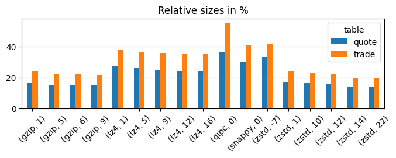

# Overview

In this document, we compare compression algorithms using a popular financial dataset from the New York Stock Exchange (NYSE). There are [three key metrics](../file-compression.md#performance) to evaluate compression algorithms.

   1. Compression ratio
   1. Compression speed
   1. Decompression speed

These metrics impact **storage cost**, **data write time** and **query response times** respectively. Both compression and decompression speeds depend on the hardware - primarily on storage speed and the compute (CPU) capacity. Our partner, Intel(R), provided access to two systems with different storage characteristics in its FasterLab, a facility dedicated to optimization of Financial Services Industry (FSI) solutions. The first system has fast local disks, while the second system comes with a slower NFS storage. The next section describes these environments in detail.

## Infrastructure

Tests were conducted on version 9.4 of Red Hat Enterprise Linux using kdb+ 4.1 (version 2025.01.17). Compression performance depends on the **compression library versions**, which are listed below:

   * `zlib`: 1.2.11
   * `lz4`: 1.9.3
   * `snappy`: 1.1.8
   * `zstd`: 1.5.1

Key specifications for the two systems:

   1. Local block storage and Intel Xeon 6 efficient CPU
      * **Storage**: Intel SSD D7-P5510 (3.84 TB), with interface PCIe 4.0 x4, NVMe
      * **CPU**: Intel(R) Xeon(R) [6780E](https://www.intel.com/content/www/us/en/products/sku/240362/intel-xeon-6780e-processor-108m-cache-2-20-ghz/specifications.html) (**E**fficient series)
         * Sockets: 2
         * Cores per socket: 144
         * Thread(s) per core: 1
         * NUMA nodes: 2
      * filesystem: ext4
      * memory: 502GiB, 8 x DDR5 6400 MT/s
   1. NFS storage and Intel Xeon 6 performance CPU
      * **Storage**: NFS (version 4.2), mounted in sync mode, with read and write chunk sizes (`wsize` and `rsize`) 1 MB. NFS cache was not set up, i.e `-o fsc` mount parameter was not set.
      * Some network parameters:
        * MTU: 1500
        * TCP read/write buffer size (`/proc/sys/net/core/rmem_default`, `/proc/sys/net/core/wmem_default`): 212992
      * **CPU**: Intel(R) Xeon(R) [6747P](https://www.intel.com/content/www/us/en/products/sku/241825/intel-xeon-6747p-processor-288m-cache-2-70-ghz/specifications.html) (**P**erformance series)
         * Sockets: 2
         * Cores per socket: 48
         * Thread(s) per core: 2
         * NUMA nodes: 4
      * memory: 502GiB, 12 x DDR5 6400 MT/s

The tests ran on a single NUMA node, i.e. kdb+ processes were launched with `numactl -N 0 -m 0`.

# Compression ratio

**Compression ratio** measures the relative reduction in size of data. This ratio is calculated by dividing the uncompressed size by the compressed size. For example, a ratio of 4 indicates that the data consumes a quarter of the disk space after compression. In this document, we show the **relative sizes** after compression, which is the inverse of compression ratios. Lower values indicate better compression. The numbers are in percentages, so 25 corresponds to compression ratio 4. The block size parameter was set to 17, which translates to logical block size of 128 KB.

The table-level results are presented below.

`zstd` outperforms `lz4` and `snappy` by nearly 2x,  though it is only marginally better than `gzip`.

The following tables provide a column-level breakdown. The columns are ordered by [entropy](https://en.wikipedia.org/wiki/Entropy_(information_theory)) in decreasing order. Low-entropy columns typically compress well so those at the top of the table likely contribute most to disk savings. Gradient background coloring highlights results (dark red = poor compression). 

Table `quote`:

<table id="T_77a3c">
  <thead>
    <tr>
      <th class="index_name level0" >Compression Algorithm</th>
      <th id="T_77a3c_level0_col0" class="col_heading level0 col0" colspan="4">gzip</th>
      <th id="T_77a3c_level0_col4" class="col_heading level0 col4" colspan="5">lz4</th>
      <th id="T_77a3c_level0_col9" class="col_heading level0 col9" >qipc</th>
      <th id="T_77a3c_level0_col10" class="col_heading level0 col10" >snappy</th>
      <th id="T_77a3c_level0_col11" class="col_heading level0 col11" colspan="6">zstd</th>
    </tr>
    <tr>
      <th class="index_name level1" >Compression Level</th>
      <th id="T_77a3c_level1_col0" class="col_heading level1 col0" >1</th>
      <th id="T_77a3c_level1_col1" class="col_heading level1 col1" >5</th>
      <th id="T_77a3c_level1_col2" class="col_heading level1 col2" >6</th>
      <th id="T_77a3c_level1_col3" class="col_heading level1 col3" >9</th>
      <th id="T_77a3c_level1_col4" class="col_heading level1 col4" >1</th>
      <th id="T_77a3c_level1_col5" class="col_heading level1 col5" >5</th>
      <th id="T_77a3c_level1_col6" class="col_heading level1 col6" >9</th>
      <th id="T_77a3c_level1_col7" class="col_heading level1 col7" >12</th>
      <th id="T_77a3c_level1_col8" class="col_heading level1 col8" >16</th>
      <th id="T_77a3c_level1_col9" class="col_heading level1 col9" >0</th>
      <th id="T_77a3c_level1_col10" class="col_heading level1 col10" >0</th>
      <th id="T_77a3c_level1_col11" class="col_heading level1 col11" >-7</th>
      <th id="T_77a3c_level1_col12" class="col_heading level1 col12" >1</th>
      <th id="T_77a3c_level1_col13" class="col_heading level1 col13" >10</th>
      <th id="T_77a3c_level1_col14" class="col_heading level1 col14" >12</th>
      <th id="T_77a3c_level1_col15" class="col_heading level1 col15" >14</th>
      <th id="T_77a3c_level1_col16" class="col_heading level1 col16" >22</th>
    </tr>
  </thead>
  <tbody>
    <tr>
      <th id="T_77a3c_level0_row0" class="row_heading level0 row0" >Participant_Timestamp</th>
      <td id="T_77a3c_row0_col0" class="data row0 col0" >46.8</td>
      <td id="T_77a3c_row0_col1" class="data row0 col1" >44.9</td>
      <td id="T_77a3c_row0_col2" class="data row0 col2" >45.0</td>
      <td id="T_77a3c_row0_col3" class="data row0 col3" >45.2</td>
      <td id="T_77a3c_row0_col4" class="data row0 col4" >70.2</td>
      <td id="T_77a3c_row0_col5" class="data row0 col5" >69.5</td>
      <td id="T_77a3c_row0_col6" class="data row0 col6" >69.0</td>
      <td id="T_77a3c_row0_col7" class="data row0 col7" >68.9</td>
      <td id="T_77a3c_row0_col8" class="data row0 col8" >68.9</td>
      <td id="T_77a3c_row0_col9" class="data row0 col9" >100.0</td>
      <td id="T_77a3c_row0_col10" class="data row0 col10" >71.5</td>
      <td id="T_77a3c_row0_col11" class="data row0 col11" >96.5</td>
      <td id="T_77a3c_row0_col12" class="data row0 col12" >41.3</td>
      <td id="T_77a3c_row0_col13" class="data row0 col13" >40.9</td>
      <td id="T_77a3c_row0_col14" class="data row0 col14" >40.9</td>
      <td id="T_77a3c_row0_col15" class="data row0 col15" >41.0</td>
      <td id="T_77a3c_row0_col16" class="data row0 col16" >41.0</td>
    </tr>
    <tr>
      <th id="T_77a3c_level0_row1" class="row_heading level0 row1" >Time</th>
      <td id="T_77a3c_row1_col0" class="data row1 col0" >38.5</td>
      <td id="T_77a3c_row1_col1" class="data row1 col1" >36.3</td>
      <td id="T_77a3c_row1_col2" class="data row1 col2" >36.3</td>
      <td id="T_77a3c_row1_col3" class="data row1 col3" >36.4</td>
      <td id="T_77a3c_row1_col4" class="data row1 col4" >61.3</td>
      <td id="T_77a3c_row1_col5" class="data row1 col5" >61.1</td>
      <td id="T_77a3c_row1_col6" class="data row1 col6" >60.5</td>
      <td id="T_77a3c_row1_col7" class="data row1 col7" >60.4</td>
      <td id="T_77a3c_row1_col8" class="data row1 col8" >60.4</td>
      <td id="T_77a3c_row1_col9" class="data row1 col9" >82.5</td>
      <td id="T_77a3c_row1_col10" class="data row1 col10" >62.4</td>
      <td id="T_77a3c_row1_col11" class="data row1 col11" >81.6</td>
      <td id="T_77a3c_row1_col12" class="data row1 col12" >31.3</td>
      <td id="T_77a3c_row1_col13" class="data row1 col13" >31.3</td>
      <td id="T_77a3c_row1_col14" class="data row1 col14" >31.3</td>
      <td id="T_77a3c_row1_col15" class="data row1 col15" >33.8</td>
      <td id="T_77a3c_row1_col16" class="data row1 col16" >33.8</td>
    </tr>
    <tr>
      <th id="T_77a3c_level0_row2" class="row_heading level0 row2" >Sequence_Number</th>
      <td id="T_77a3c_row2_col0" class="data row2 col0" >41.3</td>
      <td id="T_77a3c_row2_col1" class="data row2 col1" >41.1</td>
      <td id="T_77a3c_row2_col2" class="data row2 col2" >41.2</td>
      <td id="T_77a3c_row2_col3" class="data row2 col3" >41.2</td>
      <td id="T_77a3c_row2_col4" class="data row2 col4" >100.0</td>
      <td id="T_77a3c_row2_col5" class="data row2 col5" >100.0</td>
      <td id="T_77a3c_row2_col6" class="data row2 col6" >100.0</td>
      <td id="T_77a3c_row2_col7" class="data row2 col7" >100.0</td>
      <td id="T_77a3c_row2_col8" class="data row2 col8" >100.0</td>
      <td id="T_77a3c_row2_col9" class="data row2 col9" >100.0</td>
      <td id="T_77a3c_row2_col10" class="data row2 col10" >100.0</td>
      <td id="T_77a3c_row2_col11" class="data row2 col11" >100.0</td>
      <td id="T_77a3c_row2_col12" class="data row2 col12" >81.4</td>
      <td id="T_77a3c_row2_col13" class="data row2 col13" >81.4</td>
      <td id="T_77a3c_row2_col14" class="data row2 col14" >81.4</td>
      <td id="T_77a3c_row2_col15" class="data row2 col15" >35.1</td>
      <td id="T_77a3c_row2_col16" class="data row2 col16" >36.8</td>
    </tr>
    <tr>
      <th id="T_77a3c_level0_row3" class="row_heading level0 row3" >Offer_Price</th>
      <td id="T_77a3c_row3_col0" class="data row3 col0" >8.6</td>
      <td id="T_77a3c_row3_col1" class="data row3 col1" >6.9</td>
      <td id="T_77a3c_row3_col2" class="data row3 col2" >6.6</td>
      <td id="T_77a3c_row3_col3" class="data row3 col3" >6.5</td>
      <td id="T_77a3c_row3_col4" class="data row3 col4" >13.5</td>
      <td id="T_77a3c_row3_col5" class="data row3 col5" >11.1</td>
      <td id="T_77a3c_row3_col6" class="data row3 col6" >10.1</td>
      <td id="T_77a3c_row3_col7" class="data row3 col7" >9.6</td>
      <td id="T_77a3c_row3_col8" class="data row3 col8" >9.6</td>
      <td id="T_77a3c_row3_col9" class="data row3 col9" >17.5</td>
      <td id="T_77a3c_row3_col10" class="data row3 col10" >15.9</td>
      <td id="T_77a3c_row3_col11" class="data row3 col11" >16.3</td>
      <td id="T_77a3c_row3_col12" class="data row3 col12" >7.7</td>
      <td id="T_77a3c_row3_col13" class="data row3 col13" >6.4</td>
      <td id="T_77a3c_row3_col14" class="data row3 col14" >6.4</td>
      <td id="T_77a3c_row3_col15" class="data row3 col15" >6.1</td>
      <td id="T_77a3c_row3_col16" class="data row3 col16" >5.6</td>
    </tr>
    <tr>
      <th id="T_77a3c_level0_row4" class="row_heading level0 row4" >Bid_Price</th>
      <td id="T_77a3c_row4_col0" class="data row4 col0" >8.6</td>
      <td id="T_77a3c_row4_col1" class="data row4 col1" >6.9</td>
      <td id="T_77a3c_row4_col2" class="data row4 col2" >6.6</td>
      <td id="T_77a3c_row4_col3" class="data row4 col3" >6.5</td>
      <td id="T_77a3c_row4_col4" class="data row4 col4" >13.5</td>
      <td id="T_77a3c_row4_col5" class="data row4 col5" >11.1</td>
      <td id="T_77a3c_row4_col6" class="data row4 col6" >10.1</td>
      <td id="T_77a3c_row4_col7" class="data row4 col7" >9.6</td>
      <td id="T_77a3c_row4_col8" class="data row4 col8" >9.6</td>
      <td id="T_77a3c_row4_col9" class="data row4 col9" >17.5</td>
      <td id="T_77a3c_row4_col10" class="data row4 col10" >15.8</td>
      <td id="T_77a3c_row4_col11" class="data row4 col11" >16.3</td>
      <td id="T_77a3c_row4_col12" class="data row4 col12" >7.6</td>
      <td id="T_77a3c_row4_col13" class="data row4 col13" >6.4</td>
      <td id="T_77a3c_row4_col14" class="data row4 col14" >6.4</td>
      <td id="T_77a3c_row4_col15" class="data row4 col15" >6.1</td>
      <td id="T_77a3c_row4_col16" class="data row4 col16" >5.6</td>
    </tr>
    <tr>
      <th id="T_77a3c_level0_row5" class="row_heading level0 row5" >Symbol</th>
      <td id="T_77a3c_row5_col0" class="data row5 col0" >0.6</td>
      <td id="T_77a3c_row5_col1" class="data row5 col1" >0.2</td>
      <td id="T_77a3c_row5_col2" class="data row5 col2" >0.2</td>
      <td id="T_77a3c_row5_col3" class="data row5 col3" >0.2</td>
      <td id="T_77a3c_row5_col4" class="data row5 col4" >0.4</td>
      <td id="T_77a3c_row5_col5" class="data row5 col5" >0.4</td>
      <td id="T_77a3c_row5_col6" class="data row5 col6" >0.4</td>
      <td id="T_77a3c_row5_col7" class="data row5 col7" >0.4</td>
      <td id="T_77a3c_row5_col8" class="data row5 col8" >0.4</td>
      <td id="T_77a3c_row5_col9" class="data row5 col9" >1.7</td>
      <td id="T_77a3c_row5_col10" class="data row5 col10" >4.7</td>
      <td id="T_77a3c_row5_col11" class="data row5 col11" >0.0</td>
      <td id="T_77a3c_row5_col12" class="data row5 col12" >0.1</td>
      <td id="T_77a3c_row5_col13" class="data row5 col13" >0.0</td>
      <td id="T_77a3c_row5_col14" class="data row5 col14" >0.0</td>
      <td id="T_77a3c_row5_col15" class="data row5 col15" >0.0</td>
      <td id="T_77a3c_row5_col16" class="data row5 col16" >0.0</td>
    </tr>
    <tr>
      <th id="T_77a3c_level0_row6" class="row_heading level0 row6" >Offer_Size</th>
      <td id="T_77a3c_row6_col0" class="data row6 col0" >17.1</td>
      <td id="T_77a3c_row6_col1" class="data row6 col1" >14.9</td>
      <td id="T_77a3c_row6_col2" class="data row6 col2" >14.3</td>
      <td id="T_77a3c_row6_col3" class="data row6 col3" >13.5</td>
      <td id="T_77a3c_row6_col4" class="data row6 col4" >29.8</td>
      <td id="T_77a3c_row6_col5" class="data row6 col5" >23.3</td>
      <td id="T_77a3c_row6_col6" class="data row6 col6" >19.2</td>
      <td id="T_77a3c_row6_col7" class="data row6 col7" >17.1</td>
      <td id="T_77a3c_row6_col8" class="data row6 col8" >17.1</td>
      <td id="T_77a3c_row6_col9" class="data row6 col9" >35.3</td>
      <td id="T_77a3c_row6_col10" class="data row6 col10" >34.3</td>
      <td id="T_77a3c_row6_col11" class="data row6 col11" >28.0</td>
      <td id="T_77a3c_row6_col12" class="data row6 col12" >16.3</td>
      <td id="T_77a3c_row6_col13" class="data row6 col13" >13.6</td>
      <td id="T_77a3c_row6_col14" class="data row6 col14" >13.0</td>
      <td id="T_77a3c_row6_col15" class="data row6 col15" >12.7</td>
      <td id="T_77a3c_row6_col16" class="data row6 col16" >11.8</td>
    </tr>
    <tr>
      <th id="T_77a3c_level0_row7" class="row_heading level0 row7" >Bid_Size</th>
      <td id="T_77a3c_row7_col0" class="data row7 col0" >16.9</td>
      <td id="T_77a3c_row7_col1" class="data row7 col1" >14.7</td>
      <td id="T_77a3c_row7_col2" class="data row7 col2" >14.0</td>
      <td id="T_77a3c_row7_col3" class="data row7 col3" >13.2</td>
      <td id="T_77a3c_row7_col4" class="data row7 col4" >29.4</td>
      <td id="T_77a3c_row7_col5" class="data row7 col5" >23.0</td>
      <td id="T_77a3c_row7_col6" class="data row7 col6" >18.9</td>
      <td id="T_77a3c_row7_col7" class="data row7 col7" >16.8</td>
      <td id="T_77a3c_row7_col8" class="data row7 col8" >16.8</td>
      <td id="T_77a3c_row7_col9" class="data row7 col9" >34.8</td>
      <td id="T_77a3c_row7_col10" class="data row7 col10" >33.9</td>
      <td id="T_77a3c_row7_col11" class="data row7 col11" >27.7</td>
      <td id="T_77a3c_row7_col12" class="data row7 col12" >16.0</td>
      <td id="T_77a3c_row7_col13" class="data row7 col13" >13.4</td>
      <td id="T_77a3c_row7_col14" class="data row7 col14" >12.8</td>
      <td id="T_77a3c_row7_col15" class="data row7 col15" >12.5</td>
      <td id="T_77a3c_row7_col16" class="data row7 col16" >11.6</td>
    </tr>
    <tr>
      <th id="T_77a3c_level0_row8" class="row_heading level0 row8" >Exchange</th>
      <td id="T_77a3c_row8_col0" class="data row8 col0" >47.3</td>
      <td id="T_77a3c_row8_col1" class="data row8 col1" >44.6</td>
      <td id="T_77a3c_row8_col2" class="data row8 col2" >44.2</td>
      <td id="T_77a3c_row8_col3" class="data row8 col3" >44.0</td>
      <td id="T_77a3c_row8_col4" class="data row8 col4" >65.7</td>
      <td id="T_77a3c_row8_col5" class="data row8 col5" >60.0</td>
      <td id="T_77a3c_row8_col6" class="data row8 col6" >58.7</td>
      <td id="T_77a3c_row8_col7" class="data row8 col7" >57.8</td>
      <td id="T_77a3c_row8_col8" class="data row8 col8" >57.8</td>
      <td id="T_77a3c_row8_col9" class="data row8 col9" >99.9</td>
      <td id="T_77a3c_row8_col10" class="data row8 col10" >71.4</td>
      <td id="T_77a3c_row8_col11" class="data row8 col11" >83.1</td>
      <td id="T_77a3c_row8_col12" class="data row8 col12" >41.8</td>
      <td id="T_77a3c_row8_col13" class="data row8 col13" >43.9</td>
      <td id="T_77a3c_row8_col14" class="data row8 col14" >43.6</td>
      <td id="T_77a3c_row8_col15" class="data row8 col15" >40.5</td>
      <td id="T_77a3c_row8_col16" class="data row8 col16" >40.3</td>
    </tr>
    <tr>
      <th id="T_77a3c_level0_row9" class="row_heading level0 row9" >National_BBO_Ind</th>
      <td id="T_77a3c_row9_col0" class="data row9 col0" >20.1</td>
      <td id="T_77a3c_row9_col1" class="data row9 col1" >15.5</td>
      <td id="T_77a3c_row9_col2" class="data row9 col2" >14.8</td>
      <td id="T_77a3c_row9_col3" class="data row9 col3" >13.5</td>
      <td id="T_77a3c_row9_col4" class="data row9 col4" >33.2</td>
      <td id="T_77a3c_row9_col5" class="data row9 col5" >25.5</td>
      <td id="T_77a3c_row9_col6" class="data row9 col6" >20.4</td>
      <td id="T_77a3c_row9_col7" class="data row9 col7" >17.0</td>
      <td id="T_77a3c_row9_col8" class="data row9 col8" >17.0</td>
      <td id="T_77a3c_row9_col9" class="data row9 col9" >80.7</td>
      <td id="T_77a3c_row9_col10" class="data row9 col10" >30.4</td>
      <td id="T_77a3c_row9_col11" class="data row9 col11" >31.8</td>
      <td id="T_77a3c_row9_col12" class="data row9 col12" >18.1</td>
      <td id="T_77a3c_row9_col13" class="data row9 col13" >14.8</td>
      <td id="T_77a3c_row9_col14" class="data row9 col14" >13.7</td>
      <td id="T_77a3c_row9_col15" class="data row9 col15" >13.1</td>
      <td id="T_77a3c_row9_col16" class="data row9 col16" >12.7</td>
    </tr>
    <tr>
      <th id="T_77a3c_level0_row10" class="row_heading level0 row10" >Short_Sale_Restriction_Indicator</th>
      <td id="T_77a3c_row10_col0" class="data row10 col0" >0.5</td>
      <td id="T_77a3c_row10_col1" class="data row10 col1" >0.1</td>
      <td id="T_77a3c_row10_col2" class="data row10 col2" >0.1</td>
      <td id="T_77a3c_row10_col3" class="data row10 col3" >0.1</td>
      <td id="T_77a3c_row10_col4" class="data row10 col4" >0.4</td>
      <td id="T_77a3c_row10_col5" class="data row10 col5" >0.4</td>
      <td id="T_77a3c_row10_col6" class="data row10 col6" >0.4</td>
      <td id="T_77a3c_row10_col7" class="data row10 col7" >0.4</td>
      <td id="T_77a3c_row10_col8" class="data row10 col8" >0.4</td>
      <td id="T_77a3c_row10_col9" class="data row10 col9" >0.8</td>
      <td id="T_77a3c_row10_col10" class="data row10 col10" >4.7</td>
      <td id="T_77a3c_row10_col11" class="data row10 col11" >0.0</td>
      <td id="T_77a3c_row10_col12" class="data row10 col12" >0.0</td>
      <td id="T_77a3c_row10_col13" class="data row10 col13" >0.0</td>
      <td id="T_77a3c_row10_col14" class="data row10 col14" >0.0</td>
      <td id="T_77a3c_row10_col15" class="data row10 col15" >0.0</td>
      <td id="T_77a3c_row10_col16" class="data row10 col16" >0.0</td>
    </tr>
    <tr>
      <th id="T_77a3c_level0_row11" class="row_heading level0 row11" >Source_Of_Quote</th>
      <td id="T_77a3c_row11_col0" class="data row11 col0" >0.5</td>
      <td id="T_77a3c_row11_col1" class="data row11 col1" >0.1</td>
      <td id="T_77a3c_row11_col2" class="data row11 col2" >0.1</td>
      <td id="T_77a3c_row11_col3" class="data row11 col3" >0.1</td>
      <td id="T_77a3c_row11_col4" class="data row11 col4" >0.4</td>
      <td id="T_77a3c_row11_col5" class="data row11 col5" >0.4</td>
      <td id="T_77a3c_row11_col6" class="data row11 col6" >0.4</td>
      <td id="T_77a3c_row11_col7" class="data row11 col7" >0.4</td>
      <td id="T_77a3c_row11_col8" class="data row11 col8" >0.4</td>
      <td id="T_77a3c_row11_col9" class="data row11 col9" >0.8</td>
      <td id="T_77a3c_row11_col10" class="data row11 col10" >4.7</td>
      <td id="T_77a3c_row11_col11" class="data row11 col11" >0.0</td>
      <td id="T_77a3c_row11_col12" class="data row11 col12" >0.0</td>
      <td id="T_77a3c_row11_col13" class="data row11 col13" >0.0</td>
      <td id="T_77a3c_row11_col14" class="data row11 col14" >0.0</td>
      <td id="T_77a3c_row11_col15" class="data row11 col15" >0.0</td>
      <td id="T_77a3c_row11_col16" class="data row11 col16" >0.0</td>
    </tr>
    <tr>
      <th id="T_77a3c_level0_row12" class="row_heading level0 row12" >Retail_Interest_Indicator</th>
      <td id="T_77a3c_row12_col0" class="data row12 col0" >12.6</td>
      <td id="T_77a3c_row12_col1" class="data row12 col1" >9.6</td>
      <td id="T_77a3c_row12_col2" class="data row12 col2" >9.2</td>
      <td id="T_77a3c_row12_col3" class="data row12 col3" >8.4</td>
      <td id="T_77a3c_row12_col4" class="data row12 col4" >18.8</td>
      <td id="T_77a3c_row12_col5" class="data row12 col5" >14.7</td>
      <td id="T_77a3c_row12_col6" class="data row12 col6" >12.1</td>
      <td id="T_77a3c_row12_col7" class="data row12 col7" >10.5</td>
      <td id="T_77a3c_row12_col8" class="data row12 col8" >10.5</td>
      <td id="T_77a3c_row12_col9" class="data row12 col9" >34.0</td>
      <td id="T_77a3c_row12_col10" class="data row12 col10" >19.2</td>
      <td id="T_77a3c_row12_col11" class="data row12 col11" >21.1</td>
      <td id="T_77a3c_row12_col12" class="data row12 col12" >11.0</td>
      <td id="T_77a3c_row12_col13" class="data row12 col13" >9.0</td>
      <td id="T_77a3c_row12_col14" class="data row12 col14" >8.6</td>
      <td id="T_77a3c_row12_col15" class="data row12 col15" >8.3</td>
      <td id="T_77a3c_row12_col16" class="data row12 col16" >7.9</td>
    </tr>
    <tr>
      <th id="T_77a3c_level0_row13" class="row_heading level0 row13" >National_BBO_LULD_Indicator</th>
      <td id="T_77a3c_row13_col0" class="data row13 col0" >0.5</td>
      <td id="T_77a3c_row13_col1" class="data row13 col1" >0.1</td>
      <td id="T_77a3c_row13_col2" class="data row13 col2" >0.1</td>
      <td id="T_77a3c_row13_col3" class="data row13 col3" >0.1</td>
      <td id="T_77a3c_row13_col4" class="data row13 col4" >0.4</td>
      <td id="T_77a3c_row13_col5" class="data row13 col5" >0.4</td>
      <td id="T_77a3c_row13_col6" class="data row13 col6" >0.4</td>
      <td id="T_77a3c_row13_col7" class="data row13 col7" >0.4</td>
      <td id="T_77a3c_row13_col8" class="data row13 col8" >0.4</td>
      <td id="T_77a3c_row13_col9" class="data row13 col9" >0.8</td>
      <td id="T_77a3c_row13_col10" class="data row13 col10" >4.7</td>
      <td id="T_77a3c_row13_col11" class="data row13 col11" >0.0</td>
      <td id="T_77a3c_row13_col12" class="data row13 col12" >0.0</td>
      <td id="T_77a3c_row13_col13" class="data row13 col13" >0.0</td>
      <td id="T_77a3c_row13_col14" class="data row13 col14" >0.0</td>
      <td id="T_77a3c_row13_col15" class="data row13 col15" >0.0</td>
      <td id="T_77a3c_row13_col16" class="data row13 col16" >0.0</td>
    </tr>
    <tr>
      <th id="T_77a3c_level0_row14" class="row_heading level0 row14" >Quote_Condition</th>
      <td id="T_77a3c_row14_col0" class="data row14 col0" >0.5</td>
      <td id="T_77a3c_row14_col1" class="data row14 col1" >0.1</td>
      <td id="T_77a3c_row14_col2" class="data row14 col2" >0.1</td>
      <td id="T_77a3c_row14_col3" class="data row14 col3" >0.1</td>
      <td id="T_77a3c_row14_col4" class="data row14 col4" >0.4</td>
      <td id="T_77a3c_row14_col5" class="data row14 col5" >0.4</td>
      <td id="T_77a3c_row14_col6" class="data row14 col6" >0.4</td>
      <td id="T_77a3c_row14_col7" class="data row14 col7" >0.4</td>
      <td id="T_77a3c_row14_col8" class="data row14 col8" >0.4</td>
      <td id="T_77a3c_row14_col9" class="data row14 col9" >0.9</td>
      <td id="T_77a3c_row14_col10" class="data row14 col10" >4.7</td>
      <td id="T_77a3c_row14_col11" class="data row14 col11" >0.1</td>
      <td id="T_77a3c_row14_col12" class="data row14 col12" >0.1</td>
      <td id="T_77a3c_row14_col13" class="data row14 col13" >0.0</td>
      <td id="T_77a3c_row14_col14" class="data row14 col14" >0.0</td>
      <td id="T_77a3c_row14_col15" class="data row14 col15" >0.0</td>
      <td id="T_77a3c_row14_col16" class="data row14 col16" >0.0</td>
    </tr>
    <tr>
      <th id="T_77a3c_level0_row15" class="row_heading level0 row15" >SIP_Generated_Message_Identifier</th>
      <td id="T_77a3c_row15_col0" class="data row15 col0" >0.5</td>
      <td id="T_77a3c_row15_col1" class="data row15 col1" >0.1</td>
      <td id="T_77a3c_row15_col2" class="data row15 col2" >0.1</td>
      <td id="T_77a3c_row15_col3" class="data row15 col3" >0.1</td>
      <td id="T_77a3c_row15_col4" class="data row15 col4" >0.4</td>
      <td id="T_77a3c_row15_col5" class="data row15 col5" >0.4</td>
      <td id="T_77a3c_row15_col6" class="data row15 col6" >0.4</td>
      <td id="T_77a3c_row15_col7" class="data row15 col7" >0.4</td>
      <td id="T_77a3c_row15_col8" class="data row15 col8" >0.4</td>
      <td id="T_77a3c_row15_col9" class="data row15 col9" >0.8</td>
      <td id="T_77a3c_row15_col10" class="data row15 col10" >4.7</td>
      <td id="T_77a3c_row15_col11" class="data row15 col11" >0.0</td>
      <td id="T_77a3c_row15_col12" class="data row15 col12" >0.0</td>
      <td id="T_77a3c_row15_col13" class="data row15 col13" >0.0</td>
      <td id="T_77a3c_row15_col14" class="data row15 col14" >0.0</td>
      <td id="T_77a3c_row15_col15" class="data row15 col15" >0.0</td>
      <td id="T_77a3c_row15_col16" class="data row15 col16" >0.0</td>
    </tr>
    <tr>
      <th id="T_77a3c_level0_row16" class="row_heading level0 row16" >Security_Status_Indicator</th>
      <td id="T_77a3c_row16_col0" class="data row16 col0" >0.5</td>
      <td id="T_77a3c_row16_col1" class="data row16 col1" >0.1</td>
      <td id="T_77a3c_row16_col2" class="data row16 col2" >0.1</td>
      <td id="T_77a3c_row16_col3" class="data row16 col3" >0.1</td>
      <td id="T_77a3c_row16_col4" class="data row16 col4" >0.4</td>
      <td id="T_77a3c_row16_col5" class="data row16 col5" >0.4</td>
      <td id="T_77a3c_row16_col6" class="data row16 col6" >0.4</td>
      <td id="T_77a3c_row16_col7" class="data row16 col7" >0.4</td>
      <td id="T_77a3c_row16_col8" class="data row16 col8" >0.4</td>
      <td id="T_77a3c_row16_col9" class="data row16 col9" >0.8</td>
      <td id="T_77a3c_row16_col10" class="data row16 col10" >4.7</td>
      <td id="T_77a3c_row16_col11" class="data row16 col11" >0.0</td>
      <td id="T_77a3c_row16_col12" class="data row16 col12" >0.0</td>
      <td id="T_77a3c_row16_col13" class="data row16 col13" >0.0</td>
      <td id="T_77a3c_row16_col14" class="data row16 col14" >0.0</td>
      <td id="T_77a3c_row16_col15" class="data row16 col15" >0.0</td>
      <td id="T_77a3c_row16_col16" class="data row16 col16" >0.0</td>
    </tr>
    <tr>
      <th id="T_77a3c_level0_row17" class="row_heading level0 row17" >LULD_BBO_Indicator</th>
      <td id="T_77a3c_row17_col0" class="data row17 col0" >0.5</td>
      <td id="T_77a3c_row17_col1" class="data row17 col1" >0.1</td>
      <td id="T_77a3c_row17_col2" class="data row17 col2" >0.1</td>
      <td id="T_77a3c_row17_col3" class="data row17 col3" >0.1</td>
      <td id="T_77a3c_row17_col4" class="data row17 col4" >0.4</td>
      <td id="T_77a3c_row17_col5" class="data row17 col5" >0.4</td>
      <td id="T_77a3c_row17_col6" class="data row17 col6" >0.4</td>
      <td id="T_77a3c_row17_col7" class="data row17 col7" >0.4</td>
      <td id="T_77a3c_row17_col8" class="data row17 col8" >0.4</td>
      <td id="T_77a3c_row17_col9" class="data row17 col9" >0.8</td>
      <td id="T_77a3c_row17_col10" class="data row17 col10" >4.7</td>
      <td id="T_77a3c_row17_col11" class="data row17 col11" >0.0</td>
      <td id="T_77a3c_row17_col12" class="data row17 col12" >0.0</td>
      <td id="T_77a3c_row17_col13" class="data row17 col13" >0.0</td>
      <td id="T_77a3c_row17_col14" class="data row17 col14" >0.0</td>
      <td id="T_77a3c_row17_col15" class="data row17 col15" >0.0</td>
      <td id="T_77a3c_row17_col16" class="data row17 col16" >0.0</td>
    </tr>
    <tr>
      <th id="T_77a3c_level0_row18" class="row_heading level0 row18" >FINRA_BBO_Indicator</th>
      <td id="T_77a3c_row18_col0" class="data row18 col0" >0.5</td>
      <td id="T_77a3c_row18_col1" class="data row18 col1" >0.1</td>
      <td id="T_77a3c_row18_col2" class="data row18 col2" >0.1</td>
      <td id="T_77a3c_row18_col3" class="data row18 col3" >0.1</td>
      <td id="T_77a3c_row18_col4" class="data row18 col4" >0.4</td>
      <td id="T_77a3c_row18_col5" class="data row18 col5" >0.4</td>
      <td id="T_77a3c_row18_col6" class="data row18 col6" >0.4</td>
      <td id="T_77a3c_row18_col7" class="data row18 col7" >0.4</td>
      <td id="T_77a3c_row18_col8" class="data row18 col8" >0.4</td>
      <td id="T_77a3c_row18_col9" class="data row18 col9" >0.8</td>
      <td id="T_77a3c_row18_col10" class="data row18 col10" >4.7</td>
      <td id="T_77a3c_row18_col11" class="data row18 col11" >0.0</td>
      <td id="T_77a3c_row18_col12" class="data row18 col12" >0.0</td>
      <td id="T_77a3c_row18_col13" class="data row18 col13" >0.0</td>
      <td id="T_77a3c_row18_col14" class="data row18 col14" >0.0</td>
      <td id="T_77a3c_row18_col15" class="data row18 col15" >0.0</td>
      <td id="T_77a3c_row18_col16" class="data row18 col16" >0.0</td>
    </tr>
    <tr>
      <th id="T_77a3c_level0_row19" class="row_heading level0 row19" >Quote_Cancel_Correction</th>
      <td id="T_77a3c_row19_col0" class="data row19 col0" >0.5</td>
      <td id="T_77a3c_row19_col1" class="data row19 col1" >0.1</td>
      <td id="T_77a3c_row19_col2" class="data row19 col2" >0.1</td>
      <td id="T_77a3c_row19_col3" class="data row19 col3" >0.1</td>
      <td id="T_77a3c_row19_col4" class="data row19 col4" >0.4</td>
      <td id="T_77a3c_row19_col5" class="data row19 col5" >0.4</td>
      <td id="T_77a3c_row19_col6" class="data row19 col6" >0.4</td>
      <td id="T_77a3c_row19_col7" class="data row19 col7" >0.4</td>
      <td id="T_77a3c_row19_col8" class="data row19 col8" >0.4</td>
      <td id="T_77a3c_row19_col9" class="data row19 col9" >0.8</td>
      <td id="T_77a3c_row19_col10" class="data row19 col10" >4.7</td>
      <td id="T_77a3c_row19_col11" class="data row19 col11" >0.0</td>
      <td id="T_77a3c_row19_col12" class="data row19 col12" >0.0</td>
      <td id="T_77a3c_row19_col13" class="data row19 col13" >0.0</td>
      <td id="T_77a3c_row19_col14" class="data row19 col14" >0.0</td>
      <td id="T_77a3c_row19_col15" class="data row19 col15" >0.0</td>
      <td id="T_77a3c_row19_col16" class="data row19 col16" >0.0</td>
    </tr>
    <tr>
      <th id="T_77a3c_level0_row20" class="row_heading level0 row20" >FINRA_ADF_MPID_Indicator</th>
      <td id="T_77a3c_row20_col0" class="data row20 col0" >0.5</td>
      <td id="T_77a3c_row20_col1" class="data row20 col1" >0.1</td>
      <td id="T_77a3c_row20_col2" class="data row20 col2" >0.1</td>
      <td id="T_77a3c_row20_col3" class="data row20 col3" >0.1</td>
      <td id="T_77a3c_row20_col4" class="data row20 col4" >0.4</td>
      <td id="T_77a3c_row20_col5" class="data row20 col5" >0.4</td>
      <td id="T_77a3c_row20_col6" class="data row20 col6" >0.4</td>
      <td id="T_77a3c_row20_col7" class="data row20 col7" >0.4</td>
      <td id="T_77a3c_row20_col8" class="data row20 col8" >0.4</td>
      <td id="T_77a3c_row20_col9" class="data row20 col9" >0.8</td>
      <td id="T_77a3c_row20_col10" class="data row20 col10" >4.7</td>
      <td id="T_77a3c_row20_col11" class="data row20 col11" >0.0</td>
      <td id="T_77a3c_row20_col12" class="data row20 col12" >0.0</td>
      <td id="T_77a3c_row20_col13" class="data row20 col13" >0.0</td>
      <td id="T_77a3c_row20_col14" class="data row20 col14" >0.0</td>
      <td id="T_77a3c_row20_col15" class="data row20 col15" >0.0</td>
      <td id="T_77a3c_row20_col16" class="data row20 col16" >0.0</td>
    </tr>
    <tr>
      <th id="T_77a3c_level0_row21" class="row_heading level0 row21" >FINRA_ADF_Market_Participant_Quote_Indicator</th>
      <td id="T_77a3c_row21_col0" class="data row21 col0" >0.5</td>
      <td id="T_77a3c_row21_col1" class="data row21 col1" >0.1</td>
      <td id="T_77a3c_row21_col2" class="data row21 col2" >0.1</td>
      <td id="T_77a3c_row21_col3" class="data row21 col3" >0.1</td>
      <td id="T_77a3c_row21_col4" class="data row21 col4" >0.4</td>
      <td id="T_77a3c_row21_col5" class="data row21 col5" >0.4</td>
      <td id="T_77a3c_row21_col6" class="data row21 col6" >0.4</td>
      <td id="T_77a3c_row21_col7" class="data row21 col7" >0.4</td>
      <td id="T_77a3c_row21_col8" class="data row21 col8" >0.4</td>
      <td id="T_77a3c_row21_col9" class="data row21 col9" >0.8</td>
      <td id="T_77a3c_row21_col10" class="data row21 col10" >4.7</td>
      <td id="T_77a3c_row21_col11" class="data row21 col11" >0.0</td>
      <td id="T_77a3c_row21_col12" class="data row21 col12" >0.0</td>
      <td id="T_77a3c_row21_col13" class="data row21 col13" >0.0</td>
      <td id="T_77a3c_row21_col14" class="data row21 col14" >0.0</td>
      <td id="T_77a3c_row21_col15" class="data row21 col15" >0.0</td>
      <td id="T_77a3c_row21_col16" class="data row21 col16" >0.0</td>
    </tr>
    <tr>
      <th id="T_77a3c_level0_row22" class="row_heading level0 row22" >FINRA_ADF_Timestamp</th>
      <td id="T_77a3c_row22_col0" class="data row22 col0" >0.6</td>
      <td id="T_77a3c_row22_col1" class="data row22 col1" >0.2</td>
      <td id="T_77a3c_row22_col2" class="data row22 col2" >0.2</td>
      <td id="T_77a3c_row22_col3" class="data row22 col3" >0.2</td>
      <td id="T_77a3c_row22_col4" class="data row22 col4" >0.4</td>
      <td id="T_77a3c_row22_col5" class="data row22 col5" >0.4</td>
      <td id="T_77a3c_row22_col6" class="data row22 col6" >0.4</td>
      <td id="T_77a3c_row22_col7" class="data row22 col7" >0.4</td>
      <td id="T_77a3c_row22_col8" class="data row22 col8" >0.4</td>
      <td id="T_77a3c_row22_col9" class="data row22 col9" >2.4</td>
      <td id="T_77a3c_row22_col10" class="data row22 col10" >4.7</td>
      <td id="T_77a3c_row22_col11" class="data row22 col11" >0.0</td>
      <td id="T_77a3c_row22_col12" class="data row22 col12" >3.2</td>
      <td id="T_77a3c_row22_col13" class="data row22 col13" >0.0</td>
      <td id="T_77a3c_row22_col14" class="data row22 col14" >0.0</td>
      <td id="T_77a3c_row22_col15" class="data row22 col15" >0.0</td>
      <td id="T_77a3c_row22_col16" class="data row22 col16" >0.0</td>
    </tr>
  </tbody>
</table>

Table `trade`:

<table id="T_6a8bb">
  <thead>
    <tr>
      <th class="index_name level0" >Compression Algorithm</th>
      <th id="T_6a8bb_level0_col0" class="col_heading level0 col0" colspan="4">gzip</th>
      <th id="T_6a8bb_level0_col4" class="col_heading level0 col4" colspan="5">lz4</th>
      <th id="T_6a8bb_level0_col9" class="col_heading level0 col9" >qipc</th>
      <th id="T_6a8bb_level0_col10" class="col_heading level0 col10" >snappy</th>
      <th id="T_6a8bb_level0_col11" class="col_heading level0 col11" colspan="6">zstd</th>
    </tr>
    <tr>
      <th class="index_name level1" >Compression Level</th>
      <th id="T_6a8bb_level1_col0" class="col_heading level1 col0" >1</th>
      <th id="T_6a8bb_level1_col1" class="col_heading level1 col1" >5</th>
      <th id="T_6a8bb_level1_col2" class="col_heading level1 col2" >6</th>
      <th id="T_6a8bb_level1_col3" class="col_heading level1 col3" >9</th>
      <th id="T_6a8bb_level1_col4" class="col_heading level1 col4" >1</th>
      <th id="T_6a8bb_level1_col5" class="col_heading level1 col5" >5</th>
      <th id="T_6a8bb_level1_col6" class="col_heading level1 col6" >9</th>
      <th id="T_6a8bb_level1_col7" class="col_heading level1 col7" >12</th>
      <th id="T_6a8bb_level1_col8" class="col_heading level1 col8" >16</th>
      <th id="T_6a8bb_level1_col9" class="col_heading level1 col9" >0</th>
      <th id="T_6a8bb_level1_col10" class="col_heading level1 col10" >0</th>
      <th id="T_6a8bb_level1_col11" class="col_heading level1 col11" >-7</th>
      <th id="T_6a8bb_level1_col12" class="col_heading level1 col12" >1</th>
      <th id="T_6a8bb_level1_col13" class="col_heading level1 col13" >10</th>
      <th id="T_6a8bb_level1_col14" class="col_heading level1 col14" >12</th>
      <th id="T_6a8bb_level1_col15" class="col_heading level1 col15" >14</th>
      <th id="T_6a8bb_level1_col16" class="col_heading level1 col16" >22</th>
    </tr>
  </thead>
  <tbody>
    <tr>
      <th id="T_6a8bb_level0_row0" class="row_heading level0 row0" >Time</th>
      <td id="T_6a8bb_row0_col0" class="data row0 col0" >45.5</td>
      <td id="T_6a8bb_row0_col1" class="data row0 col1" >43.2</td>
      <td id="T_6a8bb_row0_col2" class="data row0 col2" >43.2</td>
      <td id="T_6a8bb_row0_col3" class="data row0 col3" >43.4</td>
      <td id="T_6a8bb_row0_col4" class="data row0 col4" >67.0</td>
      <td id="T_6a8bb_row0_col5" class="data row0 col5" >66.8</td>
      <td id="T_6a8bb_row0_col6" class="data row0 col6" >66.3</td>
      <td id="T_6a8bb_row0_col7" class="data row0 col7" >66.2</td>
      <td id="T_6a8bb_row0_col8" class="data row0 col8" >66.2</td>
      <td id="T_6a8bb_row0_col9" class="data row0 col9" >97.8</td>
      <td id="T_6a8bb_row0_col10" class="data row0 col10" >68.6</td>
      <td id="T_6a8bb_row0_col11" class="data row0 col11" >86.2</td>
      <td id="T_6a8bb_row0_col12" class="data row0 col12" >39.5</td>
      <td id="T_6a8bb_row0_col13" class="data row0 col13" >39.6</td>
      <td id="T_6a8bb_row0_col14" class="data row0 col14" >39.6</td>
      <td id="T_6a8bb_row0_col15" class="data row0 col15" >41.5</td>
      <td id="T_6a8bb_row0_col16" class="data row0 col16" >41.7</td>
    </tr>
    <tr>
      <th id="T_6a8bb_level0_row1" class="row_heading level0 row1" >ParticipantTimestamp</th>
      <td id="T_6a8bb_row1_col0" class="data row1 col0" >46.8</td>
      <td id="T_6a8bb_row1_col1" class="data row1 col1" >44.5</td>
      <td id="T_6a8bb_row1_col2" class="data row1 col2" >44.6</td>
      <td id="T_6a8bb_row1_col3" class="data row1 col3" >44.8</td>
      <td id="T_6a8bb_row1_col4" class="data row1 col4" >63.5</td>
      <td id="T_6a8bb_row1_col5" class="data row1 col5" >63.1</td>
      <td id="T_6a8bb_row1_col6" class="data row1 col6" >62.9</td>
      <td id="T_6a8bb_row1_col7" class="data row1 col7" >62.9</td>
      <td id="T_6a8bb_row1_col8" class="data row1 col8" >62.9</td>
      <td id="T_6a8bb_row1_col9" class="data row1 col9" >99.2</td>
      <td id="T_6a8bb_row1_col10" class="data row1 col10" >66.4</td>
      <td id="T_6a8bb_row1_col11" class="data row1 col11" >80.7</td>
      <td id="T_6a8bb_row1_col12" class="data row1 col12" >43.4</td>
      <td id="T_6a8bb_row1_col13" class="data row1 col13" >42.7</td>
      <td id="T_6a8bb_row1_col14" class="data row1 col14" >42.7</td>
      <td id="T_6a8bb_row1_col15" class="data row1 col15" >40.7</td>
      <td id="T_6a8bb_row1_col16" class="data row1 col16" >40.3</td>
    </tr>
    <tr>
      <th id="T_6a8bb_level0_row2" class="row_heading level0 row2" >SequenceNumber</th>
      <td id="T_6a8bb_row2_col0" class="data row2 col0" >44.0</td>
      <td id="T_6a8bb_row2_col1" class="data row2 col1" >43.8</td>
      <td id="T_6a8bb_row2_col2" class="data row2 col2" >43.8</td>
      <td id="T_6a8bb_row2_col3" class="data row2 col3" >43.8</td>
      <td id="T_6a8bb_row2_col4" class="data row2 col4" >100.0</td>
      <td id="T_6a8bb_row2_col5" class="data row2 col5" >100.0</td>
      <td id="T_6a8bb_row2_col6" class="data row2 col6" >100.0</td>
      <td id="T_6a8bb_row2_col7" class="data row2 col7" >100.0</td>
      <td id="T_6a8bb_row2_col8" class="data row2 col8" >100.0</td>
      <td id="T_6a8bb_row2_col9" class="data row2 col9" >100.0</td>
      <td id="T_6a8bb_row2_col10" class="data row2 col10" >100.0</td>
      <td id="T_6a8bb_row2_col11" class="data row2 col11" >100.0</td>
      <td id="T_6a8bb_row2_col12" class="data row2 col12" >80.3</td>
      <td id="T_6a8bb_row2_col13" class="data row2 col13" >80.3</td>
      <td id="T_6a8bb_row2_col14" class="data row2 col14" >80.3</td>
      <td id="T_6a8bb_row2_col15" class="data row2 col15" >39.2</td>
      <td id="T_6a8bb_row2_col16" class="data row2 col16" >43.1</td>
    </tr>
    <tr>
      <th id="T_6a8bb_level0_row3" class="row_heading level0 row3" >TradeId</th>
      <td id="T_6a8bb_row3_col0" class="data row3 col0" >26.1</td>
      <td id="T_6a8bb_row3_col1" class="data row3 col1" >22.3</td>
      <td id="T_6a8bb_row3_col2" class="data row3 col2" >22.1</td>
      <td id="T_6a8bb_row3_col3" class="data row3 col3" >22.0</td>
      <td id="T_6a8bb_row3_col4" class="data row3 col4" >43.8</td>
      <td id="T_6a8bb_row3_col5" class="data row3 col5" >42.7</td>
      <td id="T_6a8bb_row3_col6" class="data row3 col6" >42.5</td>
      <td id="T_6a8bb_row3_col7" class="data row3 col7" >42.3</td>
      <td id="T_6a8bb_row3_col8" class="data row3 col8" >42.3</td>
      <td id="T_6a8bb_row3_col9" class="data row3 col9" >75.8</td>
      <td id="T_6a8bb_row3_col10" class="data row3 col10" >47.7</td>
      <td id="T_6a8bb_row3_col11" class="data row3 col11" >39.1</td>
      <td id="T_6a8bb_row3_col12" class="data row3 col12" >21.4</td>
      <td id="T_6a8bb_row3_col13" class="data row3 col13" >18.6</td>
      <td id="T_6a8bb_row3_col14" class="data row3 col14" >18.6</td>
      <td id="T_6a8bb_row3_col15" class="data row3 col15" >16.6</td>
      <td id="T_6a8bb_row3_col16" class="data row3 col16" >16.5</td>
    </tr>
    <tr>
      <th id="T_6a8bb_level0_row4" class="row_heading level0 row4" >TradePrice</th>
      <td id="T_6a8bb_row4_col0" class="data row4 col0" >19.6</td>
      <td id="T_6a8bb_row4_col1" class="data row4 col1" >16.9</td>
      <td id="T_6a8bb_row4_col2" class="data row4 col2" >16.7</td>
      <td id="T_6a8bb_row4_col3" class="data row4 col3" >16.6</td>
      <td id="T_6a8bb_row4_col4" class="data row4 col4" >28.6</td>
      <td id="T_6a8bb_row4_col5" class="data row4 col5" >24.1</td>
      <td id="T_6a8bb_row4_col6" class="data row4 col6" >22.9</td>
      <td id="T_6a8bb_row4_col7" class="data row4 col7" >22.4</td>
      <td id="T_6a8bb_row4_col8" class="data row4 col8" >22.4</td>
      <td id="T_6a8bb_row4_col9" class="data row4 col9" >30.2</td>
      <td id="T_6a8bb_row4_col10" class="data row4 col10" >29.9</td>
      <td id="T_6a8bb_row4_col11" class="data row4 col11" >36.5</td>
      <td id="T_6a8bb_row4_col12" class="data row4 col12" >20.2</td>
      <td id="T_6a8bb_row4_col13" class="data row4 col13" >17.1</td>
      <td id="T_6a8bb_row4_col14" class="data row4 col14" >17.1</td>
      <td id="T_6a8bb_row4_col15" class="data row4 col15" >16.0</td>
      <td id="T_6a8bb_row4_col16" class="data row4 col16" >15.2</td>
    </tr>
    <tr>
      <th id="T_6a8bb_level0_row5" class="row_heading level0 row5" >Symbol</th>
      <td id="T_6a8bb_row5_col0" class="data row5 col0" >0.6</td>
      <td id="T_6a8bb_row5_col1" class="data row5 col1" >0.2</td>
      <td id="T_6a8bb_row5_col2" class="data row5 col2" >0.2</td>
      <td id="T_6a8bb_row5_col3" class="data row5 col3" >0.2</td>
      <td id="T_6a8bb_row5_col4" class="data row5 col4" >0.4</td>
      <td id="T_6a8bb_row5_col5" class="data row5 col5" >0.4</td>
      <td id="T_6a8bb_row5_col6" class="data row5 col6" >0.4</td>
      <td id="T_6a8bb_row5_col7" class="data row5 col7" >0.4</td>
      <td id="T_6a8bb_row5_col8" class="data row5 col8" >0.4</td>
      <td id="T_6a8bb_row5_col9" class="data row5 col9" >1.7</td>
      <td id="T_6a8bb_row5_col10" class="data row5 col10" >4.7</td>
      <td id="T_6a8bb_row5_col11" class="data row5 col11" >0.1</td>
      <td id="T_6a8bb_row5_col12" class="data row5 col12" >0.2</td>
      <td id="T_6a8bb_row5_col13" class="data row5 col13" >0.0</td>
      <td id="T_6a8bb_row5_col14" class="data row5 col14" >0.0</td>
      <td id="T_6a8bb_row5_col15" class="data row5 col15" >0.0</td>
      <td id="T_6a8bb_row5_col16" class="data row5 col16" >0.0</td>
    </tr>
    <tr>
      <th id="T_6a8bb_level0_row6" class="row_heading level0 row6" >TradeReportingFacilityTRFTimestamp</th>
      <td id="T_6a8bb_row6_col0" class="data row6 col0" >20.9</td>
      <td id="T_6a8bb_row6_col1" class="data row6 col1" >19.8</td>
      <td id="T_6a8bb_row6_col2" class="data row6 col2" >19.7</td>
      <td id="T_6a8bb_row6_col3" class="data row6 col3" >19.7</td>
      <td id="T_6a8bb_row6_col4" class="data row6 col4" >26.0</td>
      <td id="T_6a8bb_row6_col5" class="data row6 col5" >24.8</td>
      <td id="T_6a8bb_row6_col6" class="data row6 col6" >24.1</td>
      <td id="T_6a8bb_row6_col7" class="data row6 col7" >24.1</td>
      <td id="T_6a8bb_row6_col8" class="data row6 col8" >24.1</td>
      <td id="T_6a8bb_row6_col9" class="data row6 col9" >29.9</td>
      <td id="T_6a8bb_row6_col10" class="data row6 col10" >28.7</td>
      <td id="T_6a8bb_row6_col11" class="data row6 col11" >31.0</td>
      <td id="T_6a8bb_row6_col12" class="data row6 col12" >23.6</td>
      <td id="T_6a8bb_row6_col13" class="data row6 col13" >19.5</td>
      <td id="T_6a8bb_row6_col14" class="data row6 col14" >19.4</td>
      <td id="T_6a8bb_row6_col15" class="data row6 col15" >18.7</td>
      <td id="T_6a8bb_row6_col16" class="data row6 col16" >18.5</td>
    </tr>
    <tr>
      <th id="T_6a8bb_level0_row7" class="row_heading level0 row7" >TradeVolume</th>
      <td id="T_6a8bb_row7_col0" class="data row7 col0" >29.3</td>
      <td id="T_6a8bb_row7_col1" class="data row7 col1" >26.8</td>
      <td id="T_6a8bb_row7_col2" class="data row7 col2" >25.7</td>
      <td id="T_6a8bb_row7_col3" class="data row7 col3" >23.9</td>
      <td id="T_6a8bb_row7_col4" class="data row7 col4" >40.1</td>
      <td id="T_6a8bb_row7_col5" class="data row7 col5" >32.5</td>
      <td id="T_6a8bb_row7_col6" class="data row7 col6" >29.2</td>
      <td id="T_6a8bb_row7_col7" class="data row7 col7" >27.8</td>
      <td id="T_6a8bb_row7_col8" class="data row7 col8" >27.8</td>
      <td id="T_6a8bb_row7_col9" class="data row7 col9" >49.4</td>
      <td id="T_6a8bb_row7_col10" class="data row7 col10" >45.4</td>
      <td id="T_6a8bb_row7_col11" class="data row7 col11" >37.7</td>
      <td id="T_6a8bb_row7_col12" class="data row7 col12" >27.3</td>
      <td id="T_6a8bb_row7_col13" class="data row7 col13" >23.8</td>
      <td id="T_6a8bb_row7_col14" class="data row7 col14" >23.1</td>
      <td id="T_6a8bb_row7_col15" class="data row7 col15" >22.9</td>
      <td id="T_6a8bb_row7_col16" class="data row7 col16" >22.0</td>
    </tr>
    <tr>
      <th id="T_6a8bb_level0_row8" class="row_heading level0 row8" >Exchange</th>
      <td id="T_6a8bb_row8_col0" class="data row8 col0" >42.7</td>
      <td id="T_6a8bb_row8_col1" class="data row8 col1" >39.3</td>
      <td id="T_6a8bb_row8_col2" class="data row8 col2" >38.7</td>
      <td id="T_6a8bb_row8_col3" class="data row8 col3" >38.1</td>
      <td id="T_6a8bb_row8_col4" class="data row8 col4" >58.7</td>
      <td id="T_6a8bb_row8_col5" class="data row8 col5" >52.2</td>
      <td id="T_6a8bb_row8_col6" class="data row8 col6" >50.1</td>
      <td id="T_6a8bb_row8_col7" class="data row8 col7" >48.9</td>
      <td id="T_6a8bb_row8_col8" class="data row8 col8" >48.9</td>
      <td id="T_6a8bb_row8_col9" class="data row8 col9" >100.0</td>
      <td id="T_6a8bb_row8_col10" class="data row8 col10" >60.7</td>
      <td id="T_6a8bb_row8_col11" class="data row8 col11" >68.1</td>
      <td id="T_6a8bb_row8_col12" class="data row8 col12" >38.9</td>
      <td id="T_6a8bb_row8_col13" class="data row8 col13" >38.3</td>
      <td id="T_6a8bb_row8_col14" class="data row8 col14" >37.9</td>
      <td id="T_6a8bb_row8_col15" class="data row8 col15" >36.2</td>
      <td id="T_6a8bb_row8_col16" class="data row8 col16" >35.8</td>
    </tr>
    <tr>
      <th id="T_6a8bb_level0_row9" class="row_heading level0 row9" >SaleCondition</th>
      <td id="T_6a8bb_row9_col0" class="data row9 col0" >7.7</td>
      <td id="T_6a8bb_row9_col1" class="data row9 col1" >5.9</td>
      <td id="T_6a8bb_row9_col2" class="data row9 col2" >5.2</td>
      <td id="T_6a8bb_row9_col3" class="data row9 col3" >4.6</td>
      <td id="T_6a8bb_row9_col4" class="data row9 col4" >13.9</td>
      <td id="T_6a8bb_row9_col5" class="data row9 col5" >9.9</td>
      <td id="T_6a8bb_row9_col6" class="data row9 col6" >7.5</td>
      <td id="T_6a8bb_row9_col7" class="data row9 col7" >6.2</td>
      <td id="T_6a8bb_row9_col8" class="data row9 col8" >6.2</td>
      <td id="T_6a8bb_row9_col9" class="data row9 col9" >15.2</td>
      <td id="T_6a8bb_row9_col10" class="data row9 col10" >16.5</td>
      <td id="T_6a8bb_row9_col11" class="data row9 col11" >18.1</td>
      <td id="T_6a8bb_row9_col12" class="data row9 col12" >7.8</td>
      <td id="T_6a8bb_row9_col13" class="data row9 col13" >5.3</td>
      <td id="T_6a8bb_row9_col14" class="data row9 col14" >4.8</td>
      <td id="T_6a8bb_row9_col15" class="data row9 col15" >4.9</td>
      <td id="T_6a8bb_row9_col16" class="data row9 col16" >4.2</td>
    </tr>
    <tr>
      <th id="T_6a8bb_level0_row10" class="row_heading level0 row10" >SourceofTrade</th>
      <td id="T_6a8bb_row10_col0" class="data row10 col0" >0.5</td>
      <td id="T_6a8bb_row10_col1" class="data row10 col1" >0.1</td>
      <td id="T_6a8bb_row10_col2" class="data row10 col2" >0.1</td>
      <td id="T_6a8bb_row10_col3" class="data row10 col3" >0.1</td>
      <td id="T_6a8bb_row10_col4" class="data row10 col4" >0.4</td>
      <td id="T_6a8bb_row10_col5" class="data row10 col5" >0.4</td>
      <td id="T_6a8bb_row10_col6" class="data row10 col6" >0.4</td>
      <td id="T_6a8bb_row10_col7" class="data row10 col7" >0.4</td>
      <td id="T_6a8bb_row10_col8" class="data row10 col8" >0.4</td>
      <td id="T_6a8bb_row10_col9" class="data row10 col9" >0.9</td>
      <td id="T_6a8bb_row10_col10" class="data row10 col10" >4.7</td>
      <td id="T_6a8bb_row10_col11" class="data row10 col11" >0.1</td>
      <td id="T_6a8bb_row10_col12" class="data row10 col12" >0.0</td>
      <td id="T_6a8bb_row10_col13" class="data row10 col13" >0.0</td>
      <td id="T_6a8bb_row10_col14" class="data row10 col14" >0.0</td>
      <td id="T_6a8bb_row10_col15" class="data row10 col15" >0.1</td>
      <td id="T_6a8bb_row10_col16" class="data row10 col16" >0.1</td>
    </tr>
    <tr>
      <th id="T_6a8bb_level0_row11" class="row_heading level0 row11" >TradeThroughExemptIndicator</th>
      <td id="T_6a8bb_row11_col0" class="data row11 col0" >18.5</td>
      <td id="T_6a8bb_row11_col1" class="data row11 col1" >13.6</td>
      <td id="T_6a8bb_row11_col2" class="data row11 col2" >13.0</td>
      <td id="T_6a8bb_row11_col3" class="data row11 col3" >12.0</td>
      <td id="T_6a8bb_row11_col4" class="data row11 col4" >32.6</td>
      <td id="T_6a8bb_row11_col5" class="data row11 col5" >24.8</td>
      <td id="T_6a8bb_row11_col6" class="data row11 col6" >19.2</td>
      <td id="T_6a8bb_row11_col7" class="data row11 col7" >15.4</td>
      <td id="T_6a8bb_row11_col8" class="data row11 col8" >15.4</td>
      <td id="T_6a8bb_row11_col9" class="data row11 col9" >87.2</td>
      <td id="T_6a8bb_row11_col10" class="data row11 col10" >29.8</td>
      <td id="T_6a8bb_row11_col11" class="data row11 col11" >29.4</td>
      <td id="T_6a8bb_row11_col12" class="data row11 col12" >16.5</td>
      <td id="T_6a8bb_row11_col13" class="data row11 col13" >13.3</td>
      <td id="T_6a8bb_row11_col14" class="data row11 col14" >12.5</td>
      <td id="T_6a8bb_row11_col15" class="data row11 col15" >11.7</td>
      <td id="T_6a8bb_row11_col16" class="data row11 col16" >11.1</td>
    </tr>
    <tr>
      <th id="T_6a8bb_level0_row12" class="row_heading level0 row12" >TradeReportingFacility</th>
      <td id="T_6a8bb_row12_col0" class="data row12 col0" >9.8</td>
      <td id="T_6a8bb_row12_col1" class="data row12 col1" >7.1</td>
      <td id="T_6a8bb_row12_col2" class="data row12 col2" >6.8</td>
      <td id="T_6a8bb_row12_col3" class="data row12 col3" >6.3</td>
      <td id="T_6a8bb_row12_col4" class="data row12 col4" >15.8</td>
      <td id="T_6a8bb_row12_col5" class="data row12 col5" >12.3</td>
      <td id="T_6a8bb_row12_col6" class="data row12 col6" >9.6</td>
      <td id="T_6a8bb_row12_col7" class="data row12 col7" >8.1</td>
      <td id="T_6a8bb_row12_col8" class="data row12 col8" >8.1</td>
      <td id="T_6a8bb_row12_col9" class="data row12 col9" >25.3</td>
      <td id="T_6a8bb_row12_col10" class="data row12 col10" >16.5</td>
      <td id="T_6a8bb_row12_col11" class="data row12 col11" >17.0</td>
      <td id="T_6a8bb_row12_col12" class="data row12 col12" >8.3</td>
      <td id="T_6a8bb_row12_col13" class="data row12 col13" >6.8</td>
      <td id="T_6a8bb_row12_col14" class="data row12 col14" >6.4</td>
      <td id="T_6a8bb_row12_col15" class="data row12 col15" >6.1</td>
      <td id="T_6a8bb_row12_col16" class="data row12 col16" >5.6</td>
    </tr>
    <tr>
      <th id="T_6a8bb_level0_row13" class="row_heading level0 row13" >TradeCorrectionIndicator</th>
      <td id="T_6a8bb_row13_col0" class="data row13 col0" >0.5</td>
      <td id="T_6a8bb_row13_col1" class="data row13 col1" >0.1</td>
      <td id="T_6a8bb_row13_col2" class="data row13 col2" >0.1</td>
      <td id="T_6a8bb_row13_col3" class="data row13 col3" >0.1</td>
      <td id="T_6a8bb_row13_col4" class="data row13 col4" >0.4</td>
      <td id="T_6a8bb_row13_col5" class="data row13 col5" >0.4</td>
      <td id="T_6a8bb_row13_col6" class="data row13 col6" >0.4</td>
      <td id="T_6a8bb_row13_col7" class="data row13 col7" >0.4</td>
      <td id="T_6a8bb_row13_col8" class="data row13 col8" >0.4</td>
      <td id="T_6a8bb_row13_col9" class="data row13 col9" >0.8</td>
      <td id="T_6a8bb_row13_col10" class="data row13 col10" >4.7</td>
      <td id="T_6a8bb_row13_col11" class="data row13 col11" >0.0</td>
      <td id="T_6a8bb_row13_col12" class="data row13 col12" >0.0</td>
      <td id="T_6a8bb_row13_col13" class="data row13 col13" >0.0</td>
      <td id="T_6a8bb_row13_col14" class="data row13 col14" >0.0</td>
      <td id="T_6a8bb_row13_col15" class="data row13 col15" >0.0</td>
      <td id="T_6a8bb_row13_col16" class="data row13 col16" >0.0</td>
    </tr>
    <tr>
      <th id="T_6a8bb_level0_row14" class="row_heading level0 row14" >TradeStopStockIndicator</th>
      <td id="T_6a8bb_row14_col0" class="data row14 col0" >0.5</td>
      <td id="T_6a8bb_row14_col1" class="data row14 col1" >0.1</td>
      <td id="T_6a8bb_row14_col2" class="data row14 col2" >0.1</td>
      <td id="T_6a8bb_row14_col3" class="data row14 col3" >0.1</td>
      <td id="T_6a8bb_row14_col4" class="data row14 col4" >0.4</td>
      <td id="T_6a8bb_row14_col5" class="data row14 col5" >0.4</td>
      <td id="T_6a8bb_row14_col6" class="data row14 col6" >0.4</td>
      <td id="T_6a8bb_row14_col7" class="data row14 col7" >0.4</td>
      <td id="T_6a8bb_row14_col8" class="data row14 col8" >0.4</td>
      <td id="T_6a8bb_row14_col9" class="data row14 col9" >0.8</td>
      <td id="T_6a8bb_row14_col10" class="data row14 col10" >4.7</td>
      <td id="T_6a8bb_row14_col11" class="data row14 col11" >0.0</td>
      <td id="T_6a8bb_row14_col12" class="data row14 col12" >0.0</td>
      <td id="T_6a8bb_row14_col13" class="data row14 col13" >0.0</td>
      <td id="T_6a8bb_row14_col14" class="data row14 col14" >0.0</td>
      <td id="T_6a8bb_row14_col15" class="data row14 col15" >0.0</td>
      <td id="T_6a8bb_row14_col16" class="data row14 col16" >0.0</td>
    </tr>
  </tbody>
</table>

`zstd` excels at column-level compression, though its advantage over `gzip` is less pronounced at the table level. This discrepancy arises because minor differences in highly compressible columns (e.g. 0.025% vs. 0.1% relative size) have negligible impact on overall storage, whereas larger columns dominate. For example:
   * `Sequence_Number`: A typical capital markets column (monotonically increasing integers with repetitions) shows a stark contrast:
      * `gzip`: 40% relative size
      * `zstd`: 80% relative size (except at high compression levels)
      * `lz4`/`snappy`/`qipc`: No compression (100% relative size)

`qipc` does not compress all columns by default. The conditions under which qipc applies compression are [documented](https://code.kx.com/q/basics/ipc/#compression) precisely.

## Key Observations

   * `gzip` and `zstd` deliver the best overall ratios.
   * `gzip` significantly outperforms `zstd` for `Sequence_Number` (except at `zstd`'s highest levels).
   * `zstd` excels at small file compression, which can be particularly useful for columns with many repetitions (e.g., wide schemas in IoT applications).
   * The best compression ratio can be achieved by using mixed compression strategies.
   * `gzip` levels 6–9 show minimal difference, but level 1 performs poorly on low-entropy columns.
   * `qipc` has the worst compression ratio among the tested algorithms.   

# Write speed, compression times
The typical bottleneck of data ingestion is persiting tables to a storage. The write time determines the maximal ingestion rate.

Writing compressed data to storage involves three sequential steps:

   1. **Serializing** the data
   1. **Compressing** the serialized bytes
   1. **Persisting** the compressed output

These steps are executed by the `set` command in kdb+. Although the underlying compression library (e.g. `gzip`, `zstd`) may support multithreading, `set` is single-threaded.

The compression time ratios relative to the uncompressed set are in the tables below. Value e.g. 2 means that it takes twice as much to compress and save the table than to save (memory map) the table. Smaller numbers are better.

Results on system with block storage:

The following tables provide a column-level breakdown. Green cells mark speed improvement over uncompressed set, red cells highlight significant slowdown.

<table id="T_86f3c">
  <thead>
    <tr>
      <th class="index_name level0" >Compression Algorithm</th>
      <th id="T_86f3c_level0_col0" class="col_heading level0 col0" colspan="4">gzip</th>
      <th id="T_86f3c_level0_col4" class="col_heading level0 col4" colspan="5">lz4</th>
      <th id="T_86f3c_level0_col9" class="col_heading level0 col9" >qipc</th>
      <th id="T_86f3c_level0_col10" class="col_heading level0 col10" >snappy</th>
      <th id="T_86f3c_level0_col11" class="col_heading level0 col11" colspan="6">zstd</th>
    </tr>
    <tr>
      <th class="index_name level1" >Compression Level</th>
      <th id="T_86f3c_level1_col0" class="col_heading level1 col0" >1</th>
      <th id="T_86f3c_level1_col1" class="col_heading level1 col1" >5</th>
      <th id="T_86f3c_level1_col2" class="col_heading level1 col2" >6</th>
      <th id="T_86f3c_level1_col3" class="col_heading level1 col3" >9</th>
      <th id="T_86f3c_level1_col4" class="col_heading level1 col4" >1</th>
      <th id="T_86f3c_level1_col5" class="col_heading level1 col5" >5</th>
      <th id="T_86f3c_level1_col6" class="col_heading level1 col6" >9</th>
      <th id="T_86f3c_level1_col7" class="col_heading level1 col7" >12</th>
      <th id="T_86f3c_level1_col8" class="col_heading level1 col8" >16</th>
      <th id="T_86f3c_level1_col9" class="col_heading level1 col9" >0</th>
      <th id="T_86f3c_level1_col10" class="col_heading level1 col10" >0</th>
      <th id="T_86f3c_level1_col11" class="col_heading level1 col11" >-7</th>
      <th id="T_86f3c_level1_col12" class="col_heading level1 col12" >1</th>
      <th id="T_86f3c_level1_col13" class="col_heading level1 col13" >10</th>
      <th id="T_86f3c_level1_col14" class="col_heading level1 col14" >12</th>
      <th id="T_86f3c_level1_col15" class="col_heading level1 col15" >14</th>
      <th id="T_86f3c_level1_col16" class="col_heading level1 col16" >22</th>
    </tr>
  </thead>
  <tbody>
    <tr>
      <th id="T_86f3c_level0_row0" class="row_heading level0 row0" >Time</th>
      <td id="T_86f3c_row0_col0" class="data row0 col0" >14.3</td>
      <td id="T_86f3c_row0_col1" class="data row0 col1" >23.5</td>
      <td id="T_86f3c_row0_col2" class="data row0 col2" >34.9</td>
      <td id="T_86f3c_row0_col3" class="data row0 col3" >171.3</td>
      <td id="T_86f3c_row0_col4" class="data row0 col4" >13.7</td>
      <td id="T_86f3c_row0_col5" class="data row0 col5" >14.6</td>
      <td id="T_86f3c_row0_col6" class="data row0 col6" >21.6</td>
      <td id="T_86f3c_row0_col7" class="data row0 col7" >89.9</td>
      <td id="T_86f3c_row0_col8" class="data row0 col8" >89.5</td>
      <td id="T_86f3c_row0_col9" class="data row0 col9" >2.4</td>
      <td id="T_86f3c_row0_col10" class="data row0 col10" >2.9</td>
      <td id="T_86f3c_row0_col11" class="data row0 col11" >1.8</td>
      <td id="T_86f3c_row0_col12" class="data row0 col12" >3.6</td>
      <td id="T_86f3c_row0_col13" class="data row0 col13" >19.6</td>
      <td id="T_86f3c_row0_col14" class="data row0 col14" >38.4</td>
      <td id="T_86f3c_row0_col15" class="data row0 col15" >69.8</td>
      <td id="T_86f3c_row0_col16" class="data row0 col16" >143.1</td>
    </tr>
    <tr>
      <th id="T_86f3c_level0_row1" class="row_heading level0 row1" >ParticipantTimestamp</th>
      <td id="T_86f3c_row1_col0" class="data row1 col0" >16.6</td>
      <td id="T_86f3c_row1_col1" class="data row1 col1" >26.2</td>
      <td id="T_86f3c_row1_col2" class="data row1 col2" >38.4</td>
      <td id="T_86f3c_row1_col3" class="data row1 col3" >138.1</td>
      <td id="T_86f3c_row1_col4" class="data row1 col4" >15.2</td>
      <td id="T_86f3c_row1_col5" class="data row1 col5" >19.0</td>
      <td id="T_86f3c_row1_col6" class="data row1 col6" >22.0</td>
      <td id="T_86f3c_row1_col7" class="data row1 col7" >74.8</td>
      <td id="T_86f3c_row1_col8" class="data row1 col8" >74.2</td>
      <td id="T_86f3c_row1_col9" class="data row1 col9" >2.8</td>
      <td id="T_86f3c_row1_col10" class="data row1 col10" >3.2</td>
      <td id="T_86f3c_row1_col11" class="data row1 col11" >1.8</td>
      <td id="T_86f3c_row1_col12" class="data row1 col12" >3.9</td>
      <td id="T_86f3c_row1_col13" class="data row1 col13" >21.3</td>
      <td id="T_86f3c_row1_col14" class="data row1 col14" >33.0</td>
      <td id="T_86f3c_row1_col15" class="data row1 col15" >62.5</td>
      <td id="T_86f3c_row1_col16" class="data row1 col16" >158.6</td>
    </tr>
    <tr>
      <th id="T_86f3c_level0_row2" class="row_heading level0 row2" >SequenceNumber</th>
      <td id="T_86f3c_row2_col0" class="data row2 col0" >19.8</td>
      <td id="T_86f3c_row2_col1" class="data row2 col1" >35.2</td>
      <td id="T_86f3c_row2_col2" class="data row2 col2" >43.3</td>
      <td id="T_86f3c_row2_col3" class="data row2 col3" >46.9</td>
      <td id="T_86f3c_row2_col4" class="data row2 col4" >23.3</td>
      <td id="T_86f3c_row2_col5" class="data row2 col5" >22.6</td>
      <td id="T_86f3c_row2_col6" class="data row2 col6" >26.5</td>
      <td id="T_86f3c_row2_col7" class="data row2 col7" >28.3</td>
      <td id="T_86f3c_row2_col8" class="data row2 col8" >27.6</td>
      <td id="T_86f3c_row2_col9" class="data row2 col9" >2.0</td>
      <td id="T_86f3c_row2_col10" class="data row2 col10" >0.7</td>
      <td id="T_86f3c_row2_col11" class="data row2 col11" >0.8</td>
      <td id="T_86f3c_row2_col12" class="data row2 col12" >1.8</td>
      <td id="T_86f3c_row2_col13" class="data row2 col13" >7.1</td>
      <td id="T_86f3c_row2_col14" class="data row2 col14" >5.6</td>
      <td id="T_86f3c_row2_col15" class="data row2 col15" >65.7</td>
      <td id="T_86f3c_row2_col16" class="data row2 col16" >113.3</td>
    </tr>
    <tr>
      <th id="T_86f3c_level0_row3" class="row_heading level0 row3" >TradeId</th>
      <td id="T_86f3c_row3_col0" class="data row3 col0" >2.7</td>
      <td id="T_86f3c_row3_col1" class="data row3 col1" >6.5</td>
      <td id="T_86f3c_row3_col2" class="data row3 col2" >12.9</td>
      <td id="T_86f3c_row3_col3" class="data row3 col3" >74.8</td>
      <td id="T_86f3c_row3_col4" class="data row3 col4" >2.8</td>
      <td id="T_86f3c_row3_col5" class="data row3 col5" >4.2</td>
      <td id="T_86f3c_row3_col6" class="data row3 col6" >9.3</td>
      <td id="T_86f3c_row3_col7" class="data row3 col7" >49.0</td>
      <td id="T_86f3c_row3_col8" class="data row3 col8" >48.7</td>
      <td id="T_86f3c_row3_col9" class="data row3 col9" >1.3</td>
      <td id="T_86f3c_row3_col10" class="data row3 col10" >1.3</td>
      <td id="T_86f3c_row3_col11" class="data row3 col11" >1.4</td>
      <td id="T_86f3c_row3_col12" class="data row3 col12" >1.5</td>
      <td id="T_86f3c_row3_col13" class="data row3 col13" >8.8</td>
      <td id="T_86f3c_row3_col14" class="data row3 col14" >20.1</td>
      <td id="T_86f3c_row3_col15" class="data row3 col15" >19.4</td>
      <td id="T_86f3c_row3_col16" class="data row3 col16" >127.5</td>
    </tr>
    <tr>
      <th id="T_86f3c_level0_row4" class="row_heading level0 row4" >TradePrice</th>
      <td id="T_86f3c_row4_col0" class="data row4 col0" >8.5</td>
      <td id="T_86f3c_row4_col1" class="data row4 col1" >17.3</td>
      <td id="T_86f3c_row4_col2" class="data row4 col2" >27.4</td>
      <td id="T_86f3c_row4_col3" class="data row4 col3" >53.7</td>
      <td id="T_86f3c_row4_col4" class="data row4 col4" >8.0</td>
      <td id="T_86f3c_row4_col5" class="data row4 col5" >13.8</td>
      <td id="T_86f3c_row4_col6" class="data row4 col6" >35.0</td>
      <td id="T_86f3c_row4_col7" class="data row4 col7" >65.1</td>
      <td id="T_86f3c_row4_col8" class="data row4 col8" >65.1</td>
      <td id="T_86f3c_row4_col9" class="data row4 col9" >2.5</td>
      <td id="T_86f3c_row4_col10" class="data row4 col10" >2.3</td>
      <td id="T_86f3c_row4_col11" class="data row4 col11" >2.5</td>
      <td id="T_86f3c_row4_col12" class="data row4 col12" >3.2</td>
      <td id="T_86f3c_row4_col13" class="data row4 col13" >27.2</td>
      <td id="T_86f3c_row4_col14" class="data row4 col14" >67.6</td>
      <td id="T_86f3c_row4_col15" class="data row4 col15" >84.5</td>
      <td id="T_86f3c_row4_col16" class="data row4 col16" >374.2</td>
    </tr>
    <tr>
      <th id="T_86f3c_level0_row5" class="row_heading level0 row5" >Symbol</th>
      <td id="T_86f3c_row5_col0" class="data row5 col0" >2.2</td>
      <td id="T_86f3c_row5_col1" class="data row5 col1" >4.8</td>
      <td id="T_86f3c_row5_col2" class="data row5 col2" >5.2</td>
      <td id="T_86f3c_row5_col3" class="data row5 col3" >5.5</td>
      <td id="T_86f3c_row5_col4" class="data row5 col4" >1.5</td>
      <td id="T_86f3c_row5_col5" class="data row5 col5" >0.6</td>
      <td id="T_86f3c_row5_col6" class="data row5 col6" >1.5</td>
      <td id="T_86f3c_row5_col7" class="data row5 col7" >6.1</td>
      <td id="T_86f3c_row5_col8" class="data row5 col8" >6.1</td>
      <td id="T_86f3c_row5_col9" class="data row5 col9" >0.8</td>
      <td id="T_86f3c_row5_col10" class="data row5 col10" >0.4</td>
      <td id="T_86f3c_row5_col11" class="data row5 col11" >0.3</td>
      <td id="T_86f3c_row5_col12" class="data row5 col12" >0.4</td>
      <td id="T_86f3c_row5_col13" class="data row5 col13" >0.7</td>
      <td id="T_86f3c_row5_col14" class="data row5 col14" >0.7</td>
      <td id="T_86f3c_row5_col15" class="data row5 col15" >3.6</td>
      <td id="T_86f3c_row5_col16" class="data row5 col16" >4.5</td>
    </tr>
    <tr>
      <th id="T_86f3c_level0_row6" class="row_heading level0 row6" >TradeReportingFacilityTRFTimestamp</th>
      <td id="T_86f3c_row6_col0" class="data row6 col0" >7.5</td>
      <td id="T_86f3c_row6_col1" class="data row6 col1" >11.4</td>
      <td id="T_86f3c_row6_col2" class="data row6 col2" >15.3</td>
      <td id="T_86f3c_row6_col3" class="data row6 col3" >88.8</td>
      <td id="T_86f3c_row6_col4" class="data row6 col4" >7.6</td>
      <td id="T_86f3c_row6_col5" class="data row6 col5" >8.8</td>
      <td id="T_86f3c_row6_col6" class="data row6 col6" >25.3</td>
      <td id="T_86f3c_row6_col7" class="data row6 col7" >368.5</td>
      <td id="T_86f3c_row6_col8" class="data row6 col8" >368.9</td>
      <td id="T_86f3c_row6_col9" class="data row6 col9" >2.0</td>
      <td id="T_86f3c_row6_col10" class="data row6 col10" >1.7</td>
      <td id="T_86f3c_row6_col11" class="data row6 col11" >1.6</td>
      <td id="T_86f3c_row6_col12" class="data row6 col12" >2.4</td>
      <td id="T_86f3c_row6_col13" class="data row6 col13" >12.9</td>
      <td id="T_86f3c_row6_col14" class="data row6 col14" >64.1</td>
      <td id="T_86f3c_row6_col15" class="data row6 col15" >54.5</td>
      <td id="T_86f3c_row6_col16" class="data row6 col16" >482.5</td>
    </tr>
    <tr>
      <th id="T_86f3c_level0_row7" class="row_heading level0 row7" >TradeVolume</th>
      <td id="T_86f3c_row7_col0" class="data row7 col0" >12.4</td>
      <td id="T_86f3c_row7_col1" class="data row7 col1" >33.5</td>
      <td id="T_86f3c_row7_col2" class="data row7 col2" >81.1</td>
      <td id="T_86f3c_row7_col3" class="data row7 col3" >877.8</td>
      <td id="T_86f3c_row7_col4" class="data row7 col4" >8.9</td>
      <td id="T_86f3c_row7_col5" class="data row7 col5" >23.9</td>
      <td id="T_86f3c_row7_col6" class="data row7 col6" >148.2</td>
      <td id="T_86f3c_row7_col7" class="data row7 col7" >519.5</td>
      <td id="T_86f3c_row7_col8" class="data row7 col8" >518.5</td>
      <td id="T_86f3c_row7_col9" class="data row7 col9" >2.4</td>
      <td id="T_86f3c_row7_col10" class="data row7 col10" >2.8</td>
      <td id="T_86f3c_row7_col11" class="data row7 col11" >3.5</td>
      <td id="T_86f3c_row7_col12" class="data row7 col12" >3.9</td>
      <td id="T_86f3c_row7_col13" class="data row7 col13" >44.6</td>
      <td id="T_86f3c_row7_col14" class="data row7 col14" >122.9</td>
      <td id="T_86f3c_row7_col15" class="data row7 col15" >163.9</td>
      <td id="T_86f3c_row7_col16" class="data row7 col16" >436.5</td>
    </tr>
    <tr>
      <th id="T_86f3c_level0_row8" class="row_heading level0 row8" >Exchange</th>
      <td id="T_86f3c_row8_col0" class="data row8 col0" >15.3</td>
      <td id="T_86f3c_row8_col1" class="data row8 col1" >55.5</td>
      <td id="T_86f3c_row8_col2" class="data row8 col2" >117.5</td>
      <td id="T_86f3c_row8_col3" class="data row8 col3" >525.3</td>
      <td id="T_86f3c_row8_col4" class="data row8 col4" >15.8</td>
      <td id="T_86f3c_row8_col5" class="data row8 col5" >39.6</td>
      <td id="T_86f3c_row8_col6" class="data row8 col6" >171.6</td>
      <td id="T_86f3c_row8_col7" class="data row8 col7" >294.0</td>
      <td id="T_86f3c_row8_col8" class="data row8 col8" >295.0</td>
      <td id="T_86f3c_row8_col9" class="data row8 col9" >3.6</td>
      <td id="T_86f3c_row8_col10" class="data row8 col10" >4.4</td>
      <td id="T_86f3c_row8_col11" class="data row8 col11" >3.8</td>
      <td id="T_86f3c_row8_col12" class="data row8 col12" >5.0</td>
      <td id="T_86f3c_row8_col13" class="data row8 col13" >62.2</td>
      <td id="T_86f3c_row8_col14" class="data row8 col14" >104.0</td>
      <td id="T_86f3c_row8_col15" class="data row8 col15" >156.7</td>
      <td id="T_86f3c_row8_col16" class="data row8 col16" >362.6</td>
    </tr>
    <tr>
      <th id="T_86f3c_level0_row9" class="row_heading level0 row9" >SaleCondition</th>
      <td id="T_86f3c_row9_col0" class="data row9 col0" >4.5</td>
      <td id="T_86f3c_row9_col1" class="data row9 col1" >9.2</td>
      <td id="T_86f3c_row9_col2" class="data row9 col2" >20.5</td>
      <td id="T_86f3c_row9_col3" class="data row9 col3" >197.3</td>
      <td id="T_86f3c_row9_col4" class="data row9 col4" >6.3</td>
      <td id="T_86f3c_row9_col5" class="data row9 col5" >13.0</td>
      <td id="T_86f3c_row9_col6" class="data row9 col6" >99.2</td>
      <td id="T_86f3c_row9_col7" class="data row9 col7" >537.3</td>
      <td id="T_86f3c_row9_col8" class="data row9 col8" >537.4</td>
      <td id="T_86f3c_row9_col9" class="data row9 col9" >1.6</td>
      <td id="T_86f3c_row9_col10" class="data row9 col10" >1.5</td>
      <td id="T_86f3c_row9_col11" class="data row9 col11" >2.1</td>
      <td id="T_86f3c_row9_col12" class="data row9 col12" >2.3</td>
      <td id="T_86f3c_row9_col13" class="data row9 col13" >26.6</td>
      <td id="T_86f3c_row9_col14" class="data row9 col14" >128.4</td>
      <td id="T_86f3c_row9_col15" class="data row9 col15" >118.5</td>
      <td id="T_86f3c_row9_col16" class="data row9 col16" >712.7</td>
    </tr>
    <tr>
      <th id="T_86f3c_level0_row10" class="row_heading level0 row10" >SourceofTrade</th>
      <td id="T_86f3c_row10_col0" class="data row10 col0" >2.2</td>
      <td id="T_86f3c_row10_col1" class="data row10 col1" >4.4</td>
      <td id="T_86f3c_row10_col2" class="data row10 col2" >4.7</td>
      <td id="T_86f3c_row10_col3" class="data row10 col3" >5.1</td>
      <td id="T_86f3c_row10_col4" class="data row10 col4" >2.5</td>
      <td id="T_86f3c_row10_col5" class="data row10 col5" >3.7</td>
      <td id="T_86f3c_row10_col6" class="data row10 col6" >1.7</td>
      <td id="T_86f3c_row10_col7" class="data row10 col7" >3.7</td>
      <td id="T_86f3c_row10_col8" class="data row10 col8" >3.6</td>
      <td id="T_86f3c_row10_col9" class="data row10 col9" >0.7</td>
      <td id="T_86f3c_row10_col10" class="data row10 col10" >0.3</td>
      <td id="T_86f3c_row10_col11" class="data row10 col11" >0.3</td>
      <td id="T_86f3c_row10_col12" class="data row10 col12" >0.3</td>
      <td id="T_86f3c_row10_col13" class="data row10 col13" >1.1</td>
      <td id="T_86f3c_row10_col14" class="data row10 col14" >0.9</td>
      <td id="T_86f3c_row10_col15" class="data row10 col15" >3.0</td>
      <td id="T_86f3c_row10_col16" class="data row10 col16" >18.7</td>
    </tr>
    <tr>
      <th id="T_86f3c_level0_row11" class="row_heading level0 row11" >TradeThroughExemptIndicator</th>
      <td id="T_86f3c_row11_col0" class="data row11 col0" >11.0</td>
      <td id="T_86f3c_row11_col1" class="data row11 col1" >42.7</td>
      <td id="T_86f3c_row11_col2" class="data row11 col2" >97.4</td>
      <td id="T_86f3c_row11_col3" class="data row11 col3" >2104.0</td>
      <td id="T_86f3c_row11_col4" class="data row11 col4" >12.4</td>
      <td id="T_86f3c_row11_col5" class="data row11 col5" >35.6</td>
      <td id="T_86f3c_row11_col6" class="data row11 col6" >347.6</td>
      <td id="T_86f3c_row11_col7" class="data row11 col7" >3033.8</td>
      <td id="T_86f3c_row11_col8" class="data row11 col8" >3035.3</td>
      <td id="T_86f3c_row11_col9" class="data row11 col9" >4.7</td>
      <td id="T_86f3c_row11_col10" class="data row11 col10" >2.1</td>
      <td id="T_86f3c_row11_col11" class="data row11 col11" >3.2</td>
      <td id="T_86f3c_row11_col12" class="data row11 col12" >3.3</td>
      <td id="T_86f3c_row11_col13" class="data row11 col13" >102.5</td>
      <td id="T_86f3c_row11_col14" class="data row11 col14" >200.0</td>
      <td id="T_86f3c_row11_col15" class="data row11 col15" >216.9</td>
      <td id="T_86f3c_row11_col16" class="data row11 col16" >784.7</td>
    </tr>
    <tr>
      <th id="T_86f3c_level0_row12" class="row_heading level0 row12" >TradeReportingFacility</th>
      <td id="T_86f3c_row12_col0" class="data row12 col0" >5.9</td>
      <td id="T_86f3c_row12_col1" class="data row12 col1" >19.1</td>
      <td id="T_86f3c_row12_col2" class="data row12 col2" >39.5</td>
      <td id="T_86f3c_row12_col3" class="data row12 col3" >610.3</td>
      <td id="T_86f3c_row12_col4" class="data row12 col4" >7.1</td>
      <td id="T_86f3c_row12_col5" class="data row12 col5" >17.6</td>
      <td id="T_86f3c_row12_col6" class="data row12 col6" >156.2</td>
      <td id="T_86f3c_row12_col7" class="data row12 col7" >900.3</td>
      <td id="T_86f3c_row12_col8" class="data row12 col8" >901.3</td>
      <td id="T_86f3c_row12_col9" class="data row12 col9" >2.5</td>
      <td id="T_86f3c_row12_col10" class="data row12 col10" >1.2</td>
      <td id="T_86f3c_row12_col11" class="data row12 col11" >1.7</td>
      <td id="T_86f3c_row12_col12" class="data row12 col12" >1.8</td>
      <td id="T_86f3c_row12_col13" class="data row12 col13" >41.2</td>
      <td id="T_86f3c_row12_col14" class="data row12 col14" >92.6</td>
      <td id="T_86f3c_row12_col15" class="data row12 col15" >94.0</td>
      <td id="T_86f3c_row12_col16" class="data row12 col16" >374.5</td>
    </tr>
    <tr>
      <th id="T_86f3c_level0_row13" class="row_heading level0 row13" >TradeCorrectionIndicator</th>
      <td id="T_86f3c_row13_col0" class="data row13 col0" >2.4</td>
      <td id="T_86f3c_row13_col1" class="data row13 col1" >4.6</td>
      <td id="T_86f3c_row13_col2" class="data row13 col2" >4.9</td>
      <td id="T_86f3c_row13_col3" class="data row13 col3" >4.7</td>
      <td id="T_86f3c_row13_col4" class="data row13 col4" >0.6</td>
      <td id="T_86f3c_row13_col5" class="data row13 col5" >0.6</td>
      <td id="T_86f3c_row13_col6" class="data row13 col6" >0.7</td>
      <td id="T_86f3c_row13_col7" class="data row13 col7" >0.9</td>
      <td id="T_86f3c_row13_col8" class="data row13 col8" >1.2</td>
      <td id="T_86f3c_row13_col9" class="data row13 col9" >0.8</td>
      <td id="T_86f3c_row13_col10" class="data row13 col10" >0.4</td>
      <td id="T_86f3c_row13_col11" class="data row13 col11" >0.4</td>
      <td id="T_86f3c_row13_col12" class="data row13 col12" >0.4</td>
      <td id="T_86f3c_row13_col13" class="data row13 col13" >1.0</td>
      <td id="T_86f3c_row13_col14" class="data row13 col14" >0.8</td>
      <td id="T_86f3c_row13_col15" class="data row13 col15" >3.0</td>
      <td id="T_86f3c_row13_col16" class="data row13 col16" >3.9</td>
    </tr>
    <tr>
      <th id="T_86f3c_level0_row14" class="row_heading level0 row14" >TradeStopStockIndicator</th>
      <td id="T_86f3c_row14_col0" class="data row14 col0" >2.9</td>
      <td id="T_86f3c_row14_col1" class="data row14 col1" >5.4</td>
      <td id="T_86f3c_row14_col2" class="data row14 col2" >5.8</td>
      <td id="T_86f3c_row14_col3" class="data row14 col3" >5.4</td>
      <td id="T_86f3c_row14_col4" class="data row14 col4" >0.5</td>
      <td id="T_86f3c_row14_col5" class="data row14 col5" >0.3</td>
      <td id="T_86f3c_row14_col6" class="data row14 col6" >0.5</td>
      <td id="T_86f3c_row14_col7" class="data row14 col7" >0.5</td>
      <td id="T_86f3c_row14_col8" class="data row14 col8" >0.5</td>
      <td id="T_86f3c_row14_col9" class="data row14 col9" >1.0</td>
      <td id="T_86f3c_row14_col10" class="data row14 col10" >0.5</td>
      <td id="T_86f3c_row14_col11" class="data row14 col11" >0.4</td>
      <td id="T_86f3c_row14_col12" class="data row14 col12" >0.4</td>
      <td id="T_86f3c_row14_col13" class="data row14 col13" >1.2</td>
      <td id="T_86f3c_row14_col14" class="data row14 col14" >0.9</td>
      <td id="T_86f3c_row14_col15" class="data row14 col15" >3.5</td>
      <td id="T_86f3c_row14_col16" class="data row14 col16" >1.8</td>
    </tr>
  </tbody>
</table>

## Key Observations
   * Compression typically slows down `set` operations.
   * Notable exceptions: `snappy` and `zstd` level 1 actually improve write speed for certain column types. For these columns, `zstd` provides significantly better compression ratios than `snappy`.
   * The level has a substantial impact on compression time, even for algorithms like `lz4`; for example, `zstd` level 10 is considerably faster than level 22.
   * Higher compression levels rarely justify the performance cost, offering minimal improvement in ratio at the expense of significantly slower compression.
   * `zstd` level 1 offers the fastest compression.
   *  Although the general principle that lower zstd levels equate to faster speeds (with reduced compression) holds true, the kdb+ wrapper introduces exceptions, making it challenging to pinpoint the optimal compression level.

Let us see how compression performs with a slower storage

<table id="T_3c57d">
  <thead>
    <tr>
      <th class="index_name level0" >Compression Algorithm</th>
      <th id="T_3c57d_level0_col0" class="col_heading level0 col0" colspan="4">gzip</th>
      <th id="T_3c57d_level0_col4" class="col_heading level0 col4" colspan="5">lz4</th>
      <th id="T_3c57d_level0_col9" class="col_heading level0 col9" >qipc</th>
      <th id="T_3c57d_level0_col10" class="col_heading level0 col10" >snappy</th>
      <th id="T_3c57d_level0_col11" class="col_heading level0 col11" colspan="6">zstd</th>
    </tr>
    <tr>
      <th class="index_name level1" >Compression Level</th>
      <th id="T_3c57d_level1_col0" class="col_heading level1 col0" >1</th>
      <th id="T_3c57d_level1_col1" class="col_heading level1 col1" >5</th>
      <th id="T_3c57d_level1_col2" class="col_heading level1 col2" >6</th>
      <th id="T_3c57d_level1_col3" class="col_heading level1 col3" >9</th>
      <th id="T_3c57d_level1_col4" class="col_heading level1 col4" >1</th>
      <th id="T_3c57d_level1_col5" class="col_heading level1 col5" >5</th>
      <th id="T_3c57d_level1_col6" class="col_heading level1 col6" >9</th>
      <th id="T_3c57d_level1_col7" class="col_heading level1 col7" >12</th>
      <th id="T_3c57d_level1_col8" class="col_heading level1 col8" >16</th>
      <th id="T_3c57d_level1_col9" class="col_heading level1 col9" >0</th>
      <th id="T_3c57d_level1_col10" class="col_heading level1 col10" >0</th>
      <th id="T_3c57d_level1_col11" class="col_heading level1 col11" >-7</th>
      <th id="T_3c57d_level1_col12" class="col_heading level1 col12" >1</th>
      <th id="T_3c57d_level1_col13" class="col_heading level1 col13" >10</th>
      <th id="T_3c57d_level1_col14" class="col_heading level1 col14" >12</th>
      <th id="T_3c57d_level1_col15" class="col_heading level1 col15" >14</th>
      <th id="T_3c57d_level1_col16" class="col_heading level1 col16" >22</th>
    </tr>
  </thead>
  <tbody>
    <tr>
      <th id="T_3c57d_level0_row0" class="row_heading level0 row0" >Time</th>
      <td id="T_3c57d_row0_col0" class="data row0 col0" >1.9</td>
      <td id="T_3c57d_row0_col1" class="data row0 col1" >2.9</td>
      <td id="T_3c57d_row0_col2" class="data row0 col2" >4.4</td>
      <td id="T_3c57d_row0_col3" class="data row0 col3" >22.3</td>
      <td id="T_3c57d_row0_col4" class="data row0 col4" >1.8</td>
      <td id="T_3c57d_row0_col5" class="data row0 col5" >2.2</td>
      <td id="T_3c57d_row0_col6" class="data row0 col6" >2.7</td>
      <td id="T_3c57d_row0_col7" class="data row0 col7" >12.2</td>
      <td id="T_3c57d_row0_col8" class="data row0 col8" >12.1</td>
      <td id="T_3c57d_row0_col9" class="data row0 col9" >1.2</td>
      <td id="T_3c57d_row0_col10" class="data row0 col10" >1.0</td>
      <td id="T_3c57d_row0_col11" class="data row0 col11" >0.9</td>
      <td id="T_3c57d_row0_col12" class="data row0 col12" >0.7</td>
      <td id="T_3c57d_row0_col13" class="data row0 col13" >2.3</td>
      <td id="T_3c57d_row0_col14" class="data row0 col14" >4.4</td>
      <td id="T_3c57d_row0_col15" class="data row0 col15" >8.3</td>
      <td id="T_3c57d_row0_col16" class="data row0 col16" >16.4</td>
    </tr>
    <tr>
      <th id="T_3c57d_level0_row1" class="row_heading level0 row1" >ParticipantTimestamp</th>
      <td id="T_3c57d_row1_col0" class="data row1 col0" >2.0</td>
      <td id="T_3c57d_row1_col1" class="data row1 col1" >2.9</td>
      <td id="T_3c57d_row1_col2" class="data row1 col2" >4.4</td>
      <td id="T_3c57d_row1_col3" class="data row1 col3" >16.7</td>
      <td id="T_3c57d_row1_col4" class="data row1 col4" >1.8</td>
      <td id="T_3c57d_row1_col5" class="data row1 col5" >2.2</td>
      <td id="T_3c57d_row1_col6" class="data row1 col6" >2.5</td>
      <td id="T_3c57d_row1_col7" class="data row1 col7" >7.8</td>
      <td id="T_3c57d_row1_col8" class="data row1 col8" >8.3</td>
      <td id="T_3c57d_row1_col9" class="data row1 col9" >1.2</td>
      <td id="T_3c57d_row1_col10" class="data row1 col10" >1.0</td>
      <td id="T_3c57d_row1_col11" class="data row1 col11" >0.9</td>
      <td id="T_3c57d_row1_col12" class="data row1 col12" >0.8</td>
      <td id="T_3c57d_row1_col13" class="data row1 col13" >2.4</td>
      <td id="T_3c57d_row1_col14" class="data row1 col14" >3.7</td>
      <td id="T_3c57d_row1_col15" class="data row1 col15" >6.9</td>
      <td id="T_3c57d_row1_col16" class="data row1 col16" >16.4</td>
    </tr>
    <tr>
      <th id="T_3c57d_level0_row2" class="row_heading level0 row2" >SequenceNumber</th>
      <td id="T_3c57d_row2_col0" class="data row2 col0" >2.1</td>
      <td id="T_3c57d_row2_col1" class="data row2 col1" >3.6</td>
      <td id="T_3c57d_row2_col2" class="data row2 col2" >4.8</td>
      <td id="T_3c57d_row2_col3" class="data row2 col3" >5.3</td>
      <td id="T_3c57d_row2_col4" class="data row2 col4" >2.7</td>
      <td id="T_3c57d_row2_col5" class="data row2 col5" >2.9</td>
      <td id="T_3c57d_row2_col6" class="data row2 col6" >2.9</td>
      <td id="T_3c57d_row2_col7" class="data row2 col7" >3.1</td>
      <td id="T_3c57d_row2_col8" class="data row2 col8" >3.1</td>
      <td id="T_3c57d_row2_col9" class="data row2 col9" >1.1</td>
      <td id="T_3c57d_row2_col10" class="data row2 col10" >1.0</td>
      <td id="T_3c57d_row2_col11" class="data row2 col11" >1.1</td>
      <td id="T_3c57d_row2_col12" class="data row2 col12" >0.9</td>
      <td id="T_3c57d_row2_col13" class="data row2 col13" >1.3</td>
      <td id="T_3c57d_row2_col14" class="data row2 col14" >1.2</td>
      <td id="T_3c57d_row2_col15" class="data row2 col15" >6.9</td>
      <td id="T_3c57d_row2_col16" class="data row2 col16" >11.5</td>
    </tr>
    <tr>
      <th id="T_3c57d_level0_row3" class="row_heading level0 row3" >TradeId</th>
      <td id="T_3c57d_row3_col0" class="data row3 col0" >1.1</td>
      <td id="T_3c57d_row3_col1" class="data row3 col1" >2.2</td>
      <td id="T_3c57d_row3_col2" class="data row3 col2" >4.8</td>
      <td id="T_3c57d_row3_col3" class="data row3 col3" >30.2</td>
      <td id="T_3c57d_row3_col4" class="data row3 col4" >1.1</td>
      <td id="T_3c57d_row3_col5" class="data row3 col5" >1.5</td>
      <td id="T_3c57d_row3_col6" class="data row3 col6" >3.1</td>
      <td id="T_3c57d_row3_col7" class="data row3 col7" >23.2</td>
      <td id="T_3c57d_row3_col8" class="data row3 col8" >23.2</td>
      <td id="T_3c57d_row3_col9" class="data row3 col9" >1.0</td>
      <td id="T_3c57d_row3_col10" class="data row3 col10" >0.8</td>
      <td id="T_3c57d_row3_col11" class="data row3 col11" >0.8</td>
      <td id="T_3c57d_row3_col12" class="data row3 col12" >0.7</td>
      <td id="T_3c57d_row3_col13" class="data row3 col13" >3.1</td>
      <td id="T_3c57d_row3_col14" class="data row3 col14" >7.6</td>
      <td id="T_3c57d_row3_col15" class="data row3 col15" >7.2</td>
      <td id="T_3c57d_row3_col16" class="data row3 col16" >46.7</td>
    </tr>
    <tr>
      <th id="T_3c57d_level0_row4" class="row_heading level0 row4" >TradePrice</th>
      <td id="T_3c57d_row4_col0" class="data row4 col0" >1.0</td>
      <td id="T_3c57d_row4_col1" class="data row4 col1" >1.8</td>
      <td id="T_3c57d_row4_col2" class="data row4 col2" >2.9</td>
      <td id="T_3c57d_row4_col3" class="data row4 col3" >5.8</td>
      <td id="T_3c57d_row4_col4" class="data row4 col4" >0.9</td>
      <td id="T_3c57d_row4_col5" class="data row4 col5" >1.6</td>
      <td id="T_3c57d_row4_col6" class="data row4 col6" >3.7</td>
      <td id="T_3c57d_row4_col7" class="data row4 col7" >7.0</td>
      <td id="T_3c57d_row4_col8" class="data row4 col8" >7.0</td>
      <td id="T_3c57d_row4_col9" class="data row4 col9" >0.5</td>
      <td id="T_3c57d_row4_col10" class="data row4 col10" >0.5</td>
      <td id="T_3c57d_row4_col11" class="data row4 col11" >0.6</td>
      <td id="T_3c57d_row4_col12" class="data row4 col12" >0.5</td>
      <td id="T_3c57d_row4_col13" class="data row4 col13" >2.7</td>
      <td id="T_3c57d_row4_col14" class="data row4 col14" >7.0</td>
      <td id="T_3c57d_row4_col15" class="data row4 col15" >8.7</td>
      <td id="T_3c57d_row4_col16" class="data row4 col16" >36.1</td>
    </tr>
    <tr>
      <th id="T_3c57d_level0_row5" class="row_heading level0 row5" >Symbol</th>
      <td id="T_3c57d_row5_col0" class="data row5 col0" >0.2</td>
      <td id="T_3c57d_row5_col1" class="data row5 col1" >0.3</td>
      <td id="T_3c57d_row5_col2" class="data row5 col2" >0.3</td>
      <td id="T_3c57d_row5_col3" class="data row5 col3" >0.4</td>
      <td id="T_3c57d_row5_col4" class="data row5 col4" >0.1</td>
      <td id="T_3c57d_row5_col5" class="data row5 col5" >0.1</td>
      <td id="T_3c57d_row5_col6" class="data row5 col6" >0.1</td>
      <td id="T_3c57d_row5_col7" class="data row5 col7" >0.5</td>
      <td id="T_3c57d_row5_col8" class="data row5 col8" >0.5</td>
      <td id="T_3c57d_row5_col9" class="data row5 col9" >0.1</td>
      <td id="T_3c57d_row5_col10" class="data row5 col10" >0.1</td>
      <td id="T_3c57d_row5_col11" class="data row5 col11" >0.0</td>
      <td id="T_3c57d_row5_col12" class="data row5 col12" >0.0</td>
      <td id="T_3c57d_row5_col13" class="data row5 col13" >0.1</td>
      <td id="T_3c57d_row5_col14" class="data row5 col14" >0.1</td>
      <td id="T_3c57d_row5_col15" class="data row5 col15" >0.3</td>
      <td id="T_3c57d_row5_col16" class="data row5 col16" >0.4</td>
    </tr>
    <tr>
      <th id="T_3c57d_level0_row6" class="row_heading level0 row6" >TradeReportingFacilityTRFTimestamp</th>
      <td id="T_3c57d_row6_col0" class="data row6 col0" >0.9</td>
      <td id="T_3c57d_row6_col1" class="data row6 col1" >1.2</td>
      <td id="T_3c57d_row6_col2" class="data row6 col2" >1.7</td>
      <td id="T_3c57d_row6_col3" class="data row6 col3" >10.6</td>
      <td id="T_3c57d_row6_col4" class="data row6 col4" >0.8</td>
      <td id="T_3c57d_row6_col5" class="data row6 col5" >1.0</td>
      <td id="T_3c57d_row6_col6" class="data row6 col6" >2.6</td>
      <td id="T_3c57d_row6_col7" class="data row6 col7" >50.2</td>
      <td id="T_3c57d_row6_col8" class="data row6 col8" >50.2</td>
      <td id="T_3c57d_row6_col9" class="data row6 col9" >0.5</td>
      <td id="T_3c57d_row6_col10" class="data row6 col10" >0.4</td>
      <td id="T_3c57d_row6_col11" class="data row6 col11" >0.4</td>
      <td id="T_3c57d_row6_col12" class="data row6 col12" >0.4</td>
      <td id="T_3c57d_row6_col13" class="data row6 col13" >1.4</td>
      <td id="T_3c57d_row6_col14" class="data row6 col14" >6.9</td>
      <td id="T_3c57d_row6_col15" class="data row6 col15" >6.0</td>
      <td id="T_3c57d_row6_col16" class="data row6 col16" >47.2</td>
    </tr>
    <tr>
      <th id="T_3c57d_level0_row7" class="row_heading level0 row7" >TradeVolume</th>
      <td id="T_3c57d_row7_col0" class="data row7 col0" >1.4</td>
      <td id="T_3c57d_row7_col1" class="data row7 col1" >3.3</td>
      <td id="T_3c57d_row7_col2" class="data row7 col2" >7.7</td>
      <td id="T_3c57d_row7_col3" class="data row7 col3" >98.2</td>
      <td id="T_3c57d_row7_col4" class="data row7 col4" >1.1</td>
      <td id="T_3c57d_row7_col5" class="data row7 col5" >2.6</td>
      <td id="T_3c57d_row7_col6" class="data row7 col6" >13.4</td>
      <td id="T_3c57d_row7_col7" class="data row7 col7" >58.5</td>
      <td id="T_3c57d_row7_col8" class="data row7 col8" >58.4</td>
      <td id="T_3c57d_row7_col9" class="data row7 col9" >0.7</td>
      <td id="T_3c57d_row7_col10" class="data row7 col10" >0.8</td>
      <td id="T_3c57d_row7_col11" class="data row7 col11" >0.7</td>
      <td id="T_3c57d_row7_col12" class="data row7 col12" >0.6</td>
      <td id="T_3c57d_row7_col13" class="data row7 col13" >4.3</td>
      <td id="T_3c57d_row7_col14" class="data row7 col14" >11.9</td>
      <td id="T_3c57d_row7_col15" class="data row7 col15" >16.9</td>
      <td id="T_3c57d_row7_col16" class="data row7 col16" >42.9</td>
    </tr>
    <tr>
      <th id="T_3c57d_level0_row8" class="row_heading level0 row8" >Exchange</th>
      <td id="T_3c57d_row8_col0" class="data row8 col0" >1.9</td>
      <td id="T_3c57d_row8_col1" class="data row8 col1" >5.6</td>
      <td id="T_3c57d_row8_col2" class="data row8 col2" >11.4</td>
      <td id="T_3c57d_row8_col3" class="data row8 col3" >54.0</td>
      <td id="T_3c57d_row8_col4" class="data row8 col4" >1.9</td>
      <td id="T_3c57d_row8_col5" class="data row8 col5" >4.3</td>
      <td id="T_3c57d_row8_col6" class="data row8 col6" >16.7</td>
      <td id="T_3c57d_row8_col7" class="data row8 col7" >28.7</td>
      <td id="T_3c57d_row8_col8" class="data row8 col8" >28.6</td>
      <td id="T_3c57d_row8_col9" class="data row8 col9" >1.4</td>
      <td id="T_3c57d_row8_col10" class="data row8 col10" >1.1</td>
      <td id="T_3c57d_row8_col11" class="data row8 col11" >1.1</td>
      <td id="T_3c57d_row8_col12" class="data row8 col12" >0.8</td>
      <td id="T_3c57d_row8_col13" class="data row8 col13" >6.3</td>
      <td id="T_3c57d_row8_col14" class="data row8 col14" >10.4</td>
      <td id="T_3c57d_row8_col15" class="data row8 col15" >15.8</td>
      <td id="T_3c57d_row8_col16" class="data row8 col16" >35.6</td>
    </tr>
    <tr>
      <th id="T_3c57d_level0_row9" class="row_heading level0 row9" >SaleCondition</th>
      <td id="T_3c57d_row9_col0" class="data row9 col0" >0.5</td>
      <td id="T_3c57d_row9_col1" class="data row9 col1" >0.9</td>
      <td id="T_3c57d_row9_col2" class="data row9 col2" >2.2</td>
      <td id="T_3c57d_row9_col3" class="data row9 col3" >22.3</td>
      <td id="T_3c57d_row9_col4" class="data row9 col4" >0.6</td>
      <td id="T_3c57d_row9_col5" class="data row9 col5" >1.5</td>
      <td id="T_3c57d_row9_col6" class="data row9 col6" >10.7</td>
      <td id="T_3c57d_row9_col7" class="data row9 col7" >60.3</td>
      <td id="T_3c57d_row9_col8" class="data row9 col8" >60.2</td>
      <td id="T_3c57d_row9_col9" class="data row9 col9" >0.3</td>
      <td id="T_3c57d_row9_col10" class="data row9 col10" >0.3</td>
      <td id="T_3c57d_row9_col11" class="data row9 col11" >0.4</td>
      <td id="T_3c57d_row9_col12" class="data row9 col12" >0.3</td>
      <td id="T_3c57d_row9_col13" class="data row9 col13" >2.7</td>
      <td id="T_3c57d_row9_col14" class="data row9 col14" >13.1</td>
      <td id="T_3c57d_row9_col15" class="data row9 col15" >12.3</td>
      <td id="T_3c57d_row9_col16" class="data row9 col16" >69.7</td>
    </tr>
    <tr>
      <th id="T_3c57d_level0_row10" class="row_heading level0 row10" >SourceofTrade</th>
      <td id="T_3c57d_row10_col0" class="data row10 col0" >0.3</td>
      <td id="T_3c57d_row10_col1" class="data row10 col1" >0.4</td>
      <td id="T_3c57d_row10_col2" class="data row10 col2" >0.4</td>
      <td id="T_3c57d_row10_col3" class="data row10 col3" >0.4</td>
      <td id="T_3c57d_row10_col4" class="data row10 col4" >0.1</td>
      <td id="T_3c57d_row10_col5" class="data row10 col5" >0.3</td>
      <td id="T_3c57d_row10_col6" class="data row10 col6" >0.2</td>
      <td id="T_3c57d_row10_col7" class="data row10 col7" >0.2</td>
      <td id="T_3c57d_row10_col8" class="data row10 col8" >0.2</td>
      <td id="T_3c57d_row10_col9" class="data row10 col9" >0.1</td>
      <td id="T_3c57d_row10_col10" class="data row10 col10" >0.1</td>
      <td id="T_3c57d_row10_col11" class="data row10 col11" >0.0</td>
      <td id="T_3c57d_row10_col12" class="data row10 col12" >0.0</td>
      <td id="T_3c57d_row10_col13" class="data row10 col13" >0.1</td>
      <td id="T_3c57d_row10_col14" class="data row10 col14" >0.1</td>
      <td id="T_3c57d_row10_col15" class="data row10 col15" >0.4</td>
      <td id="T_3c57d_row10_col16" class="data row10 col16" >1.6</td>
    </tr>
    <tr>
      <th id="T_3c57d_level0_row11" class="row_heading level0 row11" >TradeThroughExemptIndicator</th>
      <td id="T_3c57d_row11_col0" class="data row11 col0" >1.3</td>
      <td id="T_3c57d_row11_col1" class="data row11 col1" >4.5</td>
      <td id="T_3c57d_row11_col2" class="data row11 col2" >10.3</td>
      <td id="T_3c57d_row11_col3" class="data row11 col3" >211.2</td>
      <td id="T_3c57d_row11_col4" class="data row11 col4" >1.5</td>
      <td id="T_3c57d_row11_col5" class="data row11 col5" >3.7</td>
      <td id="T_3c57d_row11_col6" class="data row11 col6" >34.1</td>
      <td id="T_3c57d_row11_col7" class="data row11 col7" >306.3</td>
      <td id="T_3c57d_row11_col8" class="data row11 col8" >306.2</td>
      <td id="T_3c57d_row11_col9" class="data row11 col9" >1.3</td>
      <td id="T_3c57d_row11_col10" class="data row11 col10" >0.6</td>
      <td id="T_3c57d_row11_col11" class="data row11 col11" >0.7</td>
      <td id="T_3c57d_row11_col12" class="data row11 col12" >0.6</td>
      <td id="T_3c57d_row11_col13" class="data row11 col13" >9.4</td>
      <td id="T_3c57d_row11_col14" class="data row11 col14" >18.8</td>
      <td id="T_3c57d_row11_col15" class="data row11 col15" >20.3</td>
      <td id="T_3c57d_row11_col16" class="data row11 col16" >71.0</td>
    </tr>
    <tr>
      <th id="T_3c57d_level0_row12" class="row_heading level0 row12" >TradeReportingFacility</th>
      <td id="T_3c57d_row12_col0" class="data row12 col0" >0.7</td>
      <td id="T_3c57d_row12_col1" class="data row12 col1" >2.1</td>
      <td id="T_3c57d_row12_col2" class="data row12 col2" >4.5</td>
      <td id="T_3c57d_row12_col3" class="data row12 col3" >67.3</td>
      <td id="T_3c57d_row12_col4" class="data row12 col4" >0.7</td>
      <td id="T_3c57d_row12_col5" class="data row12 col5" >1.9</td>
      <td id="T_3c57d_row12_col6" class="data row12 col6" >16.8</td>
      <td id="T_3c57d_row12_col7" class="data row12 col7" >100.7</td>
      <td id="T_3c57d_row12_col8" class="data row12 col8" >100.6</td>
      <td id="T_3c57d_row12_col9" class="data row12 col9" >0.5</td>
      <td id="T_3c57d_row12_col10" class="data row12 col10" >0.3</td>
      <td id="T_3c57d_row12_col11" class="data row12 col11" >0.4</td>
      <td id="T_3c57d_row12_col12" class="data row12 col12" >0.3</td>
      <td id="T_3c57d_row12_col13" class="data row12 col13" >4.2</td>
      <td id="T_3c57d_row12_col14" class="data row12 col14" >9.9</td>
      <td id="T_3c57d_row12_col15" class="data row12 col15" >9.9</td>
      <td id="T_3c57d_row12_col16" class="data row12 col16" >37.8</td>
    </tr>
    <tr>
      <th id="T_3c57d_level0_row13" class="row_heading level0 row13" >TradeCorrectionIndicator</th>
      <td id="T_3c57d_row13_col0" class="data row13 col0" >0.2</td>
      <td id="T_3c57d_row13_col1" class="data row13 col1" >0.3</td>
      <td id="T_3c57d_row13_col2" class="data row13 col2" >0.3</td>
      <td id="T_3c57d_row13_col3" class="data row13 col3" >0.3</td>
      <td id="T_3c57d_row13_col4" class="data row13 col4" >0.0</td>
      <td id="T_3c57d_row13_col5" class="data row13 col5" >0.1</td>
      <td id="T_3c57d_row13_col6" class="data row13 col6" >0.1</td>
      <td id="T_3c57d_row13_col7" class="data row13 col7" >0.1</td>
      <td id="T_3c57d_row13_col8" class="data row13 col8" >0.1</td>
      <td id="T_3c57d_row13_col9" class="data row13 col9" >0.1</td>
      <td id="T_3c57d_row13_col10" class="data row13 col10" >0.1</td>
      <td id="T_3c57d_row13_col11" class="data row13 col11" >0.1</td>
      <td id="T_3c57d_row13_col12" class="data row13 col12" >0.0</td>
      <td id="T_3c57d_row13_col13" class="data row13 col13" >0.1</td>
      <td id="T_3c57d_row13_col14" class="data row13 col14" >0.1</td>
      <td id="T_3c57d_row13_col15" class="data row13 col15" >0.3</td>
      <td id="T_3c57d_row13_col16" class="data row13 col16" >0.4</td>
    </tr>
    <tr>
      <th id="T_3c57d_level0_row14" class="row_heading level0 row14" >TradeStopStockIndicator</th>
      <td id="T_3c57d_row14_col0" class="data row14 col0" >0.2</td>
      <td id="T_3c57d_row14_col1" class="data row14 col1" >0.4</td>
      <td id="T_3c57d_row14_col2" class="data row14 col2" >0.4</td>
      <td id="T_3c57d_row14_col3" class="data row14 col3" >0.4</td>
      <td id="T_3c57d_row14_col4" class="data row14 col4" >0.0</td>
      <td id="T_3c57d_row14_col5" class="data row14 col5" >0.1</td>
      <td id="T_3c57d_row14_col6" class="data row14 col6" >0.0</td>
      <td id="T_3c57d_row14_col7" class="data row14 col7" >0.0</td>
      <td id="T_3c57d_row14_col8" class="data row14 col8" >0.1</td>
      <td id="T_3c57d_row14_col9" class="data row14 col9" >0.2</td>
      <td id="T_3c57d_row14_col10" class="data row14 col10" >0.1</td>
      <td id="T_3c57d_row14_col11" class="data row14 col11" >0.0</td>
      <td id="T_3c57d_row14_col12" class="data row14 col12" >0.0</td>
      <td id="T_3c57d_row14_col13" class="data row14 col13" >0.1</td>
      <td id="T_3c57d_row14_col14" class="data row14 col14" >0.1</td>
      <td id="T_3c57d_row14_col15" class="data row14 col15" >0.4</td>
      <td id="T_3c57d_row14_col16" class="data row14 col16" >0.3</td>
    </tr>
  </tbody>
</table>

These results — smaller ratios compared to uncompressed set and more green cells — indicate that the performance benefits of compression are amplified on slower disks. Notably, only `zstd` at level 1 consistently outperforms uncompressed `set` across all columns, while other compression methods generally slow down the `set` operation.

## Scaling, syncing and appending
Because the `set` command is single-threaded, kdb+ systems often persist columns in parallel by `peach` when memory allows. In our case, the number of columns is smaller than the available cores so parallelizing provided clear speed advantage. Persisting all columns simultaneously took roughly the same time as persisting the largest column (`TradeID`). In real life, the writer process may have other responsibilities like ingesting new data or serving queries. These responsibilities also compete for CPU.

Data persisted via `set` may remain in the OS buffer cache before being written to disk, risking data loss if the system crashes. The user can trigger the flush with the [fsync](https://man7.org/linux/man-pages/man2/fsync.2.html) system call. If kdb+ processes wrote several files simultaneously and a consistent state is desired then system calls fsync and [syncfs](https://linux.die.net/man/2/syncfs) are used. These calls block the kdb+ process and so their execution time contributes to the write time. In our experiment `fsync` times were marginal compared to `set`, especially on NFS. The network is the bottleneck for NFS and the underlying storage system has plenty of time to flush the data.

While `set` is a common persistence method, intraday writedowns often use appends, implemented by [amend at](https://code.kx.com/q/ref/amend/#on-disk) like `.[file; (); ,; chunk]`. `set` also chunks large vector writes behind the scenes, this explains why our test showed no speed difference between the two methods, regardless of compression.

# Data

We used [publicly available](https://ftp.nyse.com/Historical%20Data%20Samples/DAILY%20TAQ/) NYSE TAQ data for this analysis. Tables `quote` and `trade` were generated using the script [taq.k](https://github.com/KxSystems/kdb-taq). Table `quote` had 1.78 billion rows and consumed 180 GB disk space uncompressed. Table `trade` was smaller, contained 76 million rows and required 5.7 GB space. All tables were parted by the instrument ID (column `Symbol`). The data corresponds to a single day in 2022.

Below you can find some column details, including

   * data type,
   * uncompressed size,
   * number of unique items,
   * number of value changes,
   * entropy using logarithm base 2.

Table `trade`:

|Column Name|Data Type|Size|Unique nr|Differ nr|Entropy|
|---|---|---:|---:|---:|---:|
|Time|timespan|612882088|72361453|72635907|26.0|
|Exchange|char|76610275|19|39884984|3.4|
|Symbol|sym|613372360|11615|11615|10.9|
|SaleCondition|sym|612886168|118|34742301|3.1|
|TradeVolume|int|306441052|30432|61288223|5.5|
|TradePrice|real|306441052|1709277|29812918|15.5|
|TradeStopStockIndicator|boolean|76610275|2|3|0.0|
|TradeCorrectionIndicator|short|153220534|5|1461|0.0|
|SequenceNumber|int|306441052|7052899|76610223|22.3|
|TradeId|string|1507277336|25424743|76578507|20.0|
|SourceofTrade|char|76610275|2|4408|0.9|
|TradeReportingFacility|boolean|76610275|2|8561937|0.5|
|ParticipantTimestamp|timespan|612882088|61126348|63260094|25.6|
|TradeReportingFacilityTRFTimestamp|timespan|612882088|19609986|26931059|7.0|
|TradeThroughExemptIndicator|boolean|76610275|2|17317273|0.9|

Table `quote`:

|Column Name|Data Type|Size|Unique nr|Differ nr|Entropy|
|---|---|---:|---:|---:|---:|
|Time|timespan|14248237176|1580281467|1674631088|30.4|
|Exchange|char|1781029661|17|1349077745|3.7|
|Symbol|sym|14248731544|12127|12127|11.0|
|Bid_Price|float|14248237176|155049|815619737|14.3|
|Bid_Size|int|7124118596|7279|1100563342|3.9|
|Offer_Price|float|14248237176|168093|822513327|14.3|
|Offer_Size|int|7124118596|7264|1121734176|4.0|
|Quote_Condition|char|1781029661|7|451430|0.0|
|Sequence_Number|int|7124118596|113620772|1781029645|26.2|
|National_BBO_Ind|char|1781029661|9|525963500|1.7|
|FINRA_BBO_Indicator|char|1781029661|1|1|0.0|
|FINRA_ADF_MPID_Indicator|char|1781029661|1|1|0.0|
|Quote_Cancel_Correction|char|1781029661|1|1|0.0|
|Source_Of_Quote|char|1781029661|2|4421|0.8|
|Retail_Interest_Indicator|char|1781029661|4|282004323|0.6|
|Short_Sale_Restriction_Indicator|char|1781029661|8|6161|1.0|
|LULD_BBO_Indicator|char|1781029661|2|3|0.0|
|SIP_Generated_Message_Identifier|char|1781029661|3|32151|0.0|
|National_BBO_LULD_Indicator|char|1781029661|8|26600|0.1|
|Participant_Timestamp|timespan|14248237176|1720929968|1773753484|30.6|
|FINRA_ADF_Timestamp|timespan|14248237176|1|1|0.0|
|FINRA_ADF_Market_Participant_Quote_Indicator|char|1781029661|1|1|0.0|
|Security_Status_Indicator|char|1781029661|7|52|0.0|

