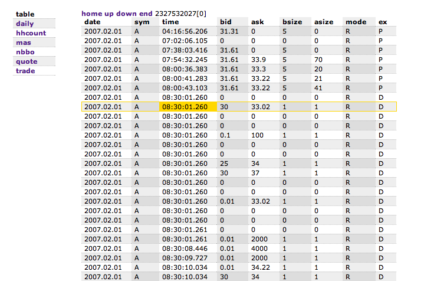

# Customizing the default webserver

Without changing anything in q you can make a kdb+ session serve up static content by creating a directory called `html` underneath your `QHOME` directory. This is the root server for the webserver (like the Apache `/var/www/html`) and is the place to save static content to be served up from kdb+. Try for example saving a `favicon.ico` file there and calling up a page.

The default location can be changed by setting the variable `.h.HOME`.

Every HTTP request that comes into a q session is handled by [.z.ph](../ref/dotz.md#zph-http-get "HTTP get"). By default it simply wraps the output from showing the data requested inside a fixed width tag (`xmp`) and sends it back. This is fast and simple, and will work in all browsers – even Internet Explorer – but makes it very difficult to apply any CSS styling to the data.

If you’re prepared to make changes, the sample code in 
<i class="fab fa-github"></i> 
[simongarland/doth](https://github.com/simongarland/doth) shows how to modify the `.z.ph` code to output table data as a simple HTML table, and then to add Javascript and CSS files to decorate the output. To use it, put the `doth.k` file in your `QHOME`, and the two `plaid.*` files in your `QHOME/html` directory – create it if necessary - then `\l doth.k`.

The JavaScript used to do the formatting of the rows and columns came from an article “Plaid-Striped HTML Tables” (no longer available), but the same thing could be done with any of the many other solutions you’ll find with a quick Google.

<i class="far fa-hand-point-right"></i> 
[Namespace `.h`](../ref/doth.md)