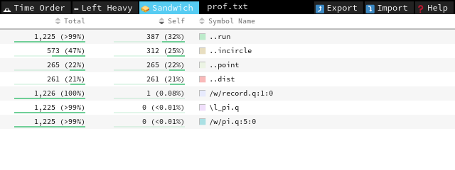
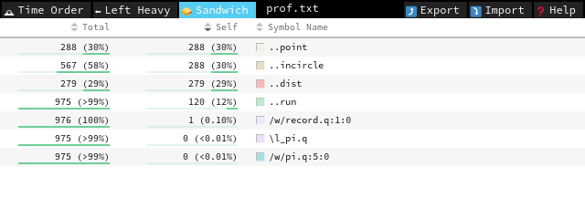

# :fontawesome-solid-code: Code profiler


??? info "Experimental feature :fontawesome-brands-linux:"

    Currently implemented for x86\_64 Linux (kdb+ `l64`).

Kdb+ 4.0 includes an experimental built-in call-stack snapshot primitive that allows building a sampling profiler.


A sampling profiler is a useful tool for low-overhead instrumentation of code performance characteristics. For inspiration, we have looked at tools like Linux [`perf`](http://www.brendangregg.com/perf.html).

A new function, [`.Q.prf0`](../ref/dotq.md#qprf0-code-profiler), returns a table representing a snapshot of the call stack at the time of the call in another kdb+ process.

!!! warning

    The process to be profiled must be started from the same binary as the one running `.Q.prf0`, otherwise `'binary mismatch` is signalled.

`.Q.prf0` stops the target process for the duration of snapshotting.

Time per call is mostly independent of call-stack depth. You should be able to do at least 100 samples per second with less than 5% impact on target process performance.

The profiler has mostly the same view of the call stack as the debugger. `.Q.prf0` returns a table with the following columns:

```txt
name    assigned name of the function
file    path to the file containing the definition
line    line number of the definition
col     column offset of the definition, 0-based
text    function definition or source string
pos     execution position (caret) within text
```

For example, given the following `/w/p.q`:

```q
.z.i
a:{b x};b:{c x}
c:{while[1;]}
a`
```

running it with `\q /w/p.q`, setting `pid` to the printed value, the following call-stack snapshot is observed (frames corresponding to system and built-in functions can be filtered out with the `.Q.fqk` predicate on file name):

```q
q)select from .Q.prf0 pid where not .Q.fqk each file
name  file     line col text          pos
-----------------------------------------
""    "/w/p.q" 4    0   "a`"          0
"..a" "/w/p.q" 2    2   "{b x}"       1
"..b" "/w/p.q" 2    10  "{c x}"       1
"..c" "/w/p.q" 3    2   "{while[1;]}" 7
```


## Permissions

By default on most Linux systems, a non-root process can only profile (using `ptrace`) its direct children. 

:fontawesome-solid-globe::
[Yama documentation](https://www.kernel.org/doc/Documentation/security/Yama.txt"kernel.org")

`\q` starts a child process, so you should be able to profile these with no system changes.

If you wish to profile unrelated processes, you have a few options:

-   change `kernel.yama.ptrace_scope` as detailed in the link above
-   give the q binary permission to profile other processes with

    `setcap cap_sys_ptrace+ep $QHOME/l64/q`

-   run the profiling q as root


## Usage

Typically a sampling profiler collects call-stack snapshots at regular intervals. It is convenient to use q’s timer for that:

```q
.z.ts:{0N!.Q.prf0 pid};system"t 10" /100Hz
```

There are a few toys provided. Their usages follow the same pattern: they accept a single argument, either a script file name to run, or a process ID to which to attach. In the former case, a new q process is started with `\q` running the specified file. Exit with `\\`.

:fontawesome-solid-download: [`top.q`](assets/top.q "Download")

: shows an automatically updated display of functions most heavily contributing to the running time (as measured by number of samples in which they appear). `self` is the percentage of time spent in the function itself; `total` includes all descendants.

:fontawesome-solid-download: [`record.q`](assets/record.q "Download")

: writes the samples to disk in a splayed table `prof`, one sample per row.

With `prof` thus recorded, try

```q
`:prof.txt 0:(exec";"sv'ssr[;"[ ;]";"_"]each'name from`:prof),\:" 1"
```

to generate `prof.txt` suitable for feeding into
[FlameGraph](https://github.com/brendangregg/FlameGraph/blob/master/flamegraph.pl) or [speedscope](https://speedscope.app) for visualization.


## Walkthrough

Let’s apply the profiler to help us optimize an extemely naïve implementation of Monte-Carlo estimation of π. We'll use `record.q` and speedscope as described above.

Start with the following `/w/pi.q` consisting of purely scalar code:

```q
point:{-1+2?2.}
dist:{sqrt sum x*x}
incircle:{1>dist x}
run:{n:0;do[x;n+:incircle point[]];4*n%x}
\t 0N!run 10000000
```

This takes ~12s on a commodity laptop. Get the profile (running `q record.q /w/pi.q`), convert to `prof.txt` and open the result in speedscope. All three tabs offer useful views of the execution profile:

- *Time Order* presents call stack
- *Left Heavy* aggregates similar call stacks together, like FlameGraph
- *Sandwich* shows an execution profile similar to `top.q`

In this very simple case, *Sandwich* suffices, but feel free to explore different representations.



`run` takes most of the time (`Self` column), and we can improve it by getting rid of the scalar loop:

```q
run:{4*(sum incircle each point each til x)%x}
```

This gets us a modest increase in performance, and looking at the profile again:



we see that `run` no longer dominates the profile; now `point` and `incircle` do. We note that `incircle` is already vectorized, so we should focus on getting a better random-point sampling function.

```q
points:{2 0N#-1+(2*x)?2.}
run:{4*(sum incircle points x)%x}
```

This runs in ~400ms – around a 30× improvement. The rest is left as an exercise for the reader.

