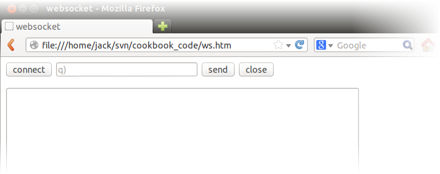
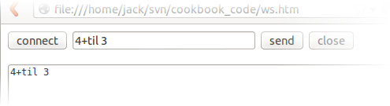
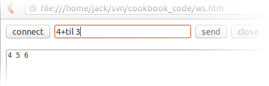

# :fontawesome-solid-handshake: WebSockets


## Simple WebSocket server example

[V3.0](../releases/ChangesIn3.0.md) supports the WebSocket protocol.

To get your browser and kdb+ talking on a WebSocket, start a q session listening on port 5000, and set its WebSocket handler `.z.ws` to echo whatever it receives.

```q
q)\p 5000
q).z.ws:{neg[.z.w] x}
```

Download 
:fontawesome-brands-github: 
[KxSystems/cookbook/ws.htm](https://github.com/KxSystems/cookbook/blob/master/ws.htm), 
a simple WebSocket client, and open it in a WebSocket-capable browser. You should see something like this:



Now click _connect_ and type e.g. `4+til 3` in the edit box. Hit Enter or click _send_. Note that it is echoed in the output text area.




### How it works

Kdb+ serves all protocols on the same port and the WebSocket protocol is no exception. [`.z.ws`](../ref/dotz.md#zws-websockets) is called for every message sent from the client (browser). The handler `{neg[.z.w]x}` echoes the message back to the client.


## Doing something useful

We just need to set [`.z.ws`](../ref/dotz.md#zws-websockets) to do something useful. In your q session, define:

```q
.z.ws:{neg[.z.w].Q.s value x}
```

Then try typing `4+til 3` in the edit box and click _send_. You will see a result this time:



To enable error reporting, try:

```q
.z.ws:{neg[.z.w]@[.Q.s value@;x;{`“`'`”`,x,`“`\n`”`}]}
```


## `c.js` (no AJAX required)

`c.js` provides functions `serialize` and `deserialize` to simplify IPC between the browser and a kdb+ server. An example, `wslogin.htm` shows how to send a JavaScript dictionary to kdb+. It receives an echo of the dictionary and turns it back into a JavaScript dictionary.

To run this example

1.  restart the server
1.  download `wslogin.htm` and `c.js` to the same location
1.  open `wslogin.htm` in your browser

A byte vector is passed to `.z.ws` when using the `c.js` function `serialize`. To decode a *serialized* string, use `-9!` and to encode, use `-8!`.

```q
q).z.ws:{neg[.z.w] -8!value -9!x;}
```

Note that the above functions for `.z.ws` won't work when using serialize/deserialize. To handle both byte and char, check for the type of the input.

This example works, because the default `.z.ws` echoes the byte vector over the WebSocket.

:fontawesome-solid-download: Downloads:

-   :fontawesome-brands-github: [KxSystems/kdb/c/c.js](https://github.com/KxSystems/kdb/blob/master/c/c.js)
-   :fontawesome-brands-github: [KxSystems/cookbook/wslogin.htm](https://github.com/KxSystems/cookbook/blob/master/wslogin.htm)


## JSON

A small utility to parse and generate JSON is shipped in `q.k`. (Since V3.2 2014.08.22.) For prior releases, it can be found at:
:fontawesome-brands-github: 
[KxSystems/kdb/e/json.k](https://github.com/KxSystems/kdb/blob/master/e/json.k)

After loading `json.k`, example data is in `.j.x`

```q
q).j.x
C    b j z                      
--------------------------------
"as" 0                          
""   1 2 2014.05.08T16:45:16.025
q).j.j .j.x / convert q data to json
"[{\"C\":\"as\",\"b\":false,\"j\":null,\"z\":\"\"},{\"C\":\"\",\"b\":true,\"j\":2,\"z\":\"2014-05-08T16:45:16.025\"}]"
q)-1 .j.j .j.x; / pretty display
[{"C":"as","b":false,"j":null,"z":""},{"C":"","b":true,"j":2,"z":"2014-05-08T16:45:16.025"}]
q).j.k .j.j .j.x / convert json to q
C    b j z                        
----------------------------------
"as" 0   ""                       
""   1 2 "2014-05-08T16:45:16.025"
```


### Multi-line data

If your JSON data is spread over multiple lines, reduce those to a single char vector with `raze`.

```bash
$ cat t1.json 
{
    "code" : 3,
    "message" : "This request requires authorization"
}
```

```q
q).j.k raze read0 `:t1.json
code   | 3f
message| "This request requires authorization"
```

Otherwise you’ll encounter an error similar to:

```q
q).j.k read0 `:t1.json
k){=\~("\"=-1_q,x)<q=x}
'length
<
(0b;,0b;000000000000b;00000000000000000000000000000000000000000000000000b)
(,0b;010000100000b;01000000010001000000000000000000000000000000000001b;,0b)
q.j))\\
```


## Compression

V3.2t 2014.05.08 added ‘permessage-deflate’ WebSockets compression. One way to observe whether compression is active on a connection is to observe the queued data. For example

```q
/ generate some compressible data
q)v:10000#.Q.a 
/ queue 1000 msgs to an existing websocket handle
/ and observe the queue
q)\ts do[1000;(-5)v];show sum each .z.W
5| 10004000
6| 0
14 20610976
/ now do same again, but this time with a handle which requested compression
q)\ts do[1000;(-6)v];show sum each .z.W
5| 0
6| 47022
94 4354944
```

Here we can see the uncompressed data was quicker to add to the queue, and consumed more memory overall. The compressed data took longer to queue, and in this case was 200× smaller. Compression speed and ratio achieved will depend on your data.

In Chrome you can also observe the network handshake in _View&gt;Developer&gt;Developer tools_; a successful negotiation will have `“Sec-WebSocket-Extensions:permessage-deflate”` in the HTTP response header.


## Simple WebSocket client example

Since V3.2t 2014.07.26, q can also create a WebSocket connection, i.e. operate as a client as well as a server.

`.z.ws` must be defined before opening a WebSocket.

```q
q).z.ws:{0N!x;} / print incoming msgs to console, no echo.
```

A WebSocket can be created with the syntax

```q
q)r:(`$":ws://host:port")"GET / HTTP/1.1\r\nHost: host:port\r\n\r\n"
```

If successful it will return a 2-item list of (handle;HTTP response), e.g.

```q
(3i;"HTTP/1.1 101 Switching Protocols\r\nConnection: Upgrade\r\nUpgrade: websocket\r\nSec-WebSocket-Accept: HSmrc0sMlYUkAGmm5OPpG2HaGWk=\r\nSec-WebSocket-Extensions: permessage-deflate\r\n\r\n")
```

and from that point on will call back via `.z.ws` when messages arrive. To send messages, use

```q
q)neg[handle]"text" / a char vector
```

or

```q
q)neg[handle]0x010203 / a bytevector
```

If the protocol upgrade from HTTP to WebSocket failed, it returns the 2-item list, with the handle as `0Ni`, e.g.

```q
(0Ni;"HTTP/1.1 400 Bad Request\r\nContent-Type: text/html; charset=UTF-8...")
```

The response text is returned for debug purposes only; ideally, you need only be concerned whether the handle is valid.

Any other error is signalled as usual, e.g.

```q
'www.nonexist.badcom: No route to host
```

Should you need to use WebSockets over SSL, e.g. `wss://host:port`, consider stunnel, and open from kdb+ to that stunnel with `ws://`. Basic Authentication can be passed in the char vector on opening, along with any other necessary fields such as cookies etc.

Both client and server support permessage-deflate compression.


## Secure sockets: stunnel

[Stunnel](https://en.wikipedia.org/wiki/Stunnel) :fontawesome-brands-wikipedia-w: will provide secure sockets (TLS/SSL) using the OpenSSL library. Stunnel will take any WebSocket server, HTTP server, or similar and secure it – you get `https://` and `wss://` for free.

:fontawesome-brands-github: 
[cesanta/ssl_wrapper](https://github.com/cesanta/ssl_wrapper)


## UTF-8 encoding

The WebSocket requires that text is UTF-8 encoded. If you try to send invalidly encoded text it will signal `'utf8`.

:fontawesome-solid-book: 
[Namespace `.h`](../ref/doth.md)

----
:fontawesome-regular-map:
[Kdb+ and WebSockets](../wp/websockets/index.md)
<br>
:fontawesome-solid-street-view:
_Q for Mortals_
[§11.7.2 Basic WebSockets](/q4m3/11_IO/#1172-basic-websockets)
