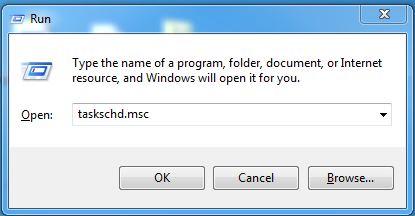
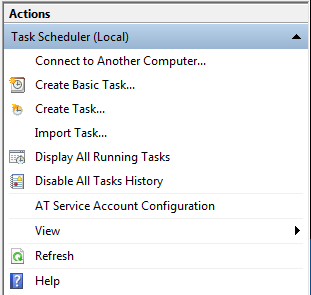
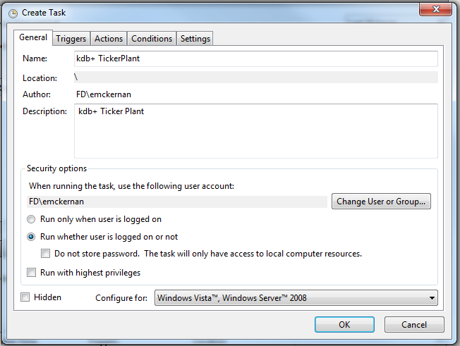
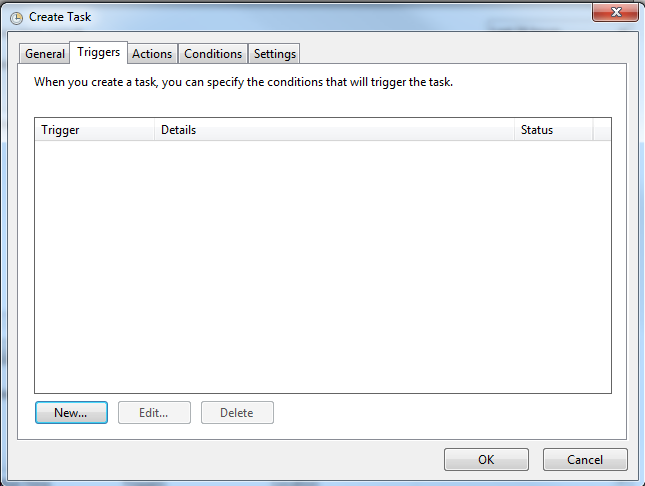
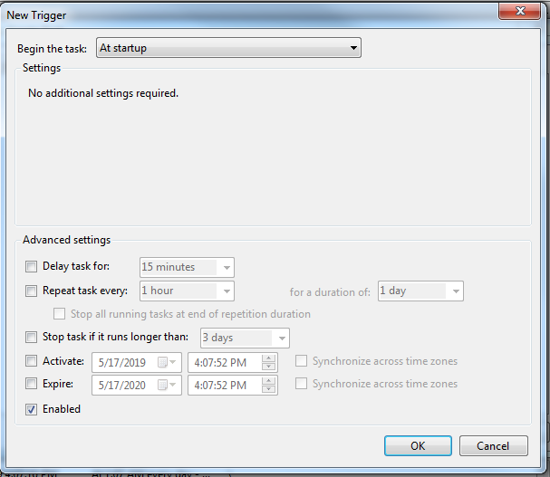
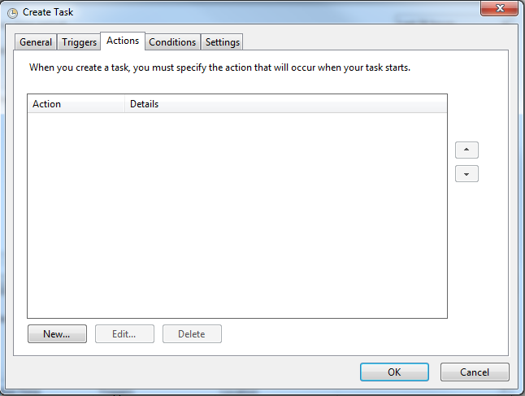
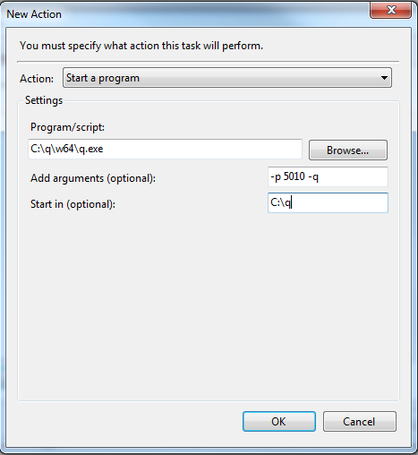
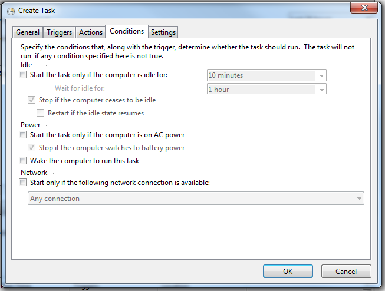
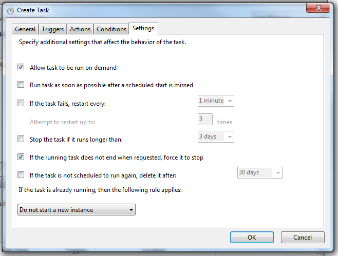
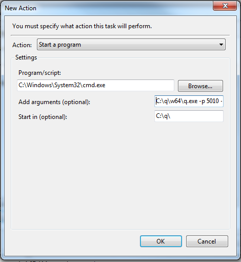

# Running kdb+ as a service on Windows


Windows 7+ provides a task scheduler tool which can be used to run kdb+
processes as services.

To schedule a kdb+ process to start on startup:

1.  Press the <i class="fab fa-windows"></i>+R keys to open Run.

2.  Type `taskschd.msc` and press Enter.
    
    

3.  Under _Actions_ select _Create Task_.
    
    

4.  Enter a name and description for your task. Select the user under
    which the task should be run, and if the user should be logged on
    for the task to run. If you would like the process to be hidden,
    select the hidden option.
    
    

5.  Add a trigger to start the task on system startup:
    
    1.  First click _New_ under the triggers tab.
        
        
    
    2.  Select _At startup_ under _Begin the task_.
        
        

6.  Select the actions the task should take before:
    
    3.  Click _New_ under the _Actions_ tab.
        
        
    
    4.  Select `q.exe` with any command-line arguments and the folder
        which the process should start in.
        
        

7.  Set any required conditions.
    
    

8.  Configure any required settings.
    
    

9.  When the task is complete, press _OK_.


## Output redirect

If you need to redirect output you must modify the action using
the following configuration:



The arguments should be

```bat
/c C:\\q\\w64\\q.exe -p 5010 -q >C:\\q\\logs\\q.5010.log
```

Note the directory for logs must exist.


## Multiple processes

If you want to set up several instances, the steps required are slightly
different. Rather than configure the task to run `q.exe`, instead
create a `.bat` file to start multiple kdb+ processes in the background
and run this from the task. 

Example:

```bat
start "q5010" /B cmd.exe /c C:\\q\\w64\\q.exe -p 5010 -q >C:\\q\\logs\\q.5010.log
start "q5011" /B q testScript.q -q
```

In this way you can set up on Windows a complete kdb+ process that
starts all the required processes in the correct order.
