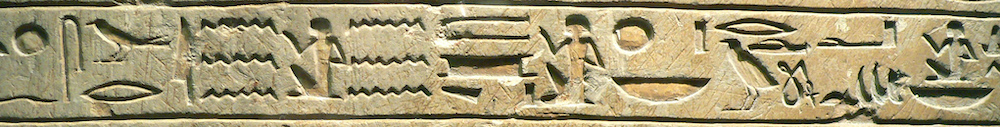

# :fontawesome-solid-book-reader: Origins

The q language derives from the notation devised by Harvard mathematician [Kenneth E. Iverson](https://en.wikipedia.org/wiki/Kenneth_E._Iverson).

Many powerful techniques for programming in q originally appeared in earlier Iversonian languages, which can reward study by q programmers.

[Try APL](https://tryapl.org)

: APL (A Programming Language) was the first language derived from Iverson notation. At this site you can see it with its original elegant symbols. 

[Jsoftware wiki](https://code.jsoftware.com/wiki/Main_Page)

: J was Iverson’s from-the-ground-up reboot of APL in 1990.

[no stinking loops](http://www.nsl.com) 

: Stevan Apter’s personal website is a treasure chest for k programmers.

[_Vector_](https://vector.org.uk) 

: The journal of the British APL Association has recorded work in the Iversonian languages since 1984.

## :fontawesome-solid-graduation-cap: History

-   [AKQJ大师](https://mp.weixin.qq.com/s/QPaDWavuZzCQIPSZ9FrACQ)
-   [Kx Systems: A Historical Need for Speed](https://www.datanami.com/2020/10/29/kx-systems-a-historical-need-for-speed/), _Datanami_, October 2020
-   [APL Since 1978](/download/3386319.pdf), Proc. ACM Program. Lang., Vol. 4, No. HOPL, Article 69. June 2020
-   [Stages of Denial](http://beyondloom.com/blog/denial.html), John Earnest, March 2020
-   [Vector processing languages: the future of Big Data analytics and real-time business intelligence](http://conceptualorigami.blogspot.com/2010/12/vector-processing-languages-future-of.html), _Conceptual Origami_, 2010
-   [A conversation with Arthur Whitney](https://queue.acm.org/detail.cfm?id=1531242), ACM, 2009
-   [An interview with Arthur Whitney](https://kx.com/blog/arthur-whitney-talks/), KX, 2004

## :fontawesome-solid-archive: Archive

-   [Abridged q language manual](https://legaldocumentation.kx.com/q/d/q.htm), Arthur Whitney, 2009
-   [Abridged kdb+ database manual](https://legaldocumentation.kx.com/q/d/kdb+.htm), Arthur Whitney, 2006
-   [Kdb+ database reference manual](https://legaldocumentation.kx.com/q/d/kdb+1.htm), Don Orth, 2006
-   [Q language reference manual](https://legaldocumentation.kx.com/q/d/q1.htm), Don Orth, 2006
-   [Abridged kdb+tick manual](https://legaldocumentation.kx.com/q/d/tick.htm), Arthur Whitney, 2005
-   [Abridged kdb+taq manual](https://legaldocumentation.kx.com/q/d/taq.htm), Arthur Whitney, 2005
-   [Kdb+ database and language primer](https://legaldocumentation.kx.com/q/d/primer.htm), Dennis Sasha, 2005

