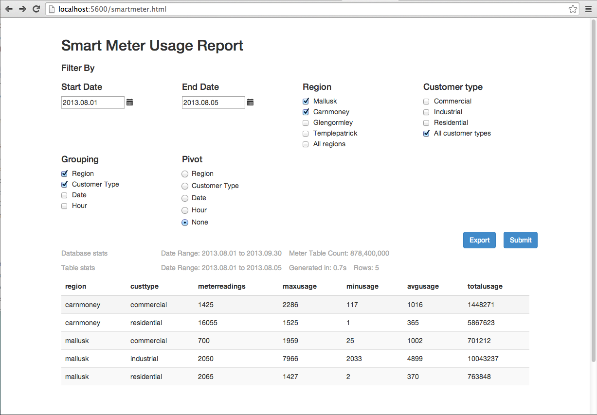

# A brief introduction to q and kdb+ for analysts


Kdb+ is a powerful database that can be used for streaming, real-time and historical data. Q is the SQL-like, general-purpose programming language built on top of kdb+. It offers high-performance, in-database analytic capabilities.

:fontawesome-regular-hand-point-right: [Get started](install.md) to download and install kdb+.


## Launch q

At the shell prompt, type `q` to start a q console session, where the prompt `q)` will appear.

```bash
$ q
KDB+ 3.6 2018.10.23 Copyright (C) 1993-2018 Kx Systems
m32/ 8()core 16384MB sjt max.local 192.168.0.17 NONEXPIRE

q)
```


## Create a table

To begin learning q, we will create a simple table. To do this, type or copy the code below into your q session. (Don’t copy or type the `q)` prompt.)

```q
q)n:1000000
q)item:`apple`banana`orange`pear
q)city:`beijing`chicago`london`paris
q)tab:([]time:asc n?0D0;n?item;amount:n?100;n?city)
```

These expressions create a table called `tab` which contains a million rows and 4 columns of random time-series sales data. (For now, understanding these lines of code is not important.)


## Simple query

The first query we run selects all rows from the table where the item sold is a banana.

```q
q)select from tab where item=`banana 
time                 item   amount city
------------------------------------------
0D00:00:00.466201454 banana 31     london 
0D00:00:00.712388008 banana 86     london 
0D00:00:00.952962040 banana 20     london 
0D00:00:01.036425679 banana 49     chicago
0D00:00:01.254006475 banana 94     beijing
..
```

Notice all columns in the table are returned in the result when no column is explicitly mentioned.


## Aggregate query

The next query calculates the sum of the amounts sold of all items by each city.

```q
q)select sum amount by city from tab                                            
city   | amount  
-------| --------
beijing| 12398569
chicago| 12317015
london | 12375412
paris  | 12421447
```

This uses the aggregate function `sum` within the q language. Notice this returns a keyed table where the key column is `city`. This key column is sorted in alphabetical order.


## Time-series aggregate query

The following query shows the sum of the amount of each item sold by hour during the day.

```q
q)select sum amount by time.hh,item from tab 
hh item  | amount
---------| ------
0  apple | 522704
0  banana| 506947
0  orange| 503054
0  pear  | 515212
1  apple | 513723
..
```

The result is a _keyed table_ with two key columns, `hh` for the hour and `item`. The results are ordered by the keyed columns. The query extracts the hour portion from the nanosecond-precision time column by adding a `.hh` to the column name.

Congratulations, you created and queried your first q table!


## In-memory queries

This tutorial shows you q in action on some randomly-generated in-memory data. If you are new to q you won’t understand all the syntax – but you can get a flavour of the language and its performance. 

You can run each of these queries in the free versions of kdb+. You can paste each line of code into a session and run it. To time the performance of an operation, prepend `\t`.

```q
q)\t select from table
```

The dataset is from a fictional computer-monitoring application. A company owns a set of desktop computers and monitors the CPU usage minute by minute. Users of the desktop computers can register calls with a help desk if they hit problems.

!!! tip "Limited memory"

    If your computer has limited memory, it’s advisable to start q with the [`-g 1` command line flag](../basics/cmdline.md#-g-garbage-collection "garbage collection") to minimize memory use. You can also periodically invoke garbage collection with [`.Q.gc`](../ref/dotq.md#qgc-garbage-collect "garbage collect").


### Random data generation

The script `calls.q` below will generate some semi-realistic random data. It is quite complex for beginners – don’t dwell on it!  

```q
/ calls.q
/ Generate some random computer statistics (CPU usage only)
/ You can modify n (number of unique computers), timerange (how long the data is for)
/ freq (how often a computer publishes a statistic) 
/ and calls (the number of logged calls)
n:1000; timerange:5D; freq:0D00:01; calls:3000
depts:`finance`packing`logistics`management`hoopjumping`trading`telesales
startcpu:(til n)!25+n?20 
fcn:n*fc:`long$timerange%freq

computer:([]
    time:(-0D00:00:10 + fcn?0D00:00:20)+fcn#(.z.p - timerange)+freq*til fc; 
    id:raze fc#'key startcpu
    )
computer:update `g#id from `time xasc update cpu:{
    100&3|startcpu[first x]+sums(count x)?-2 -1 -1 0 0 1 1 2
    }[id] by id from computer

/ Generate some random logged calls
calls:([] 
    time:(.z.p - timerange)+asc calls?timerange; 
    id:calls?key startcpu; 
    severity:calls?1 2 3
    )

/ Create a lookup table of computer information
computerlookup:([id:key startcpu] dept:n?depts; os:n?`win7`win8`osx`vista)
```

:fontawesome-solid-download: Download [`calls.q`](assets/calls.q) into your `QHOME` folder, then [load it](../basics/syscmds.md#l-load-file-or-directory):

```q
q)\l calls.q
```

Each desktop reports its CPU usage every minute (the computer table). The CPU usage is a value between 3% and 100%, and moves by between -2 and +2 between each sample period. The data is generated over a 5-day period, for 1000 machines. You can modify the number of machines, time range and sample frequency.

Call records (the `calls` table) are generated with a severity whenever a user reports a problem. A call record has different severity levels possible. 3000 call records are generated in the 5-day period.

Static information (the `computerlookup` table) is stored about each desktop computer, keyed by `id`. Here, this is just the department the machine belongs to and the operating system.


### Data overview

The generated data looks like this:

```q
q)computer
time                          id  cpu
-------------------------------------
2014.05.09D12:25:32.391350534 566 24 
2014.05.09D12:25:32.415609466 477 39 
2014.05.09D12:25:32.416150345 328 41 
2014.05.09D12:25:32.476874123 692 38 
2014.05.09D12:25:32.542837079 157 33 
2014.05.09D12:25:32.553545142 997 33 
2014.05.09D12:25:32.557224705 780 43 
..

q)calls
time                          id  severity
------------------------------------------
2014.05.09D12:28:29.436601608 990 1       
2014.05.09D12:28:32.649418621 33  2       
2014.05.09D12:28:33.102242558 843 1       
2014.05.09D12:29:52.791007667 16  2       
2014.05.09D12:32:43.289881705 776 3       
2014.05.09D12:35:06.373595654 529 3       
2014.05.09D12:38:53.922653108 766 1       
..

q)computerlookup
id| dept        os   
--| -----------------
0 | trading     win8 
1 | trading     osx  
2 | management  win7 
3 | finance     vista
4 | packing     win8 
5 | telesales   vista
6 | hoopjumping win8 
..

/ The counts of each table
q)tables[]!count each value each tables[]
calls         | 3000
computer      | 7200000
computerlookup| 1000
```


### Aggregation queries

Q is much used to aggregate across large datasets. For these examples, we will use simple aggregators (`max`, `min`, `avg`) and concentrate on doing complex things in the by-clause. One of the most powerful features of q is its ability to extend the query language with user-defined functions – so we can easily build custom aggregators.

For the first example, we will calculate the maximum, minimum and average CPU usage for every machine, across the whole data set:

```q
q)select mxc:max cpu,mnc:min cpu,avc:avg cpu by id from computer
id| mxc mnc avc     
--| ----------------
0 | 63  3   22.92236
1 | 42  3   4.679444
2 | 37  3   4.239167
3 | 100 3   41.52431
4 | 100 3   79.00819
5 | 56  3   6.349028
6 | 96  3   30.41361
..
```

We can also do this for every date, by extracting the date component from the time field:

```q
q)select mxc:max cpu,mnc:min cpu,avc:avg cpu by id,time.date from computer
id date      | mxc mnc avc     
-------------| ----------------
0  2014.05.09| 42  6   23.86331
0  2014.05.10| 34  3   8.539583
0  2014.05.11| 45  3   7.48125 
0  2014.05.12| 63  21  43.95   
0  2014.05.13| 49  8   27.98403
0  2014.05.14| 48  12  29.26309
1  2014.05.09| 42  3   16.02158
..
```

Similarly, we can do this for the time portion. The code below will aggregate across hours in different days:

```q
q)select mxc:max cpu,mnc:min cpu,avc:avg cpu by id,time.hh from computer
id hh| mxc mnc avc     
-----| ----------------
0  0 | 47  3   24.64667
0  1 | 57  3   23.04667
0  2 | 57  3   24.28   
0  3 | 58  3   26.08333
0  4 | 53  3   22.53333
0  5 | 54  3   22.01333
0  6 | 56  3   23.38667
..
```

If that is not what is required, we can combine the aggregations to aggregate across each hour in each date separately:

```q
q)select mxc:max cpu,mnc:min cpu,avc:avg cpu by id,time.date,time.hh from computer
id date       hh| mxc mnc avc     
----------------| ----------------
0  2014.05.09 12| 42  32  37.28571
0  2014.05.09 13| 35  17  25      
0  2014.05.09 14| 32  20  23.3    
0  2014.05.09 15| 38  27  32.28333
0  2014.05.09 16| 38  19  29.55   
0  2014.05.09 17| 23  15  20.1    
0  2014.05.09 18| 31  20  26.03333
..
```

Or alternatively we can use the [xbar](../ref/xbar.md) keyword to break the time list into buckets of any size. This is equivalent to the `by id,time.date,time.hh` query above, but is more efficient and has extra flexibility – the bucketing can be any size, all the way down to nanoseconds:

```q
q)select mxc:max cpu,mnc:min cpu,avc:avg cpu by id,0D01:00:00.0 xbar time from computer
id time                         | mxc mnc avc     
--------------------------------| ----------------
0  2014.05.09D12:00:00.000000000| 42  32  37.28571
0  2014.05.09D13:00:00.000000000| 35  17  25      
0  2014.05.09D14:00:00.000000000| 32  20  23.3    
0  2014.05.09D15:00:00.000000000| 38  27  32.28333
0  2014.05.09D16:00:00.000000000| 38  19  29.55   
0  2014.05.09D17:00:00.000000000| 23  15  20.1    
0  2014.05.09D18:00:00.000000000| 31  20  26.03333
..
```

Another approach to breaking up the day might be to define a set of “daily periods”, e.g. early morning is from 00:00 to 07:00, midmorning is from 07:00 to 12:00, lunch is from 12:00 to 13:30, afternoon is from 13:30 to 17:00 and evening is after 17:00. We can aggregate the data according to these groupings by creating a function to map a minute value to a period of the day. This user-defined function drops in to the `select` statement in the same way as any built-in function.

```q
q)timeofday:{`0earlymorn`1midmorn`2lunch`3afternoon`4evening 00:00 07:00 12:00 13:30 17:00 bin x}
q)select mxc:max cpu,mnc:min cpu,avc:avg cpu by id,time.date,tod:timeofday[time.minute] from computer
id date       tod       | mxc mnc avc     
------------------------| ----------------
0  2014.05.09 2lunch    | 42  25  33.29231
0  2014.05.09 3afternoon| 38  17  27.37619
0  2014.05.09 4evening  | 33  6   20.64762
0  2014.05.10 0earlymorn| 34  7   17.22619
0  2014.05.10 1midmorn  | 19  3   9.386667
0  2014.05.10 2lunch    | 8   3   3.933333
0  2014.05.10 3afternoon| 4   3   3.009524
..
```

We can also generate an average usage profile in the date range for each time of day across all desktop machines. First, we aggregate the data and calculate the totals for each day in each time period. Then, we re-aggregate the data to get an average usage across all days.

```q
q)select avc:sum[cpu]%sum samplecount by tod from select sum cpu,samplecount:count cpu by time.date,tod:timeofday[time.minute] from computer
tod       | avc     
----------| --------
0earlymorn| 42.04672
1midmorn  | 42.71953
2lunch    | 41.27816
3afternoon| 40.7399 
4evening  | 41.12103
```

!!! detail "A simplification"

    With this dataset, we can do as below. However, this only holds because there are exactly the same number of records for each time period in each day. If this were not the case (as is likely with a real dataset) then we must do as above.

```q
q)select avg cpu by tod:timeofday[time.minute] from computer
tod       | cpu     
----------| --------
0earlymorn| 42.04672
1midmorn  | 42.71953
2lunch    | 41.27816
3afternoon| 40.7399 
4evening  | 41.12103
```


### Joins

[Joins](../basics/joins.md) are very fast in q. Most q databases do not rely heavily on pre-defined foreign-key relationships between tables, as is common in standard RDMSs. Instead, ad-hoc joins are used. As an example, [`lj` (left join)](../ref/lj.md) can be used join the `computerlookup` table to either the `computer` or `calls` table to show the static data on each computer `id`.

```q
q)calls lj computerlookup
time                          id  severity dept        os   
------------------------------------------------------------
2014.05.09D12:28:29.436601608 990 1        hoopjumping win7 
2014.05.09D12:28:32.649418621 33  2        telesales   win8 
2014.05.09D12:28:33.102242558 843 1        management  win7 
2014.05.09D12:29:52.791007667 16  2        management  win7 
2014.05.09D12:32:43.289881705 776 3        packing     vista
2014.05.09D12:35:06.373595654 529 3        management  vista
2014.05.09D12:38:53.922653108 766 1        hoopjumping win7 
..
```

We can then perform aggregations using this static data – for example, count calls by severity and department:

```q
q)select callcount:count i by severity,dept from calls lj computerlookup
severity dept       | callcount
--------------------| ---------
1        finance    | 152      
1        hoopjumping| 148      
1        logistics  | 127      
1        management | 152      
1        packing    | 162      
1        telesales  | 122      
1        trading    | 130      
..
```

Alternatively, we can enforce a [foreign-key](/q4m3/8_Tables/#85-foreign-keys-and-virtual-columns) relationship and use that: 

```q
q)update `computerlookup$id from `calls
`calls
q)select callcount:count i by id.os,id.dept,severity from calls
os  dept        severity| callcount
------------------------| ---------
osx finance     1       | 41       
osx finance     2       | 48       
osx finance     3       | 39       
osx hoopjumping 1       | 44       
osx hoopjumping 2       | 49       
osx hoopjumping 3       | 37       
osx logistics   1       | 29       
..
```


### Time joins

Now this is where it gets interesting…

Q has some specialized time joins. The joins aren’t restricted to time fields (any numeric type will work) but that is what they are predominantly used for. The first, [`aj` (asof join)](../ref/aj.md) is used to align two tables, aligning the prevailing value from the value table with each record in the source table.

It’s probably easier to explain with an example. For our dataset, let’s say that for every helpdesk call we have received we want to get the prevailing data from the computer table (i.e. when the user called the help desk, what was the CPU reading from the computer). We can't use an `lj` here because the time fields are very unlikely to match exactly – so instead we use an `aj` to get the last value from the computer table prior to the record in the call table. Like this:

```q
q)aj[`id`time;calls;computer]
time                          id  severity cpu
----------------------------------------------
2014.05.09D12:28:29.436601608 990 1        36 
2014.05.09D12:28:32.649418621 33  2        28 
2014.05.09D12:28:33.102242558 843 1        37 
2014.05.09D12:29:52.791007667 16  2        41 
2014.05.09D12:32:43.289881705 776 3        29 
2014.05.09D12:35:06.373595654 529 3        24 
2014.05.09D12:38:53.922653108 766 1        31 
..
```

Q also has a [window join `wj`](../ref/wj.md). A window join is a generalization of an `asof` join. Instead of selecting the prevailing value, it allows you to apply any aggregation within a window around a source record. An example for the dataset we are dealing with would be to work out the maximum and average CPU usage for each computer in a window around the call time. For example, we can specify a window of 10-minutes-before to 2-minutes-after each call, and calculate the maximum and average CPU usage (the `wj` code is slightly more complicated than `aj` as some rules have to be adhered to):

```q
q)p:update `p#id from `id xasc computer
q)wj[-0D00:10 0D00:02+\:calls.time; `id`time; calls; (p;(max;`cpu);(avg;`cpu))]
time                          id  severity cpu cpu     
-------------------------------------------------------
2014.05.09D12:28:29.436601608 990 1        37  35.6    
2014.05.09D12:28:32.649418621 33  2        29  27.6    
2014.05.09D12:28:33.102242558 843 1        38  36.8    
2014.05.09D12:29:52.791007667 16  2        42  41.14286
2014.05.09D12:32:43.289881705 776 3        31  29.55556
2014.05.09D12:35:06.373595654 529 3        29  26.5    
2014.05.09D12:38:53.922653108 766 1        40  35.23077
..
```


## On-disk queries

The linked scripts allow you to build an on-disk database and run some queries against it. The database is randomly-generated utility (smart-meter) data for different customers in different regions and industry sectors, along with some associated payment information. The idea is to allow you to see some of the q language and performance. There is more information in the `README` file. 

:fontawesome-brands-github: [KxSystems/cookbook/tutorial](https://github.com/KxSystems/cookbook/tree/master/tutorial)


### Building the database

The database is built by running the `buildsmartmeterdb.q` script. You can vary the number of days of data to build, and the number of customer records per day. When you run the script, some information will be printed. Type

```q
go[]
```

to proceed.

```bash
$ q buildsmartmeterdb.q 
KDB+ 3.1 2014.05.03 Copyright (C) 1993-2014 Kx Systems
This process is set up to save a daily profile across 61 days for 100000 random customers with a sample every 15 minute(s). 
This will generate 9.60 million rows per day and 585.60 million rows in total
Uncompressed disk usage will be approximately 224 MB per day and 13664 MB in total
Compression is switched OFF
Data will be written to :./smartmeterDB

To modify the volume of data change either the number of customers, the number of days, or the sample period of the data.  Minimum sample period is 1 minute
These values, along with compression settings and output directory, can be modified at the top of this file (buildsmartmeterdb.q)
```

To proceed, type `go[]`

```q
q)go[]                                                                                                    
2014.05.15T09:17:42.271 Saving static data table to :./smartmeterDB/static
2014.05.15T09:17:42.291 Saving pricing tables to :./smartmeterDB/basicpricing and :./smartmeterDB/timepricing
2014.05.15T09:17:42.293 Generating random data for date 2013.08.01
2014.05.15T09:17:47.011 Saving to hdb :./smartmeterDB
2014.05.15T09:17:47.775 Save complete
2014.05.15T09:17:47.776 Generating random data for date 2013.08.02
2014.05.15T09:17:52.459 Saving to hdb :./smartmeterDB
2014.05.15T09:17:53.196 Save complete
2014.05.15T09:17:53.196 Generating random data for date 2013.08.03
2014.05.15T09:17:58.006 Saving to hdb :./smartmeterDB
2014.05.15T09:17:58.734 Save complete
2014.05.15T09:17:58.734 Generating random data for date 2013.08.04
2014.05.15T09:18:03.438 Saving to hdb :./smartmeterDB
2014.05.15T09:18:04.194 Save complete

…

2014.05.15T09:23:09.689 Generating random data for date 2013.09.30
2014.05.15T09:23:14.503 Saving to hdb :./smartmeterDB
2014.05.15T09:23:15.266 Save complete
2014.05.15T09:23:15.271 Saving payment table to :./smartmeterDB/payment/

2014.05.15T09:23:15.281 HDB successfully built in directory :./smartmeterDB
2014.05.15T09:23:15.281 Time taken to generate and store 585.60 million rows was 00:05:33
2014.05.15T09:23:15.281 or 1.76 million rows per second
```


### Running the queries

Once the database has been built, you can start the tutorial by running `smartmeterdemo.q`. This will print an overview of the database, and a lot of information as to how to step through the queries. Each query will show you the code, a sample of the results, and timing and memory usage information for the query. You can also see the code in `smartmeterfunctions.q`. (You will also see comments in the code in this script which should help explain how it works.) 

```bash
$ q smartmeterdemo.q 
KDB+ 3.1 2014.05.03 Copyright (C) 1993-2014 Kx Systems
DATABASE INFO
-------------
This database consists of 5 tables.
It is using 0 secondary processes.
There are 61 date partitions. 
```

To start running queries, execute `.tut.n[]`.

```q
…

Run .tut.help[] to redisplay the below instructions
Start by running .tut.n[].

.tut.n[]     : run the Next example
.tut.p[]     : run the Previous example
.tut.c[]     : run the Current example
.tut.f[]     : go back to the First example
.tut.j[n]    : Jump to the specific example
.tut.db[]    : print out database statistics
.tut.res     : result of last run query
.tut.gcON[]  : turn garbage collection on after each query
.tut.gcOFF[] : turn garbage collection off after each query
.tut.help[]  : display help information
\\           : quit

q).tut.n[]

**********  Example 0  **********

Total meter usage for every customer over a 10 day period

Function meterusage has definition:

{[startdate; enddate]
 
 start:select first usage by meterid from meter where date=startdate;
 end:select last usage by meterid from meter where date=enddate;
 
 end-start}

2014.05.15T09:27:55.260 Running: meterusage[2013.08.01;2013.08.10]
2014.05.15T09:27:56.817 Function executed in 1557ms using 387.0 MB of memory

Result set contains 100000 rows.
First 10 element(s) of result set:

meterid | usage   
--------| --------
10000000| 3469.449
10000001| 2277.875
10000002| 4656.111
10000003| 2216.527
10000004| 2746.24 
10000005| 2349.073
10000006| 3599.034
10000007| 2450.384
10000008| 1939.314
10000009| 3934.089

Garbage collecting...

*********************************

q)
```


### Experimentation

Experiment! There are lots of things to try:

-   Run each query several times – does the performance change? (Q doesn’t use explicit caching, it relies on the OS file-system caches.)
-   Run the queries with different parameters.
-   If you have multiple cores available, restart the database with [secondary processes](../basics/cmdline.md#-s-secondary-processes). See if some of the query performance changes.
-   Rebuild the database and change the number of days of data in the database, and the number of records per day. How is the query performance affected?
-   Rebuild the database with [compression](../kb/file-compression.md) turned on. How does the size vary? And the performance?


### User interface

The Smart-Meter demo includes a basic UI intended for Business Intelligence-type usage. It is intended as a simple example of an HTML5 front end talking directly to the q database. It is not intended as a demonstration of capability in building advanced BI tools or complex GUIs. It is to show the performance of q slicing and dicing the data in different ways directly from the raw dataset, and the q language: the whole report is done in one function, `usagereport`. There isn’t any caching of data; there aren't any tricks.

The report allows for 3 things:

-   filtering of the data by date, customer type and region
-   grouping (aggregating) by different combinations of dimensions. The aggregated stats are max/min/avg/total/count. If no grouping is selected, the raw usage for every meter is displayed
-   pivoting of the data by a chosen field. If the data is pivoted then the `totalusage` value is displayed.

To access the UI, start the smart-meter demo database on port 5600 and point your browser (Chrome or Firefox only) at `http://localhost:5600/smartmeter.html`. If the date range becomes large, the query will take more time and memory. Similarly, grouping by hour can increase the time taken. 

!!! warning "32-bit free version"

    It is not hard to exceed the 32-bit memory limits of the free version of q when working on large datasets.




## What next?

Start building your own database? A good way to start is to [load some data from CSV](../kb/loading-from-large-files.md).

Or perhaps try one of the other [tutorials](index.md).


