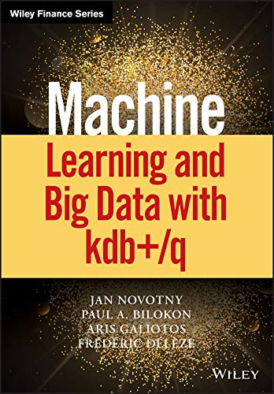
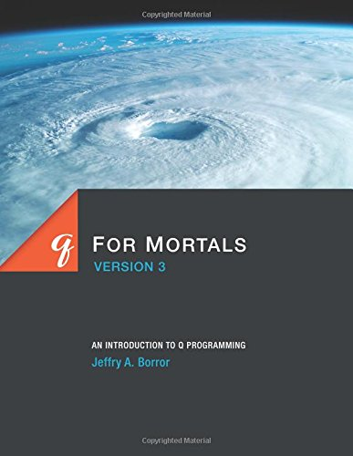
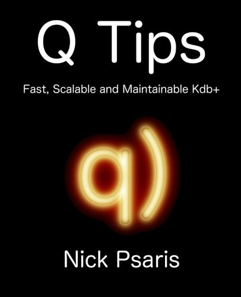

# Get started with q and kdb+

&nbsp;

[:fontawesome-solid-download:
 
Download 
:fontawesome-brands-linux: :fontawesome-brands-apple: :fontawesome-brands-windows: ](https://kx.com/connect-with-us/download/  "Download free kdb+ for non-commercial use")
{: .md-button}

[:fontawesome-solid-power-off: 
Install](install.md "How to install kdb+")
{: .md-button}

[:fontawesome-solid-hiking: 
Mountain tour](tour/index.md "A one-page rapid tour of the q language")
{: .md-button}

[:fontawesome-brands-python: 
Examples from Python](python/examples/index.md "Examples from Python")
{: .md-button}

[:fontawesome-brands-youtube: 
Q for All](q-for-all.md "Video tutorials by Jeffry Borror")
{: .md-button}

[:fontawesome-solid-street-view: 
_Q for Mortals_](/q4m3/ "The classic textboox for kdb+, now in its 3rd edition")
{: .md-button}

[:fontawesome-solid-chart-line: 
Q for quants](brief-introduction.md "A q tutorial for analysts and quants")
{: .md-button}

[:fontawesome-solid-code: 
Q by examples](q-by-examples.md "An introduction to q through examples")
{: .md-button}

[:fontawesome-solid-database: 
Starting kdb+](startingkdb/index.md "Getting started on real-time and historical database")
{: .md-button}

[:fontawesome-solid-book-reader: 
Reading room](reading/index.md "Example programs for study")
{: .md-button}

[:fontawesome-solid-laptop-code: 
Kx Developer](/developer/ "Download and install the free IDE, KX Developer")
{: .md-button}

[:fontawesome-solid-graduation-cap: 
Advanced q](advanced.md "Advanced topics in q")
{: .md-button}

Kdb+ is a database. You can use it through [interfaces](../interfaces/index.md) such as ODBC, or from [Python](../interfaces/pyq/index.md). But its power and performance are best accessed through its own language, q.

Q is a general-purpose programming language. You can write programs for anything in q. 

You do not need prior programming experience to learn it. 
If you have some experience with mathematics, functional programming or SQL, you will find in q much that is familiar. 

In this section we offer different routes into the language.
Find one that suits your experience and learning style.
(Or ask the [Librarian](mailto:librarian@code.kx.com) for what you need.)

Other sections:

section | content
--------|--------
:fontawesome-solid-book: [Language](../ref/index.md) | formal definition of  language elements
:fontawesome-solid-database:  [Database](../database/index.md)  | persisting tables in the filesystem 
:fontawesome-solid-university: [Architecture](../architecture/index.md) | topics in building systems using kdb+ processes 
:fontawesome-regular-map: [White papers](../wp/index.md) | extended treatments of topics in q programming and in building kdb+ systems

## Books

{: style="box-shadow: 10px 10px 5px #888888; display: block; float: left; margin: 0 3em 2em 0; width: 200px;"}

### kdb+中文教程 

**kdb+ Tutorial in Chinese**
 
by Kdbcn Workshop

[kdbcn.gitee.io](https://kdbcn.gitee.io/)

{: style="box-shadow: 10px 10px 5px #888888; display: block; float: left; margin: 0 3em 2em 0; width: 200px;"}

### Fun Q

**A Functional Introduction to Machine Learning in Q**
 
by Nick Psaris

:fontawesome-solid-quote-left:
Whether you are a data scientist looking to learn q, or a kdb+ developer looking to learn machine learning, there is something for everyone.
:fontawesome-solid-quote-right:

:fontawesome-solid-globe: 
[Review](https://vector.org.uk/book-review-fun-q-a-functional-introduction-to-machine-learning-in-q/) in _Vector_
 
:fontawesome-brands-amazon:
[Amazon](https://www.amazon.com/dp/1734467509)

{: style="box-shadow: 10px 10px 5px #888888; display: block; float: left; margin: 0 3em 2em 0; width: 200px;"}

### Machine Learning and Big Data with kdb+/q

by Jan Novotny, Paul A. Bilokon, Aris Galiotos, and Frederic Deleze

:fontawesome-solid-quote-left:
Offers quants, programmers and algorithmic traders a practical entry into the powerful but non-intuitive kdb+ database and q programming language. 
:fontawesome-solid-quote-right:

:fontawesome-brands-amazon:
[Amazon](https://www.amazon.co.uk/Machine-Learning-Data-Wiley-Finance/dp/1119404754/ref=sr_1_1?dchild=1&keywords=Machine+Learning+and+Big+data+with+kdb%2B%2Fq)

{: style="box-shadow: 10px 10px 5px #888888; display: block; float: left; margin: 0 3em 2em 0; width: 200px;"}

### Q for Mortals

**Version 3**
 
by Jeffry A. Borror

Covers up to kdb+ V3.3. 

If you are a new kdb+ user, this is the book for you!

:fontawesome-brands-amazon:
[Amazon](https://www.amazon.com/Mortals-Version-Introduction-Programming/dp/0692573674/)
 :fontawesome-solid-street-view:
[HTML edition](/q4m3/) online

{: style="box-shadow: 10px 10px 5px #888888; display: block; float: left; margin: 0 3em 2em 0; width: 200px;"}

### Q Tips

**Fast, scalable and maintainable kdb+**
by Nick Psaris

:fontawesome-solid-quote-left:
:fontawesome-solid-star:
:fontawesome-solid-star:
:fontawesome-solid-star:
:fontawesome-solid-star:
:fontawesome-solid-star:
There is information that if you were learning by yourself, would take years to work out.
:fontawesome-solid-quote-right:

:fontawesome-brands-amazon:
[Amazon](https://www.amazon.co.uk/d/Books/Tips-Fast-Scalable-Maintainable-Kdb/9881389909/)

See the [Archive](archive.md) for older documents.

Please send comments on tutorials to <librarian@kx.com>.
