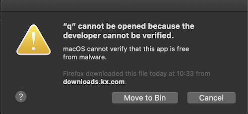

# :fontawesome-solid-power-off: Installing kdb+


You can run kdb+ on Linux, macOS, or Windows.
There are three installation scenarios.

-   You are a commercial user, with a `k4.lic` file.
-   You have the 64-bit On Demand Personal Edition for non-commercial use. This is enabled by a `kc.lic` license-key file and requires an always-on Internet connection. (This version of kdb+ is not licensed for use on cloud servers.)
-   You have the 32-bit Personal Edition for non-commercial use. It does not require a license-key file.

    !!! warning "32-bit applications will not run in macOS 10.15+ (Catalina and later)"

:fontawesome-regular-hand-point-right: 
[More about licensing](licensing.md)


## :fontawesome-solid-download: Step 1: Download

<button style="background: #0088ff; border-radius: 5px; box-shadow: 0 3px 1px -2px rgba(0, 0, 0, 0.2), 0 2px 2px 0 rgba(0, 0, 0, 0.14), 0 1px 5px 0 rgba(0, 0, 0, 0.12); padding: 10px;" type="button">
  <a href="https://kx.com/connect-with-us/download/" style="color: white">
    <span style="font-size: 2em;">:fontawesome-solid-download: Get kdb+</span><br/>Personal, non-commercial
      :fontawesome-brands-linux:
      :fontawesome-brands-apple:
      :fontawesome-brands-windows:
  </a>
</button>

Commercial versions of kdb+ are available to customers from [downloads.kx.com](https://downloads.kx.com). (Credentials are available from customers’ [Designated Contacts](licensing.md#obtain-a-license-key-file)). 

??? tip "Internal distribution at customer sites"

    Most customers download the latest release of kdb+ (along with the accompanying `README.txt`, the detailed change list) and make a limited number of approved kdb+ versions available from a central file server. 

    Designated Contacts should encourage developers to keep production systems up to date with these versions of kdb+. This can greatly simplify development, deployment and debugging.


??? info "Platforms and versions"

    The names of the ZIPs denote the platform (`l64.zip` – 64-bit Linux; `w32.zip` – 32-bit Windows, etc.).

    Numerical release versions of the form 3.5, or 4.0 are production code. Versions of kdb+ with a trailing `t` in the name such as `3.7t` are test versions and are neither intended nor supported for production use.


## :fontawesome-solid-file-archive: Step 2: Unzip your download

Here we assume you install kdb+ in your `HOME` directory on Linux or macOS; or in `C:\` on Windows, and set the environment variable `QHOME` accordingly. 

```txt
Linux       macOS       Windows
~/q         ~/q         c:\q
```

(You can install kdb+ anywhere as long as you set the path in `QHOME`.) 

Open a command shell and `cd` to your downloads directory.

Unzip the downloaded ZIP to produce a folder `q` in your install location.

=== "Linux"
    `unzip l64.zip -d $HOME/q`
=== "macOS"
    `unzip m64.zip -d $HOME/q`
=== "Windows (PowerShell)"
    `Expand-Archive w64.zip -DestinationPath C:\q`


??? tip "Recommended: `rlwrap` for Linux and macOS"

    On Linux and macOS the `rlwrap` command allows the Up arrow to retrieve earlier expressions in the q session. It is very useful and we recommend installing it. 

    :fontawesome-solid-globe:
    [Unwrapping rlwrap](https://kx.com/blog/unwrapping-rlwrap/)

    Ask for its version number: `rlwrap -v`. If you see one, `rlwrap` is already installed. Otherwise, you will see `rlwrap: command not found`. 

    Install `rlwrap` using your [package manager](https://en.wikipedia.org/wiki/Package_manager "Wikipedia"). (Common package managers: `apt`, `dnf` and `yum` for Linux; [Homebrew](https://brew.sh/) and [MacPorts](https://www.macports.org/) for macOS.) 


??? note "How to run 32-bit kdb+ on 64-bit Linux"

    Use the `uname -m` command to determine whether your machine is using the 32-bit or 64-bit Linux distribution.

    If the result is 

    -   `i686` or `i386` or similar, you are running a **32-bit** Linux distribution
    -   `x86_64`, you are running a **64-bit** Linux distribution

    To install 32-bit kdb+ on a 64-bit Linux distribution, you need a 32-bit library. Use your usual [package manager](https://en.wikipedia.org/wiki/Package_manager "Wikipedia") to install i686 or i386: for example, `sudo apt-get install libc6-i386`.

    :fontawesome-solid-globe: [How to run 32-bit app in Ubuntu 64-bit?](https://askubuntu.com/questions/454253/how-to-run-32-bit-app-in-ubuntu-64-bit)


## :fontawesome-solid-certificate: Step 3: Install the license file

If you have a license file, `k4.lic` or `kc.lic`, put it in the `QHOME` directory. 

Your `QHOME` directory will then contain:

=== "Linux"
    <pre class="language-txt">
    ├── kc.lic
    ├── l64
    │   └── q
    └── q.k
    </pre>
=== "macOS"
    <pre class="language-txt">
    ├── kc.lic
    ├── m64
    │   └── q
    └── q.k
    </pre>
=== "Windows"
    <pre class="language-txt">
    ├── kc.lic
    ├── w64
    │   └── q
    └── q.k
    </pre>

(32-bit versions have `32` in the folder name instead of `64`.)

Kdb+ looks for a license file in `QHOME`. To keep your license file elsewhere, set its path in environment variable `QLIC`. 

:fontawesome-solid-laptop-code:
[Working with multiple versions of kdb+](../kb/versions.md)


## :fontawesome-solid-check: Step 4: Confirm success

Confirm kdb+ is working: launch your first q session. 

=== "Linux"
    1.  `cd`
    1.  `q/l64/q`
=== "macOS Mojave or earlier"
    1.  `cd`
    1.  `q/m64/q`
=== "macOS Catalina (10.15)"
    1.  `cd`
    1.  `spctl --add q/m64/q` 
    1.  `xattr -d com.apple.quarantine q/m64/q`
    1.  `q/m64/q`
=== "Windows"
    1.  `c:\q\w64\q`

??? warning ":fontawesome-brands-apple: Authorizing macOS Catalina to run kdb+"

    MacOS Catalina (10.15) introduced tighter security. 
    At this point it may display a warning that it does not recognize the software.

    

    If the `spctl` and `xattr` commands above have not authorized the OS to run q, open _System Preferences > Security & Privacy_.
    
    You should see a notification that q has been blocked – and a button to override the block.

    :fontawesome-brands-apple:
    [Safely open apps on your Mac](https://support.apple.com/en-us/HT202491)

The q session opens with a banner like this. 

```q
KDB+ 4.0 2020.06.01 Copyright (C) 1993-2020 Kx Systems
m64/ 12()core 65536MB sjt mackenzie.local 127.0.0.1 EXPIRE…

q)
```

:fontawesome-solid-book-open: 
[License errors](../basics/errors.md#license-errors), 
[Licensing](licensing.md)

??? warning "License files and 32-bit kdb+"

    32-bit kdb+ does not require a license file to run, but if it finds one at launch it will signal a license error if the license is not valid.

Try your first expression. 

```q
q)til 6
0 1 2 3 4 5
```

End the q session and return to the command shell.

```q
q)\\
$
```


## :fontawesome-solid-code: Step 5: Edit your profile

Defining `q` as a command allows you to invoke kdb+ without specifying the path to it.

The q interpreter refers to environment variable `QHOME` for the location of certain files. 
Without this variable, it will guess based on the path to the interpreter. 
Better to set the variable explicitly. 

The `QLIC` environment variable tells kdb+ where to find [a license key file](licensing.md). Absent the variable, `QHOME` is used. 

=== "Linux"
    1.  Open `~/.bash_profile` in a text editor, append the following line, and save the file. (Edit `~/.bashrc` to define a q command for non-console processes.)
    1.   `alias q='QHOME=~/q rlwrap -r ~/q/l64/q'`
    1.   In the command shell, use the revised profile: `source .bash_profile`
=== "macOS"
    1.  Open `~/.zshrc` in a text editor, append the following lines, and save the file. (In macOS Mojave and earlier the profile is `~/.bash_profile`.)
    1.   `alias q='QHOME=~/q rlwrap -r ~/q/m64/q'`
    1.   In the command shell, use the revised profile: `source ~/.zshrc`
=== "Windows"
    In the command shell issue the following commands:

    1.  `setx QHOME "C:\q"`
    1.  `setx PATH "%PATH%;C:\q\w64"`

(In the above, substitute `32` for `64` if you are installing 32-bit kdb+.)

Test the new command. Open a new command shell and type `q`.

```q
Last login: Sat Jun 20 12:42:49 on ttys004
❯ q
KDB+ 4.0 2020.06.01 Copyright (C) 1993-2020 Kx Systems
m64/ 12()core 65536MB sjt mackenzie.local 127.0.0.1 EXPIRE…

q)
```

:fontawesome-solid-laptop-code:
[Installing multiple versions of kdb+](../kb/versions.md)
<br>
:fontawesome-solid-cloud:
[Installing kdb+ on DigitalOcean](../kb/digitalocean.md)


## :fontawesome-solid-laptop-code: Interactive development environments

If you are a solo student, we recommend learning q by running it from a command shell, as a REPL, writing scripts in a text editor. 
The examples on this site are produced that way; visual fidelity should help you as you learn. 

[Jupyter notebooks](https://jupyter.org/) are an interactive publishing format.
We are producing lessons in this form and the library  is growing. 
The [JupyterQ interface](../ml/jupyterq/index.md) lets you run q code in notebooks.

Notebooks are not, however, an IDE, and are unsuitable for studying features such as event handlers. 

For more advanced study, use either the bare q REPL, or download and install our interactive development environment, [Kx Developer](/developer/).


## :fontawesome-solid-hand-point-right: What’s next?

[Learn the q programming language](index.md), look through the [reference card](../ref/index.md), or see in the [Database](../database/index.md) what you can do with kdb+.

