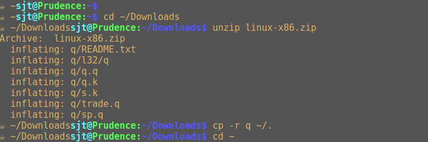
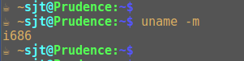
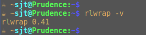
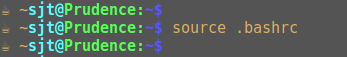
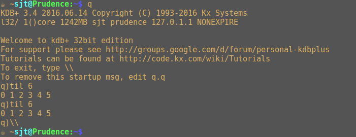

# <i class="fab fa-linux"></i> Installing under Linux


Open a Bash session (eg LXTerminal) in your home folder and `cd` to the folder where you downloaded your ZIP file. Unzip the archive. A new folder `q` will appear there. Copy it to your home folder and `cd` there.

```bash
$ cd ~/Downloads
~/Downloads$ unzip linux-x86.zip
Archive:  linux-x86.zip
  inflating: q/README.txt
  inflating: q/l32/q
  inflating: q/q.q
  inflating: q/q.k
  inflating: q/s.k
  inflating: q/trade.q
  inflating: q/sp.q
~/Downloads$ cp -r q ~/.
~/Downloads$ cd
$
```

<!--  -->


## 64-bit or 32-bit?

Use the `uname` command to determine whether your machine is using the 32-bit or 64-bit Linux distribution.
```bash
$ uname -m
i686
```
<!--  -->

If the result is `i686` or `i386` or similar, you are running a **32-bit** Linux distribution. If the result is `x86_64`, you are running a **64-bit** Linux distribution.

If you are installing 32-bit kdb+ on a 32-bit Linux distribution, proceed to [Launch (minimum install)](#minimum-install-and-launch).

But if you are installing 32-bit kdb+ on a 64-bit Linux distribution, you will need a 32-bit library. Use your usual package manager to install i686 or i386: for example:
```bash
sudo apt-get install libc6-i386
```

<i class="far fa-hand-point-right"></i> AskUbuntu: [How to run 32-bit app in Ubuntu 64-bit?](https://askubuntu.com/questions/454253/how-to-run-32-bit-app-in-ubuntu-64-bit)


## <i class="fas fa-rocket"></i> Minimum install and launch

Confirm that kdb+ runs. In your home folder, type `q/l32/q`
to see the kdb+ banner and the `q)` prompt. 
Type `til 6` to see the first six integers. Type `\\` to return to Linux.

```txt
$ q/l32/q
KDB+ 3.6 2018.07.30 Copyright (C) 1993-2018 Kx Systems
m32/ 2()core 4096MB sjt mark.local 192.168.0.17 NONEXPIRE

Welcome to kdb+ 32bit edition
For support please see https://groups.google.com/d/forum/personal-kdbplus
Tutorials can be found at http://code.kx.com/v2/tutorials/install
To exit type \\
To remove this startup msg, edit q.q
q)til 6
0 1 2 3 4 5
q)\\
$
```
<!--  -->

You have completed the minimum installation. We recommend continuing with _Complete install and launch_.


## Complete install and launch

The minimum installation can be improved in two important ways. We strongly recommend them.

* Call kdb+ within the `rlwrap` command, which will allow you to call back and edit previous lines
* Define `q` as a command alias, allowing you to invoke kdb+ without specifying the path to it


### <i class="fas fa-plug"></i> Install Rlwrap

<!-- Exit kdb+ to return to the Bash prompt and your home folder.  -->
Ask for Rlwrap’s version number. If you see one, Rlwrap is already installed

```bash
$ rlwrap -v
rlwrap 0.42
$
```

<!--  -->

If Rlwrap is already installed you can go on to the next step.

Otherwise, you will be told `rlwrap: command not found`. Install Rlwrap using your package manager.


### <i class="fas fa-code"></i> Edit your profile

In the File Manager, find `.bashrc` in your home folder.


Open it with a text editor, append the following line

```bash
alias q='QHOME=~/q rlwrap -r ~/q/l32/q'
```
and save it. 
Start a new Bash session, or tell Bash to use the revised profile:

```bash
$ source .bashrc
```

<!--  -->

!!! tip "Installing elsewhere"

    You can install kdb+ where you please. The environment variables `QHOME` (specified above) and `QLIC` tell kdb+ [where to find its files](../licensing.md). 


## <i class="fas fa-check"></i> Confirm successful installation

From your home folder, launch kdb+, type an expression and recall it using the up-arrow key. Exit kdb+.

```txt
$ q
KDB+ 3.6 2018.07.30 Copyright (C) 1993-2018 Kx Systems
m32/ 2()core 4096MB sjt mark.local 192.168.0.17 NONEXPIRE

Welcome to kdb+ 32bit edition
For support please see http://groups.google.com/d/forum/personal-kdbplus
Tutorials can be found at http://code.kx.com/v2/tutorials/install
To exit type \\
To remove this startup msg, edit q.q
```
```q
q)til 6 / first 6 integers
0 1 2 3 4 5
q)til 6 / first 6 integers
0 1 2 3 4 5
q)\\
$
```


<!--  -->


## <i class="fas fa-certificate"></i> Install a license key file

64-bit kdb+ requires a license key file.
[Obtain and install](../licensing.md) one.

You’re done. You have completely installed kdb+. 


## <i class="far fa-hand-point-right"></i> What’s next?

[Learn the q programming language](../index.md#learn-q), look through the [reference card](../../ref/index.md), or see in the [Knowledge Base](../../kb/index.md)  what you can do with kdb+.


