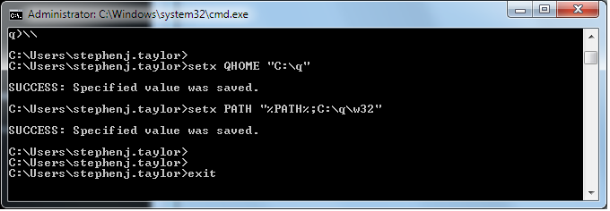

# <i class="fab fa-windows"></i> Installing under Microsoft Windows


Downloading put a file `w64.zip` or `w32.zip` in your downloads folder. 
Extract the files to `C:\`, producing a new folder `C:\q`. 

!!! tip "Installing elsewhere"

    You can install on a different filepath. If you do, in the following instructions simply replace `C:\q` with your filepath.


## <i class="fas fa-check"></i> Confirm q is working

Open a command shell window: type <i class="fab fa-windows"></i>-r or click the Start button, and type `cmd`.

Launch q by typing 

-   `C:\q\w64\q` (64-bit) 
-   `C:\q\w32\q` (32-bit)

You should see the kdb+ banner.


### 64-bit kdb+

Your q interpreter needs a **license key file**. If it does not find one, it signals a license error and aborts:

```txt
C:\Users\mr.user>C:\q\w64\q
Microsoft Windows [Version 6.1.7601]
Copyright (c) 2009 Microsoft Corporation. All rights reserved.
KDB+ 3.6 2018.06.14 Copyright (C) 1993-2018 Kx Systems
w64/ 4()core 3974MB mr.user it1234567 192.168.0.37 55041-011-2084043-86863
'k4.lic
C:\Users\mr.user>
```

Kdb+ is working. You just need to [install a license](../licensing.md).


### 32-bit kdb+

Your q interpreter needs no license key file. You will see the `q)` prompt. Type `til 6` to see the first 6 integers. Type `\\` to exit q.

```txt
C:\Users\mr.user>C:\q\w32\q
Microsoft Windows [Version 6.1.7601]
Copyright (c) 2009 Microsoft Corporation. All rights reserved.
KDB+ 3.6 2018.06.14 Copyright (C) 1993-2018 Kx Systems
w32/ 4()core 3974MB mr.user it1234567 192.168.0.37 NONEXPIRE

Welcome to kdb+ 32bit edition
For support please see http://groups.google.com/d/forum/personal-kdbplus
Tutorials can be found at http://code.kx.com/v2/tutorials/install
To exit type \\
To remove this startup msg, edit q.q
q)til 6
0 1 2 3 4 5
q)\\
C:\Users\mr.user>
```


## <i class="fas fa-code"></i> Define q as a command

Defining `q` as a command allows you to invoke kdb+ without specifying the path to it.

In the MS-DOS shell:

!!! tip "32-bit kdb+"

    In what follows, substitute `\w32` for `\w64`.

```powershell
C:\Users\mr.user>setx QHOME "C:\q"

SUCCESS: Specified value was saved.

C:\Users\mr.user>setx PATH "%PATH%;C:\q\w64"

SUCCESS: Specified value was saved.

C:\Users\mr.user>exit
```

<!--  -->

!!! tip "Installing elsewhere"

    You can install kdb+ where you please. The environment variable `QHOME` (specified above) tells kdb+ where its home folder is. 


This will close your shell session. Open a new shell session and confirm `q` now works as a command.

```txt
C:\Users\mr.user>C:\q\w64\q
Microsoft Windows [Version 6.1.7601]
Copyright (c) 2009 Microsoft Corporation. All rights reserved.
KDB+ 3.6 2018.06.14 Copyright (C) 1993-2018 Kx Systems
w64/ 4()core 3974MB mr.user it1234567 192.168.0.37 EXPIRE 2019.08.16 mr.user@gmail.com KOD #9999999

q)til 6
0 1 2 3 4 5
q)
```

<!-- 
 -->


You’re done. You have completely installed kdb+. 


## <i class="far fa-hand-point-right"></i> What’s next?

[Learn the q programming language](../index.md#learn-q), look through the [reference card](../../ref/index.md), or see in the [Knowledge Base](../../kb/index.md)  what you can do with kdb+.


