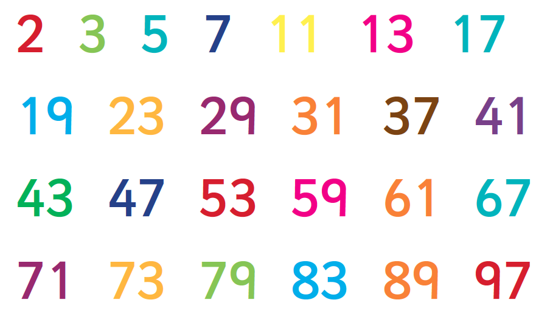

# Prime numbers



by [Noah Attrup](#author)
{: .wp-author}

Computationally-intensive numerical problems are not usually undertaken with q due to the looping nature of the solutions. However, there are neat, fast solutions using q, and they give us scope to practice writing efficient q functions – avoiding traditional loops – but also using [iterators](../../ref/iterators.md) where loops are unavoidable.

!!! info "A prime is a positive integer with exactly two factors: itself and one"


## Test for prime

A simple and inefficient method to find if a number $x$ is prime would be to divide it by all positive integers less than $x$ and then see if any of the results are integers.

Although far from optimal this can be done very simply in q with the `mod` and `til` keywords.

Note that we drop 0 and 1 from the list `til x` as there is no point in checking `x mod` these. If `x` divides by a number `y` where `y<x`, then `x mod y=0`, hence `min` of this list of binaries will be `0b`. If there is no `0b` in the list we can certify this as a prime number.

```q
q)isprimeSLOW:{min x mod 2_til x}
q)isprimeSLOW 13
1
q)isprimeSLOW 14
0
q)isprimeSLOW 1010101
0
q)l where isprimeSLOW each l:100+til 10
101 103 107 109
```

To speed this up exponentially we can check values only up to the square root of `x`. This makes mathematical sense as if a number `x` has a factor greater than `sqrt x` it must also have a factor less than `sqrt x`. For example, 27 divides by 3 and 7, if we are checking 3 there is no need to check 7. 

```q
q)isprime:{min x mod 2_til 1+floor sqrt x}

q)/ We can quickly check much larger numbers:
q)isprime 10101010101
0

q)/ Find which are prime from a list of numbers:
q)l where isprime each l:20202020202+til 100
20202020203 20202020231 20202020233 20202020273 20202020299
```

Feel free to try timing the previous vs the following function to see the speed-up when it comes to large numbers.

```q
q)\ts isprimeSLOW 10101010101
2982031 549755814080
q)\ts isprime 10101010101
25 4194496
```

We can also add a conditional wrapper around our `isprime` function to give `1b` if 2 or 3, and `0b` if `x<2`.

```q
q)/ isprime does not work for 0 1 2 3
q)isPrime:{$[x in 2 3;1;x<2;0;isprime x]}
q)where isPrime each til 10
```


## Sum primes

??? question "Q1.1 Sum all the primes below two million"

    https://projecteuler.net/problem=10

We can solve this quite simply by running `isPrime` on each of the list `til 2000000`. As we know there is no point testing even numbers other than 2 we can take these out.

```q
q)\ts 0N!sum a where isPrime each a:2,1+2*til 1000000
142913828922
5860 32778544
```


## Nth prime

??? question "Q1.2 Find the 10,001st prime number"

    https://projecteuler.net/problem=7

We could run the `isPrime` function on a long list of numbers to generate a long list of primes, and then take the 10,001st entry of the prime list. 
Let’s try to do better.

Break this down into the following iterator-based steps.

1.  Use the `isPrime` function to find the next prime given a number
2.  Run that function 10,000 times on initial argument of 2

With the [While](../../ref/accumulators.md#while) iterator (`/`) we can extend `isPrime` to keep adding `2` to an odd number, until `isPrime` is true.

```q
q)nextprime:{(not isPrime@)(2+)/x}(2+)@ 
q)nextprime 5           / adds two; immediately finds a prime
7
q)nextprime 7           / add two until finds a prime
11
q)nextprime 119         / 121 123 125: none is prime
127
```

Applying `nextprime` to an even number will cause it to run forever. 
Again, a conditional wrapper prevents this.

```q
q)nextPrime:{nextprime x-1 0 x mod 2}
q)nextPrime each 2 3 4
3 5 5
```

We can test this with the [Scan](../../ref/accumulators.md#scan) iterator (`\`) to generate lists of primes.


## Next prime

!!! question "Find the next 10 primes after 2"

```q
q)10 nextPrime\2
2 3 5 7 11 13 17 19 23 29 31
```

!!! question "Find all primes between 1,000,000 and 1,000,100"

Function will overshoot by one, and include the initial value, so we drop these.

```q
q)-1_1_{x<1000100}nextPrime\1000000
1000003 1000033 1000037 1000039 1000081 1000099

q)l where isPrime each l:1000000+til 100  / equivalent using just isPrime
1000003 1000033 1000037 1000039 1000081 1000099
```

Now let’s use `nextPrime` to find the 10,001th prime with an Over (`/`).

```q
q)\ts show 10000 nextPrime/2
104743
185 17280
```

Reducing a given number to a list of its prime factors is a natural next step, and we can use the previous section’s functions to to build an efficient prime factorization function.

Let’s first sketch an outline of one algorithm to go about this:

1.  Start with `L:()` empty list; append primes to this
2.  Given an input `x`, check if `x` is prime; if it is, exit appending `x` to `L`
3.  Generate a list `l`, up to `floor sqrt x`, omitting 0 and 1, of divisors of `x`, as we do in `isPrime`
4.  Redefine `l` as just the primes in `l`
5.  Redefine `x` as `x % prd l`
6.  Append `l` to `L` and repeat steps 2 onwards on the new `x`

```q
q)/Example
q)L:()
q)x:100 /not prime so step 2 does nothing
q)l:l where 0=x mod l:2_til 1+floor sqrt x
q)l:l where isPrime each l
q)L,:l;L
2 5
q)x:x%prd l
q)/Repeat
q)/x is now 10 so step 2 still does nothing
q)l:l where 0=x mod l:2_til 1+floor sqrt x
q)l:l where isPrime each l
q)L,:l;L
2 5 2
q)x:x%prd l
q)/x is now 5 so we add it to L and we are finished. Cast to match L's type
q)L,"j"$x
2 5 2 5
```

As this is a repeating algorithm we should already be thinking how we can pull this together using an iterator. 
The following steps allow us to convert the above code into a prime factorization function:

1.  Consider the input `x` as a list (`enlist x`)
2.  Each loop produces the list of found prime factors with the remaining compound number (`x%prd l`) last in the list
3.  Apply the looping function on just the last term of the list
4.  Use the Converge iterator (`/`) so function runs until the result stops changing
5.  Lastly, add a wrapper with the casting and remove 1 (1 appears sometimes otherwise, e.g. 30)

This is a good test of writing concise q. 
It is possible write the whole function as a single expression.

```q
primeFactors:{"j"$except[;1] {(-1_x),l,last[x]%prd l@:where isPrime each l@:where 0=last[x] mod l:2_til 1+floor sqrt last x}/[enlist x]}
```
```q
q)primeFactors 121
11 11
q)primeFactors 100000000000
2 5 2 5 2 5 2 5 2 5 2 5 2 5 2 5 2 5 2 5 2 5
```


## Largest prime factor

??? question "Find the largest prime factor of the number 600851475143"

    https://projecteuler.net/problem=3

```q
q)\ts show max primeFactors 600851475143
6857
18 33554976
```

Let’s try a harder question.

The first two consecutive numbers to have two distinct prime factors are:

```txt
14 = 2 × 7
15 = 3 × 5
```

The first three consecutive numbers to have three distinct prime factors are:

```txt
644 = 2² × 7 × 23
645 = 3 × 5 × 43
646 = 2 × 17 × 19
```


## Distinct prime factors

??? question "Find the first four consecutive integers to have four distinct prime factors each.<br>What is the first of these numbers?"

    https://projecteuler.net/problem=47

```q
q)next4PFs:{(not 4=count distinct primeFactors@)(1+)/x}(1+)@
q)\ts show first {not all first[x]=x-til 4}{1_x,next4PFs last x}/4#1
134043
2889 4195744
```


## Author


{: .small-face}

**Noah Attrup** is a senior kdb+ developer in New York City.
<br>
[:fontawesome-solid-envelope:](mailto:nattrup@kx.com?subject=Prime numbers) &nbsp;
[:fontawesome-brands-linkedin:](https://linkedin.com/in/noah-attrup-16a38483)


<!-- 
## Abundant numbers

!!! info "An abundant number is a number for which the sum of its proper divisors is greater than itself."

The first abundant number is 12, which has proper divisors 1, 2, 3, 4, 6 for a sum of 16. 

The _abundance_ of 12 is $16-12=4$.

A naïve algorithm for the proper divisors of integer `x`: 

```q
s:{c where 0=x mod c:1+til x div 2}
```

Clearly with this function `s` we can sum the list output, minus `x`, and we have an abundance function. However this will be very slow to calculate the abundance of large numbers.

Let’s use our `primeFactors` function as part of an efficient abundance function. But first some theory.

-   Every $x>1$ is a unique product of primes (helpfully output by the `primeFactors` function)
-   The set of proper divisors are the set of combinations of these primes, along with the number 1 (not prime, but it is a proper divisor)

For example

-   The prime factors of 12 are 2, 2, 3
-   The proper divisors of 12 are: 1, 2, 3, 4 (2×2), 6 (2×3)

By using the `group` function on the output of `primeFactors` we can collect up the prime factors by distinct values.

We can use take the `key`, `xexp` on `value` of `til 1+count` of the group to get all the divisors which are made up of only powers of one prime. 

Next we `cross/` these lists to get all possible combinations, and `prd each` to get the proper divisors.

To get the abundance we can drop the last number in the list (this will always be equal to `x`), sum and minus `x`.

Step through a simple example.

```q
q)x:12
q)show step1:primeFactors x
2 3 2
q)show step2:group step1
2| 0 2
3| ,1
show step3:{til 1+count x} each step2
2| 0 1 2
3| 0 1
show step4:key[step3] xexp value step3
1 2 4f
1 3f
show step5:(cross/)step4
1 1
1 3
2 1
2 3
4 1
4 3
q)show step6:prd each step5
1 3 2 6 4 12f
q)show finalstep:neg[x]+sum -1_step6
4f
```

Put this together for a satisfying and quintessentially-q one-liner.

```q
q)abundance:{neg[x]+sum prd each -1_(cross/)key[g] xexp value g:{til 1+count x} each group primeFactors x}
q)abundance 12
4f
```

Abundant numbers are common, though even abundant numbers seem to be much more common than odd abundant numbers.

Using a similar technique to the `nextPrime` function we can apply our `abundance` function with the While iterator (`/`) to check for odd abundant numbers.

!!! question "Find the first 10 abundant odd numbers"

```q
q)nextAbundant:{(1>abundance@)(2+)/x}(2+)@
q)\ts show 1_10 nextAbundant\3
945 1575 2205 2835 3465 4095 4725 5355 5775 5985
51 4195104
```

??? detail "Lambdas, composition and projection"

    `nextAbundant` can be written in the lambda notation as 

        {{1>abundance x}{x+2}/x+2}

    Writing it with composition `1>abundance@` and projection `2+` removes the potential confusion of three `x` tokens with three different references. 

        {(1>abundance@)(2+)/x}(2+)@

    The remaining lambda can be rewritten as a projection:

        (2+)/[1>abundance@;] (2+)@

    Readable? _Add 2, and keep adding 2 while abundance is less than 1._

!!! question "What is the thousandth abundant odd number?"

```q
q)\ts show 1000 nextAbundant/3
492975
6048 4194752
```

 -->