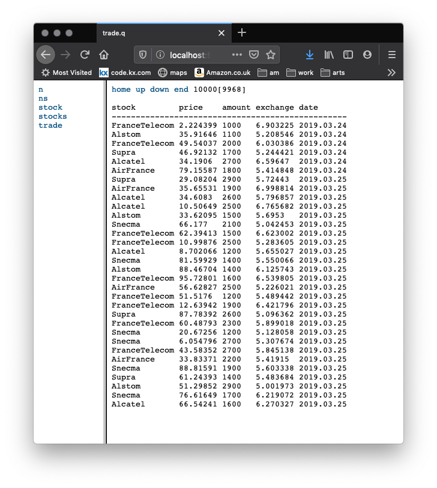
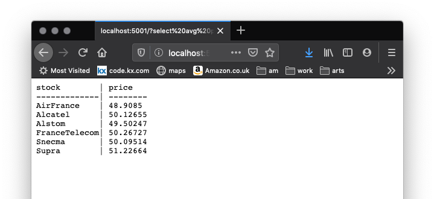

# Appendix 4: Interprocess communication


When running a q script, you can specify a port and then clients can talk to that port.

Let’s start with the script `trade.q`:

```q
/ Create a list of French stocks where name is the key.
stock:([name:`Alcatel`Alstom`AirFrance`FranceTelecom`Snecma`Supra]
 industry:`telecom`engineering`aviation`telecom`aviation`consulting)
/ get a list of distinct stocks are there?
stocks: distinct exec name from stock
ns: count stocks
n:10000
/ stock is a foreign key foreign key.
/ We are taking n stocks at random.
/ Then n prices up to 100.0 at random, then amounts then dates.
trade:([]stock:`stock$n?stocks;
 price:n?100.0;amount:100*10+n?20;exchange:5+n?2.0;date:1998.01.01+n?449)
`date xasc`trade
/ An example function.
f:{[mytable] count select from mytable}
f[stock]
f[trade]
/ A somewhat less trivial function does volume-weighted
/ rollups by week (an abridged example from Tom Ferguson)
/ over a certain time period.
weekrollup:{[daterange]
 select first date, last date, amount wavg price by stock, date.week
  from trade where date within daterange }
```

Launch a q task with that script. And have it listen to (say) port 5001.

```bash
$ q trade.q -p 5001
KDB+ 3.7t 2020.02.27 Copyright (C) 1993-2020 Kx Systems
m64/ 4()core 8192MB sjt mint.local ...

`trade
6
10000
```

<i class="fas fa-book-open"></i>
[Command-line options](../../basics/cmdline.md)

This will be our ‘server’ task. 


## Default web server

When a kdb+ task listens to a port, it handles HTTP calls. Exactly how and whether it does so is something you can control, but here we’ll look at what it does by default. 

Open a browser window and navigate to `http://localhost:5001`. 



The default web view of a kdb+ task is a ‘table explorer’.
The `trade` table exceeds the [HTTP console size](../../basics/syscmds.md#c-http-console-size), so the display window includes controls for scrolling it.

<i class="fas fa-graduation-cap"></i>
[Customizing the default web server](../../kb/custom-web.md)


## The session on the server

In production systems, server tasks run as detached processes. But ours is running with a session, which we can use to explore. 

In the server session, use the last function defined in the script.

```q
q)weekrollup 2018.02.28 2018.03.31
stock         week      | date       date1      price
------------------------| ------------------------------
AirFrance     2018.02.26| 2018.02.28 2018.03.04 46.16306
AirFrance     2018.03.05| 2018.03.05 2018.03.11 49.29903
AirFrance     2018.03.12| 2018.03.12 2018.03.18 47.682
AirFrance     2018.03.19| 2018.03.19 2018.03.25 53.71417
AirFrance     2018.03.26| 2018.03.26 2018.03.31 50.40664
Alcatel       2018.02.26| 2018.02.28 2018.03.04 50.46859
Alcatel       2018.03.05| 2018.03.05 2018.03.11 56.21325
Alcatel       2018.03.12| 2018.03.12 2018.03.18 55.0396
Alcatel       2018.03.19| 2018.03.19 2018.03.25 44.38205
Alcatel       2018.03.26| 2018.03.26 2018.03.31 41.94703
Alstom        2018.02.26| 2018.02.28 2018.03.04 50.97607
Alstom        2018.03.05| 2018.03.05 2018.03.11 40.90767
Alstom        2018.03.12| 2018.03.12 2018.03.18 49.75555
Alstom        2018.03.19| 2018.03.19 2018.03.25 54.84719
Alstom        2018.03.26| 2018.03.26 2018.03.31 59.81624
FranceTelecom 2018.02.26| 2018.02.28 2018.03.04 67.46937
FranceTelecom 2018.03.05| 2018.03.05 2018.03.11 58.21524
FranceTelecom 2018.03.12| 2018.03.12 2018.03.18 48.51894
FranceTelecom 2018.03.19| 2018.03.19 2018.03.25 48.92187
FranceTelecom 2018.03.26| 2018.03.26 2018.03.30 51.21313
..
```


Now open up a new command shell (on the same machine, or a different one) and type simply `q`. This is the client.

The client connects to the server by opening the connection, communicating, and then closing the connection.

Open the connection and get a handle for it.

```q
q)show h: hopen`::5001      / `:foobar:5001 if server on machine foobar
5i
```

This reminds you of opening a file. The second colon in the symbol marks it as a port, not a file. 

!!! warning "Don’t use colons in file names."

Write to the server process much as you would append to a text file. 

```q
q)h"select avg price by stock from trade"
stock        | price
-------------| --------
AirFrance    | 48.9085
Alcatel      | 50.12655
Alstom       | 49.50247
FranceTelecom| 50.26727
Snecma       | 50.09514
Supra        | 51.22664
```

The open session on the server process gives us complete access.
Type in the two command shells:

```txt
           SERVER                                 CLIENT

q)myfunc:{[x] 3*x}                          |  
                                            |  q)h"z:4"
                                            |  q)h"myfunc[z]"
                                            |  12
q).z.pg:count                               |  
                                            |  q)h"myfunc[z]"
                                            |  9
```

Defining `myfunc` on the server made it possible for the client to send `"myfunc[z]"` and get 12 back.

Setting [`.z.pg`](../../ref/dotz.md#zpg-get) redefined the handler. Where the default is to evaluate whatever is received, the new value, `count`, simply returns the length of the message. 

Note that the client’s first message `"z:4"` defined a global variable on the server. (Refresh the browser display to see it.)


## Queries from the browser

The default web server also accepts queries from the browser, i.e via HTTP calls. 
In your browser navigate to 

```txt
http://localhost:5001/?select avg price by stock from trade
```




## Security

These default behaviors make setting up and debugging interprocess communication unusually simple. 

They are also hopelessly insecure for any production system.

!!! warning "In production, functions set as `.z.pg` must run suitable security checks."

<i class="far fa-map"></i>
[Permissions with kdb+](../../wp/permissions/index.md)
<br>
<i class="far fa-handshake"></i>
[Interfaces](../../interfaces/index.md)


## Protected evaluation

In a critical application, especially an internet-accessible one, a bad argument may cause a function to fail. Instead of allowing this to expose server code to the client, we can trap the error.

```txt
           SERVER                                 CLIENT

q)/restore default behavior                 |  
q).z.pg:value                               |  
                                            |  q)h"myfunc[4]" / and we're back
                                            |  12
                                            |  
                                            |  q)h"myfunc[silly]" / oops
                                            |  'silly
                                            |    [0]  h"myfunc[silly]"
                                            |         ^
q).z.pg:{@[value;x;`$"Number please"]}      |
                                            |  q)h"myfunc[silly]"
                                            |  `Number please
```

<i class="fas fa-book"></i>
[Trap](../../ref/apply.md#trap)


---
<i class="far fa-hand-point-right"></i>
[Type and cast](type-cast.md)