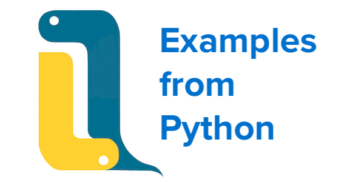

# Basic programs



From
:fontawesome-solid-globe:
GeeksforGeeks [Python Programming Examples](https://www.geeksforgeeks.org/python-programming-examples/)

Many of the published examples have been rewritten to use Python techniques more likely to illuminate the q solution. 
Where practical, the solutions are shown as expressions evaluated in the REPL, which better allows for experimenting. 

Follow links to the originals for more details on the problem and Python solutions. 


### [Factorial of a number](https://www.geeksforgeeks.org/python-program-for-factorial-of-a-number/)

```python
>>> def factorial(n): return 1 if (n==1 or n==0) else n * factorial(n - 1)
...
>>> factorial(5)
120
```
```q
q)factorial:{$[x<2;1;x*.z.s x-1]}
q)factorial 5
120
```

<big>:fontawesome-regular-comment:</big>
Above [`.z.s`](../../../ref/dotz.md#zs-self) refers to the running function; it can be assigned any name. 

Factorial 5 is defined non-recursively as the product of the integers 1-5.

```python
>>> math.prod(map(1 ._add_, range(5))) # in Python 3.8
>>> 120
```
```q
q)prd 1+til 5
120
```

:fontawesome-brands-linkedin:
[Adding 42 to a list](https://www.linkedin.com/pulse/adding-42-list-ferenc-bodon-ph-d-/)

### [Simple interest](https://www.geeksforgeeks.org/python-program-for-simple-interest/)

```python
>>> p=10000                 # principal
>>> r=5                     # rate
>>> t=5                     # time periods 
>>> (p*r*t)/100             # simple interest
2500.0
```
```q
q)p:10000                   / principal
q)r:5                       / rate
q)t:5                       / time periods
q)(p*r*t)%100               / simple interest
2500f
```

<big>:fontawesome-regular-comment:</big>
Q programs tend to prefer vectors.

```q
q)(prd 10000 5 5)%100
2500f
```

Iteration is implicit in most q operators. 
Here we have three principals and corresponding time periods.
The rate is the same for all three.

```q
q)p:1000 1500 1750          / principals
q)r:3                       / rate
q)t:5 6 7                   / time periods
q)(p*r*t)%100               / simple interest
150 270 367.5
```


### [Compound interest](https://www.geeksforgeeks.org/python-program-for-compound-interest/)

```python
>>> p = 1200                # principal
>>> r = 5.4                 # rate
>>> t = 2                   # time periods
>>> p*(pow((1+r/100),t))    # compound interest
1333.0992
```
```q
q)p:1200                    / principal
q)r:5.4                     / rate
q)t:2                       / time periods
q)p*(1+r%100)xexp t         / compound interest
1333.099
```

Again, iteration through lists is implicit.

```q
q)p:1200 1500 1800          / principals
q)r:5.4                     / rate
q)t:2 2 3                   / time periods
q)p*(1+r%100)xexp t         / compound interest
1333.099 1666.374 2107.63
```


### [Whether an Armstrong number](https://www.geeksforgeeks.org/python-program-to-check-armstrong-number/)

```python
import numpy as np
def is_armstrong(x):
    s = 0
    t = x
    while t:
        s += (t % 10) ** len(str(x))
        t //= 10
    return s == x
```
```python
>>> [is_armstrong(x) for x in (153, 120, 1253, 1634)]
[True, False, False, True]
```
```q
isArmstrong:{x=sum{x xexp count x}10 vs x}
```
```q
q)isArmstrong each 153 120 1253 1634
1001b
```

<big>:fontawesome-regular-comment:</big>
The steps of `isArmstrong` explain themselves.

```q
q)10 vs 153                 / decode base-10 integer
1 5 3
q)1 5 3 xexp 3              / raise to 3rd power
1 125 27f
q)sum 1 5 3 xexp 3
153f
```


### [Area of a circle](https://www.geeksforgeeks.org/python-program-for-program-to-find-area-of-a-circle/)

The area of a circle of radius $r$ is $\pi r^2$, where
$\pi$ is the arc-cosine of -1. 

```python
>>> import numpy as np
>>> np.arccos(-1)*5*5       # area of circle of radius 5
78.53981633974483
```
```q
q)(acos -1)*5*5             / area of circle of radius 5
78.53982
```


### [Prime numbers in an interval](https://www.geeksforgeeks.org/python-program-to-print-all-prime-numbers-in-an-interval/)

```python
>>> from sympy import sieve
>>> list(sieve.primerange(11, 25))
[11, 13, 17, 19, 23]
```
```q
range:{x+til y-x-1}

sieve_primerange:{
  c:range[x;y];                       / candidates
  lmt:"j"$sqrt last c;                / highest divisor to test
  c where all 0<c mod/:range[2;lmt] }
```
```q
q)sieve_primerange[11;25]
11 13 17 19 23
```

<big>:fontawesome-regular-comment:</big>
No q primitive for this, but range is a useful starting point.

```q
q)show c:range[11;25]           / candidates
11 12 13 14 15 16 17 18 19 20 21 22 23 24 25
q)"j"$sqrt last c               / need test modulo only to here
5
q)range[2;]"j"$sqrt last c
2 3 4 5

q)c mod/:2 3 4 5                / modulo each c against all of them
1 0 1 0 1 0 1 0 1 0 1 0 1 0 1
2 0 1 2 0 1 2 0 1 2 0 1 2 0 1
3 0 1 2 3 0 1 2 3 0 1 2 3 0 1
1 2 3 4 0 1 2 3 4 0 1 2 3 4 0

q)show f:0<c mod/:2 3 4 5       / flag remainders
101010101010101b
101101101101101b
101110111011101b
111101111011110b
q)all f                         / AND the flag vectors
101000101000100b
q)where all f                   / index the hits
0 2 6 8 12
q)c where all f                 / select from range
11 13 17 19 23
```


### [Whether a number is prime](https://www.geeksforgeeks.org/python-program-to-check-whether-a-number-is-prime-or-not/)

```python
>>> from sympy import isprime
>>> [isprime(x) for x in (11, 15, 1)]
[True, False, False]
```

No q primitive for this either.

```q
range:{x+til y-x-1}
isPrime:{(x>1)and all 0<x mod range[2;"j"$sqrt x]}
```
```q
q)isPrime each 11 15 1
100b
```


### [Nth Fibonacci number](https://www.geeksforgeeks.org/python-program-for-n-th-fibonacci-number/)

```python
# next Fibonacci pair
def nfp(x): return [x[1], sum(x)]

# Nth Fibonacci pair
def fibp(n):
    if n<2: return [0, 1]
    return nfp(fibp(n-1))

def fib(n): return fibp(n)[0]
```
```python
>>> fib(9)
21
```
```q
nfp:{(x 1),sum x}
fib:{first(x-1)nfp/0 1}
```
```q
q)fib 9
21
```

<big>:fontawesome-regular-comment:</big>
Above we see `nfp ` applied with the [Do iterator `/`](../../../ref/accumulators.md#do).

The Python solution recurses down from `n` to reach the initial state of `[0, 1]`, while the q solution iterates `n-1` times on an initial state of `0 1`.


### [Whether a Fibonacci number](https://www.geeksforgeeks.org/python-program-for-how-to-check-if-a-given-number-is-fibonacci-number/)

```python
import math
def is_fibonacci(n):
    phi = 0.5 + 0.5 * math.sqrt(5.0)
    a = phi * n
    return n == 0 or abs(round(a) - a) < 1.0 / n
```
```python
>>> [is_fibonacci(x) for x in (8, 34, 41)]
[True, True, False]
```

$x$ is a Fibonacci number if either of $5x^{2}\pm 4$ is a perfect square.

```q
is_ps:{x={x*x}"j"$sqrt x}                       / is perfect square?
is_fibonacci:{.[or]is_ps flip 4 -4+/:5*x*x}
```
```q
q)is_fibonacci 8 34 41
110b
```

<big>:fontawesome-regular-comment:</big>
The iteration implicit in q’s operators means that `is_fibonacci` also iterates implicitly.


### [Sum of squares of first N natural numbers](https://www.geeksforgeeks.org/python-program-for-sum-of-squares-of-first-n-natural-numbers/)

```python
def squaresum(n): return (n * (n + 1) / 2) * (2 * n + 1) / 3
```
```python
>>> [squaresum(x) for x in (4,5)]
[30.0, 55.0]
```

```q
squaresum:{(x*(x+1)%2)*(1+x*2)%3}
```
```q
q)squaresum 4 5
30 55f
```

<big>:fontawesome-regular-comment:</big>
The q solution mirrors the Python, but the primitives iterate implicitly.


### [Cube sum of first N natural numbers](https://www.geeksforgeeks.org/python-program-for-program-for-cube-sum-of-first-n-natural-numbers/)

```python
def sum_cubes(x): return (x * (x + 1) // 2) ** 2
```
```python
>>> [sum_cubes(x) for x in (5, 7)]
[225, 784]
```

```q
sum_cubes:{(x*(x+1)div 2)xexp 2}
```
```q
q)sum_cubes 5 7
225 784f
```

<big>:fontawesome-regular-comment:</big>
Once again, the q operators iterate implicitly.

---
:fontawesome-regular-hand-point-right:
[Array examples](array.md)