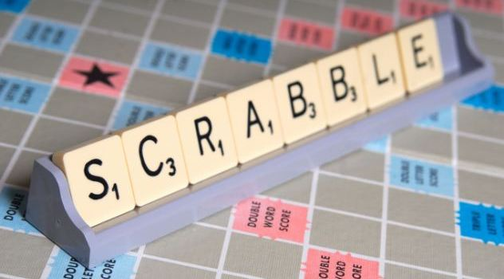

# Cheat at Scrabble


[](https://scrabble.hasbro.com/en-us "Official Scrabble site")


**Problem** Given a string representing the letters in a [Scrabble™](https://scrabble.hasbro.com/en-us) player’s rack, produce candidate words for the next turn, ranked by potential score. (The score ignores the effect of placement on the board, such as Double Letter Score, etc.)

:fontawesome-brands-wikipedia-w:
[Rules of Scrabble](https://en.wikipedia.org/wiki/Scrabble "Wikipedia") 

## Techniques

-   Download a word list from the Web
-   Make a q dictionary
-   Count frequencies of items in a list 
-   Subtract one dictionary from another
-   Use function notation within a [qSQL](../../basics/qsql.md) query


## Solution

```q
/ Scrabble tile values
TV:.Q.a!1 3 3 2 1 4 2 4 1 8 5 1 3 1 1 3 10 1 1 1 1 4 4 8 4 10  

/ Unix dictionary
UD:system "curl http://wiki.puzzlers.org/pub/wordlists/unixdict.txt"

/ frequency count
fc:{count each group x} 

/ dictionary table
DT:([] word:UD; fr:fc each UD; sc:{sum TV x}each UD) 

/ word builder
wb:{{x idesc x`sc}select word,sc from DT where fc[x]{all(x-y)>=0}/:fr}
```


## Usage

```q
q)wb "eobmagl"
word     sc
-----------
"gamble" 11
"gambol" 11
"amble"  9
"blame"  9
"mabel"  9
"bagel"  8
"balm"   8
..
```

:fontawesome-regular-hand-point-right:
[Official Scrabble site word builder](https://scrabble.hasbro.com/en-us/tools#wordbuilder)


## Discussion

```q
q)sum TV "scrabble"  / score a word
14
```

For each word, make a frequency count of its letters as a dictionary. 

```q
q)fc "scrabble"
s| 1
c| 1
r| 1
a| 1
b| 2
l| 1
e| 1
```

Tabulate the words, their frequency counts, and the word scores.

```q
q)DT
word     fr                sc
-----------------------------
,"a"     (,"a")!,1         1
"aaa"    (,"a")!,3         3
"aaas"   "as"!3 1          4
"aarhus" "arhus"!2 1 1 1 1 9
"aaron"  "aron"!2 1 1 1    5
"aau"    "au"!2 1          3
"aba"    "ab"!2 1          5
..
```

To test a word, subtract its frequency count from the frequency count of the tiles on your rack.

```q
q)fc["eobmagl"]-fc "mangle"
e| 0
o| 1
b| 1
m| 0
a| 0
g| 0
l| 0
n| -1
q)all 0<=fc["eobmagl"]-fc "mangle"  / is "mangle" possible?
0b
```

If no item is negative, the word is a candidate. 


The expression `fc[x]{all(x-y)>=0}/:fr` applies the test to flag words that can be formed from the letters in the tray `x`. 
It takes the frequency count of the tray letters `fc[x]` and uses [Each Right](../../ref/maps.md#each-left-and-each-right) to apply the test to the frequency counts in the `fr` column. 

It remains only to sort the candidates descending by score.