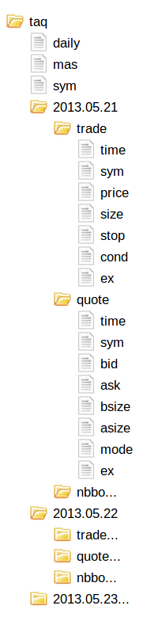

# Historical database


<style type="text/css">
    .foo {
        border: 1px solid #ccc; 
        border-radius: 10px; 
        box-shadow: 0 5px 5px 0 rgba(0,0,0,.2); 
        display: block; 
        float: right; 
        margin: 0 0 1em 3em;
        padding: 0 1em;
    }
</style>
{.foo}

A historical database (HDB) holds data before today, and its tables would be stored on disk, being much too large to fit in memory. Each new day’s records would be added to the HDB at the end of day.

Typically, large tables in the HDB (such as daily tick data) are stored splayed, i.e. each column is stored in its own file.

:fontawesome-regular-hand-point-right: 
Knowledge Base: [Splayed tables](../../kb/splayed-tables.md)  
_Q for Mortals_: [§11.3 Splayed Tables](/q4m3/11_IO/#113-splayed-tables)

Typically also, large tables are stored [partitioned]/q4m3/14_Introduction_to_Kdb+/#143-partitioned-tables) by date. Very large databases may be further partitioned into segments, using [`par.txt`](../../kb/partition.md).

These storage strategies give best efficiency for searching and retrieval. For example, the database can be written over several drives. Also, partitions can be allocated to secondary threads so that queries over a range of dates can be run in parallel. The exact set-up would be customized for each installation.

For example, a simple partitioning scheme on a single disk might be as shown right. Here, the daily and master tables are small enough to be written to single files, while the trade and quote tables are splayed and partitioned by date.


## Sample database

The script `buildhdb.q` will build a sample HDB. It builds a month’s random data in directory `start/db`, and takes a few seconds to run. 

:fontawesome-brands-github: 
[KxSystems/cookbook/start/buildhdb.q](https://github.com/KxSystems/cookbook/blob/master/start/buildhdb.q) 

Load q, then:

```q
q)\l start/buildhdb.q
```

To load the database, enter:

```q
q)\l start/db
```

In q (actual values may vary):

```q
q)count trade
369149

q)count quote
1846241

q)t:select from trade where date=last date, sym=`IBM
q)count t
1017

q)5#t
date       time         sym price size stop cond ex
---------------------------------------------------
2013.05.31 09:30:00.004 IBM 47.38 48   0    G    N
2013.05.31 09:30:01.048 IBM 47.4  56   0    9    N
2013.05.31 09:30:01.950 IBM 47.38 89   0    G    N
2013.05.31 09:30:02.547 IBM 47.36 70   0    9    N
2013.05.31 09:30:03.448 IBM 47.4  72   0    N    N

q)select count i by date from trade
date      | x
----------| -----
2013.05.01| 15271
2013.05.02| 15025
2013.05.03| 14774
2013.05.06| 14182
...

q)select cnt:count i,sum size,last price, wprice:size wavg price
  by 5 xbar time.minute from t
minute| cnt size price wprice
------| -----------------------
09:30 | 44  2456 47.83 47.60555
09:35 | 27  1469 47.74 47.77138
09:40 | 17  975  47.84 47.87198
09:45 | 19  1099 47.84 47.78618
...
```

Join trades with the most recent quote at time of trade ([as-of join](../../ref/aj.md)):

```q
q)t:select time,price from trade where date=last date,sym=`IBM
q)q:select time,bid,ask from quote where date=last date,sym=`IBM
q)aj[`time;t;q]
time         price bid   ask
------------------------------
09:30:00.004 47.38 47.12 48.01
09:30:01.048 47.4  46.91 47.88
09:30:01.950 47.38 46.72 47.99
09:30:02.547 47.36 47.33 47.46
...
```


## Sample segmented database

The `buildhdb.q` script can be customized to build a segmented database. In practice, database segments should be on separate drives, but for illustration, the segments are here written to a single drive. Both the database root, and the location of the database segments need to be specified.

For example, edit the first few lines of the script as below.

Ensure that the directory given in `dsp` is the full pathname, and that it is created, writeable and empty.

```q
dst:`:start/dbs      / new database root
dsp:`:/dbss          / database segments directory
dsx:5                / number of segments

bgn:2010.01.01       / set 4 years data
end:2013.12.31
...
```

For Windows, `dsp` might be: ``dsp:`:c:/dbss``.

Load the modified script, which should now take a minute or so. This should write the partioned data to subdirectories of `dsp`, and create a `par.txt` file like:

```txt
/dbss/d0
/dbss/d1
/dbss/d2
/dbss/d3
/dbss/d4
```

Restart q, and load the segmented database:

```q
q)\l start/dbs

q)(count quote), count trade
61752871 12356516

q)select cnt:count i,sum size,size wavg price from trade
  where date in 2012.09.17+til 5, sym=`IBM
cnt  size   price
--------------------
4033 217537 37.35015
```

