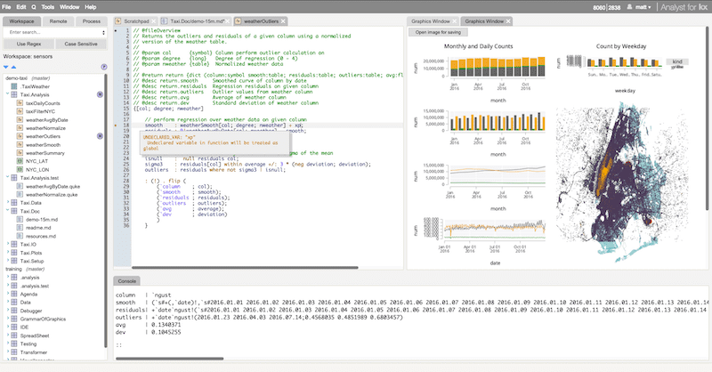

# :fontawesome-solid-laptop-code: Interactive development environments


When q runs it displays a console where you enter expressions and see them evaluated. 

```q
KDB+ 4.0 2020.05.20 Copyright (C) 1993-2020 Kx Systems
m64/ 12()core 65536MB sjt mackenzie.local 127.0.0.1 ..

q)til 6
0 1 2 3 4 5
q)
```

This is all you need to follow the tutorials, and if you just want to learn a little about q, it is easiest to work in the console.

As you become more familiar with q, you may prefer to work in an interactive development environment. 


## [KX Developer](/developer/)

An interactive development environment for kdb+ produced and maintained by KX.
Free for all use.

[](/developer/ "KX Developer")

[KX Analyst](/analyst/) is the enterprise version of Developer.


## [KX Dashboards](/dashboards/)

An interactive development environment for graphical displays from q scripts. 
Free for all use.

<iframe src="https://player.vimeo.com/video/135580263" style="border: 1px solid #ccc; box-shadow: 0 2px 2px rgba(0,0,0,.14); height: 450px; width: 100%;"webkitallowfullscreen mozallowfullscreen allowfullscreen></iframe>


## Jupyter notebooks

[**JupyterQ**](../../ml/jupyterq/index.md), from KX, lets you run q inside a [Jupyter](https://jupyter.org) notebook.


## Third-party IDEs

-   [qStudio](http://www.timestored.com/qstudio/), a cross-platform IDE with charting and autocompletion by TimeStored 
-   [Q and K Development Tools](http://www.qkdt.org) has an Eclipse plugin
-   [Q Insight Pad](http://www.qinsightpad.com) is an IDE for Windows
-   :fontawesome-brands-github: [kxcontrib/cburke/qconsole](https://github.com/kxcontrib/cburke/tree/master/qconsole) is an IDE using GTK

<!--
-   Most popular is Charlie Skelton’s **Studio for kdb+**, a cross-platform execution environment – worth having available even if you use another interface  
:fontawesome-brands-github: [CharlesSkelton/studio](https://github.com/CharlesSkelton/studio)
-->