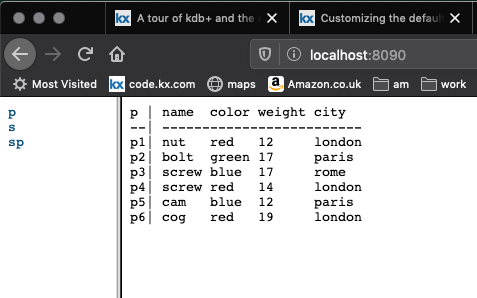

# :fontawesome-solid-binoculars: A mountain tour of kdb+ and q


This is a mountain tour of q, the programming language built into kdb+.
It takes the form of a one-page ‘ridge walk’ along the tops, with optional side descents to see more detail.

Use it as a very fast start with kdb+, or for a quick overview of what it is like to work in q.

:fontawesome-regular-hand-point-left:
[`TL;DR`](tldr.md)

!!! tip "Before you start"

    [Download, install and launch q.](../install.md)
    Experiment with the expressions as you read.

Follow
:fontawesome-regular-hand-point-right:
links to deeper treatments of topics.


## :fontawesome-solid-laptop-code: The q session

The q session is a [REPL](https://en.wikipedia.org/wiki/Read%E2%80%93eval%E2%80%93print_loop "Wikipedia").
It evaluates a q expression and prints the result.
You can use it as a calculator.

```q
$ q
KDB+ 3.7t 2020.03.05 Copyright (C) 1993-2020 Kx Systems
m64/ 4()core 8192MB sjt ...

q)2+2 3 4
4 5 6
q)acos -1
3.141593
```

End your session with the Terminate [system command](../../basics/syscmds.md).

```q
q)\\
$
```

:fontawesome-regular-hand-point-right:
[The q session](session.md)


## :fontawesome-solid-database: Databases

### Tables

Tables are first-class objects in q.

Load the [Suppliers and Parts](https://en.wikipedia.org/wiki/Suppliers_and_Parts_database "Wikipedia") database.

```q
q)\l sp.q
+`p`city!(`p$`p1`p2`p3`p4`p5`p6`p1`p2;`london`london`london`london`london`lon..
(`s#+(,`color)!,`s#`blue`green`red)!+(,`qty)!,900 1000 1200
+`s`p`qty!(`s$`s1`s1`s1`s2`s3`s4;`p$`p1`p4`p6`p2`p2`p4;300 200 100 400 200 300)

q)\a
`p`s`sp
```

The `\l` [system command](../../basics/syscmds.md) loaded and ran the script `sp.q`. 
The script defined three tables, ran three queries against them and displayed the results. 

The `\a` system command listed the names of tables. 

```q
q)sp            / suppliers and parts
s  p  qty
---------
s1 p1 300
s1 p2 200
s1 p3 400
s1 p4 200
s4 p5 100
s1 p6 100
s2 p1 300
s2 p2 400
s3 p2 200
s4 p2 200
s4 p4 300
s1 p5 400
```

:fontawesome-regular-hand-point-right:
[Tables](tables.md)

Save a table to a file of the same name.

```q
q)save `:path/to/sp             / kdb+ format
`:path/to/sp
q)save `:path/to/sp.xls         / Excel spreadsheet
`:path/to/sp.xls
```

Other [`save`](../../ref/save.md) formats include CSV, plain text and XML. 

Large tables can be [splayed](../../kb/splayed-tables.md) (each column written as its own file) and [partitioned](../../kb/partition.md) into time periods. 


### CSVs

Fetch a CSV example from this website.

```q
q)url:"https://code.kx.com/download/data/example.csv"
q)count t:("SFI";enlist csv)0: system "curl -Ls ",url
10000
q)t
id   price qty
--------------
kikb 36.05 90
hlfe 96.57 84
mcej 91.34 63
iemn 57.12 93
femn 63.64 54
engn 94.56 38
edhp 63.31 97
ggna 72.39 88
mjlg 12.04 58
fpjb 34.3  68
gfpl 25.34 45
jogj 78.67 2
gpna 23.08 39
njoh 91.46 64
aoap 48.38 49
bhan 63.2  82
enmc 70    40
niom 58.92 88
nblh 42.9  77
jdok 9.42  30
..
```

Above, we used [`system`](../../ref/system.md) to get a result direct from the operating system, and passed the result to the [Load CSV](../../ref/file-text.md#load-csv) operator `0:` to interpret as a table.
Table `t` has 10,000 rows. 
(The interpreter displayed only the top of the table.)

Save `t` as `example.csv`.

```q
q)`:example.csv set t
`:example.csv
```

:fontawesome-regular-hand-point-right:
[CSVs](csvs.md)


### Queries

If you know SQL you can work with q tables.

```q
q)select from sp where qty>200
s  p  qty
---------
s1 p1 300
s1 p3 400
s2 p1 300
s2 p2 400
s4 p4 300
s1 p5 400

q)/ double all stocks of p2
q)update qty:qty*2 from sp where p=`p2
s  p  qty
---------
s1 p1 300
s1 p2 400
s1 p3 400
s1 p4 200
s4 p5 100
s1 p6 100
s2 p1 300
s2 p2 800
s3 p2 400
s4 p2 400
s4 p4 300
s1 p5 400
```

In qSQL queries you can use q operators, keywords, and functions you define yourself. 
<!-- 
:fontawesome-regular-hand-point-right:
[Functions](functions.md),
[qSQL](queries.md)
 -->


## Language

### Data

Q handles numerical data, including times, dates, and periods.
Also booleans, characters, GUIDs, and immutable strings called _symbols_.

Lists of the same [datatype](../../basics/datatypes.md) are called _vectors_ and have simple representations.

```q
q)1 2 3*acos -1                                 / three floats
3.141593 6.283185 9.424778
q)count 2019.07.05 2019.09.15 2019.11.16        / three dates
3
q)count 08:30 12:45 17:15                       / three times
3
q)count 22:45:53.600 22:45:53.601 22:45:53.602  / three timestamps
3
q)count "fox"                                   / three characters
3
q)count ("quick";"brown";"fox")                 / three character lists
3
q)count each ("quick";"brown";"fox")
5 5 3
q)count `quick`brown`fox                        / three symbols
3
q)count each `quick`brown`foxes                 / symbols are 'atoms'
1 1 1
```


### Lists

Anything can be an item in a list.

```q
q)count (42;"foxes";`screw`bolt;2020.09.15)
4
```

In the list above the first and last items, `42` and `2020.09.15`, are single values, known as _atoms_. The other items `"foxes"` and `` `screw`bolt`` are themselves lists.

A list in which all items are atoms of the same datatype is a _simple list_ or _vector_. Vectors are key to the high performance of kdb+ and have simple representations.

```q
q)count 3 1 4 5                                 / integers
4
q)count 3 1 4 5.9                               / floats
4
q)count "jump"                                  / characters
4
q)"jump"<"n"                                    / four booleans
1010b
q)count `cow`sheep`cat`dog                      / four symbols
4
q)2020.01.01+30 60 90 120                       / four dates
2020.01.31 2020.03.01 2020.03.31 2020.04.30
q)12:00+30 60 90 120                            / four times
12:30 13:00 13:30 14:00
```

Indexing is zero-origin.

```q
q)"abcdef"[3 4 0 5]
"deaf"
```

Brackets are not always needed.
[Indexing and function application](../../ref/apply.md) have the same syntax.

```q
q)count[3 1 4 5]
4
q)count 3 1 4 5
4
q)"abcdef" 5 4 4 3
"feed"
```

You can index a table.

```q
q)sp 0 2                    / first and third rows
s  p  qty
---------
s1 p1 300
s1 p3 400

q)sp `s`p                   / two columns
s1 s1 s1 s1 s4 s1 s2 s2 s3 s4 s4 s1
p1 p2 p3 p4 p5 p6 p1 p2 p2 p2 p4 p5

q)sp[`qty]                  / one column
300 200 400 200 100 100 300 400 200 200 300 400
q)sp[`qty]>200              / flags
101000110011b
q)where sp[`qty]>200        / indexes
0 2 6 7 10 11
q)sp where sp[`qty]>200     / indexed rows
s  p  qty
---------
s1 p1 300
s1 p3 400
s2 p1 300
s2 p2 400
s4 p4 300
s1 p5 400
```

A table is a list of dictionaries.


### Dictionaries

Dictionaries are first-class objects.

```q
q)`item`qty`price!(`screw;500;1.95)         / record of a sale
item | `screw
qty  | 500
price| 1.95

q)pr:`screw`nail`bolt`nut!0.75 3 2.85 0.55  / price dictionary
q)pr
screw| 0.75
nail | 3
bolt | 2.85
nut  | 0.55

q)pr `bolt`nail                             / indexing
2.85 3

q)pr>2
screw| 0
nail | 1
bolt | 1
nut  | 0

q)pr*1+.05*pr>2                             / 5% increase where price>2
screw| 0.75
nail | 3.15
bolt | 2.9925
nut  | 0.55
```
<!-- 
:fontawesome-regular-hand-point-right:
[Dictionaries](dictionaries.md)
 -->
A table is a list of dictionaries.

```q
q)sp 0                                      / first row
s  | `s$`s1
p  | `p$`p1
qty| 300
```

Joining a dictionary to a table appends a tuple.

```q
q)sp,`s`p`qty!(`s5;`p3;159)
s  p  qty
---------
s1 p1 300
s1 p2 200
s1 p3 400
s1 p4 200
s4 p5 100
s1 p6 100
s2 p1 300
s2 p2 400
s3 p2 200
s4 p2 200
s4 p4 300
s1 p5 400
s5 p3 159
```


### Functions

<!-- [Function notation](functions.md) is simple. -->
Function notation is simple.
A function can have up to eight arguments.
Unless explicitly named, the first three arguments are assumed to be `x`, `y`, and `z`.

```q
q){x*x}2 -1.5 17
4 2.25 289

q)el:{[e;a;v;c]"<",e," ",a,"=\"",v,"\">",c,"</",e,">"}
q)el["a";"href";"https://example.com/";"link text"]
"<a href=\"https://example.com/\">link text</a>"
```

<!-- 
:fontawesome-regular-hand-point-right:
[Functions](functions.md)
 -->

### Iteration

[Control structures](../../basics/control.md#control-structures) such as `do` and `while` are rarely used for iteration.

Much iteration is implicit in the operators.

```q
q)2 3 4 + 10
12 13 14
q)2 3 4 + 10 100 1000
12 103 1004
```

Most other [iteration](../../basics/iteration.md) is handled by keywords, and special operators called [_iterators_](../../ref/iterators.md).

```q
q)count each ("quick";"brown";"fox")
5 5 3

q).h.htc[`p;"The quick brown fox"]              / mark up
"<p>The quick brown fox</p>"
q)"The quick brown fox" {.h.htc[y;x]}/ `p`body`html
"<html><body><p>The quick brown fox</p></body></html>"

q)8 {x,sum -2#x}\1 1                            / 10 Fibonacci numbers
1 1
1 1 2
1 1 2 3
1 1 2 3 5
1 1 2 3 5 8
1 1 2 3 5 8 13
1 1 2 3 5 8 13 21
1 1 2 3 5 8 13 21 34
1 1 2 3 5 8 13 21 34 55
```

<!-- 
:fontawesome-regular-hand-point-right:
[Iteration](iteration.md)
 -->

## Communication

Interprocess communication is ‘baked in’ to q. It requires no library code and is easy to set up.

Watch two kdb+ processes communicating through TCP/IP.


### Client/server

Use two command shells for this.
On the left, we have the server task; on the right, the client.

```txt
KDB+ 3.7t 2020.01.22 …          | KDB+ 3.7t 2020.01.22
m64/ 4()core 8192MB …           | m64/ 4()core 8192MB …
                                |
q)\p 5432                       | 
                                | q)h:hopen `::5432
                                | q)h"2+2"
                                | 4
                                |
                                | q)h "system\"l /Users/sjt/q/sp.q\""
q)+`p`city!(`p$`p1`p2`p3`p4`p5  |
(`s#+(,`color)!,`s#`blue`green  |
+`s`p`qty!(`s$`s1`s1`s1`s2`s3`  |
                                | q)h "select from sp where s in `s2`s3"
                                | s  p  qty
                                | ---------
                                | s2 p1 300
                                | s2 p2 400
                                | s3 p2 200
                                | q)
```

On the left, the server task started listening on port 5432. The client task opened a socket to port 5432, getting a handle, which it dubbed `h`.

The client task sent to the server the expression `2+2` to be evaluated, and received the value 4 in return.

The client task told the server to load the Suppliers and Parts script.
The server task session showed that script loaded.
The client sent the server a qSQL query and got a table as a result.

Asynchronous calls are only slightly more complicated.

A production system requires code in the callbacks to secure communications but you can see from the above that the basics are very simple.
The baked-in interprocess communications make it simple to implement systems as tasks distributed over multiple machines.


### Webserver

A q session can listen for HTTP requests and act as a webserver.
The default callback composes a page for browsing tables in the session.

```q
q)tables[]      / Suppliers & Parts
`p`s`sp
q)\p 8090       / listen to port 8090
```

Browse to `http://localhost:8090`.



:fontawesome-regular-hand-point-right:
[Customizing the default webserver](../../kb/custom-web.md)
<br>
:fontawesome-solid-book:
[The `.h` namespace](../../ref/doth.md)


## :fontawesome-solid-code: Development

### Scripts

Write and load scripts to define an application.
Scripts are text files.

The `sp.q` script defines the Suppliers & Parts database and runs some queries on it.

```q
s:([s:`s1`s2`s3`s4`s5]
 name:`smith`jones`blake`clark`adams;
 status:20 10 30 20 30;
 city:`london`paris`paris`london`athens)

p:([p:`p1`p2`p3`p4`p5`p6]
 name:`nut`bolt`screw`screw`cam`cog;
 color:`red`green`blue`red`blue`red;
 weight:12 17 17 14 12 19;
 city:`london`paris`rome`london`paris`london)

sp:([]
 s:`s$`s1`s1`s1`s1`s4`s1`s2`s2`s3`s4`s4`s1; / fkey
 p:`p$`p1`p2`p3`p4`p5`p6`p1`p2`p2`p2`p4`p5; / fkey
 qty:300 200 400 200 100 100 300 400 200 200 300 400)

select distinct p,s.city from sp

select sum qty by p.color from sp

select from sp where s.city=p.city
```

In scripts, q expressions can be written across multiple lines.


### IDE

[Kx Developer](/developer/) is a free interactive development environment (IDE) for q.


