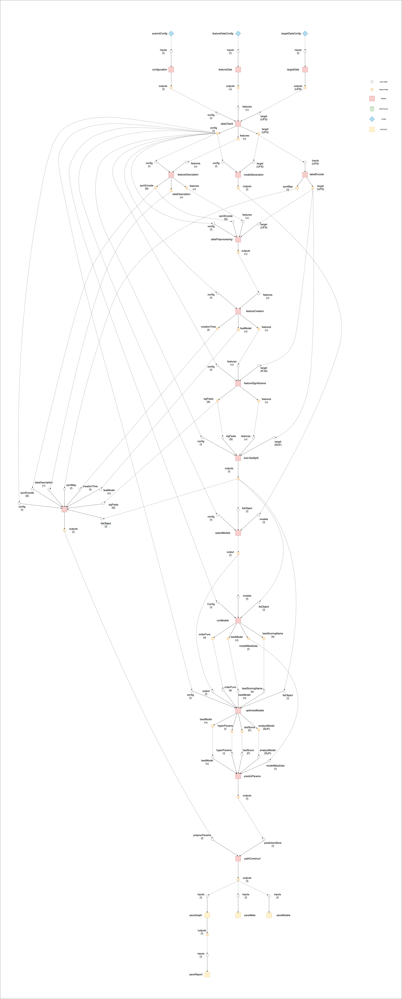

# :fontawesome-solid-share-alt: Overview

:fontawesome-brands-github:
[KxSystems/automl](https://github.com/kxsystems/automl)

The documentation offers several entry points to the AutoML framework:

[User-callable functions](functions.md)
: To use the interface with no need for detailed information on implementation

Low-level introduction to procedures undertaken within the framework

: Sections correspond to the core elements of most machine-learning workflows:

	-   [Data pre-processing](preproc.md) (data retrieval, data cleaning, feature extraction)
	-   [Data processing](proc.md) (model selection and optimization)
	-   [Data post-processing](postproc.md) (saving reports, models, graphs and metadata)

[Advanced parameter modifications](advanced.md)
: To change underlying functionality using tunable parameters


## Graphing structure

Version `0.3.0` of the AutoML framework has undergone fundamental changes with respect to the coding structure. In particular, the framework has moved from a small number of closely-dependent functions to a coding pattern which separates the individual pieces of required functionality into distinct sections. This is facilitated by the [directed acyclic graph structure](../../toolkit/graph/index.md).

Understanding the structure provides insights into the functionality and their interdependencies. It also explains the documentation breakdown within the [data pre-processing](preproc.md), [data processing](proc.md) and [data post-processing](postproc.md) sections, which reference the applied functions within each of these sections based on their `node` within the graph i.e. 

```txt
.automl.trainTestSplit.node.function
.automl.saveGraph.node.function
.automl.featureData.node.function
```

The following image fully describes the interconnection between sections of the framework.

[](img/Automl_Graph.png "Click to expand")
