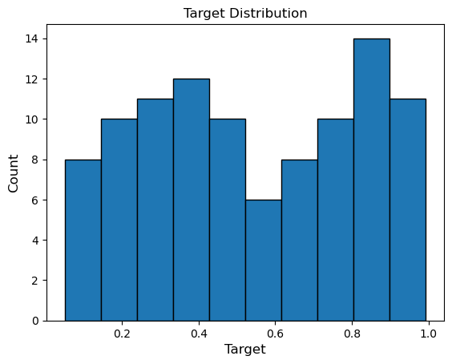
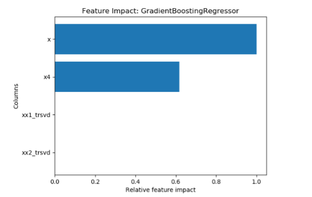
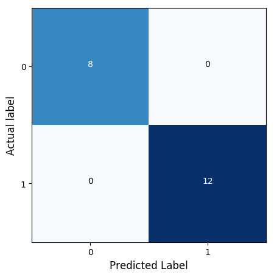
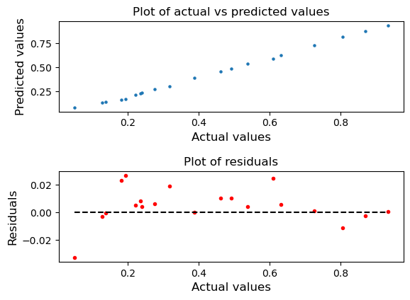

# :fontawesome-solid-share-alt: Automated Post-Processing

:fontawesome-brands-github: 
[KxSystems/automl](https://github.com/kxsystems/automl)

This section describes the outputs produced following model selection and optimization. All outputs are contained in an `outputs` directory within the `automl` repository.

In its default configuration, the pipeline returns:

-   visualizations: data split, target distribution, feature impact, confusion matrix (classification only) and regression analysis (regression only) plots
-   best model saved as a binary, `.h5` or `.pt` file depending on the type of model returned
-   configuration file outlining the procedure carried out for a run which can be used in re-running a pipeline
-   report outlining the steps taken and results achieved at each step of a run.

The outputs are in subfolders `images`, `models`, `config`, and `reports` respectively, in a directory named as the date and time of the run. The folder structure for each unique run is as follows: `automl/outputs/dateTimeModels/date/run_time/...`.


## Processing nodes

<div markdown="1" class="typewriter">
.automl.X.node.function   **Top-level processing node functions**
  [preprocParams](#automlpreprocparamsnodefunction)  Collect parameters for report/graph generation from preprocessing nodes
  [predictParams](#automlpredictparamsnodefunction)  Collect parameters for report/graph generation from prediction stages
  [pathConstruct](#automlpathconstructnodefunction)  Construct save paths for generated graphs/reports
  [saveGraph](#automlsavegraphnodefunction)      Save all the graphs required for report generation
  [saveMeta](#automlsavemetanodefunction)       Save relevant metadata for use with a persisted model on new data
  [saveReport](#automlsavereportnodefunction)     Save Python generated report summarizing current run via pyLatex/reportlab
  [saveModels](#automlsavemodelsnodefunction)     Save encoded representation of best model retrieved during run of AutoML
</div>


## Visualizations

A number of visualizations are produced within the pipeline and are saved to disk (in the default setting of AutoML) to be used within report generation, or for posterity. The specific images produced are detailed below and depend on the problem type of the current run.

### Data split

Every run generates an image showing the specific split applied to the data. 
In the default case depicted below, 20% of the data is used as the testing set, then 20% of the remaining data is used as a holdout set, wth the rest of the data used as the training set.


### Target distribution

A target distribution plot it generated for both classification and regression tasks. For classification, the plot simply shows the split between the classes within the target vector. While in the regression case, the target values are separated into 10 bins, as demonstrated in the example below.




### Feature impact

The feature-impact plot identifies the features with the highest impact on predicting the outcomes of a model. Within the framework, the impact of a single feature column is determined by shuffling the values in that column and running the best model again with this new, scrambled feature.

It should be expected that if a feature is an important contributor to the output of a model, then scrambling or shuffling that feature will cause the model to perform poorly due to removal of signal for a model. Conversely, if the model performs better, or results do  not change, it could be inferred that the feature is not relevant for model training.

A score is produced by the model for each shuffled column, with all scores ordered and scaled using `.ml.minmaxscaler` contained within the ML Toolkit. An example plot is shown below for a table containing four features, using a Gradient Boosting Regressor.




### Confusion matrix

A confusion matrix shows how well the predictions produced by a model predict the actual class. This gives you a visual representation of the success or otherwise of the model.




### Regression analysis

For regression problems, plotting true vs predicted targets and their residuals values show how well your model performed, by mapping predicted values to actual values and plotting the difference as a residual plot. 

:fontawesome-solid-globe:
[Interpreting Residual Plots to Improve Your Regression](https://www.qualtrics.com/support/stats-iq/analyses/regression-guides/interpreting-residual-plots-improve-regression/ "qualtrics.com")




## Configuration

Once the pipeline has been completed, a configuration dictionary is saved as a binary file. 

This file is used for running on new data and can be used for oversight where configuration data is important for regulation.

---

## `.automl.pathConstruct.node.function`

_Construct save paths for generated graphs/reports_

```syntax
.automl.pathConstruct.node.function[preProcParams;predictionStore]
```

Where

-   `preProcParams` is a dictionary with data generated during the preprocess stage
-   `predictionStore` is a dictionary with data generated during the prediction stage

returns a dictionary containing all the data collected along the entire process along with paths to where graphs/reports will be generated.


## `.automl.predictParams.node.function`

_Collect parameters for report/graph generation from prediction stages_

```syntax
.automl.predictParams.node.function
  [bestModel;hyperParams;modelName;testScore;analyzeModel;modelMetaData]
```

Where

-   `bestModel` is the best fitted model as an embedPy object
-   `hyperParmams` is a dictionary of hyperparameters used for the best model (if any)
-   `modelName` is the name of the best model as a string
-   `testScore` is the floating point score of the best model when applied on the testing data
-   `modelMetaData` is a dictionary containing the metadata produced when finding the best model

returns a dictionary with consolidated parameters to be used to generate reports/graphs.


## `.automl.preprocParams.node.function`

_Collect parameters for report/graph generation from preprocessing nodes_

```syntax
.automl.preprocParams.node.function
  [config;descrip;cTime;sigFeats;symEncode;symMap;featModel;tts]
```

Where

-   `config` is a dictionary with location and method by which to retrieve the data
-   `descrip` is a table with symbol encoding, feature data and description
-   `cTime` is the time taken for feature creation
-   `sigFeats` is a symbol list of significant features
-   `symEncode` is a dictionary containing the columns to symbol encode and their required encoding
-   `symMap` is a dictionary with a mapping initial symbol representations of a target to the underlying integer returned in prediction.
-   `featModel` is the embedPy NLP feature creation model used (if required)
-   `tts` is a dictionary with feature and target data split into training/testing sets

returns dictionary of consolidated parameters to be used to generate reports/graphs.


## `.automl.saveGraph.node.function`

_Save all the graphs required for report generation_

```syntax
.automl.saveGraph.node.function params
```

Where `params` is a dictionary containing all data generated during the preprocessing and prediction stages, saves all graphs needed for reports, and returns a null.


## `.automl.saveMeta.node.function`

_Save relevant metadata for model oversight and use when retrieving saved models from disk_

```syntax
.automl.saveMeta.node.function params
```

Where

-   `params` is a dictionary containing all the data generated during the preprocessing and prediction stages

returns a dictionary containing all metadata information needed to the predict function.

Example config file produced for a single run of AutoML which used FRESH classification data:

```q
q)get`:automl/outputs/dateTimeModels/2020.12.17/run_14.57.20.206/config/metadata
modelLib                     | `sklearn
modelFunc                    | `ensemble
startDate                    | 2020.12.17
startTime                    | 14:57:20.206
featureExtractionType        | `fresh
problemType                  | `reg
saveOption                   | 2
seed                         | 53840238
crossValidationFunction      | `.ml.xv.kfshuff
crossValidationArgument      | 5
gridSearchFunction           | `.automl.gs.kfshuff
gridSearchArgument           | 5
randomSearchFunction         | `.automl.rs.kfshuff
randomSearchArgument         | 5
hyperparameterSearchType     | `grid
holdoutSize                  | 0.2
testingSize                  | 0.2
numberTrials                 | 256
significantFeatures          | `.automl.featureSignificance.significance
predictionFunction           | `.automl.utils.fitPredict
scoringFunctionClassification| `.ml.accuracy
scoringFunctionRegression    | `.ml.mse
loggingDir                   | `
loggingFile                  | `
pythonWarning                | 0
overWriteFiles               | 0
targetLimit                  | 10000
savedModelName               | `
functions                    | `.ml.fresh.params
trainTestSplit               | `.automl.utils.ttsNonShuff
aggregationColumns           | `x
configSavePath               | "C:/Users/foobar/AppData/Local/Continuum/ana..
modelsSavePath               | "C:/Users/foobar/AppData/Local/Continuum/ana..
imagesSavePath               | "C:/Users/foobar/AppData/Local/Continuum/ana..
reportSavePath               | "C:/Users/foobar/AppData/Local/Continuum/ana..
mainSavePath                 | "C:/Users/foobar/AppData/Local/Continuum/ana..
logFunc                      | {[filename;val;nline1;nline2]
savedWord2Vec                | 0b
modelName                    | `RandomForestRegressor
symEncode                    | `freq`ohe!``
sigFeats                     | `x1_countbelowmean`x1_mean2dercentral`x1_med`x..
```


## `.automl.saveModels.node.function`

_Save encoded representation of best model retrieved during run of AutoML_

```syntax
.automl.saveModels.node.function params
```

Where `params` is a dictionary containing all the data generated during the preprocessing and prediction stages, saves the best-performing model to disk in the following model file format, and returns null.

```txt
Sklearn      pickled binary 
Keras        HDF5 
PyTorch      serialized .pt
```


## `.automl.saveReport.node.function`

_Save a Python generated report summarizing current run via pyLatex/reportlab_

```syntax
.automl.saveReport.node.function params
```

Where `params` is a dictionary of data generated during the preprocessing and prediction stages, saves a report to a location named by run date and time, and returns null.

The reports contains

-   total extracted features
-   cross validation scores
-   scoring metrics
-   above listed plots
-   best model and holdout score
-   run times for each section

