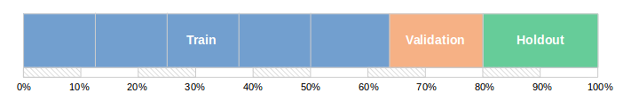

# :fontawesome-solid-share-alt: Automated data processing

:fontawesome-brands-github:
[KxSystems/automl](https://github.com/kxsystems/automl)

The procedures outlined below describe the steps required to prepare extracted features for training a model, perform cross validation to determine the most generalizable model, and optimize this model using a hyperparameter search. These steps follow on from the [data pre-processing methods](preproc.md).

The following are the procedures completed when the default system configuration is deployed:

1.  Models are selected to be applied to the data.
2.  Cross-validation procedures are performed on a selection of models to find the most generally applicable.
3.  Models are scored with a pre-defined performance metric, based on the problem type (classification/regression), with the best model selected and scored on the validation set.
4.  The best model is optimized using hyperparameter searching procedures.


## Processing nodes

<div markdown="1" class="typewriter">
.automl.X.node.function   **Top-level processing node functions**
  [selectModels](#automlselectmodelsnodefunction)    Select a subset of models based on dataset imposed limitations.
  [runModels](#automlrunmodelsnodefunction)       Select the most promising model from the table of models provided.
  [optimizeModels](#automloptimizemodelsnodefunction)  Apply a user defined optimization method (grid/random/sobol).
</div>


## Cross validation

Cross validation procedures are commonly used in machine learning to test how robust or stable a model is to changes in the volume of data or the specific subsets of data used for validation. The technique ensures that the model selected is the one that best generalizes to new unseen data.

The cross validation techniques implemented within AutoML are those contained within the [ML Toolkit](../../toolkit/xval.md). In the default configuration of the pipeline, a shuffled 5-fold cross validation procedure is applied.

For clarity, in the default configuration, 20% of the overall dataset is used as the testing set, 20% of the remaining dataset is used as the holdout (validation) set and then the remaining data is split into 5-folds for cross validation to be carried out.




## Model selection

Once the relevant models have undergone cross validation using the training data, scores are calculated using the relevant scoring metric for the problem type (classification/regression).

The file `scoring.json` contained within `automl/code/customization/scoring` specifies the possible scoring metrics and how to order the resulting scores (ascending/descending) to ensure that the best model is being returned. The default metric for classification problems is `.ml.accuracy`, while `.ml.mse` is used for regression. 

If necessary, `scoring.json` can be altered by the user in order to expand the number of metrics available. An extensive list of the metrics provided within the ML Toolkit and thus AutoML can be found [here](../../toolkit/utilities/metric.md), but users can also add their own custom metrics.


## Optimization

To optimize the best model, hyperparameter searching procedures are implemented. This includes the grid, random and Sobol-random search functionality contained within the [ML Toolkit](../../toolkit/xval.md).

---

## `.automl.optimizeModels.node.function`

```syntax
.automl.optimizeModels.node.function[config;modelTab;bestModel;modelName;tts;orderFunc]
```

Where

-   `config` is a dictionary containing information related to the current run of AutoML
-   `modelTab` is a table containing information about models applied to the data
-   `bestModel` is the best model chosen as a fitted embedPy object
-   `modelName` is the name of the best model
-   `tts` is the feature and target data split into a dictionary of training/testing sets
-   `orderFunc` is the function used to order scores (ascending/descending)

returns a dictionary containing the following:

 -   The fit model
 -   Any hyperparameters used to generate the best fit model
 -   The name of the best model
 -   The score achieved by the model when applied to the testing data
 -   Any information generated from analyzing the results made by the model (i.e confusion matrix (classification), residual errors (regression) and inforamtion on the impact of each column on predictive performance of the model)

Hyperparameters searched for each model in the default configuration of AutoML:

```txt
model                         hyperparameters
----------------------------------------------
AdaBoost Regressor            learning_rate, n_estimators
Gradient Boosting Regressor   criterion, learning_rate, loss
KNeighbors Regressor          n_neighbors, weights
Lasso                         alpha, max_iter, normalize, tol
MLP Regressor                 activation, alpha, learning_rate_init, solver
Random Forest Regressor       criterion, min_samples_leaf, n_estimators
AdaBoost Classifier           learning_rate, n_estimators
Gradient Boosting Classifier  criterion, learning_rate, loss, n_estimators
KNeighbors Classifier         leaf_size, metric, n_neighbors
Linear SVC                    C, tol
Logistic Regression           C, penalty, tol
MLP Classifier                activation, alpha, learning_rate_init, solver
Random Forest Classifier      criterion, min_samples_leaf, min_samples_split
SVC                           C, degree, tol
```

The values to search for each model and their hyperparameters are specified in the JSON scripts `gsHyperParameters.json` and `rsHyperParameters.json` contained within `automl/code/customization/hyperParameters/`. These can be modified by the user if required.

Once the hyperparameter search has been performed, the optimized model is validated using the testing set, with the final score returned and the best model saved to disk.

```q
// Default configuration dictionary
config:(`seed`problemType`logFunc`scoringFunctionRegression,
  `predictionFunction`numberTrials`holdoutSize)!
  (1234;`reg;();`.ml.mse;`.automl.utils.fitPredict;8;.2)

// Grid search hyperparameters
gsConfig:`gridSearchFunction`gridSearchArgument`hyperparameterSearchType!
  (`.automl.gs.kfshuff;2;`grid)

// Join grid search config to default dictionary
config:config,gsConfig

// Non-time series (normal) feature data as a matrix
features:100 10#100?10f

// Regression target
target:asc 100?10f

// Features and target data split into training and testing sets
tts:.ml.traintestsplit[features;targets;.2]

// Generate model table
modelTab:.automl.modelGeneration.node.function[config;target]

// Best model fitted on features and target data
randomForest:.p.import[`sklearn.ensemble][`:RandomForestRegressor]
bestModel:randomForest[features;target]

// Name of best model
modelName:`RandomForestRegressor

// Model score ordering function
orderFunc:desc
```

Run node:

```q
q)show outputs:.automl.optimizeModels.node.function[config;modelTab;bestModel;modelName;tts;orderFunc]
bestModel   | {[f;x]embedPy[f;x]}[foreign]enlist
hyperParams | `n_estimators`criterion`min_samples_leaf!(10i;`mse;1i)
modelName   | `RandomForestRegressor
testScore   | 0.2935
analyzeModel| `confMatrix`impact`residuals!(()!();7 3 6 1 5 0 2 4 9 8!..
```

Information generated when analyzing model results:

```q
q)outputs`analyzeModel
confMatrix| ()!()
impact    | 7 3 6 1 5 0 2 4 9 8!`s#0.900346 0.950173 0.9536332 0.96539..
residuals | `residuals`preds!(0.4 0.7 0.3 0.2 -0.7 0.4 -0.2 0.4 -0.6  ..
```


## `.automl.runModels.node.function`

_Select the most promising model from the list of provided models for the user defined problem_

```syntax
.automl.runModels.node.function[config;tts;modelTab]
```

Where 

-   `config` is a dictionary containing information related to the current run of AutoML
-   `tts` is the feature and target data split into a dictionary of training/testing sets
-   `modelTab` is a table of potential models to be applied to the feature data

returns a dictionary containing the following:

  -   Function used to order the scores achieved by the models
  -   The best model as an embedPy object
  -   The name of best model
  -   Any metadata generated from the node that will be used later for the report (i.e holdout score, metric used, holdout/validation time etc).

```q
// Configuration keys
configKeys:`seed`trainTestSplit`holdoutSize`predictionFunction,
  `scoringFunctionClassification`gridSearchFunction`gridSearchArgument,
  `crossValidationFunction`crossValidationArgument`logFunc

// Configuration values
configVals:(1234;`.ml.traintestsplit;.2;`.automl.utils.fitPredict;
  `.ml.accuracy;`.automl.gs.kfshuff;5;`.ml.xv.kfshuff;5;
  .automl.utils.printFunction[`testLog;;1;1])

// Configuration dictionary
config:configKeys!configVals

// Non-time series (normal) feature data as a matrix
features:100 10#1000?10f

// Binary-classification target
target:100?0b

// Features and target data split into training and testing sets
tts:.ml.traintestsplit[features;target;.2]

// Problem type
ptype:enlist[`problemType]!enlist`class

// Generate table of models to run
modelTab:.automl.modelGeneration.node.function[ptype;target]
```

Run node:

```q
q)outputs:.automl.runModels.node.function[config;tts;modelTab]

Scores for all models using .ml.accuracy


GradientBoostingClassifier| 0.5641026
RandomForestClassifier    | 0.5307692
LogisticRegression        | 0.5294872
KNeighborsClassifier      | 0.5012821
LinearSVC                 | 0.4679487
MLPClassifier             | 0.4525641
SVC                       | 0.4512821
AdaBoostClassifier        | 0.4397436
GaussianNB                | 0.4217949
BinaryKeras               | 0.4192308


Best scoring model = GradientBoostingClassifier
```

Order function, best scoring model details and metadata returned:

```q
q)show outputs
orderFunc      | k){$[99h=@x;(!x)[i]!r i:>r:. x;0h>@x;'`rank;x@>x]}
bestModel      | {[f;x]embedPy[f;x]}[foreign]enlist
bestScoringName| `GradientBoostingClassifier
modelMetaData  | `holdoutScore`modelScores`metric`xValTime`holdoutTime..
```

Meta information produced while running node:

```q
q)outputs`modelMetaData
holdoutScore| 0.625
modelScores | `RandomForestClassifier`LinearSVC`SVC`LogisticRegression..
metric      | `.ml.accuracy
xValTime    | 00:00:03.275
holdoutTime | 00:00:00.155
modelLib    | `sklearn
modelFunc   | `ensemble
```


## `.automl.selectModels.node.function`

_Select a subset of models based on limitations imposed by the dataset and environment_

```syntax
.automl.selectModels.node.function[tts;target;modelTab;config]
```

Where
 
-   `tts` is the feature and target data split into a dictionary of training/testing sets
-   `target` is a numerical representation of the target vector
-   `modelTab` is a table of potential models to be applied to the feature data
-   `config` is a dictionary containing information related to the current run of AutoML

returns a table of appropriate models to be applied to the feature data.

```q
q)// Non-time series (normal) feature data as a matrix
q)features:100 10#1000?10f

q)// Binary-classification target
q)target:100?0b

q)// Features and target data split into training and testing sets
q)show tts:.ml.traintestsplit[features;target;.2]
xtrain| (9.424804 8.974053 5.086379 2.880684 4.077511 1.007649 9.96666..
ytrain| 01100001110100001100010010000111111111011101010011001010000000..
xtest | (3.349253 9.660613 0.6159866 2.613222 8.485587 4.333356 4.1628..
ytest | 11110101011011111101b

q)// Problem type
q)ptype:enlist[`problemType]!enlist`class

q)// Generate table of models to run
q)5#modelTab:.automl.modelGeneration.node.function[ptype;target]
model                      lib     fnc          seed  typ    apply mini..
-----------------------------------------------------------------------..
AdaBoostClassifier         sklearn ensemble     `seed multi  1     {[x;..
RandomForestClassifier     sklearn ensemble     `seed multi  1     {[x;..
GradientBoostingClassifier sklearn ensemble     `seed multi  1     {[x;..
LogisticRegression         sklearn linear_model `seed binary 1     {[x;..
GaussianNB                 sklearn naive_bayes  ::    binary 1     {[x;..

q)// Configuration dictionary
q)config:`logFunc`targetLimit!
  (.automl.utils.printFunction[`testLog;;1;1];1000)

q)// Run node
q).automl.selectModels.node.function[tts;target;modelTab;config]
model                  lib     fnc      seed apply
--------------------------------------------------
AdaBoostClassifier     sklearn ensemble seed 1    
RandomForestClassifier sklearn ensemble seed 1    
RandomForestClassifier sklearn ensemble seed 1 
```


